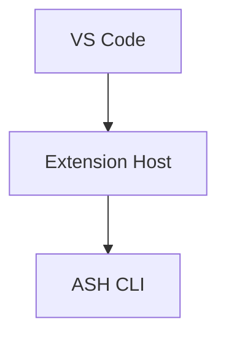

# Developer Documentation for ASH Workbench

Write developer-facing documentation for the ASH Workbench project. All developer docs live in a Docusaurus v3 site with autogenerated sidebars — adding or updating a page requires zero config changes.

## Step 1: Search Before You Write

This is the most important step. Never skip it.

Search `workbench/docs/docs/developer-docs/` and all its subdirectories for existing documentation that covers your topic or something closely related. Search three ways:

1. **By filename** — Glob for files whose names relate to your topic keywords
2. **By content** — Grep within `.md` files for key terms, class names, module names, or concepts you plan to document
3. **By headings** — Grep for `^##` headings in existing docs; your topic might already be a section inside a broader document

Based on what you find, choose exactly one action — listed in order of preference:

| What you find | Action |
|---|---|
| An existing doc covers this topic | **Update that doc.** Add missing information, correct outdated content, expand thin sections. Do not create a second page. |
| An existing doc covers a parent/sibling topic | **Add a section to that doc.** Your content is a natural addition, not a standalone page. |
| 2+ standalone docs share a theme with your topic | **Consolidate into a subdirectory.** See the consolidation steps below. |
| Nothing related exists | **Create a new page.** Proceed to Step 2. |

### Consolidation steps

When you find related standalone files that should be grouped (e.g., `command-registration.md` and `command-palette.md` while adding `command-keybindings.md`):

1. Create subdirectory: `developer-docs/<theme>/`
2. Add `_category_.json` with `label` and `position`
3. Add `README.md` with frontmatter `title: Overview` introducing the theme
4. Move the existing files into the subdirectory (keep their filenames)
5. Search the **entire** `docs/docs/` tree for cross-links referencing the old paths and update them — broken links fail the Docusaurus build
6. Add your new page to the subdirectory

A flat directory with more than 6-8 files is a strong signal that consolidation is overdue.

### Updating an existing doc

- Preserve the existing structure and voice
- Add content in the section where it logically belongs; add a new `##` section only if no existing section fits
- If the doc grows beyond ~300 lines, split by extracting sections into a subdirectory (consolidation), not by leaving a bloated doc alongside a new one

## Step 2: Determine the File Location

All developer docs go in:

```
workbench/docs/docs/developer-docs/
```

This maps to `/docs/developer-docs/...` on the built site under the "Developer Docs" navbar with its own sidebar.

**Adding a page to an existing section:**
```
workbench/docs/docs/developer-docs/<subdirectory>/<kebab-case-filename>.md
```

**Creating a new section** — you must create three things:

1. The directory: `developer-docs/<new-section>/`

2. `_category_.json`:
```json
{
  "label": "Section Name",
  "position": <integer>,
  "collapsible": true,
  "collapsed": true
}
```
Check sibling `_category_.json` files to pick a non-colliding position value.

3. `README.md`:
```yaml
---
title: Overview
---
```

## Step 3: Write the Document

### Frontmatter

Every file needs YAML frontmatter. Minimum:

```yaml
---
title: Human-Readable Page Title
---
```

Set `sidebar_position` only when ordering matters (e.g., a sequential guide). Otherwise omit it and let alphabetical sorting handle placement.

For the top-level `developer-docs/README.md` specifically:
```yaml
---
title: Overview
sidebar_label: Overview
sidebar_position: 1
---
```

### Document structure

Follow this section order. Omit sections that don't apply but keep the order of those that remain:

```markdown
# <Topic Name>

Brief orientation — what this is and why it exists. One to three sentences.

## How It Works

Implementation explanation with code snippets where helpful.
Reference source files by repo-relative path: `workbench/ash-workbench/src/someModule.ts`

## Usage

How to use this from a developer perspective. Concrete examples.

## Extending / Maintaining

What a developer needs to modify this. Key files, patterns, gotchas, dependencies.
This is the most valuable section — call out non-obvious coupling and ripple effects.

## Known Issues

Current limitations and workarounds. Omit entirely if none exist.

## References

Internal cross-links (relative file paths) and external resources.
```

### Formatting rules

**File naming:** Kebab-case only (`system-overview.md`). `README.md` uppercase for category indices. Never spaces, underscores, or camelCase.

**Cross-links:** Always use relative file paths so Docusaurus validates at build time:
```markdown
See the [Installation Guide](../user-docs/getting-started/installation.md)
```
Never use absolute URL paths like `/docs/user-docs/...`.

**Diagrams:** Use Mermaid for all diagrams. Mermaid renders natively in Docusaurus and is version-controllable:
````markdown

````
Only use static images when Mermaid can't represent the content (e.g., UI screenshots). Place static images in `workbench/docs/static/img/developer-docs/`.

**Code snippets:** Use fenced blocks with language identifiers (`typescript`, `json`, `bash`). Keep snippets to 5-20 relevant lines, not entire files. Reference the source file path so readers can find the full implementation.

**Admonitions:** Use sparingly:
```markdown
:::warning
Important caveat about this behavior.
:::
```
Available types: `note`, `tip`, `warning`, `danger`, `info`. If every other paragraph is an admonition, none stand out.

### Writing style

- **Audience:** Developers contributing to ASH Workbench. Assume TypeScript and VS Code extension development familiarity.
- **Tone:** Direct, technical, concise. No filler ("In this document we will explore...").
- **Voice:** Second person ("you") or imperative ("Run the command"). No first person.
- **Length:** One topic per document, covered well. If exceeding ~300 lines, split via consolidation.
- **No fluff:** No introductions restating the title. No concluding summaries. No empty "TBD" sections.

## Step 4: Verify

Before finishing, check:

1. You searched existing docs and confirmed a new file is warranted (or updated/consolidated instead)
2. If related standalone docs existed, you consolidated them and updated all cross-links
3. File is in `workbench/docs/docs/developer-docs/` or a subdirectory
4. Valid YAML frontmatter with at least `title`
5. Filename is kebab-case `.md`
6. New subdirectories have both `_category_.json` and `README.md`
7. Internal links use relative file paths
8. Diagrams use Mermaid where possible
9. Code snippets have language identifiers
10. Document follows the section structure template
11. No empty or placeholder sections remain

## Things to Never Do

- Create a new file without searching existing docs first
- Modify `sidebars.ts` or `docusaurus.config.ts` — the autogenerated sidebar handles everything
- Create `.mdx` files unless React components are genuinely needed — use plain `.md`
- Duplicate content from `user-docs/` — cross-link instead
- Write files outside `developer-docs/` for developer documentation
- Add images to `docs/docs/` — static assets go in `docs/static/img/`
- Leave a flat directory with 6-8+ files unconsolidated
- Move files without updating all cross-links referencing the old paths
