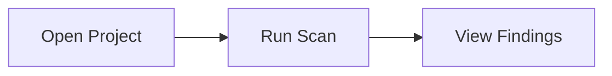

# User Documentation for ASH Workbench

Write and maintain end-user documentation for the ASH Workbench VS Code extension. Documentation is published via a Docusaurus site and lives exclusively in `docs/docs/user-docs/`.

## Step 0: Load the full guidance

Read the detailed conventions document before doing anything else:

```
docs/docs/working/docs/user-docs-skill-guidance.md
```

This file is the authoritative reference for all conventions: file placement, frontmatter, content structure, style rules, Docusaurus features, and anti-patterns. The instructions below are the workflow; the guidance document is the rulebook. If anything below conflicts with the guidance document, the guidance document wins.

## Step 1: Search existing documentation

This is the most important step. Never skip it.

1. **Glob for related filenames** in `docs/docs/user-docs/`:
   - Search for keywords from the topic (e.g., `*scan*`, `*config*`, `*install*`)
   - Check all `README.md` files to understand what each category covers

2. **Grep for related content** across `docs/docs/user-docs/`:
   - Search for the feature name, key terms, and synonyms
   - Look for sections within existing pages that already touch this topic

3. **Decide your action** based on what you find:

   | What you find | What you do |
   |---|---|
   | Existing page covers this topic | **Update that page.** Add/revise/expand content in place. Do not create a new file. |
   | Existing page covers a related topic | **Augment it** with a new section, or **split** if it exceeds ~300 lines. Keep both in the same category. |
   | Multiple related pages scattered at top level | **Consolidate first.** Create a category directory, move the related pages into it, fix cross-links, then add your content. |
   | Nothing relevant exists | **Create a new page.** Proceed to Step 2. |

Tell the user what you found and what action you're taking before making changes.

## Step 2: Determine file placement

All user documentation goes in `docs/docs/user-docs/`. Nowhere else.

**New page in existing category:**
```
docs/docs/user-docs/<category>/<kebab-case-filename>.md
```

**New page at top level (no category yet):**
```
docs/docs/user-docs/<kebab-case-filename>.md
```

**New category** -- create all three files:

1. `docs/docs/user-docs/<category>/_category_.json`:
```json
{
  "label": "Category Display Name",
  "position": <number>,
  "collapsible": true,
  "collapsed": true
}
```

2. `docs/docs/user-docs/<category>/README.md`:
```yaml
---
title: Overview
---
```

3. Then add your content file(s) in the category directory.

Do not modify `docusaurus.config.ts` or `sidebars.ts`. The autogenerated sidebar picks up new files automatically.

## Step 3: Write the content

### Frontmatter

Every file needs at minimum:

```yaml
---
title: Human-Readable Page Title
---
```

Add `sidebar_position` only when reading order matters (e.g., a getting-started sequence).

### Page structure

Use the sections that apply -- not every page needs all of them:

```markdown
# Topic Name

What this does and why it helps you. 1-3 sentences. Lead with the user's goal.

## Getting Started
Step-by-step numbered instructions.

## Configuration
Settings the user can control. Show setting key, type, default, and effect.

## Tips and Best Practices
How to get the most from this feature.

## Troubleshooting
**Problem:** What the user sees.
**Cause:** Why it happens.
**Solution:** What to do.

## Related Features
Relative file path links to complementary docs.
```

### Style rules

- Address the user as "you". Use imperative mood for instructions.
- Lead with the user's goal, not the feature name.
- Be concise. Cut filler.
- Use project terminology consistently: **ASH** (the scanning tool), **ASH Workbench** (the VS Code extension), **scan**, **finding**, **scanner**, **severity** (Critical/High/Medium/Low/Info), **suppression**, **actionable finding**.
- No marketing language ("powerful", "seamless", "robust").
- One topic per page.
- Show code blocks with language identifiers (`yaml`, `bash`, `json`, etc.).
- Explain error messages when documenting features that can fail.

### Diagrams

Use Mermaid instead of static images. The site has `@docusaurus/theme-mermaid` enabled:

````markdown

````

### Cross-links

Use relative file paths for build-time validation:

```markdown
See the [Installation Guide](../getting-started/installation.md) for setup.
```

Never use absolute URL paths like `/docs/user-docs/...`.

### Docusaurus features

Use admonitions for callouts:

```markdown
:::tip
Helpful suggestion here.
:::

:::warning
Important caveat here.
:::
```

Use tabs for platform-specific instructions (import `Tabs` and `TabItem` from `@theme`). Use titled code blocks for config examples.

## Step 4: Verify

After writing, check:

- [ ] Searched existing docs first -- confirmed this is the right action (update, augment, consolidate, or create)
- [ ] If consolidating: moved related scattered pages into a category and fixed cross-links
- [ ] File is in `docs/docs/user-docs/` with a kebab-case filename
- [ ] Frontmatter has at minimum `title`
- [ ] New subdirectories have `_category_.json` with `label` and `position`
- [ ] Content leads with the user's goal
- [ ] Instructions use numbered steps and imperative mood
- [ ] Code blocks have language identifiers
- [ ] Cross-links use relative file paths
- [ ] Diagrams use Mermaid (not images)
- [ ] No marketing language or filler
- [ ] No duplication of ASH CLI docs (link to parent project README instead)
- [ ] Page covers one topic only
- [ ] Did not modify `docusaurus.config.ts` or `sidebars.ts`

## What this skill does NOT cover

- **Developer documentation** -- architecture, contributing guides, API internals go in `docs/docs/developer-docs/`
- **Working documents** -- research, plans, ephemeral notes go in `docs/docs/working/`
- **ASH CLI documentation** -- the parent project README covers CLI usage; link to it, don't duplicate it
- **Documentation for unbuilt features** -- only document what is implemented and working
