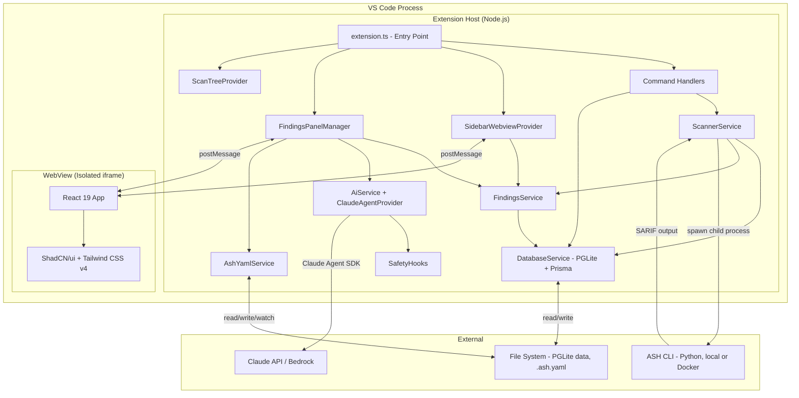
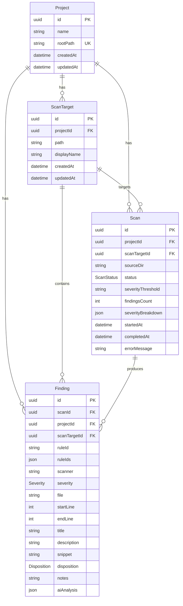
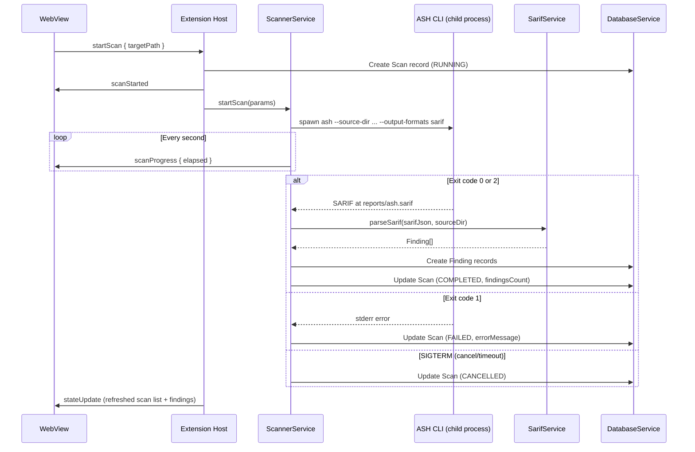
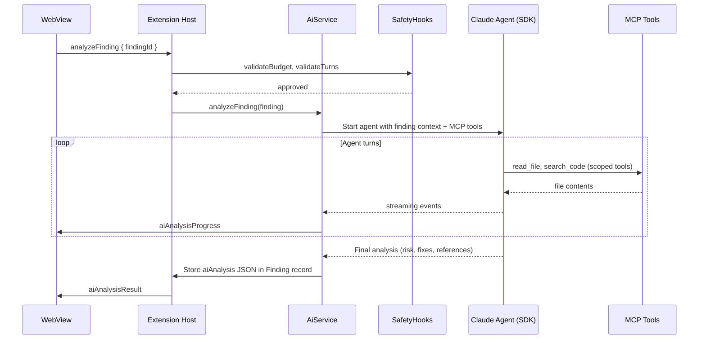

# Technical Specification

## System Architecture

The extension runs entirely within the VS Code process. No external servers, APIs, or databases are required beyond the ASH CLI itself.



### Component Model

| Component | Runtime | Lifecycle |
|-----------|---------|-----------|
| Extension Host | Node.js (VS Code extension host) | Activated on first view open (`onView:ashWorkbench.mainView`), deactivated on window close |
| Sidebar WebView | Chromium iframe (VS Code webview view) | Created on sidebar open, destroyed on close (no `retainContextWhenHidden`) |
| Findings Panel | Chromium iframe (VS Code webview panel) | Created on scan select, retained when hidden, destroyed on close |
| ASH CLI | Python process or Docker container | Started per scan, terminated on completion/cancel/timeout |
| PGLite | In-process WASM (~3MB) | Initialized on activation, file-backed persistence |
| Claude Agent | HTTP client (Claude Agent SDK) | Lazy-initialized on first AI analysis request |

### Key Architectural Decisions

| Decision | Choice | Rationale |
|----------|--------|-----------|
| Database | PGLite (WASM PostgreSQL) + Prisma | No external server, real SQL, JSON columns, single-user is fine for VS Code |
| ORM | Prisma with `prisma-pglite` adapter (`driverAdapters` preview feature) | Type-safe queries, schema-as-code |
| Migration | Custom raw SQL runner (not Prisma CLI) | Prisma Migrate requires network DB; raw SQL runs directly against PGLite |
| WebView framework | React 19 + ShadCN/ui + Tailwind CSS v4 | Rich component library, consistent styling |
| WebView build | Vite with fixed filenames (no content hashes) | Simplifies HTML template — always `assets/index.js` and `assets/index.css` |
| State ownership | Extension host owns all state | WebView is a pure renderer; all data flows through postMessage |
| AI integration | Claude Agent SDK with MCP tools | Structured analysis with file-reading tools scoped per finding |
| Type sharing | Manual copy between vsix/ and webview/ | Avoids symlink/monorepo build complications |
| Config in tests | Override pattern (inject config, avoid `vscode.workspace` API) | Enables unit testing without VS Code electron |

## Data Models

### Prisma Schema (PostgreSQL via PGLite)



### Enums

| Enum | Values |
|------|--------|
| `ScanStatus` | `RUNNING`, `COMPLETED`, `FAILED`, `CANCELLED` |
| `Severity` | `CRITICAL`, `HIGH`, `MEDIUM`, `LOW`, `INFO` |
| `Disposition` | `PENDING`, `FIX`, `SUPPRESS`, `DEFER` |

### Indexes

| Table | Index | Purpose |
|-------|-------|---------|
| `ScanTarget` | `(projectId, path)` UNIQUE | One target per path per project |
| `Scan` | `(projectId, startedAt DESC)` | Scan history listing |
| `Finding` | `(scanTargetId, ruleId, file)` | Deduplication and lookup |
| `Finding` | `(scanId, severity)` | Severity breakdown queries |

### Migration Tracking

Applied migrations are tracked in a custom `_ash_migrations` table (not Prisma's `_prisma_migrations`). On activation, the extension reads SQL files from `prisma/migrations/*/migration.sql`, checks against the tracking table, and applies unapplied migrations in order.

Current migrations:
1. `20260316000000_init` — Project, ScanTarget, Scan, Finding tables + enums + indexes
2. `20260317000000_add_finding_notes` — `notes` TEXT column on Finding
3. `20260320000000_add_ai_analysis` — `aiAnalysis` JSONB column on Finding

## API Contracts

The extension has no REST API. Communication between the extension host and WebView uses a typed `postMessage` protocol.

### Message Protocol (WebView → Extension)

| Message Type | Payload | Purpose |
|-------------|---------|---------|
| `init` | — | WebView loaded, request current state |
| `startScan` | `{ targetPath, severityThreshold? }` | Trigger ASH CLI scan |
| `cancelScan` | `{ scanId }` | Kill running scan process |
| `selectScan` | `{ scanId }` | Load findings for a scan |
| `selectFinding` | `{ findingId }` | Load finding detail |
| `setDisposition` | `{ findingId, disposition }` | Triage a finding |
| `setNotes` | `{ findingId, notes }` | Add notes to a finding |
| `navigateToCode` | `{ file, line }` | Open file at line in editor |
| `deleteScan` | `{ scanId }` | Delete scan and cascade findings |
| `applyFilters` | `FilterState` | Filter findings list |
| `suppressFinding` | suppression params | Write to `.ash.yaml` |
| `analyzeFinding` | `{ findingId }` | Start AI analysis for one finding |
| `startBatchAnalysis` | `{ findingIds, options }` | Start batch AI analysis |
| `cancelBatchAnalysis` | — | Abort running batch |
| `testAiConnection` | — | Verify AI provider connectivity |

### Message Protocol (Extension → WebView)

| Message Type | Payload | Purpose |
|-------------|---------|---------|
| `stateUpdate` | `AppState` | Full state push (on init or refresh) |
| `scanStarted` | `{ targetPath }` | Scan process spawned |
| `scanProgress` | `{ scanId, status, elapsed }` | Progress tick |
| `findingsUpdate` | `FindingRow[]` | Findings list data |
| `findingDetail` | `FindingDetail` | Single finding full detail |
| `dispositionUpdated` | `{ findingId, disposition }` | Triage confirmed |
| `notesUpdated` | `{ findingId, notes }` | Notes saved |
| `suppressionsUpdate` | `AshYamlConfigSummary` | Suppression state changed |
| `suppressionWriteResult` | `{ success, error? }` | YAML write result |
| `aiAnalysisStarted` | `{ findingId }` | Analysis in progress |
| `aiAnalysisProgress` | `{ findingId, event }` | Streaming analysis events |
| `aiAnalysisResult` | `{ findingId, analysis }` | Analysis complete |
| `aiAnalysisError` | `{ findingId, error }` | Analysis failed |
| `batchAnalysisStarted` | `{ sessionId, total }` | Batch started |
| `batchAnalysisProgress` | `{ completed, total, current }` | Batch progress |
| `batchAnalysisComplete` | `{ sessionId, results }` | Batch finished |
| `error` | `{ message }` | General error display |

### Core View Model Types

```typescript
interface ScanSummary {
  id: string;
  scanTargetId: string;
  sourceDir: string;
  status: ScanStatus;
  findingsCount: number;
  severityBreakdown: Record<Severity, number> | null;
  startedAt: string;
  completedAt: string | null;
  errorMessage: string | null;
}

interface FindingRow {
  id: string;
  ruleId: string;
  scanner: string;
  severity: Severity;
  file: string;
  startLine: number;
  title: string;
  disposition: Disposition;
  notes: string | null;
  hasAiAnalysis: boolean;
}

interface AiAnalysis {
  riskAssessment: RiskAssessment;
  suggestedFixes: SuggestedFix[];
  references: AiReference[];
  metadata: AnalysisMetadata;
}
```

## Authentication and Authorization

The extension itself has no authentication layer — it runs locally within VS Code as a single-user tool.

**AI provider authentication:**
- **AWS Bedrock:** Uses ambient AWS credentials (AWS CLI profile, environment variables, or IAM role). Configurable via `ashWorkbench.llm.awsProfile` setting. Supports credential refresh via `ashWorkbench.llm.awsAuthRefreshCommand`.
- **Anthropic API:** Uses `ANTHROPIC_API_KEY` environment variable.
- **Claude Code settings detection:** `ClaudeSettingsDetector` reads `~/.claude/settings.json` to auto-discover provider/region when `ashWorkbench.llm.useClaudeSettings` is enabled.

**WebView security:**
- Scripts are nonce-gated (only bundled JS executes)
- No external resource loading
- CSP: `default-src 'none'; style-src ${cspSource} 'unsafe-inline'; script-src 'nonce-${nonce}'; font-src ${cspSource}; img-src ${cspSource}`

## Infrastructure and Deployment

**Distribution:** Internal `.vsix` file shared within the team. Not published to VS Code Marketplace.

**Packaging:**
```bash
cd vsix && npm run build      # Compiles extension + builds webview
npx @vscode/vsce package      # Creates .vsix file
```

The `vscode:prepublish` script orchestrates both builds. Webview dist is copied to `vsix/webview-dist/` so it's bundled inside the VSIX.

**Runtime requirements:**
- VS Code `^1.110.0`
- ASH CLI installed (`pip install automated-security-helper`) for scanning
- Docker (optional, only for `--mode container`)
- AWS credentials (optional, only for AI analysis via Bedrock)

**Storage locations:**
- PGLite database: `{globalStorageUri}/ash-workbench-pgdata/` (VS Code's per-extension storage)
- Scan output: Temp directories under extension storage, cleaned after SARIF parsing
- Suppressions: `.ash.yaml` in workspace root (user-managed, watched by extension)

## Data Flow and Processing

### Scan Execution Flow



### AI Analysis Flow



### SARIF Severity Mapping

ASH enriches SARIF with custom severity in `result.properties`. The parser checks properties first, then falls back to SARIF level mapping:

| Source | Mapping |
|--------|---------|
| `properties.severity` or `properties['ash/severity']` | Direct (e.g., `CRITICAL`, `HIGH`) |
| SARIF `level: 'error'` | `HIGH` |
| SARIF `level: 'warning'` | `MEDIUM` |
| SARIF `level: 'note'` | `LOW` |
| SARIF `level: 'none'` or default | `INFO` |

## Security

**Content Security Policy (WebView):**
- `default-src 'none'` — deny all by default
- `script-src 'nonce-${nonce}'` — only bundled JS with correct nonce executes
- `style-src ${cspSource} 'unsafe-inline'` — required for ShadCN/Tailwind runtime styles
- No external network requests from WebView

**AI Safety Guardrails (`SafetyHooks`):**
- **Budget validation:** Configurable spending limit per analysis (`ashWorkbench.llm.budgetLimit`)
- **Turn limiting:** Max agent turns per analysis (`ashWorkbench.llm.maxTurns`)
- **Tool access control:** MCP tools are read-only by default; file writing requires explicit opt-in
- **Consecutive failure tracking:** Batch analysis aborts after N consecutive failures (`ashWorkbench.llm.batchFailureLimit`)
- **Abort signals:** All AI operations support cancellation via `AbortController`

**Input validation:**
- SARIF parsing uses defensive extraction (optional fields, fallbacks for missing data)
- File paths are normalized and made relative to source directory (no absolute path leakage)
- Scan target paths are validated against workspace folders

**Suppression file safety:**
- `.ash.yaml` writes preserve existing config structure
- Expiration dates are validated
- YAML formatting follows ASH conventions

## Performance

No specific performance targets for this POC. Performance is best-effort with these design choices:

- **Lazy activation:** Extension activates only when the sidebar view is opened (`onView:ashWorkbench.mainView`), not on VS Code startup
- **Lazy AI initialization:** Claude Agent provider created only on first AI analysis request
- **PGLite in-process:** No network round-trips for database queries; WASM executes in the extension host
- **Fixed WebView assets:** No content hash computation; deterministic paths simplify loading
- **Findings panel retained:** `retainContextWhenHidden` on the findings panel avoids re-rendering large finding lists
- **Sidebar not retained:** Recreated on re-open to save memory; re-fetches state from extension host
- **Batch concurrency limit:** AI analysis runs max 5 concurrent analyses to avoid API throttling
- **Streamed progress:** AI analysis events stream to WebView in real-time rather than waiting for completion

## Error Handling and Resilience

### ASH CLI Error Handling

| Scenario | Detection | Response |
|----------|-----------|----------|
| ASH not installed | `spawn` throws `ENOENT` | Show error: "ASH CLI not found. Install via `pip install automated-security-helper`" |
| Docker not running | Exit code 1, stderr contains "Docker daemon" | Show error with mode switch suggestion |
| Findings detected | Exit code 2, SARIF at `reports/ash.sarif` | Normal: parse findings, store in DB |
| Clean scan | Exit code 0 | Normal: zero findings |
| Scan error | Exit code 1 | Mark scan FAILED, store stderr as `errorMessage` |
| Scan cancelled | SIGTERM sent | Mark scan CANCELLED, clean temp output |
| Scan timeout | Timer expires (configurable, default 600s) | SIGTERM, mark FAILED with timeout message |

### Database Error Handling

- **Initialization failure:** Retry once, then offer database reset to user
- **Stale scans on startup:** ScannerService recovers RUNNING scans from previous sessions, marks them FAILED
- **Migration failure:** Logged to output channel; extension continues with existing schema if possible

### AI Analysis Error Handling

- **Connection test:** `testAiConnection` message verifies provider before analysis
- **Individual failure:** Error stored per-finding, does not block other analyses
- **Batch failure:** Consecutive failure counter triggers batch abort at configurable limit
- **Budget exceeded:** SafetyHooks rejects analysis before it starts
- **Provider unavailable:** Graceful degradation — all non-AI features continue working

## Migration and Evolution

**Database migration strategy:**
- **Tool:** Custom raw SQL runner (not Prisma CLI)
- **Direction:** Forward-only; no rollback support
- **Naming:** Timestamp-prefixed directories (`YYYYMMDDHHMMSS_description/migration.sql`)
- **Tracking:** `_ash_migrations` table with name and `applied_at`
- **Runtime:** Migrations applied automatically on extension activation before Prisma client creation
- **Development:** `npx prisma migrate dev` generates SQL files; the extension applies them via `pglite.exec()`

**Schema evolution process:**
1. Modify `prisma/schema.prisma`
2. Run `npx prisma migrate dev --name description` to generate migration SQL
3. Migration SQL is bundled with the extension
4. On user upgrade, new migrations apply automatically on next activation

**WebView/extension type sync:** Message types and view models are manually duplicated between `vsix/src/models/` and `webview/src/types/`. Changes to the protocol require updating both locations.

**Fallback path:** If PGLite + Prisma proves unreliable, the documented fallback is SQLite via `better-sqlite3` with native Prisma support. The switch only affects database initialization code and schema provider; all Prisma queries remain unchanged.

## Third-Party Dependencies

### Extension Host (`vsix/`)

| Package | Version | Purpose | Failure Mode |
|---------|---------|---------|--------------|
| `@electric-sql/pglite` | `^0.2.17` | WASM PostgreSQL (in-process, file-backed) | Extension cannot persist data; would need SQLite fallback |
| `@prisma/client` | `^7.5.0` | Type-safe ORM client | Build-time dependency; no runtime fallback |
| `prisma-pglite` | `^2.0.2` | Prisma driver adapter for PGLite | Community-maintained; fallback is raw SQL queries |
| `@anthropic-ai/claude-agent-sdk` | `^0.2.80` | Claude Agent with MCP tool use | AI features unavailable; all other features work |
| `zod` | `^4.3.6` | Runtime schema validation | Used for AI response parsing |
| `js-yaml` | `^4.1.1` | YAML parsing/serialization for `.ash.yaml` | Suppression features unavailable |
| `picomatch` | `^4.0.3` | Glob pattern matching for suppression rules | Suppression matching falls back to exact match |

### WebView (`webview/`)

| Package | Version | Purpose |
|---------|---------|---------|
| `react` | `^19.x` | UI framework |
| `react-dom` | `^19.x` | React DOM renderer |
| `tailwindcss` | `^4.x` | Utility CSS framework |
| ShadCN/ui components | Latest | 25 base UI components (button, card, dialog, tabs, etc.) |
| `vite` (dev) | `^6.x` | Build tool |
| `@vitejs/plugin-react` (dev) | `^4.x` | Vite React plugin |

## Observability

**Logging:** All extension output goes to a dedicated VS Code output channel (`ASH Workbench`).

- **Scan output:** ASH CLI stdout/stderr streamed in real-time to the output channel
- **Database:** Initialization, migration application, and errors logged
- **AI analysis:** Provider connection, analysis start/complete/error, budget usage logged
- **Errors:** All caught exceptions logged with context before user-facing error messages

**No telemetry:** The extension does not collect or send any usage metrics or telemetry data. All logging is local to the user's VS Code instance.

**Debugging:**
- Source maps enabled for both extension (`vsix/out/`) and WebView (`webview/dist/`)
- Kitchen sink panel (`ashWorkbench.openKitchenSink` command) for component development and visual testing
- VS Code Extension Development Host launch configuration for interactive debugging
