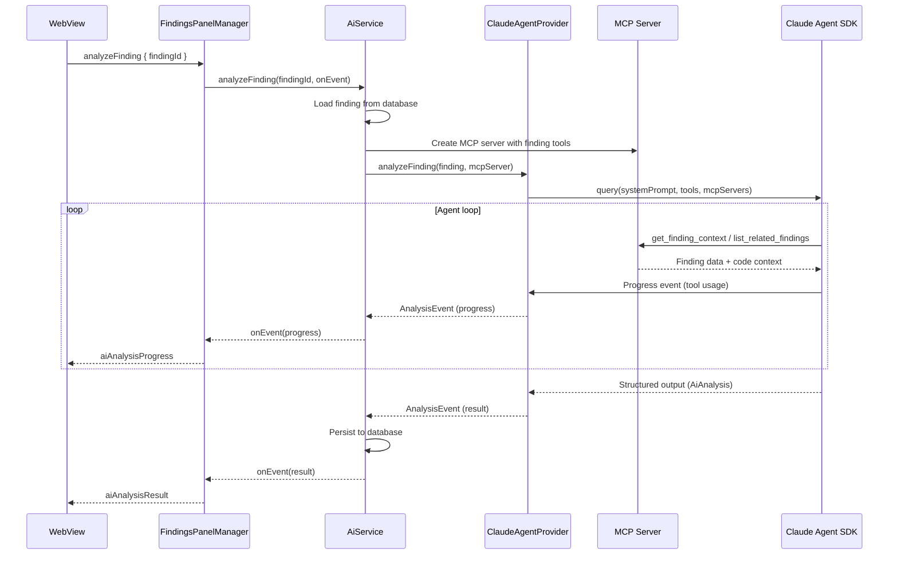

# AI Integration

ASH Workbench uses the Claude Agent SDK to provide AI-assisted security analysis of findings. The system supports per-finding analysis with streaming progress, batch analysis across all findings in a scan, and provider auto-detection from Claude Code settings.

## How It Works

### Analysis Flow



### Architecture

The AI system has four layers:

| Layer | File | Responsibility |
|-------|------|----------------|
| **Orchestration** | `aiService.ts` | Concurrency management, batch processing, event routing, database persistence |
| **Provider** | `claudeAgentProvider.ts` | Claude Agent SDK integration, system prompt construction, structured output schema |
| **Tools** | `mcpTools.ts` | MCP server with finding-analysis tools exposed to the agent |
| **Interface** | `aiProvider.ts` | `AiProvider` interface, `AnalysisEvent` types |

## AiService (Orchestration)

`vsix/src/services/aiService.ts`

### Single Finding Analysis

`analyzeFinding(findingId, onEvent)`:

1. Validates concurrency (max 5 concurrent analyses via `activeAnalyses` map)
2. Loads finding details from database
3. Creates an in-process MCP server with finding-analysis tools
4. Calls `provider.analyzeFinding()` with an async generator pattern
5. Streams events: `progress` (tool usage), `result` (structured output), `error`
6. On success: persists AI analysis to database via `findingsService.setAiAnalysis()`

### Batch Analysis

`analyzeAllFindings(scanId, onBatchEvent)`:

1. Queries unanalyzed findings for the scan
2. Creates batch state with shared `AbortController`
3. Iterates through findings sequentially:
   - Skips already-analyzed findings (idempotent)
   - Calls `analyzeFinding()` for each
   - Tracks consecutive failures
4. Stops on consecutive failure threshold (default: 3, configurable via `ashWorkbench.llm.batchConsecutiveFailureLimit`)
5. Emits batch events: `batch-started`, `batch-progress`, `batch-finding-event`, `batch-complete`
6. Supports session resumption for cross-finding context

### Error Types

```typescript
type AnalysisErrorType =
  | 'credentials_missing' | 'auth_failed' | 'model_unavailable'
  | 'budget_exceeded' | 'max_turns_exceeded' | 'format_error'
  | 'network_error' | 'cancelled' | 'unknown'
```

The WebView maps these error types to user-actionable guidance via `webview/src/lib/ai-errors.ts`.

## ClaudeAgentProvider (SDK Integration)

`vsix/src/services/claudeAgentProvider.ts`

### System Prompt

The provider constructs a system prompt for each finding that includes:

- Finding context: title, severity, scanner, rule ID, file path, line range, code snippet
- Task instructions: read relevant code, search for patterns, produce structured analysis
- Output format requirements

### Structured Output Schema

The agent produces structured output conforming to this schema:

```typescript
interface AiAnalysis {
  explanation: string;
  riskAssessment: {
    exploitability: RiskLevel;     // CRITICAL | HIGH | MEDIUM | LOW | NONE
    exploitabilityRationale: string;
    impact: RiskLevel;
    impactRationale: string;
    likelihood: RiskLevel;
    likelihoodRationale: string;
  };
  suggestedFix: {
    description: string;
    diffText: string;
    language: string;
  } | null;
  references: Array<{ title: string; url: string }>;
}

interface AnalysisMetadata {
  analyzedAt: string;    // ISO timestamp
  modelId: string;
  costUsd: number;
  toolsUsed: string[];
}
```

### Tool Configuration

The agent has access to different tool sets based on `ashWorkbench.llm.toolMode`:

| Mode | Tools |
|------|-------|
| `read-only` (default) | `Read`, `Glob`, `Grep`, `get_finding_context`, `list_related_findings` |
| `full` | All of the above plus `Write`, `Edit`, `Bash` |

### Session Persistence

Batch analysis supports session resumption — the `ClaudeAgentProvider` passes a `resume` parameter to maintain context across findings in the same batch.

## MCP Tools

`vsix/src/services/mcpTools.ts`

An in-process MCP server exposes two tools to the Claude agent:

### `get_finding_context`

**Parameters:** `findingId: string`

Returns the finding details plus surrounding code context (20 lines before/after the finding's line range). Reads the actual file from disk.

### `list_related_findings`

**Parameters:** `findingId: string`

Finds up to 25 related findings that share the same rule ID, scanner, or file path. Useful for understanding patterns across the codebase.

## Configuration

### VS Code Settings

All AI settings are under `ashWorkbench.llm.*`:

| Setting | Type | Default | Description |
|---------|------|---------|-------------|
| `provider` | `'bedrock' \| 'anthropic-api'` | `''` | AI provider |
| `region` | string | `''` | AWS region (Bedrock) |
| `modelId` | string | `''` | Claude model ID |
| `useClaudeSettings` | boolean | `true` | Inherit from `~/.claude/settings.json` |
| `maxBudgetUsd` | number | `1.00` | Max cost per analysis |
| `toolMode` | `'read-only' \| 'full'` | `'read-only'` | Agent tool access level |
| `maxTurns` | number | `15` | Max agent turns per analysis |
| `awsProfile` | string | `''` | AWS profile name |
| `awsAuthRefresh` | string | `''` | Shell command for credential refresh (application-scoped for security) |
| `batchConsecutiveFailureLimit` | number | `3` | Stop batch after N consecutive failures |

### Claude Code Settings Inheritance

`vsix/src/services/claudeSettingsDetector.ts` reads `~/.claude/settings.json` to auto-detect the AI provider:

1. Checks for Bedrock: `env.CLAUDE_CODE_USE_BEDROCK` or top-level `awsAuthRefresh`
2. Checks for Anthropic API: `env.ANTHROPIC_API_KEY`
3. Returns `{ claudeSettingsDetected: boolean, detectedProvider: 'bedrock' | 'anthropic-api' | 'none' }`

When `useClaudeSettings` is true (default), the provider inherits credential configuration from Claude Code, avoiding duplicate setup.

### Configuration Priority

Settings are resolved in `ClaudeAgentProvider.buildQueryOptions()`:

1. Base: `useClaudeSettings=true` sets `settingSources: ['user']`
2. Explicit `modelId` in extension settings overrides the inherited model
3. Environment variables set per-query: `AWS_REGION`, `CLAUDE_CODE_USE_BEDROCK`, `AWS_PROFILE`

## Connection Testing

`AiService.testConnection()` performs a lightweight query to verify credentials:

- Uses a 10-second timeout
- Returns `{ success, model?, latencyMs, error? }`
- Accessible from the dashboard via the "Test Connection" button
- WebView shows the result via `aiTestResult` message

## Extending / Maintaining

### Changing the structured output schema

1. Update the JSON Schema in `claudeAgentProvider.ts` (the `analysisSchema` object)
2. Update the `AiAnalysis` interface in `vsix/src/models/types.ts`
3. Copy to `webview/src/types/types.ts`
4. Update `AiAnalysisPanel.tsx` in the WebView to render new fields

### Adding a new MCP tool

1. Add the tool definition and handler in `mcpTools.ts`
2. The tool is automatically available to the agent on next analysis
3. Update both tool mode lists in `claudeAgentProvider.ts` if needed

### Adding a new AI provider

1. Implement the `AiProvider` interface from `aiProvider.ts`
2. Add provider selection logic in `AiService.ensureProvider()`
3. Add the new provider option to `ashWorkbench.llm.provider` enum in `package.json`
