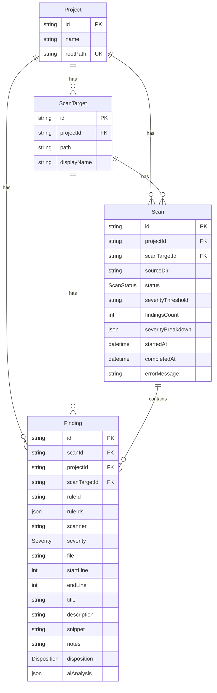

# Database

ASH Workbench stores all project, scan, and finding data in an embedded PostgreSQL database using PGLite (WASM PostgreSQL) with Prisma ORM. The database runs entirely in-process — no external server or container required.

## How It Works

### PGLite + Prisma Adapter

The database stack has three layers:

1. **PGLite** — WASM-compiled PostgreSQL that runs inside the Node.js extension host process
2. **`prisma-pglite`** — Adapter that bridges PGLite to Prisma's driver interface
3. **Prisma Client** — Type-safe ORM for queries

PGLite is ESM-only. The extension host runs as CommonJS. This is resolved via dynamic `import()` at runtime in `DatabaseService.initialize()`.

### Initialization

`vsix/src/services/database.ts` — `DatabaseService` (static class):

```typescript
// vsix/src/services/database.ts
static async initialize(storagePath?: string): Promise<PrismaClientType>
```

1. Lazy-imports PGLite, Prisma, and the adapter via dynamic `import()`
2. Creates PGLite instance:
   - **Production:** persisted at `{context.globalStorageUri.fsPath}/ash-workbench-pgdata/`
   - **Tests:** in-memory (no `storagePath` argument)
3. Runs migrations via `runMigrations()`
4. Creates Prisma client with `PrismaPgliteAdapter`
5. Stores singleton references — accessed via `DatabaseService.client`

### Shutdown

```typescript
static async close(): Promise<void>
```

Gracefully closes both Prisma and PGLite connections. Called from `deactivate()`.

## Schema

Defined in `vsix/prisma/schema.prisma`. Four entities with relationships:



### Enums

| Enum | Values |
|---|---|
| `ScanStatus` | `RUNNING`, `COMPLETED`, `FAILED`, `CANCELLED` |
| `Severity` | `CRITICAL`, `HIGH`, `MEDIUM`, `LOW`, `INFO` |
| `Disposition` | `PENDING`, `FIX`, `SUPPRESS`, `DEFER` |

### Key Constraints

- `Project.rootPath` is unique — one project per workspace
- `ScanTarget` has a composite unique constraint on `[projectId, path]`
- `Finding` has indexes on `[scanTargetId, ruleId, file]` and `[scanId, severity]`
- `Scan` has an index on `[projectId, startedAt DESC]` for chronological queries
- `Finding.scanId` cascades on delete — deleting a scan deletes its findings

### JSON Fields

- `Scan.severityBreakdown` — `Record<Severity, number>` stored as JSON
- `Finding.ruleIds` — `string[]` for findings with multiple rule IDs
- `Finding.aiAnalysis` — `{ analysis: AiAnalysis, metadata: AnalysisMetadata }` (see [AI Integration](./ai-integration.md))

## Migration System

Migrations are raw SQL files executed in transactions. The extension does **not** use Prisma Migrate CLI — instead, it runs SQL directly via PGLite.

### How It Works

`DatabaseService.runMigrations()`:

1. Creates `_ash_migrations` tracking table (if not exists) with columns: `id`, `name`, `applied_at`
2. Reads migration directories from `vsix/prisma/migrations/` sorted alphabetically
3. For each migration: checks `_ash_migrations` for applied status
4. If not applied: reads `migration.sql`, executes in a transaction, records in `_ash_migrations`

### Current Migrations

| Migration | Purpose |
|---|---|
| `20260316000000_init` | Creates all tables, enums, indexes |
| `20260317000000_add_finding_notes` | Adds `notes` column to Finding |
| `20260320000000_add_ai_analysis` | Adds `aiAnalysis` JSON column to Finding |

### Adding a New Migration

1. Create a directory in `vsix/prisma/migrations/` with format `YYYYMMDDHHMMSS_description`
2. Write a `migration.sql` file with the SQL to execute
3. Update `schema.prisma` to match the new schema
4. The migration runs automatically on next activation

:::warning
Do not use Prisma Migrate CLI (`npx prisma migrate dev`) — it does not work with PGLite. Write raw SQL migration files instead.
:::

## Data Access Patterns

Database queries are encapsulated in service classes, not executed directly from providers.

### FindingsService

`vsix/src/services/findings.ts` — the primary data access service:

| Method | Purpose |
|---|---|
| `getFindings(scanId, filters?)` | Query findings with optional severity/scanner/disposition/filePattern filters |
| `getFindingDetail(findingId)` | Single finding with full context |
| `getCurrentFindings(scanRootFilter?)` | Latest scan for scan root with suppression overlay |
| `getRelatedFindings(findingId)` | Findings with same rule/scanner/file (max 25) |
| `setDisposition(findingId, disposition)` | Update finding disposition |
| `setNotes(findingId, notes)` | Update finding notes |
| `setAiAnalysis(findingId, analysis, metadata)` | Persist AI analysis results |
| `getScanSummaries(scanRootFilter?)` | All scans ordered by startedAt DESC |
| `getScanTargets(scanRootFilter?)` | Aggregated scan targets with finding/severity counts |
| `getSummary(scanRootFilter?)` | Disposition breakdown counts |
| `deleteScan(scanId)` | Delete scan and cascade findings |

### Type Mappers

`vsix/src/models/mappers.ts` converts between Prisma database types and UI types:

- `mapScanToSummary(scan)` — Prisma Scan to `ScanSummary`
- `mapScanTargetToView(target, aggregates)` — Prisma ScanTarget to `ScanTarget` (UI type)
- `mapFindingToRow(finding, suppression?)` — Prisma Finding + optional suppression to `FindingRow`

## Extending / Maintaining

### Adding a new field

1. Write a new migration SQL file in `vsix/prisma/migrations/`
2. Update `schema.prisma` to match
3. Update the relevant mapper in `mappers.ts`
4. Update the corresponding UI type in `models/types.ts` and `webview/src/types/types.ts`

### Reset during development

The `ASH: Reset Application` command (`AdminService.resetApplication()`) deletes the entire `ash-workbench-pgdata/` directory and reloads the window. This is the fastest way to start with a clean database during development.

### Schema version check

`DatabaseService.getSchemaVersion()` queries the latest `_ash_migrations` entry. This is exposed via `AdminService.getApplicationInfo()` for the dashboard info panel.
