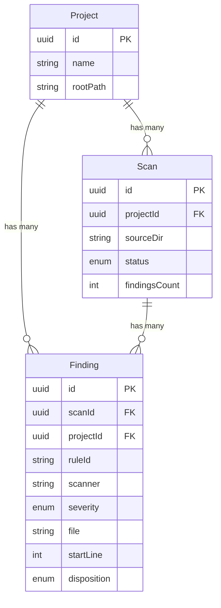
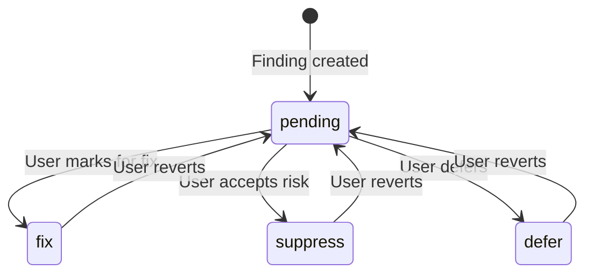
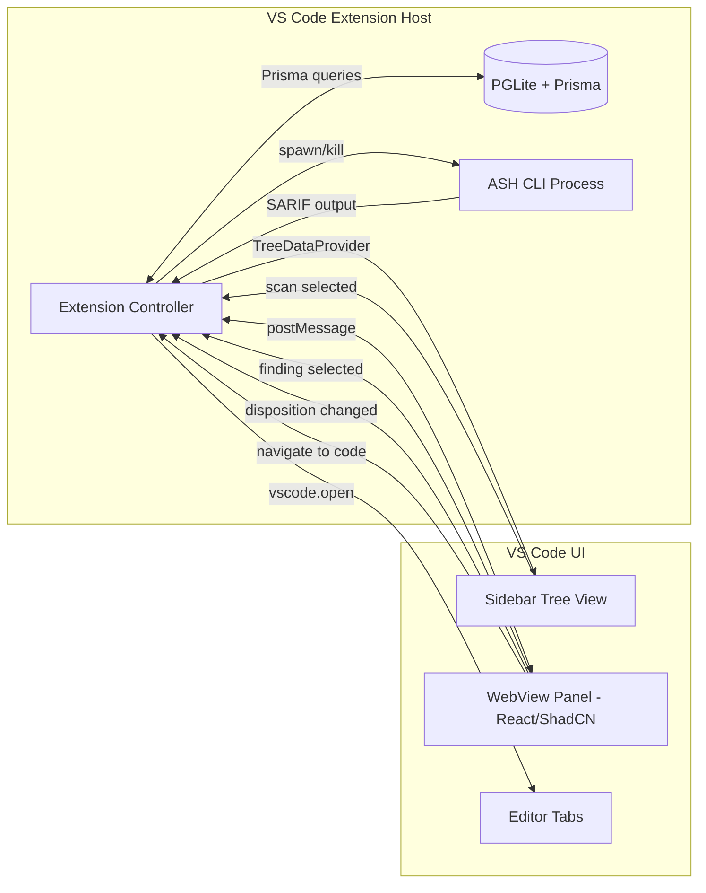
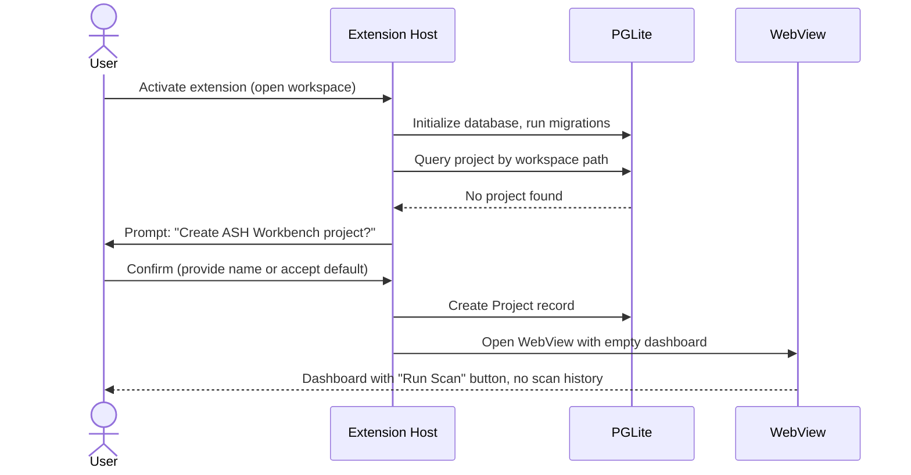
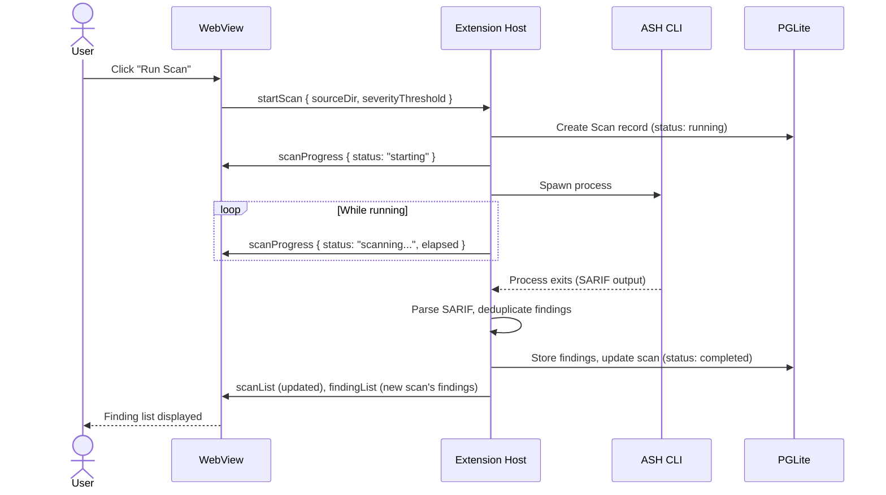
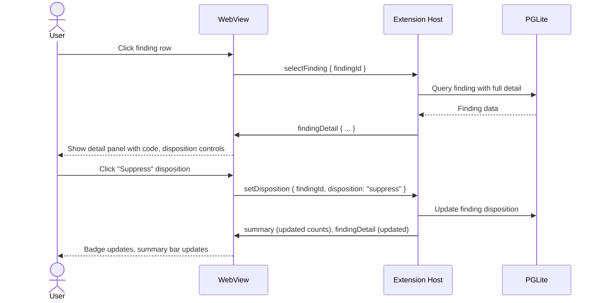
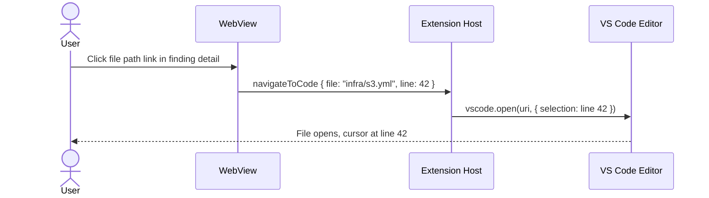

# ASH Workbench: Functional Design (POC / v1)

Functional design for the first release of the ASH Workbench VS Code extension. This document defines what the application does, what the user experiences, and how the data flows -- scoped to a realistic, achievable POC.

**Design principles for this version:**

- **KISS** -- Simple implementations that work end-to-end beat sophisticated implementations that don't ship.
- **YAGNI** -- Features are included only if they're required for the core scan-triage-act loop.
- **Progressive foundation** -- The data model and architecture should support future features (AI enrichment, delta reports, categories) without requiring rewrites, but those features are not built yet.

---

## 1. POC Scope

### 1.1 What's In

The core loop: **scan code, view findings, decide what to do about each one.**

| Capability | Description |
|------------|-------------|
| **Project management** | Create/select a project scoped to a workspace folder. All scans and findings belong to a project. |
| **Scan execution** | Run a single ASH scan against a directory, with progress feedback and the ability to cancel. |
| **Scan history** | View a list of current and past scans with summary metadata. Delete old scans. |
| **Finding list** | View deduplicated findings from a scan, filterable by severity, file, scanner, and status. |
| **Finding detail** | View a finding's affected code locations, description, and rule information. Navigate to the affected file/line in the editor. |
| **Finding triage** | Set a disposition on each finding: Pending, Fix, Suppress, Defer. View cumulative finding status across scans. |
| **Settings** | Configure ASH installation path, default scan parameters, and LLM model settings (Anthropic on Bedrock). |

### 1.2 What's Out (Future Versions)

These capabilities are deliberately deferred. The data model is designed so they can be added without schema rewrites.

| Deferred Capability | Rationale |
|---------------------|-----------|
| **Category grouping** | Grouping findings by root cause is valuable but requires a categorization algorithm and category-level disposition propagation. The POC triages per-finding. |
| **Research documents** | Structured investigation documents (seed-and-fill pattern) add value but depend on category grouping. |
| **Implementation plans** | Remediation planning documents depend on research documents. |
| **Delta reports** | Comparing runs requires stable finding identity across scans. The data model supports this (rule_id + file composite key), but the UI and reconciliation logic are deferred. |
| **Suppression file generation** | Generating `.ash.yaml` entries from suppress-disposition findings. Simple to add once triage works. |
| **AI-enriched finding detail** | Rewriting scanner descriptions, generating attack vector explanations, proposing code fixes. Requires LLM integration. The settings and model configuration are in the POC to prepare for this. |
| **Batch operations** | Applying a disposition to multiple findings at once. Useful but not essential for POC. |

### 1.3 POC Exit Criteria

The POC is complete when a user can:

1. Open a workspace in VS Code and create an ASH Workbench project
2. Run an ASH scan against a directory in that workspace
3. See scan progress and completion
4. Browse the resulting findings, filtered by severity
5. Click a finding and see the affected code with line numbers
6. Click a code location and navigate to that file/line in the editor
7. Set a disposition (Fix, Suppress, Defer) on findings
8. View a cumulative list showing how many findings are Pending, Fixed, Suppressed, Deferred
9. Run a second scan and see new findings appear
10. Delete an old scan and its findings

---

## 2. User Stories (Prioritized)

### P0 -- Must Have

| ID | Story | Acceptance |
|----|-------|------------|
| US-01 | As a user, I can create a project scoped to my workspace, so that scans and findings are organized together. | Project created with name and root path. Persists across VS Code sessions. |
| US-02 | As a user, I can run an ASH scan against a directory in my project. | Scan executes, progress is visible, findings are stored on completion. |
| US-03 | As a user, I can see scan progress and know when it completes or fails. | Progress indicator with status text. Clear completion/failure state. |
| US-04 | As a user, I can see a list of findings from a scan, sorted by severity. | Finding list shows severity, title, file, scanner, status. Sortable, filterable. |
| US-05 | As a user, I can view finding details including affected code locations. | Detail view shows code excerpt with file path and line range for each location. |
| US-06 | As a user, I can click a code location to open that file at that line in the editor. | Clicking navigates to the exact file and line in a VS Code editor tab. |
| US-07 | As a user, I can set a disposition on a finding (Pending, Fix, Suppress, Defer). | Disposition is persisted and reflected in the finding list. |
| US-08 | As a user, I can see a cumulative view of findings with their current statuses. | Summary counts: total, pending, fix, suppress, defer. Filterable list. |

### P1 -- Should Have

| ID | Story | Acceptance |
|----|-------|------------|
| US-09 | As a user, I can see a list of past scans with summary info (date, finding count, severity breakdown). | Scan history list with metadata. Most recent first. |
| US-10 | As a user, I can delete a past scan and its associated findings. | Scan and findings removed from database. UI reflects deletion. |
| US-11 | As a user, I can stop a running scan. | Cancel action stops the ASH process. Partial results are discarded. |
| US-12 | As a user, I can configure ASH Workbench settings (ASH path, default scan parameters). | Settings persisted in VS Code configuration. Validated on save. |
| US-13 | As a user, I can configure LLM model settings for future AI features. | Model provider, region, and model ID stored. Connection validated. |

### P2 -- Nice to Have

| ID | Story | Acceptance |
|----|-------|------------|
| US-14 | As a user, I can filter findings by scanner (checkov, cdk-nag, semgrep, etc.). | Filter control on finding list. |
| US-15 | As a user, I can see severity distribution as a visual summary (chart or badge counts). | Visual severity breakdown on scan detail or project dashboard. |
| US-16 | As a user, I can select a scan from history and view its findings. | Clicking a past scan shows its finding list. |

---

## 3. Data Model

Simplified from the IPA domain model. Designed so that Category, ResearchDocument, DeltaReport, and MatrixResponse entities can be added later without schema changes to existing tables.

### 3.1 Entity Definitions

#### Project

The root aggregate. Scopes all data to a workspace.

| Field | Type | Notes |
|-------|------|-------|
| `id` | UUID | Primary key |
| `name` | String | User-provided project name |
| `rootPath` | String | Absolute path to workspace root |
| `createdAt` | DateTime | |
| `updatedAt` | DateTime | |

#### Scan

A single execution of the ASH scanner suite against a target directory.

| Field | Type | Notes |
|-------|------|-------|
| `id` | UUID | Primary key |
| `projectId` | UUID | FK to Project |
| `sourceDir` | String | Relative path to scanned directory (relative to project root) |
| `status` | Enum | `running`, `completed`, `failed`, `cancelled` |
| `severityThreshold` | Enum | `LOW`, `MEDIUM`, `HIGH` -- minimum severity to report |
| `findingsCount` | Int | Total findings (populated on completion) |
| `severityBreakdown` | JSON | `{ high: N, medium: N, low: N, info: N }` |
| `startedAt` | DateTime | |
| `completedAt` | DateTime | Nullable |
| `errorMessage` | String | Nullable, populated on failure |

#### Finding

An individual security issue detected by a scanner. Matched across scans by the composite key `(ruleId, file)`.

| Field | Type | Notes |
|-------|------|-------|
| `id` | UUID | Primary key |
| `scanId` | UUID | FK to Scan |
| `projectId` | UUID | FK to Project (denormalized for cumulative queries) |
| `ruleId` | String | Primary scanner rule identifier (e.g., `CKV_AWS_18`) |
| `ruleIds` | JSON | Array of all rule IDs if multiple scanners flagged same issue |
| `scanner` | String | Which scanner produced this (`checkov`, `cdk-nag`, `semgrep`, etc.) |
| `severity` | Enum | `HIGH`, `MEDIUM`, `LOW`, `INFO` |
| `file` | String | Relative path to affected file |
| `startLine` | Int | |
| `endLine` | Int | |
| `description` | String | Scanner-provided description |
| `snippet` | String | Code excerpt, nullable |
| `disposition` | Enum | `pending`, `fix`, `suppress`, `defer` |

**Identity rule:** Two findings are the "same" issue when they share the same `(ruleId, file)` pair. This supports future delta computation without schema changes.

### 3.2 Entity Relationships



### 3.3 Disposition State Machine (POC)

Simplified from the IPA model. No "Research" or "Fixed (verified)" states in POC -- those require category grouping and delta verification respectively.



All transitions are user-initiated. There is no automated state change in the POC (automated verification via re-scan is a future feature).

---

## 4. Feature Specifications

### 4.1 Project Management

**Behavior:**

- On first activation, if no project exists for the current workspace, prompt the user to create one.
- A project is 1:1 with a VS Code workspace folder. The project's `rootPath` is the workspace folder path.
- Project name defaults to the workspace folder name but is editable.
- Project data persists in a PGLite database stored within the extension's global storage path (not in the workspace itself).
- Only one project is active at a time (the current workspace).

**UI surface:** Minimal. Project creation is a one-time setup flow (input box or small form). The active project name appears in the status bar or sidebar header.

### 4.2 Scan Execution

**Behavior:**

1. User initiates a scan via command palette or sidebar button.
2. User selects or confirms the target directory (defaults to workspace root).
3. Extension spawns the ASH CLI process with the configured parameters.
4. Progress is reported to the UI as the scan runs (scanner-level progress if available, otherwise an indeterminate indicator).
5. On completion, the extension parses ASH output (SARIF format), deduplicates findings, and stores them in the database.
6. On failure, the error message is stored and displayed.
7. On cancel, the ASH process is killed and the scan record is marked `cancelled`.

**ASH integration:** The extension calls the ASH CLI directly as a child process. This is simpler and more reliable than MCP for a POC. The MCP integration described in the IPA as-built is a future enhancement.

**Parsing:** ASH produces SARIF output. The extension parses SARIF to extract findings. Each SARIF result becomes a Finding record. Deduplication by `(ruleId, file)` happens at parse time -- if the same rule flags the same file at different lines, the first occurrence is kept and the line range is expanded.

**Constraints:**
- One scan at a time per project.
- The scan target must be within the project's root path.

### 4.3 Scan History

**Behavior:**

- Sidebar panel shows a list of scans for the active project, most recent first.
- Each scan entry shows: date/time, status (with icon), source directory, finding count, severity badges.
- Clicking a scan shows its findings in the finding list.
- A running scan appears at the top with a progress indicator.
- Context menu or button allows deleting a completed scan (with confirmation). Deleting a scan cascades to its findings.

**UI surface:** Tree view in the sidebar (VS Code native `TreeDataProvider`), or a section within the WebView panel.

### 4.4 Finding List

**Behavior:**

- Shows findings for a selected scan, or cumulative findings across all scans in the project.
- Default view: findings from the most recent completed scan.
- Cumulative view: one row per unique `(ruleId, file)` pair across all scans, showing the most recent disposition.
- Sortable by severity (default: HIGH first), file, scanner.
- Filterable by: severity level, disposition status, scanner, file path substring.
- Each row shows: severity (color-coded), description (one line), file path, scanner, disposition status.

**UI surface:** Table in a WebView panel (React + ShadCN). The WebView provides richer UI than native tree views -- filtering, sorting, color-coded severity, and inline status badges.

### 4.5 Finding Detail

**Behavior:**

When a user selects a finding, a detail panel shows:

**Tier 1 -- Header:**
- Severity badge (color-coded)
- Description (one-line summary)
- Rule ID(s) and scanner name
- Current disposition with change control

**Tier 2 -- Affected Code:**
- File path (clickable -- opens in editor)
- Line range
- Code excerpt with syntax highlighting (10 lines of context)
- If the finding affects multiple locations in the same file, show all locations

**Tier 3 -- Scanner Information:**
- Full scanner description / rule explanation
- Rule ID for reference lookup

Tiers 3b (AI vulnerability explanation), 3c (repair options), and 3d (suppression guidance) from the finding information notes are **deferred**. The detail view shows what the scanner provides; AI enrichment comes later.

**Navigation:** Clicking a file path or line number sends a `vscode.commands.executeCommand('vscode.open', uri, { selection })` to open the file at that location. This is the most valuable single interaction in the POC.

**UI surface:** Detail section within the WebView panel (expanding row or side panel within the WebView).

### 4.6 Finding Triage

**Behavior:**

- Each finding has a disposition dropdown or button group: Pending, Fix, Suppress, Defer.
- Changing disposition is immediate -- persisted to the database on change.
- Disposition can be reverted to Pending at any time.
- The finding list updates to reflect the new status (badge color, filter membership).

**Cumulative triage view:**
- Summary bar showing counts: `Total: N | Pending: N | Fix: N | Suppress: N | Defer: N`
- This view operates across all scans, using the most recent disposition for each unique finding.

**What triage does NOT do in POC:**
- No propagation to categories (no categories yet)
- No generation of suppression entries in `.ash.yaml`
- No verification via re-scan
- No research document creation

### 4.7 Settings

**Behavior:**

Settings are stored in VS Code's configuration system (`vscode.workspace.getConfiguration`).

| Setting | Type | Default | Notes |
|---------|------|---------|-------|
| `ashWorkbench.ashPath` | string | `ash` | Path to ASH CLI executable |
| `ashWorkbench.defaultSeverityThreshold` | enum | `LOW` | Default minimum severity for scans |
| `ashWorkbench.defaultSourceDir` | string | `.` | Default scan target relative to workspace root |
| `ashWorkbench.llm.provider` | enum | `bedrock` | LLM provider (bedrock only for POC) |
| `ashWorkbench.llm.region` | string | `us-east-1` | AWS region for Bedrock |
| `ashWorkbench.llm.modelId` | string | `anthropic.claude-sonnet-4-20250514` | Bedrock model ID |

LLM settings are stored but not actively used in POC. They prepare for AI enrichment features.

**UI surface:** VS Code native settings UI (contributed via `package.json` `contributes.configuration`). No custom settings WebView needed.

---

## 5. UI Architecture

### 5.1 Layout

The extension contributes two UI surfaces:

1. **Sidebar view container** ("ASH Workbench" icon in the activity bar)
   - Contains a native tree view for scan history and quick navigation
   - Lightweight, always visible when the sidebar is open

2. **WebView panel** (opens in the editor area)
   - React + ShadCN application for the rich finding list, detail view, and triage controls
   - Opens when the user clicks a scan or uses the "Open Workbench" command
   - Communicates with the extension host via `postMessage` / `onDidReceiveMessage`

### 5.2 Information Flow



### 5.3 WebView Communication Protocol

The WebView and extension host communicate via a message protocol:

**Extension -> WebView (state pushes):**

| Message Type | Payload | When |
|-------------|---------|------|
| `scanList` | Array of scan summaries | On load, after scan completes, after delete |
| `findingList` | Array of findings (paginated) | On scan selection, on filter change |
| `findingDetail` | Single finding with full data | On finding selection |
| `scanProgress` | Status text, percentage (if available) | During active scan |
| `summary` | Disposition counts | On load, after disposition change |

**WebView -> Extension (user actions):**

| Message Type | Payload | Effect |
|-------------|---------|--------|
| `startScan` | `{ sourceDir, severityThreshold }` | Begin ASH scan |
| `cancelScan` | `{ scanId }` | Kill running scan |
| `selectScan` | `{ scanId }` | Load findings for scan |
| `selectFinding` | `{ findingId }` | Load finding detail |
| `setDisposition` | `{ findingId, disposition }` | Update finding disposition |
| `navigateToCode` | `{ file, line }` | Open file in editor |
| `deleteScan` | `{ scanId }` | Delete scan (with confirmation in extension host) |
| `applyFilters` | `{ severity?, scanner?, disposition?, filePattern? }` | Filter finding list |

### 5.4 WebView Screens

**Screen 1: Dashboard / Scan List**
- Project name header
- "Run Scan" button (prominent)
- Active scan progress (if running)
- Scan history table: date, status, directory, findings count, severity badges
- Summary bar: total findings, disposition breakdown across all scans

**Screen 2: Finding List** (after selecting a scan or choosing "All Findings")
- Breadcrumb: Project > Scan (date) or Project > All Findings
- Filter bar: severity chips, scanner dropdown, disposition dropdown, file search
- Summary bar: count by disposition
- Finding table: severity icon, description, file, scanner, disposition badge
- Click a row to expand or navigate to detail

**Screen 3: Finding Detail** (expanded row or side panel)
- Header: severity badge, description, rule IDs, scanner
- Disposition control: button group (Pending / Fix / Suppress / Defer)
- Code locations: for each location, show file path (clickable), line range, syntax-highlighted excerpt
- Scanner details: full description, rule documentation link (if available)

---

## 6. Technical Integration

### 6.1 ASH CLI Integration

The extension invokes ASH as a child process rather than through MCP. This is simpler to implement and debug.

**Scan invocation:**
```
ash --source-dir <path> --output-dir <temp> --format sarif [--severity-threshold <level>]
```

**Output parsing:**
1. ASH writes SARIF files to the temp output directory.
2. Extension reads SARIF JSON, iterates `runs[].results[]`.
3. Each SARIF result maps to a Finding:
   - `ruleId` from `result.ruleId`
   - `severity` from `result.level` (mapped: `error` -> HIGH, `warning` -> MEDIUM, `note` -> LOW, `none` -> INFO)
   - `file` from `result.locations[0].physicalLocation.artifactLocation.uri`
   - `startLine` / `endLine` from `result.locations[0].physicalLocation.region`
   - `description` from `result.message.text`
   - `snippet` from `result.locations[0].physicalLocation.region.snippet.text` (if available)
   - `scanner` from `run.tool.driver.name`
4. Deduplication: group by `(ruleId, file)`, merge line ranges, keep most detailed description.

**Progress:** ASH does not provide granular progress events. The extension shows an indeterminate progress indicator with elapsed time. If ASH supports progress in the future, the extension can parse stdout for progress updates.

### 6.2 Database (PGLite + Prisma)

**Why PGLite:** Embeddable PostgreSQL that runs in-process. No external database server needed. Gives us Prisma ORM compatibility and real SQL capabilities (joins, aggregations, JSON columns) that SQLite alternatives lack. The database file lives in the extension's `globalStorageUri` directory.

**Prisma schema** defines the three POC entities (Project, Scan, Finding) with indexes on:
- `Finding(projectId, ruleId, file)` -- for cumulative queries and deduplication
- `Finding(scanId, severity)` -- for filtered finding lists
- `Scan(projectId, startedAt)` -- for scan history ordering

**Migration strategy:** Prisma Migrate generates SQL migrations. For POC, migrations run automatically on extension activation. This is acceptable because the database is local and disposable -- if a migration fails, the user can reset by deleting the database file.

### 6.3 WebView (React + ShadCN)

**Build:** The React app is built separately (`npm run build` in a `webview/` subdirectory) and bundled into the extension's output. The extension loads the built HTML/JS/CSS from disk.

**State management:** The WebView receives state from the extension host via messages. Local UI state (filter selections, expanded rows) lives in React state. There is no client-side data fetching -- all data comes through the message bridge.

**ShadCN components used (expected):**
- `Table` -- finding list, scan history
- `Badge` -- severity indicators, disposition tags
- `Button` -- actions, disposition controls
- `Select` / `DropdownMenu` -- filters
- `Input` -- file search filter
- `Card` -- finding detail layout
- `Progress` -- scan progress indicator

---

## 7. Interaction Flows

### 7.1 First Run



### 7.2 Run Scan



### 7.3 Triage a Finding



### 7.4 Navigate to Code



---

## 8. Future Version Roadmap

Features deferred from POC, ordered by expected implementation sequence. Each builds on the previous.

### v1.1 -- AI Enrichment
- Use OpenCodeSDK to generate plain-language vulnerability explanations per finding
- AI-generated repair options with code diff previews
- Suppression justification drafts
- Leverages the LLM settings already configured in POC

### v1.2 -- Category Grouping
- Automated grouping of findings by root cause (same description theme across files)
- Category-level disposition that propagates to all member findings
- Category list view alongside finding list
- Batch triage operations

### v1.3 -- Suppression & Remediation
- Generate `.ash.yaml` suppression entries from suppress-disposition findings/categories
- Research document generation (seed-and-fill pattern)
- Implementation plan documents
- Directory-as-state pattern (pending/fixed/suppressed)

### v1.4 -- Delta Reports & Iteration
- Compare findings between scan runs using `(ruleId, file)` matching
- Delta view: resolved, new, unchanged findings
- Automated status transitions (Fix -> Fixed when verified by re-scan)
- Iterative convergence tracking

---

## 9. Outstanding Questions

| # | Question | Context | Impact |
|---|----------|---------|--------|
| 1 | What ASH CLI flags are available for controlling output format? | The integration assumes SARIF output is available via a `--format sarif` flag. If ASH outputs differently, the parser needs to adapt. | Scan execution, finding parsing |
| 2 | Does PGLite support Prisma's migration system out of the box, or does it require a custom adapter? | Prisma officially supports PostgreSQL. PGLite is PostgreSQL-compatible but may need a custom driver adapter for the Node.js Prisma client. | Database layer implementation |
| 3 | Should the database be per-workspace or global? | Per-workspace keeps data local but creates a database file in each project. Global (using `globalStorageUri`) keeps a single database with project-level scoping. | Project management, data isolation |
| 4 | What is the expected scan duration for typical projects? | Affects UX decisions around progress reporting, timeout handling, and whether background scanning is needed. | Scan execution UX |
| 5 | Should finding deduplication happen across scans or only within a single scan? | Within-scan dedup is simpler. Cross-scan dedup enables cumulative views but requires a merge strategy for conflicting dispositions. | Finding list, cumulative view |
| 6 | How should the extension handle ASH not being installed? | Options: error message with install link, bundled ASH, Docker-based ASH execution. | First-run experience |
