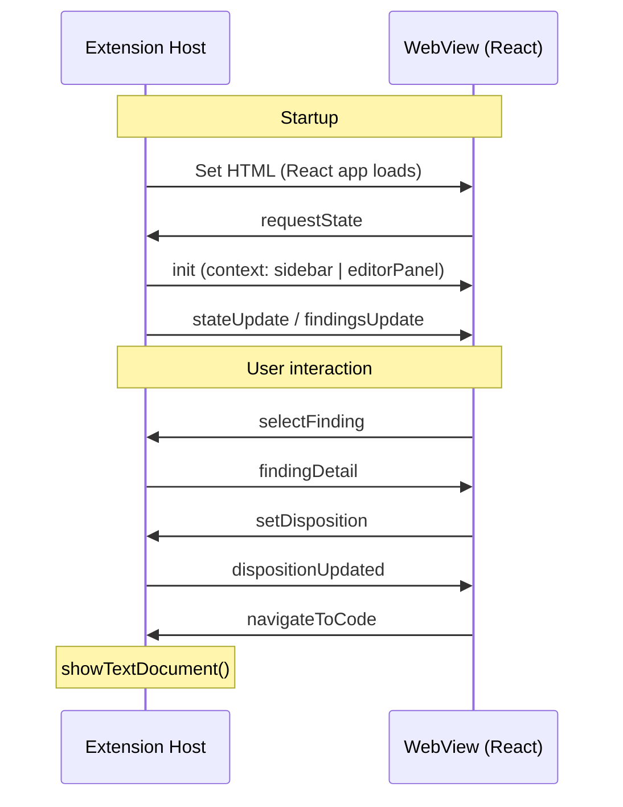

# Message Protocol

The extension host and WebView communicate via `postMessage`. All messages are typed as discriminated unions in `vsix/src/models/messages.ts` (and copied to `webview/src/types/messages.ts`). The `type` field identifies each message variant.

## How It Works

### Handshake

The WebView cannot receive messages until its JavaScript has loaded and registered a listener. The handshake avoids race conditions:

1. Extension host sets `webview.html` (starts loading the React app)
2. React app mounts, registers a `message` event listener via `useMessages()`
3. React app sends `requestState` to the extension host
4. Extension host responds with `init` (setting the context) followed by state data

This request-response pattern guarantees the WebView is ready before receiving data. Earlier iterations used `setTimeout()` to delay the `init` message, which was unreliable.

### Message flow

## Extension Host to WebView Messages

Defined as `ExtToWebviewMessage` in `models/messages.ts`:

| Type | Payload | Purpose |
|---|---|---|
| `init` | `{ context: 'sidebar' }` or `{ context: 'editorPanel', scanId }` | Tells the WebView which UI to render |
| `stateUpdate` | `{ scans: ScanSummary[], summary: DispositionSummary }` | Sidebar dashboard data |
| `findingsUpdate` | `{ scanId, findings: FindingRow[] }` | Finding list for editor panel |
| `findingDetail` | `FindingRow` | Single finding detail |
| `dispositionUpdated` | `{ findingId, disposition }` | Confirms a disposition change |

## WebView to Extension Host Messages

Defined as `WebviewToExtMessage` in `models/messages.ts`:

| Type | Payload | Purpose |
|---|---|---|
| `requestState` | *(none)* | Request initial state (sent on mount) |
| `selectScan` | `{ scanId }` | User selected a scan |
| `selectFinding` | `{ findingId }` | User clicked a finding row |
| `setDisposition` | `{ findingId, disposition }` | User changed a disposition |
| `navigateToCode` | `{ filePath, startLine }` | User clicked a file path link |
| `startScan` | *(none)* | User clicked "Run Scan" |
| `openFindings` | `{ scanId }` | User clicked "View Findings" |

## Context-Specific Routing

Different providers handle different message subsets:

| Provider | Handles |
|---|---|
| `SidebarWebviewProvider` | `requestState`, `startScan`, `openFindings` |
| `FindingsPanelManager` | `requestState`, `selectFinding`, `setDisposition`, `navigateToCode` |

Both providers handle `requestState` by first sending `init`, then sending context-appropriate data.

## Extending / Maintaining

### Adding a new message

1. Add the message variant to `ExtToWebviewMessage` or `WebviewToExtMessage` in `vsix/src/models/messages.ts`
2. Copy the updated file to `webview/src/types/messages.ts`
3. Add the handler in the relevant provider (`sidebarWebviewProvider.ts` or `findingsPanelManager.ts`)
4. Add the reducer case in `webview/src/App.tsx` if it's an inbound message
5. Add the `postMessage()` call in the relevant React component if it's an outbound message

### Type safety

Both sides use the same type definitions. TypeScript enforces that messages conform to the discriminated union at compile time. The `type` field acts as the discriminant -- each `switch` case narrows the payload type automatically.

### Gotcha: message ordering

`postMessage` is asynchronous and non-blocking. When sending multiple messages in sequence (e.g., `init` then `findingsUpdate`), they arrive in order but the WebView processes them in separate React render cycles. The reducer in `App.tsx` handles this correctly because each message updates independent parts of the state.
