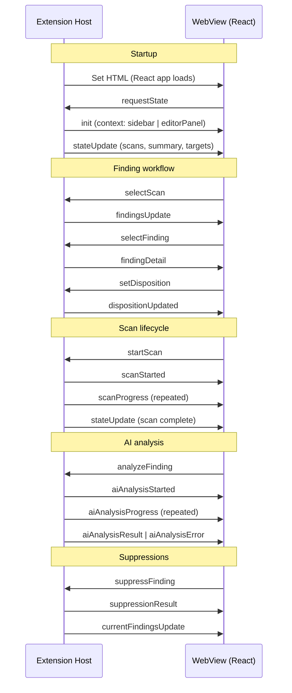

# Message Protocol

The extension host and WebView communicate via `postMessage`. All messages are typed as discriminated unions in `vsix/src/models/messages.ts` (and copied to `webview/src/types/messages.ts`). The `type` field identifies each message variant.

## How It Works

### Handshake

The WebView cannot receive messages until its JavaScript has loaded and registered a listener. The handshake avoids race conditions:

1. Extension host sets `webview.html` (starts loading the React app)
2. React app mounts, registers a `message` event listener via `useMessages()`
3. React app sends `requestState` to the extension host
4. Extension host responds with `init` (setting the context) followed by state data

This request-response pattern guarantees the WebView is ready before receiving data.

### Message Flow

## Extension Host to WebView Messages

Defined as `ExtToWebviewMessage` in `models/messages.ts`:

### Initialization and State

| Type | Payload | Purpose |
|---|---|---|
| `init` | `{ context: 'sidebar' \| 'editorPanel' \| 'sink', scanId? }` | Tells the WebView which UI to render |
| `stateUpdate` | `{ scans, summary, scanTargets, scanRoot, claudeSettingsDetected, detectedProvider }` | Dashboard data: scan list, triage counts, targets, AI config |
| `findingsUpdate` | `{ scanId, findings }` | Finding list for a specific scan |
| `findingDetail` | `FindingRow` | Single finding with full detail |
| `dispositionUpdated` | `{ findingId, disposition }` | Confirms a disposition change |
| `currentFindingsUpdate` | `{ findings, suppressionSummary, scanId, lastScannedAt }` | Latest findings for scan root with suppression overlay |

### Scan Lifecycle

| Type | Payload | Purpose |
|---|---|---|
| `scanStarted` | `{ scanId, targetPath }` | Scan has begun |
| `scanProgress` | `{ scanId, elapsed, status }` | Periodic progress update |

### Suppression Events

| Type | Payload | Purpose |
|---|---|---|
| `ashYamlChanged` | `{ config: AshYamlConfigSummary }` | `.ash.yaml` file was modified (external or internal) |
| `suppressionResult` | `SuppressionResult` | Result of a suppress-finding operation |
| `suppressionWriteResult` | `SuppressionWriteResult` | Result of add/edit/remove suppression |
| `suppressionsUpdate` | `{ suppressions, ignorePaths, configInfo }` | Full suppression state refresh |

### AI Analysis Events

| Type | Payload | Purpose |
|---|---|---|
| `aiAnalysisStarted` | `{ findingId, model }` | Analysis has begun for a finding |
| `aiAnalysisProgress` | `{ findingId, message, toolName? }` | Streaming progress with optional tool usage |
| `aiAnalysisResult` | `{ findingId, analysis, metadata }` | Completed analysis with structured output |
| `aiAnalysisError` | `{ findingId, errorType, message }` | Analysis failed |
| `aiTestResult` | `{ success, model?, latencyMs, error? }` | Connection test result |

### Batch Analysis Events

| Type | Payload | Purpose |
|---|---|---|
| `batchAnalysisStarted` | `{ scanId, totalFindings, findingIds }` | Batch analysis has begun |
| `batchAnalysisProgress` | `{ scanId, currentIndex, totalFindings, currentFindingId }` | Progress through the batch |
| `batchAnalysisComplete` | `{ scanId, analyzedCount, failedCount, skippedCount, status }` | Batch finished (status: completed, cancelled, consecutive-failures, error) |

## WebView to Extension Host Messages

Defined as `WebviewToExtMessage` in `models/messages.ts`:

### Data Requests

| Type | Payload | Purpose |
|---|---|---|
| `requestState` | *(none)* | Request initial state (sent on mount) |
| `requestSuppressions` | *(none)* | Request suppression data |
| `requestCurrentFindings` | *(none)* | Request latest findings for scan root |
| `requestApplicationInfo` | *(none)* | Request extension info (version, DB stats) |

### Scan Operations

| Type | Payload | Purpose |
|---|---|---|
| `startScan` | *(none)* | Start a new scan |
| `cancelScan` | `{ scanId }` | Cancel a running scan |
| `deleteScan` | `{ scanId }` | Delete a scan and its findings |

### Finding Operations

| Type | Payload | Purpose |
|---|---|---|
| `selectScan` | `{ scanId }` | User selected a scan |
| `selectScanTarget` | `{ scanTargetId }` | User selected a scan target filter |
| `selectFinding` | `{ findingId }` | User clicked a finding row |
| `setDisposition` | `{ findingId, disposition }` | User changed a disposition |
| `setNotes` | `{ findingId, notes }` | User updated finding notes |

### Suppression Operations

| Type | Payload | Purpose |
|---|---|---|
| `suppressFinding` | `SuppressionInput` | Create suppression for a finding |
| `unsuppressFinding` | `{ findingId }` | Remove suppression for a finding |
| `addSuppression` | `{ suppression }` | Add suppression rule directly |
| `editSuppression` | `{ old, updated }` | Edit an existing suppression |
| `removeSuppression` | `{ suppression }` | Remove a suppression rule |

### AI Operations

| Type | Payload | Purpose |
|---|---|---|
| `testAiConnection` | *(none)* | Test AI provider credentials |
| `analyzeFinding` | `{ findingId }` | Analyze a single finding with AI |
| `cancelAiAnalysis` | `{ findingId }` | Cancel an active analysis |
| `analyzeAllFindings` | `{ scanId }` | Start batch analysis for a scan |
| `cancelBatchAnalysis` | `{ scanId }` | Cancel batch analysis |

### Navigation

| Type | Payload | Purpose |
|---|---|---|
| `navigateToCode` | `{ filePath, startLine }` | Open file at line in VS Code editor |
| `openDashboard` | *(none)* | Navigate to dashboard view |
| `openSettings` | *(none)* | Open VS Code settings |
| `openSink` | *(none)* | Open Kitchen Sink (dev only) |
| `resetApplication` | *(none)* | Delete all data and reload |

## Context-Specific Routing

Different providers handle different message subsets:

| Provider | Handles |
|---|---|
| `SidebarWebviewProvider` | `requestState`, `startScan`, `cancelScan`, `requestCurrentFindings`, `testAiConnection`, `openDashboard`, `openSettings`, `selectScanTarget` |
| `FindingsPanelManager` | All message types — finding queries, triage, suppressions, AI analysis, scan management, navigation |

Both providers handle `requestState` by first sending `init`, then sending context-appropriate data.

## Extending / Maintaining

### Adding a new message

1. Add the message variant to `ExtToWebviewMessage` or `WebviewToExtMessage` in `vsix/src/models/messages.ts`
2. Copy the updated types to `webview/src/types/messages.ts`
3. Add the handler in the relevant provider (`sidebarWebviewProvider.ts` or `findingsPanelManager.ts`)
4. Add the reducer case in `webview/src/App.tsx` if it's an inbound message
5. Add the `postMessage()` call in the relevant React component if it's an outbound message

### Type safety

Both sides use the same type definitions. TypeScript enforces that messages conform to the discriminated union at compile time. The `type` field acts as the discriminant — each `switch` case narrows the payload type automatically.

### Gotcha: message ordering

`postMessage` is asynchronous and non-blocking. When sending multiple messages in sequence (e.g., `init` then `findingsUpdate`), they arrive in order but the WebView processes them in separate React render cycles. The reducer in `App.tsx` handles this correctly because each message updates independent parts of the state.

### Gotcha: type drift

The message types in `vsix/src/models/messages.ts` are the source of truth. The webview copy at `webview/src/types/messages.ts` must be manually kept in sync. There is no build-time validation that the two files match.
