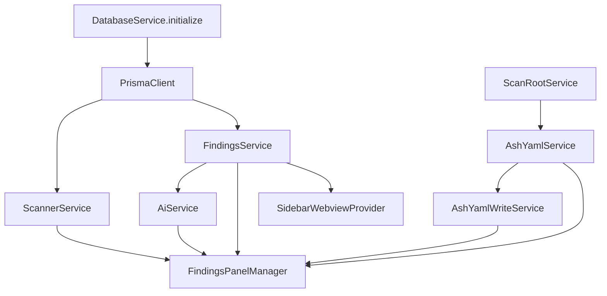

# Services

Services are the business logic layer of ASH Workbench. They live in `vsix/src/services/` and are instantiated in `extension.ts` during activation. Services receive dependencies via constructor injection and expose async methods for specific operations.

## Service Inventory

| Service | File | Responsibility | Dependencies |
|---------|------|----------------|-------------|
| `DatabaseService` | `database.ts` | PGLite + Prisma lifecycle, migrations | None (static) |
| `ScannerService` | `scanner.ts` | ASH CLI spawn, scan lifecycle, SARIF import | PrismaClient, projectId |
| `FindingsService` | `findings.ts` | Finding queries, triage, AI analysis persistence | PrismaClient, projectId |
| `AshYamlService` | `ashYaml.ts` | `.ash.yaml` file watching, parsing, suppression matching | scanRoot |
| `AshYamlWriteService` | `ashYamlWrite.ts` | `.ash.yaml` mutation (add/edit/remove suppressions) | scanRoot, AshYamlService |
| `AiService` | `aiService.ts` | AI analysis orchestration (single + batch) | FindingsService, workspaceRoot |
| `ClaudeAgentProvider` | `claudeAgentProvider.ts` | Claude Agent SDK integration, structured output | Settings |
| `ScanRootService` | `scanRoot.ts` | Effective scan root resolution and validation | workspaceRoot |
| `AdminService` | `admin.ts` | Application info and reset | PrismaClient (static) |

### Supporting Modules

| Module | File | Purpose |
|--------|------|---------|
| `AshYamlCore` | `ashYamlCore.ts` | Pure functions: YAML parsing, config discovery, suppression matching |
| `AshYamlWriteCore` | `ashYamlWriteCore.ts` | Pure functions: YAML serialization, skeleton generation |
| `SarifService` | `sarif.ts` | SARIF JSON parsing, finding extraction, deduplication |
| `AiProvider` | `aiProvider.ts` | Interface definition and event types for AI providers |
| `McpTools` | `mcpTools.ts` | MCP server creation for finding-analysis tools |
| `ClaudeSettingsDetector` | `claudeSettingsDetector.ts` | `~/.claude/settings.json` detection |
| `ProjectService` | `project.ts` | Project record upsert |

## Service Wiring

Services are instantiated in `extension.ts` `activate()` in dependency order:



## Key Services

### ScannerService

`vsix/src/services/scanner.ts` — spawns the ASH CLI and manages the scan lifecycle.

```typescript
constructor(
  private readonly db: PrismaClient,
  private readonly projectId: string,
  private readonly spawnFn?: SpawnFn,    // Defaults to child_process.spawn
  private readonly outputChannel?: OutputChannel
)
```

**Key methods:**
- `startScan(params, onProgress?)` — Spawns ASH CLI (`ash --source-dir ... --output-formats sarif`), streams output to OutputChannel, parses SARIF from temp directory, stores findings in database
- `cancelScan(scanId)` — Kills process, marks scan CANCELLED
- `recoverStaleScans()` — On activation, marks any RUNNING scans as FAILED (crash recovery)

**Config resolution:** reads `ashWorkbench.ashPath`, `ashWorkbench.ashMode`, `ashWorkbench.scanTimeout` from VS Code settings.

### FindingsService

`vsix/src/services/findings.ts` — all finding queries and triage operations.

```typescript
constructor(
  private readonly db: PrismaClient,
  private readonly projectId: string
)
```

**Key methods:**
- `getFindings(scanId, filters?)` — Filterable queries (severity, scanner, disposition, file pattern)
- `getFindingDetail(findingId)` — Single finding with full context
- `getCurrentFindings(scanRootFilter?)` — Latest scan findings with suppression overlay
- `setDisposition(findingId, disposition)` — Update triage status
- `setAiAnalysis(findingId, analysis, metadata)` — Persist AI results as JSON
- `getScanSummaries()` / `getScanTargets()` / `getSummary()` — Aggregation queries

### AshYamlService

`vsix/src/services/ashYaml.ts` — reads and watches `.ash.yaml` for suppression rules.

```typescript
constructor(private readonly scanRoot: string)
```

Implements `vscode.Disposable`. Creates file watchers for config files in the scan root.

**Key methods:**
- `getConfig()` — Returns parsed `AshYamlConfig`
- `getSuppressions()` — Returns suppression array
- `matchesSuppression(finding)` — Single finding match (returns first matching suppression or null)
- `getMatchingSuppressions(findings)` — Batch matching (returns `Map<findingId, suppression>`)
- `onDidChangeConfig` — Event fired when `.ash.yaml` changes (debounced 200ms)

See [Suppression System](./suppression-system.md) for the matching algorithm and file format.

### AiService

`vsix/src/services/aiService.ts` — orchestrates AI analysis of findings.

```typescript
constructor(
  private readonly findingsService: FindingsService,
  private readonly workspaceRoot: string,
  private readonly outputChannel?: OutputChannel
)
```

**Key methods:**
- `analyzeFinding(findingId, onEvent)` — Analyze single finding, stream events
- `analyzeAllFindings(scanId, onBatchEvent)` — Batch analyze unanalyzed findings
- `testConnection()` — Test AI provider credentials
- `cancelAnalysis(findingId)` / `cancelBatchAnalysis(scanId)` — Abort active analyses

**Concurrency:** max 5 concurrent analyses. Active analyses tracked in `Map<string, AbortController>`.

See [AI Integration](./ai-integration.md) for the full analysis flow and provider configuration.

### ScanRootService

`vsix/src/services/scanRoot.ts` — resolves the effective scan root path.

```typescript
constructor(private readonly workspaceRoot: string)
```

**Key methods:**
- `refresh()` — Re-resolve `ashWorkbench.scanRoot` setting (validates: absolute path, exists)
- `getEffectiveScanRoot()` — Returns cached resolved root
- `isInScope(targetPath)` — Check if path is within scan root
- `buildPathFilter()` — Build Prisma WHERE clause for scan target filtering

## Patterns

### Constructor Injection

All services accept dependencies via constructor. No service locator or DI container. This makes testing straightforward — inject mocks directly.

```typescript
// Production wiring in extension.ts
const findingsService = new FindingsService(db, projectId);
const aiService = new AiService(findingsService, workspaceRoot, outputChannel);

// Test wiring
const findingsService = new FindingsService(mockDb, 'test-project');
```

### Static vs. Instance Services

- **Static:** `DatabaseService`, `AdminService` — singleton utilities with no per-project state
- **Instance:** Everything else — scoped to a project/workspace via constructor parameters

### Pure Function Modules

Complex logic is extracted into pure function modules (`*Core.ts`) that have no VS Code or I/O dependencies:

- `ashYamlCore.ts` — Config discovery, YAML parsing, suppression matching
- `ashYamlWriteCore.ts` — YAML serialization, skeleton generation
- `sarif.ts` — SARIF parsing and finding extraction

This separation enables unit testing without VS Code mocking.

### Event Emission

Services that need to notify providers of changes use VS Code's `EventEmitter` pattern:

```typescript
// AshYamlService
private readonly _onDidChangeConfig = new vscode.EventEmitter<AshYamlConfig>();
readonly onDidChangeConfig = this._onDidChangeConfig.event;
```

Providers subscribe in `extension.ts` and forward changes to webviews.

## Extending / Maintaining

### Adding a new service

1. Create `vsix/src/services/<name>.ts`
2. Accept dependencies via constructor (Prisma client, other services, workspace root)
3. Instantiate in `extension.ts` after its dependencies are ready
4. Pass to providers that need it via constructor or setter methods
5. If the service needs cleanup, implement `vscode.Disposable` and add to `context.subscriptions`

### Testing services

Services with pure function modules (`*Core.ts`) can be unit tested directly. Services with VS Code dependencies use the `@vscode/test-cli` integration test framework. See [Testing and Quality](../testing-and-quality.md).
