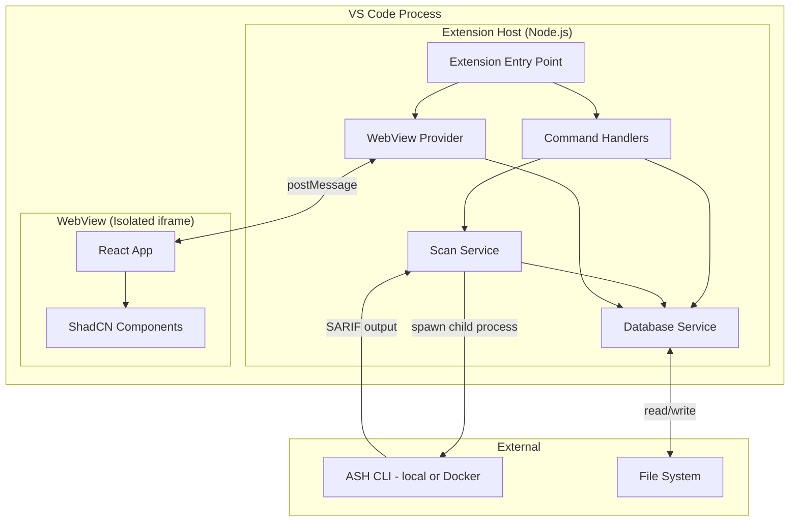
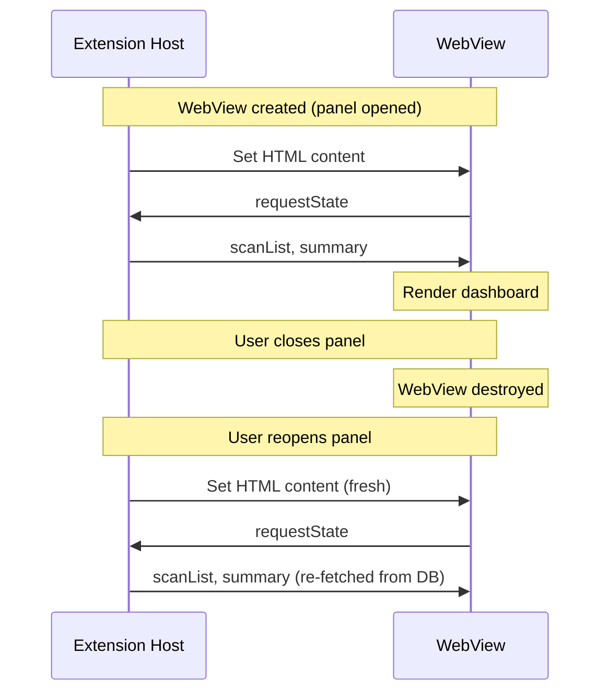

# ASH Workbench: Technical Design (POC / v1)

Technical design for the ASH Workbench VS Code extension. This document specifies how the application is built: architecture, module structure, data layer, integration patterns, build system, and testing strategy. Read the [Functional Design](./functional-design.md) first for the what; this document covers the how.

**Design constraints:**

- **Ship fast** -- Prefer proven patterns over novel ones. When a technology pairing is unproven (e.g., PGLite + Prisma), design a fallback.
- **Single developer** -- The architecture must be understandable and debuggable by one person. No microservices, no message queues, no external infrastructure.
- **VS Code native** -- Leverage VS Code APIs where they exist. Don't rebuild what the platform provides.

---

## 1. System Architecture

### 1.1 High-Level Architecture

The extension runs entirely within the VS Code process. There are no external servers, APIs, or databases.



### 1.2 Process Model

| Component | Runtime | Lifecycle |
|-----------|---------|-----------|
| Extension Host | Node.js (VS Code's extension host process) | Activated on first command, deactivated on window close |
| WebView | Chromium iframe (VS Code's webview renderer) | Created on demand, destroyed when panel closes (unless `retainContextWhenHidden`) |
| ASH CLI | Python process or Docker container (spawned child process) | Started per scan, terminated on completion or cancel |
| PGLite | In-process WASM (runs inside extension host) | Initialized on activation, persists to filesystem |

### 1.3 Key Design Decisions

| Decision | Choice | Rationale |
|----------|--------|-----------|
| Database | PGLite (in-process PostgreSQL via WASM) | No external server, real SQL capabilities, JSON columns, Prisma-compatible wire protocol. See [Section 4](#4-database-layer) for risks and fallback. |
| ORM | Prisma with `prisma-pglite` adapter | Type-safe queries, schema-as-code. Community `prisma-pglite` package provides the PGLite adapter and migration CLI wrapper. |
| WebView framework | React 19 + ShadCN/ui | Rich component library, consistent styling, fast development. |
| WebView build tool | Vite | Fast builds, native ESM, React plugin, simple config. |
| ASH integration | Child process (Python CLI) | ASH is a Python CLI (installed via pip/uvx). Supports `--mode local` (no Docker) and `--mode container` (Docker). The extension spawns `ash --source-dir ... --output-formats sarif` and parses the SARIF output. |
| State management | Extension host owns all state | WebView is a pure renderer. All data flows through postMessage from the extension host. No client-side data fetching or caching. |

---

## 2. Project Structure

```
workbench/
  vsix/                           # VS Code extension
    package.json                  # Extension manifest + dependencies
    tsconfig.json                 # TypeScript config (extension host)
    eslint.config.mjs             # Lint config
    src/
      extension.ts                # Entry point: activate/deactivate
      commands/                   # Command handler functions
        index.ts                  # Command registration
        scanCommands.ts           # Start scan, cancel scan, delete scan
        projectCommands.ts        # Create project, open workbench
      services/
        database.ts               # PGLite + Prisma initialization, query helpers
        scanner.ts                # ASH CLI spawn, SARIF parsing, finding storage
        sarif.ts                  # SARIF JSON parsing and mapping to Finding model
      providers/
        scanTreeProvider.ts       # Sidebar tree view (scan history)
        webviewProvider.ts        # WebView panel creation and message handling
      models/
        types.ts                  # Shared TypeScript types (Finding, Scan, Project, etc.)
        messages.ts               # WebView <-> Extension message type definitions
      test/
        extension.test.ts
        scanner.test.ts
        sarif.test.ts
        database.test.ts
    prisma/
      schema.prisma               # Database schema
      migrations/                 # Generated migration SQL
    out/                          # Compiled extension JS (gitignored)

  webview/                        # React WebView app (separate build)
    package.json
    tsconfig.json
    vite.config.ts
    index.html
    src/
      main.tsx                    # React entry point
      App.tsx                     # Root component with message bridge
      hooks/
        useVSCodeAPI.ts           # postMessage bridge hook
      components/
        Dashboard.tsx             # Scan list + summary
        FindingList.tsx           # Finding table with filters
        FindingDetail.tsx         # Finding detail panel
        ScanProgress.tsx          # Active scan progress
      types/
        messages.ts               # Message types (shared with extension via copy)
    dist/                         # Built output (loaded by extension, gitignored)

  docs/                           # Docusaurus documentation site
```

### 2.1 Why Two Packages

The extension host and WebView have fundamentally different build requirements:

| Concern | Extension Host (`vsix/`) | WebView (`webview/`) |
|---------|--------------------------|----------------------|
| **Target** | Node.js (CommonJS/ESM) | Browser (ESM) |
| **Bundler** | `tsc` (TypeScript compiler) | Vite |
| **Dependencies** | `vscode`, `@prisma/client`, `@electric-sql/pglite` | `react`, `react-dom`, ShadCN components |
| **Output** | `vsix/out/` (JS + sourcemaps) | `webview/dist/` (single HTML + JS bundle) |
| **Dev mode** | `tsc --watch` | `vite build --watch` |

The extension loads the WebView's built HTML from `webview/dist/index.html` at runtime. The two packages share type definitions for the message protocol (copied, not symlinked, to avoid build complications).

---

## 3. Extension Host Modules

### 3.1 Entry Point (`extension.ts`)

```typescript
export async function activate(context: vscode.ExtensionContext) {
  // 1. Initialize database (PGLite + Prisma)
  const db = await DatabaseService.initialize(context.globalStorageUri);

  // 2. Ensure project exists for this workspace
  const project = await ensureProject(db, vscode.workspace.workspaceFolders);

  // 3. Register commands
  registerCommands(context, db, project);

  // 4. Register sidebar tree view
  const scanTree = new ScanTreeProvider(db, project);
  vscode.window.registerTreeDataProvider('ashWorkbench.scanHistory', scanTree);

  // 5. Register WebView provider
  const webviewProvider = new WorkbenchWebviewProvider(
    context.extensionUri, db, project, scanTree
  );
  context.subscriptions.push(
    vscode.window.registerWebviewViewProvider(
      'ashWorkbench.mainView', webviewProvider
    )
  );
}

export function deactivate() {
  // Close PGLite connection
  DatabaseService.close();
}
```

### 3.2 Scanner Service (`services/scanner.ts`)

Responsible for spawning the ASH CLI, monitoring the process, and storing results.

**Key operations:**

```typescript
class ScannerService {
  // Spawn ASH container, return scan ID
  async startScan(params: {
    projectId: string;
    targetPath: string;
    severityThreshold: string;
  }): Promise<string>;

  // Kill running ASH process
  async cancelScan(scanId: string): Promise<void>;

  // Internal: parse SARIF output after scan completes
  private async processSarifOutput(
    scanId: string, outputDir: string
  ): Promise<Finding[]>;
}
```

**ASH invocation:**

```typescript
const ashPath = vscode.workspace.getConfiguration('ashWorkbench').get('ashPath', 'ash');
const mode = vscode.workspace.getConfiguration('ashWorkbench').get('ashMode', 'local');

const proc = spawn(ashPath, [
  '--source-dir', absoluteSourceDir,
  '--output-dir', tempOutputDir,
  '--output-formats', 'sarif',
  '--mode', mode,
  '--color', 'false',
  '--progress',
], {
  cwd: projectRootPath,
});
```

ASH is a Python CLI. In `--mode local`, it runs scanners directly. In `--mode container`, it builds and runs a Docker container. The extension spawns it as a child process. The process lifecycle:

1. `spawn()` starts the ASH CLI
2. Extension captures `stdout`/`stderr` for progress logging
3. On process `exit` with code 0: no findings, parse SARIF (empty results)
4. On process `exit` with code 2: findings detected, parse SARIF from `outputDir/reports/ash.sarif`
5. On process `exit` with code 1: error, record as failed with stderr
6. On `cancelScan()`: send `SIGTERM` to process, mark scan as cancelled

**Output directory:** A temp directory created via `fs.mkdtemp()` under the extension's storage path. Cleaned up after parsing.

### 3.3 SARIF Parser (`services/sarif.ts`)

Maps SARIF 2.1.0 output to the Finding model.

```typescript
interface SarifResult {
  ruleId: string;
  level: 'error' | 'warning' | 'note' | 'none';
  message: { text: string };
  locations: Array<{
    physicalLocation: {
      artifactLocation: { uri: string };
      region?: {
        startLine: number;
        endLine?: number;
        snippet?: { text: string };
      };
    };
  }>;
}

function mapSeverity(level: string): Severity {
  switch (level) {
    case 'error': return 'CRITICAL';  // ASH uses CRITICAL as top severity
    case 'warning': return 'HIGH';
    case 'note': return 'MEDIUM';
    case 'none': return 'LOW';
    default: return 'INFO';
  }
}
```

**Deduplication:** After parsing all SARIF runs, findings are grouped by `(ruleId, file)`. Within a group:
- Line ranges are merged (min startLine, max endLine)
- The most detailed description is kept
- Scanner names are concatenated if multiple scanners found the same issue

**Severity mapping note:** ASH's internal `FlatVulnerability` model uses `CRITICAL`, `HIGH`, `MEDIUM`, `LOW`, `INFO`. The SARIF `level` field maps `error`/`warning`/`note`/`none`, but ASH enriches this with its own severity classification. The parser should first check for ASH-specific severity in the SARIF result's `properties` bag, and fall back to the standard level mapping.

### 3.4 Database Service (`services/database.ts`)

Manages PGLite lifecycle and exposes Prisma client.

```typescript
import { PGlite } from '@electric-sql/pglite';
import { createPgliteAdapter } from 'prisma-pglite/adapter';
import { PrismaClient } from '@prisma/client';

class DatabaseService {
  private static pglite: PGlite;
  private static prisma: PrismaClient;

  static async initialize(storageUri: vscode.Uri): Promise<PrismaClient> {
    const dbPath = vscode.Uri.joinPath(storageUri, 'ash-workbench-pgdata');

    // Initialize PGLite with filesystem persistence
    this.pglite = new PGlite(dbPath.fsPath);

    // Run raw SQL migrations before creating Prisma client
    await this.runMigrations();

    // Create Prisma client with PGLite adapter
    const adapter = createPgliteAdapter(this.pglite);
    this.prisma = new PrismaClient({ adapter });

    return this.prisma;
  }

  static async close(): Promise<void> {
    await this.prisma.$disconnect();
    await this.pglite.close();
  }

  private static async runMigrations(): Promise<void> {
    // See Section 4.3 for migration strategy
  }
}
```

### 3.5 WebView Provider (`providers/webviewProvider.ts`)

Creates and manages the WebView panel. Handles the message bridge between the React app and extension host.

```typescript
class WorkbenchWebviewProvider implements vscode.WebviewViewProvider {
  resolveWebviewView(
    webviewView: vscode.WebviewView,
    context: vscode.WebviewViewResolveContext,
    token: vscode.CancellationToken,
  ): void {
    webviewView.webview.options = {
      enableScripts: true,
      localResourceRoots: [
        vscode.Uri.joinPath(this.extensionUri, 'webview', 'dist'),
      ],
    };

    webviewView.webview.html = this.getWebviewContent(webviewView.webview);
    this.setupMessageHandler(webviewView.webview);
  }

  private getWebviewContent(webview: vscode.Webview): string {
    const scriptUri = webview.asWebviewUri(
      vscode.Uri.joinPath(this.extensionUri, 'webview', 'dist', 'assets', 'index.js')
    );
    const styleUri = webview.asWebviewUri(
      vscode.Uri.joinPath(this.extensionUri, 'webview', 'dist', 'assets', 'index.css')
    );
    const nonce = getNonce();

    return `<!DOCTYPE html>
    <html lang="en">
    <head>
      <meta charset="UTF-8">
      <meta http-equiv="Content-Security-Policy"
        content="default-src 'none';
          style-src ${webview.cspSource} 'unsafe-inline';
          script-src 'nonce-${nonce}';
          font-src ${webview.cspSource};">
      <link href="${styleUri}" rel="stylesheet">
    </head>
    <body>
      <div id="root"></div>
      <script nonce="${nonce}" src="${scriptUri}"></script>
    </body>
    </html>`;
  }
}
```

### 3.6 Scan Tree Provider (`providers/scanTreeProvider.ts`)

Native VS Code tree view in the sidebar. Lightweight -- just shows scan history with icons.

```typescript
class ScanTreeProvider implements vscode.TreeDataProvider<ScanTreeItem> {
  private _onDidChangeTreeData = new vscode.EventEmitter<ScanTreeItem | undefined>();
  readonly onDidChangeTreeData = this._onDidChangeTreeData.event;

  getTreeItem(element: ScanTreeItem): vscode.TreeItem {
    return element;
  }

  async getChildren(): Promise<ScanTreeItem[]> {
    const scans = await this.db.scan.findMany({
      where: { projectId: this.project.id },
      orderBy: { startedAt: 'desc' },
    });
    return scans.map(scan => new ScanTreeItem(scan));
  }

  refresh(): void {
    this._onDidChangeTreeData.fire(undefined);
  }
}
```

**Tree item icons:**
- Running scan: `$(sync~spin)` (animated spinner)
- Completed scan: `$(check)` green
- Failed scan: `$(error)` red
- Cancelled scan: `$(circle-slash)` grey

---

## 4. Database Layer

### 4.1 Prisma Schema

```prisma
datasource db {
  provider = "postgresql"
  url      = env("DATABASE_URL")
}

generator client {
  provider        = "prisma-client-js"
  previewFeatures = ["driverAdapters"]
}

model Project {
  id        String   @id @default(uuid())
  name      String
  rootPath  String   @unique
  createdAt DateTime @default(now())
  updatedAt DateTime @updatedAt
  scanTargets ScanTarget[]
  scans       Scan[]
  findings    Finding[]
}

model ScanTarget {
  id          String   @id @default(uuid())
  projectId   String
  project     Project  @relation(fields: [projectId], references: [id])
  path        String
  displayName String
  createdAt   DateTime @default(now())
  updatedAt   DateTime @updatedAt
  scans       Scan[]
  findings    Finding[]

  @@unique([projectId, path])
}

model Scan {
  id                String    @id @default(uuid())
  projectId         String
  project           Project   @relation(fields: [projectId], references: [id])
  scanTargetId      String
  scanTarget        ScanTarget @relation(fields: [scanTargetId], references: [id])
  sourceDir         String
  status            ScanStatus
  severityThreshold String    @default("LOW")
  findingsCount     Int       @default(0)
  severityBreakdown Json?
  startedAt         DateTime  @default(now())
  completedAt       DateTime?
  errorMessage      String?
  findings          Finding[]

  @@index([projectId, startedAt(sort: Desc)])
}

model Finding {
  id          String      @id @default(uuid())
  scanId      String
  scan        Scan        @relation(fields: [scanId], references: [id], onDelete: Cascade)
  projectId   String
  project     Project     @relation(fields: [projectId], references: [id])
  scanTargetId String
  scanTarget   ScanTarget  @relation(fields: [scanTargetId], references: [id])
  ruleId      String
  ruleIds     Json?
  scanner     String
  severity    Severity
  file        String
  startLine   Int
  endLine     Int?
  title       String
  description String
  snippet     String?
  disposition Disposition @default(PENDING)

  @@index([scanTargetId, ruleId, file])
  @@index([scanId, severity])
}

enum ScanStatus {
  RUNNING
  COMPLETED
  FAILED
  CANCELLED
}

enum Severity {
  CRITICAL
  HIGH
  MEDIUM
  LOW
  INFO
}

enum Disposition {
  PENDING
  FIX
  SUPPRESS
  DEFER
}
```

### 4.2 PGLite + Prisma Integration

PGLite provides an in-process PostgreSQL instance via WASM (~3MB gzipped). The community `prisma-pglite` package provides a Prisma driver adapter and migration CLI wrapper.

**Dependencies:**

```json
{
  "@electric-sql/pglite": "^0.2.x",
  "@prisma/client": "^6.x",
  "prisma-pglite": "latest",
  "prisma": "^6.x"
}
```

**Connection pattern:**

```typescript
import { PGlite } from '@electric-sql/pglite';
import { createPgliteAdapter } from 'prisma-pglite/adapter';
import { PrismaClient } from '@prisma/client';

const pglite = new PGlite(dataDir); // filesystem persistence
const adapter = createPgliteAdapter(pglite);
const prisma = new PrismaClient({ adapter });
```

The Prisma schema must enable the `driverAdapters` preview feature:

```prisma
generator client {
  provider        = "prisma-client-js"
  previewFeatures = ["driverAdapters"]
}
```

**PGLite storage:** In Node.js, PGLite persists to a directory on the filesystem. Files are loaded into memory on start and flushed after each query if changed. The storage path is the constructor argument to `new PGlite(path)`.

**Known limitations:**
- **Single connection only** -- PGLite cannot handle concurrent connections (WASM constraint). This is fine for a VS Code extension (single user).
- **Migration resets** -- `prisma-pglite` only supports schema-only pushes on new databases. Incremental migrations require a database reset. For POC this is acceptable; for production, raw SQL migrations (Section 4.3) avoid this limitation.
- **No VS Code extension precedent** -- No published VS Code extensions use PGLite. SQLite is the established choice for embedded extension databases.

**Integration risk:** The `prisma-pglite` package is community-maintained and relatively new. If it proves unreliable during the Phase 1 spike, the fallback is documented in Section 4.4.

### 4.3 Migration Strategy

Prisma Migrate generates SQL migration files during development. At runtime in the extension, migrations are applied differently than in a server environment:

1. **Development:** Run `npx prisma migrate dev` to generate migration SQL files in `prisma/migrations/`.
2. **Runtime:** On extension activation, read the migration SQL files and execute them directly against PGLite using `pglite.exec(sql)`. This bypasses Prisma's migration engine (which requires a network-accessible database) and applies the SQL directly.
3. **Tracking:** Maintain a `_prisma_migrations` table manually (or use a simpler version table) to track which migrations have been applied.

```typescript
async function runMigrations(pglite: PGlite): Promise<void> {
  // Create migration tracking table if not exists
  await pglite.exec(`
    CREATE TABLE IF NOT EXISTS _ash_migrations (
      id SERIAL PRIMARY KEY,
      name TEXT NOT NULL UNIQUE,
      applied_at TIMESTAMP DEFAULT NOW()
    )
  `);

  // Read migration files from bundled directory
  const migrationsDir = path.join(__dirname, '..', 'prisma', 'migrations');
  const migrations = fs.readdirSync(migrationsDir)
    .filter(d => fs.statSync(path.join(migrationsDir, d)).isDirectory())
    .sort();

  for (const migration of migrations) {
    const applied = await pglite.query(
      'SELECT 1 FROM _ash_migrations WHERE name = $1', [migration]
    );
    if (applied.rows.length === 0) {
      const sql = fs.readFileSync(
        path.join(migrationsDir, migration, 'migration.sql'), 'utf-8'
      );
      await pglite.exec(sql);
      await pglite.exec(
        'INSERT INTO _ash_migrations (name) VALUES ($1)', [migration]
      );
    }
  }
}
```

### 4.4 Fallback: SQLite with better-sqlite3

If PGLite + Prisma integration proves unreliable, the fallback is SQLite via `better-sqlite3`. This is a well-tested path: Prisma has native SQLite support (no adapter needed), `better-sqlite3` is the most popular embedded database for Node.js, and multiple VS Code extensions use SQLite successfully.

**What changes:**
- Prisma schema `provider` changes from `postgresql` to `sqlite`
- `Json` fields become `String` (JSON stored as text, parsed in application code)
- No driver adapter needed, no `previewFeatures` needed (Prisma has built-in SQLite support)
- Database file: single `.db` file in storage directory
- Full Prisma Migrate support (incremental migrations work correctly)

**What stays the same:**
- All Prisma queries
- All TypeScript types
- All service interfaces

**Tradeoff summary:**

| Factor | PGLite | better-sqlite3 |
|--------|--------|----------------|
| Prisma support | Community adapter (`prisma-pglite`) | Native (built-in) |
| Migrations | Require reset or raw SQL | Full Prisma Migrate |
| VS Code precedent | None | Multiple extensions |
| JSON columns | Native PostgreSQL JSON | Stored as text, parsed in app |
| Future PostgreSQL migration | Direct schema portability | SQL dialect differences |

**Decision point:** Attempt PGLite integration first in the Phase 1 spike. If it works within 1-2 days, continue with it. If not, switch to SQLite before building any features on top. The switch is low-cost because only the database initialization code and schema provider change.

---

## 5. ASH CLI Integration

### 5.1 Invocation

ASH is a Python CLI (Typer-based) installable via `pip`, `uvx`, or `pipx`. It supports two execution modes:

- **`--mode local`** (default) -- Runs scanners directly in the local Python environment. Requires scanner tools to be installed.
- **`--mode container`** -- Builds and runs a Docker container with all tools pre-installed.

For the POC, the extension spawns ASH as a child process:

```
ash --source-dir <absolute-path> --output-dir <temp-dir> --output-formats sarif --color false --progress
```

**CLI flags** (from `ash` Python CLI via Typer):

| Flag | Used | Purpose |
|------|------|---------|
| `--source-dir` | Yes | Path to code to scan (defaults to cwd) |
| `--output-dir` | Yes | Where results are written (defaults to `.ash/ash_output`) |
| `--output-formats`, `-f` | Yes | Comma-separated: `sarif`, `text`, `flat-json`, `csv`, `html`, `markdown`, etc. |
| `--mode` | Yes | `local` (default) or `container` |
| `--color` / `--no-color` | Yes | Suppress ANSI color codes |
| `--progress` / `-P` | Yes | Show live progress |
| `--log-level` | Optional | `QUIET`, `SIMPLE`, `ERROR`, `INFO`, `VERBOSE`, `DEBUG`, `TRACE` |
| `--quiet` | Optional | Hide all output |
| `--scanners` | Future | Comma-separated list of specific scanners to run |
| `--exclude-scanners` | Future | Scanners to skip |
| `--strategy` | No | `parallel` (default) or `sequential` |
| `--config`, `-c` | Future | Path to `.ash/ash.yaml` config file |
| `--fail-on-findings` | No | Exit code 2 if findings detected (default: true) |

**Exit codes:**

| Code | Meaning |
|------|---------|
| `0` | Success -- no actionable findings, or `--fail-on-findings false` |
| `1` | Error during execution (invalid config, missing dependencies, scan failure) |
| `2` | Actionable findings detected (when `--fail-on-findings` is true, which is the default) |

### 5.2 Output Structure

ASH writes to the `--output-dir` (default `.ash/ash_output/`):

```
<output-dir>/
  ash_aggregated_results.json     # Main machine-readable results
  reports/
    ash.sarif                     # SARIF 2.1.0 JSON
    ash.summary.txt               # Text summary
    ash.summary.md                # Markdown summary
    ash.html                      # Interactive HTML report
    ash.csv                       # CSV format
  scanners/                       # Per-scanner working directories
```

The extension reads `reports/ash.sarif`. The SARIF file contains multiple `runs[]`, one per scanner. Each run has `tool.driver.name` identifying the scanner and `results[]` containing findings.

### 5.3 SARIF Mapping

Each SARIF `result` maps to a `Finding`:

| SARIF Field | Finding Field | Transform |
|-------------|---------------|-----------|
| `ruleId` | `ruleId` | Direct |
| `message.text` | `description` | Direct |
| `level` | `severity` | See severity mapping below |
| `locations[0].physicalLocation.artifactLocation.uri` | `file` | Strip `file://` prefix, make relative to source dir |
| `locations[0].physicalLocation.region.startLine` | `startLine` | Direct |
| `locations[0].physicalLocation.region.endLine` | `endLine` | Default to `startLine` if absent |
| `locations[0].physicalLocation.region.snippet.text` | `snippet` | Direct, nullable |
| `run.tool.driver.name` | `scanner` | Direct |
| `properties.severity` (ASH custom) | `severity` | Override SARIF level if present |

**Severity mapping (SARIF level -> ASH severity):**

ASH's scanners report severity through SARIF's `level` field, but ASH enriches findings with its own severity classification stored in the SARIF result `properties`. The parser checks `properties` first:

```typescript
function extractSeverity(result: SarifResult, run: SarifRun): Severity {
  // Check ASH-specific severity in properties
  const ashSeverity = result.properties?.severity
    || result.properties?.['ash/severity'];
  if (ashSeverity) {
    return ashSeverity.toUpperCase() as Severity;
  }

  // Fall back to SARIF level mapping
  switch (result.level) {
    case 'error': return 'HIGH';
    case 'warning': return 'MEDIUM';
    case 'note': return 'LOW';
    default: return 'INFO';
  }
}
```

### 5.4 Error Handling

| Scenario | Detection | Response |
|----------|-----------|----------|
| ASH not installed | `spawn` throws `ENOENT` | Show error: "ASH CLI not found. Install via `pip install automated-security-helper`" |
| Docker not running (container mode) | ASH exits code 1, stderr contains "Cannot connect to the Docker daemon" | Show error: "Docker must be running for container mode. Switch to local mode or start Docker." |
| Scan finds issues | Exit code 2, SARIF at `reports/ash.sarif` | Normal: parse findings |
| Scan clean | Exit code 0, SARIF at `reports/ash.sarif` | Normal: zero findings |
| Scan error | Exit code 1 | Mark scan as FAILED, store stderr as errorMessage |
| Scan cancelled | `SIGTERM` sent | Mark scan as CANCELLED, delete temp output |
| Scan timeout | Timer expires (configurable, default 10 min) | Send `SIGTERM`, mark as FAILED with timeout message |
| Missing scanner dependencies | ASH exits code 1, stderr lists missing tools | Show error with specific missing tools |

### 5.5 Progress Reporting

ASH does not emit structured progress events. The extension provides:

1. **Indeterminate progress bar** in the WebView
2. **Elapsed time counter** updated every second
3. **stdout/stderr streaming** to an output channel (`ASH Workbench` output channel) for debugging
4. **Status bar item** showing "ASH: Scanning..." with spinner

---

## 6. WebView Architecture

### 6.1 Build System (Vite)

```typescript
// webview/vite.config.ts
import { defineConfig } from 'vite';
import react from '@vitejs/plugin-react';

export default defineConfig({
  plugins: [react()],
  build: {
    outDir: 'dist',
    rollupOptions: {
      output: {
        entryFileNames: 'assets/index.js',
        chunkFileNames: 'assets/[name].js',
        assetFileNames: 'assets/[name].[ext]',
      },
    },
  },
});
```

Fixed filenames (no content hashes) simplify the extension's HTML template -- it always references `assets/index.js` and `assets/index.css`.

### 6.2 VS Code API Bridge

The WebView communicates with the extension host via a typed message protocol.

**WebView side (`hooks/useVSCodeAPI.ts`):**

```typescript
interface VSCodeAPI {
  postMessage(message: WebviewToExtMessage): void;
  getState(): unknown;
  setState(state: unknown): void;
}

// Acquired once, reused throughout the app
const vscode = acquireVsCodeApi() as VSCodeAPI;

function useVSCodeMessages(handler: (msg: ExtToWebviewMessage) => void) {
  useEffect(() => {
    const listener = (event: MessageEvent<ExtToWebviewMessage>) => {
      handler(event.data);
    };
    window.addEventListener('message', listener);
    return () => window.removeEventListener('message', listener);
  }, [handler]);
}
```

**Extension side (in `webviewProvider.ts`):**

```typescript
webview.onDidReceiveMessage(async (message: WebviewToExtMessage) => {
  switch (message.type) {
    case 'startScan':
      await this.scanService.startScan(message.payload);
      break;
    case 'selectScan':
      const findings = await this.db.finding.findMany({
        where: { scanId: message.payload.scanId },
        orderBy: { severity: 'asc' },
      });
      webview.postMessage({ type: 'findingList', payload: findings });
      break;
    case 'setDisposition':
      await this.db.finding.update({
        where: { id: message.payload.findingId },
        data: { disposition: message.payload.disposition },
      });
      break;
    case 'navigateToCode':
      const uri = vscode.Uri.file(
        path.join(this.project.rootPath, message.payload.file)
      );
      const line = message.payload.line - 1; // VS Code is 0-indexed
      await vscode.window.showTextDocument(uri, {
        selection: new vscode.Range(line, 0, line, 0),
      });
      break;
  }
});
```

### 6.3 Message Protocol Types

Shared between extension and WebView (duplicated in both packages):

```typescript
// --- WebView -> Extension ---

type WebviewToExtMessage =
  | { type: 'startScan'; payload: { targetPath: string; severityThreshold?: string } }
  | { type: 'cancelScan'; payload: { scanId: string } }
  | { type: 'selectScan'; payload: { scanId: string } }
  | { type: 'selectFinding'; payload: { findingId: string } }
  | { type: 'setDisposition'; payload: { findingId: string; disposition: Disposition } }
  | { type: 'navigateToCode'; payload: { file: string; line: number } }
  | { type: 'deleteScan'; payload: { scanId: string } }
  | { type: 'applyFilters'; payload: FilterState }
  | { type: 'requestState' }  // WebView asks for current state on load

// --- Extension -> WebView ---

type ExtToWebviewMessage =
  | { type: 'scanList'; payload: ScanSummary[] }
  | { type: 'findingList'; payload: FindingRow[] }
  | { type: 'findingDetail'; payload: FindingDetail }
  | { type: 'scanProgress'; payload: { scanId: string; status: string; elapsed: number } }
  | { type: 'scanStarted'; payload: { targetPath: string } }
  | { type: 'summary'; payload: DispositionSummary }
  | { type: 'error'; payload: { message: string } }
```

### 6.4 WebView State Management

The WebView uses React `useReducer` for local state:

```typescript
interface AppState {
  view: 'dashboard' | 'findingList' | 'findingDetail' | 'scanHistory' | 'scanDetail' | 'scanProgress';
  scans: ScanSummary[];
  findings: FindingRow[];
  selectedFinding: FindingDetail | null;
  filters: FilterState;
  scanProgress: { scanId: string; status: string; elapsed: number } | null;
  summary: DispositionSummary;
  scanTargets: ScanTarget[];
  selectedScanTargetId: string | null;
  targetPath: string | null;
}
```

State is populated entirely from extension messages. On WebView creation (or restore), the WebView sends `{ type: 'requestState' }` and the extension pushes all current data.

Scan target filtering is handled client-side: when `selectedScanTargetId` is set, the finding list and scan history views derive filtered subsets via `useMemo` rather than requesting filtered data from the extension host.

### 6.5 Content Security Policy

```
default-src 'none';
style-src ${webview.cspSource} 'unsafe-inline';
script-src 'nonce-${nonce}';
font-src ${webview.cspSource};
img-src ${webview.cspSource};
```

- `'unsafe-inline'` for styles is required because ShadCN/Tailwind injects styles at runtime
- Scripts are nonce-gated (only the bundled JS runs)
- No external resource loading

### 6.6 WebView Lifecycle



For the POC, `retainContextWhenHidden` is **not** used. The WebView is recreated when re-opened, and re-fetches state from the extension host. This is simpler and avoids hidden WebViews consuming memory.

---

## 7. VS Code Extension Manifest

Key additions to `package.json`:

```json
{
  "activationEvents": [
    "onView:ashWorkbench.mainView"
  ],
  "contributes": {
    "viewsContainers": {
      "activitybar": [
        {
          "id": "ashWorkbench",
          "title": "ASH Workbench",
          "icon": "resources/icon.svg"
        }
      ]
    },
    "views": {
      "ashWorkbench": [
        {
          "type": "webview",
          "id": "ashWorkbench.mainView",
          "name": "Workbench"
        },
        {
          "id": "ashWorkbench.scanHistory",
          "name": "Scan History"
        }
      ]
    },
    "commands": [
      {
        "command": "ashWorkbench.openWorkbench",
        "title": "ASH: Open Workbench"
      },
      {
        "command": "ashWorkbench.startScan",
        "title": "ASH: Start Scan"
      },
      {
        "command": "ashWorkbench.cancelScan",
        "title": "ASH: Cancel Scan"
      },
      {
        "command": "ashWorkbench.scanFolder",
        "title": "ASH: Scan This Folder"
      }
    ],
    "menus": {
      "explorer/context": [
        {
          "command": "ashWorkbench.scanFolder",
          "when": "explorerResourceIsFolder",
          "group": "7_modification"
        }
      ]
    },
    "configuration": {
      "title": "ASH Workbench",
      "properties": {
        "ashWorkbench.ashPath": {
          "type": "string",
          "default": "ash",
          "description": "Path to ASH CLI executable"
        },
        "ashWorkbench.ashMode": {
          "type": "string",
          "enum": ["local", "container"],
          "default": "local",
          "description": "ASH execution mode: local (direct) or container (Docker)"
        },
        "ashWorkbench.defaultSeverityThreshold": {
          "type": "string",
          "enum": ["CRITICAL", "HIGH", "MEDIUM", "LOW", "INFO"],
          "default": "LOW",
          "description": "Default minimum severity for scans"
        },
        "ashWorkbench.defaultSourceDir": {
          "type": "string",
          "default": ".",
          "description": "Default scan target relative to workspace root"
        },
        "ashWorkbench.scanTimeout": {
          "type": "number",
          "default": 600,
          "description": "Scan timeout in seconds (default: 10 minutes)"
        },
        "ashWorkbench.llm.provider": {
          "type": "string",
          "enum": ["bedrock"],
          "default": "bedrock",
          "description": "LLM provider (for future AI features)"
        },
        "ashWorkbench.llm.region": {
          "type": "string",
          "default": "us-east-1",
          "description": "AWS region for Bedrock"
        },
        "ashWorkbench.llm.modelId": {
          "type": "string",
          "default": "anthropic.claude-sonnet-4-20250514",
          "description": "Bedrock model ID"
        }
      }
    }
  }
}
```

**Activation:** The extension activates when the user opens the ASH Workbench sidebar view. This is lazy -- no activation on startup, no activation on file open.

---

## 8. Build System

### 8.1 Development Workflow

```bash
# Terminal 1: Extension host (TypeScript compiler in watch mode)
cd vsix && npm run watch

# Terminal 2: WebView (Vite in watch mode)
cd webview && npm run dev

# Terminal 3: Launch VS Code Extension Development Host
# Press F5 in VS Code (uses .vscode/launch.json)
```

### 8.2 Production Build

```bash
# Build both packages
cd vsix && npm run compile
cd webview && npm run build

# Package as VSIX
cd vsix && npx @vscode/vsce package
```

The `vscode:prepublish` script in `vsix/package.json` should trigger both the extension compilation and the WebView build:

```json
{
  "scripts": {
    "vscode:prepublish": "npm run compile && cd ../webview && npm run build",
    "compile": "tsc -p ./",
    "watch": "tsc -watch -p ./"
  }
}
```

### 8.3 Extension Bundling

For the POC, `tsc` output (individual JS files) is sufficient. If extension activation time becomes a concern, switch to `esbuild` for single-file bundling:

```json
{
  "scripts": {
    "compile": "esbuild src/extension.ts --bundle --outfile=out/extension.js --platform=node --external:vscode --format=cjs"
  }
}
```

This is a future optimization, not a POC requirement.

---

## 9. Testing Strategy

### 9.1 What to Test

| Layer | Test Type | Tool | Priority |
|-------|-----------|------|----------|
| SARIF parser | Unit | Mocha + assert | **P0** -- correctness of finding extraction is critical |
| Database service | Integration | Mocha + PGLite (in-memory) | **P0** -- queries must work |
| Scanner service | Unit (mocked process) | Mocha + sinon | **P1** -- process lifecycle |
| Message protocol | Type checking only | TypeScript compiler | **P0** -- compile-time safety |
| WebView components | Manual | VS Code Extension Development Host | **P2** -- visual verification |

### 9.2 SARIF Parser Tests

The most important tests. Use real SARIF samples from ASH test data.

```typescript
describe('SARIF Parser', () => {
  it('extracts findings from multi-run SARIF', () => {
    const sarif = loadFixture('multi-scanner.sarif');
    const findings = parseSarif(sarif, '/source/dir');
    assert.ok(findings.length > 0);
    assert.ok(findings.every(f => f.ruleId && f.file && f.severity));
  });

  it('deduplicates findings by (ruleId, file)', () => {
    const sarif = loadFixture('duplicate-findings.sarif');
    const findings = parseSarif(sarif, '/source/dir');
    const keys = findings.map(f => `${f.ruleId}:${f.file}`);
    assert.strictEqual(keys.length, new Set(keys).size);
  });

  it('maps ASH severity from properties', () => {
    const sarif = loadFixture('ash-severity-properties.sarif');
    const findings = parseSarif(sarif, '/source/dir');
    const critical = findings.find(f => f.severity === 'CRITICAL');
    assert.ok(critical);
  });

  it('makes file paths relative to source dir', () => {
    const sarif = loadFixture('absolute-paths.sarif');
    const findings = parseSarif(sarif, '/home/user/project');
    assert.ok(findings.every(f => !f.file.startsWith('/')));
  });
});
```

### 9.3 Database Tests

Use PGLite in-memory mode for fast, isolated tests:

```typescript
describe('Database Service', () => {
  let db: PrismaClient;

  before(async () => {
    const pglite = new PGlite(); // in-memory
    db = new PrismaClient({ adapter: new PrismaPg(pglite) });
    await runMigrations(pglite);
  });

  it('creates a project and retrieves by rootPath', async () => {
    const project = await db.project.create({
      data: { name: 'test', rootPath: '/tmp/test' },
    });
    const found = await db.project.findUnique({
      where: { rootPath: '/tmp/test' },
    });
    assert.strictEqual(found?.id, project.id);
  });

  it('cascades finding deletion when scan is deleted', async () => {
    // Create scan with findings, delete scan, verify findings gone
  });
});
```

---

## 10. Dependency Summary

### Extension Host (`vsix/package.json`)

| Package | Purpose | Version |
|---------|---------|---------|
| `@electric-sql/pglite` | Embedded PostgreSQL | `^0.2.x` |
| `@prisma/client` | ORM client | `^6.x` |
| `prisma-pglite` | Prisma PGLite adapter + migration CLI | Latest |
| `prisma` (dev) | Schema tooling, migration generation | `^6.x` |

### WebView (`webview/package.json`)

| Package | Purpose | Version |
|---------|---------|---------|
| `react` | UI framework | `^19.x` |
| `react-dom` | React DOM renderer | `^19.x` |
| `tailwindcss` | Utility CSS | `^4.x` |
| `@shadcn/ui` components | UI component library | Latest |
| `vite` (dev) | Build tool | `^6.x` |
| `@vitejs/plugin-react` (dev) | Vite React plugin | `^4.x` |
| `typescript` (dev) | Type checking | `^5.x` |

### Total new dependencies: ~8 production, ~5 dev

---

## 11. Risks and Mitigations

| Risk | Likelihood | Impact | Mitigation |
|------|-----------|--------|------------|
| **PGLite + Prisma adapter incompatibility** | Medium | High -- blocks all data persistence | `prisma-pglite` is community-maintained and unproven in VS Code extensions. Spike in Phase 1. Fallback to SQLite + Prisma native (Section 4.4) -- proven path used by multiple extensions. |
| **PGLite WASM size impacts extension load time** | Low | Medium -- slow activation | PGLite is ~3MB gzipped. Lazy-load database service (don't initialize until first command). |
| **ASH dependency installation** | Low | Medium -- first-run friction | ASH supports `--mode local` (no Docker needed). Default to local mode. Show clear install instructions: `pip install automated-security-helper`. Container mode available as an option for users with Docker. |
| **SARIF output format varies between ASH versions** | Low | Medium -- parser breaks | Test parser against SARIF samples from multiple ASH versions. Use defensive parsing (optional fields, fallbacks). |
| **WebView postMessage latency for large finding lists** | Low | Low -- UI feels sluggish | Paginate finding lists (50 per page). Only send visible data. |
| **Prisma migration at runtime in WASM** | Medium | High -- migrations fail silently | Apply raw SQL migrations directly to PGLite via `pglite.exec()`, bypassing Prisma's migration engine. Track applied migrations in a simple table. If using SQLite fallback, Prisma Migrate works natively. |
| **ShadCN/Tailwind CSS conflicts with VS Code theme** | Low | Low -- visual inconsistency | Use CSS custom properties that inherit from VS Code's theme variables where possible. Accept some visual divergence for POC. |

---

## 12. Implementation Sequence

Recommended build order, designed so each phase produces a testable increment.

### Phase 1: Foundation (Spike + Skeleton)
1. **Database spike** -- Verify PGLite + Prisma works in a VS Code extension context. If it fails, switch to SQLite.
2. **Project scaffold** -- Set up `webview/` package with Vite + React + ShadCN. Verify WebView loads in extension.
3. **Message bridge** -- Implement postMessage round-trip between extension and WebView.
4. **Schema + migrations** -- Define Prisma schema, generate migrations, verify they apply at activation.

### Phase 2: Scan Execution
1. **Scanner service** -- Spawn ASH CLI, capture output, handle lifecycle (complete/fail/cancel).
2. **SARIF parser** -- Parse SARIF output into Finding records. Unit tests with fixture data.
3. **Scan storage** -- Store Scan + Finding records in database after parse.
4. **Scan tree view** -- Sidebar tree showing scan history with status icons.

### Phase 3: Finding Display
1. **Finding list** -- WebView table component with severity, description, file, scanner, status.
2. **Finding detail** -- Expandable detail panel with code excerpt and file link.
3. **Code navigation** -- Click-to-open file at line number in VS Code editor.
4. **Filters** -- Severity, scanner, disposition filter controls on finding list.

### Phase 4: Triage + Polish
1. **Disposition controls** -- Button group on finding detail, persists to database.
2. **Summary bar** -- Disposition counts, updated on change.
3. **Scan deletion** -- Delete scan with cascade, refresh tree and list.
4. **Settings** -- Register configuration properties in package.json.
5. **Error handling** -- ASH not installed, Docker not running, scan timeout.
