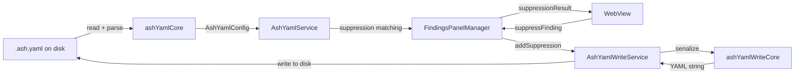

# Suppression System

The suppression system manages `.ash.yaml` configuration files that mark specific security findings as intentionally accepted. It handles file discovery, parsing, suppression matching against findings, and YAML mutation (add/edit/remove).

## How It Works

### Architecture

The suppression system is split into four files with a deliberate pure/impure separation:

| File | Type | Responsibility |
|------|------|----------------|
| `ashYamlCore.ts` | Pure functions | Config discovery, YAML parsing, suppression matching, glob compilation |
| `ashYaml.ts` | VS Code service | File watching, change events, caching, `Disposable` lifecycle |
| `ashYamlWriteCore.ts` | Pure functions | YAML serialization, skeleton generation |
| `ashYamlWrite.ts` | VS Code service | File I/O, conflict detection, retry logic |

Pure modules have no VS Code or I/O dependencies (except `fs.readFileSync`/`fs.existsSync`), enabling direct unit testing.

### Data Flow



## `.ash.yaml` File Format

### Config Structure

```yaml
project_name: my-project
fail_on_findings: false
global_settings:
  severity_threshold: MEDIUM    # ALL | LOW | MEDIUM | HIGH | CRITICAL
  suppressions:
    - path: "src/auth/**"
      rule_id: "S101"
      reason: "Hardcoded password is a test fixture"
      expiration: "2026-06-01"
    - path: "**"
      rule_id: null
      reason: "Accepted risk for legacy code"
      line_start: 42
      line_end: 50
  ignore_paths:
    - path: "node_modules/**"
      reason: "Third-party code"
scanners:
  bandit:
    enabled: true
  checkov:
    enabled: true
```

### Suppression Entry Fields

| Field | Type | Required | Description |
|-------|------|----------|-------------|
| `path` | string | Yes | Glob pattern matching file paths (e.g., `src/auth/**`, `**`) |
| `reason` | string | Yes | Justification for the suppression |
| `rule_id` | string or null | No | Rule ID glob pattern (e.g., `S101`, `S1*`). Null matches all rules. |
| `line_start` | number or null | No | Start line for line-range scoping |
| `line_end` | number or null | No | End line for line-range scoping |
| `expiration` | string or null | No | Expiration date in `YYYY-MM-DD` format |

### Suppression Scope

Three scoping strategies, controlled by which fields are populated:

| Scope | `path` | `rule_id` | Effect |
|-------|--------|-----------|--------|
| File + rule | `src/auth/login.ts` | `S101` | Suppresses rule S101 in that specific file |
| Rule everywhere | `**` | `S101` | Suppresses rule S101 in all files |
| File all rules | `src/legacy/**` | null | Suppresses all findings in matching files |

## Config Discovery

`ashYamlCore.ts` searches for config files in this order:

**Filenames:** `.ash.yml`, `.ash.yaml`, `.ash.json`, `ash.yml`, `ash.yaml`, `ash.json`

**Locations:**
1. Scan root directory (e.g., `/project/.ash.yaml`)
2. `.ash/` subdirectory (e.g., `/project/.ash/.ash.yaml`)

First match wins. If no config file exists, the service returns an empty config.

## Suppression Matching

`ashYamlCore.ts` implements a three-stage matching algorithm:

### 1. Expiration Check

```
isExpired(suppression) → boolean
```
Compares `expiration` date to today. Expired suppressions are skipped.

### 2. Rule ID Matching

```
matchesRuleId(suppression.rule_id, finding.ruleId) → boolean
```
- Null `rule_id` matches all rules
- Uses `picomatch` for glob pattern matching (supports `S1*`, `CKV_*`, etc.)

### 3. File Path Matching

```
matchesFilePath(suppression.path, finding.file) → boolean
```
Uses `picomatch` for glob pattern matching. Paths are relative to the scan root.

### 4. Line Range Matching

```
matchesLineRange(suppression, finding) → boolean
```
- No range on suppression → matches any line
- Only `line_start` → `finding.startLine >= line_start`
- Only `line_end` → `finding.endLine <= line_end`
- Both → checks overlap between suppression range and finding range

### Batch Matching Optimization

`batchMatchSuppressions(findings, suppressions)` optimizes for large finding sets:

1. Pre-filters expired suppressions
2. Pre-compiles glob patterns using `picomatch`
3. Iterates findings, testing each against compiled matchers
4. First matching suppression wins (order matters)
5. Returns `Map<findingId, suppression>`

## File Watching

`AshYamlService` watches for config file changes using VS Code's `FileSystemWatcher`:

- Watches all 6 config filenames in the scan root and `.ash/` subdirectory
- Debounces changes (200ms) to handle rapid edits
- Fires `onDidChangeConfig` event on changes
- Providers subscribe and forward to webviews via `ashYamlChanged` message

## Write Operations

`AshYamlWriteService` handles mutation of `.ash.yaml` files.

### Add Suppression

`addSuppression(input: SuppressionInput)`:

1. Validates justification (required)
2. Validates expiration (must be future date if set)
3. Discovers config file or creates new `.ash.yaml` with skeleton
4. Reads current file, checks `mtime` for conflict detection
5. Appends suppression entry preserving YAML structure
6. Writes file, re-checks `mtime` to detect concurrent modification
7. Retries once on conflict (re-read, re-apply, re-write)

### Remove Suppression

`removeSuppression(suppression)`:

1. Finds matching suppression by exact field comparison
2. Reads current file with `mtime` conflict detection
3. Removes entry from suppressions array
4. Re-serializes and writes

### Edit Suppression

`editSuppression(old, updated)`:

1. Finds suppression by exact match on all fields
2. Validates updated reason and expiration
3. Replaces entry in-place
4. Re-serializes and writes

### Conflict Detection

All write operations use filesystem `mtime` checking:

1. Read file and record `mtime`
2. Apply changes in memory
3. Before write: check `mtime` hasn't changed
4. If changed: retry once (re-read, re-apply)
5. If still conflicting: return error

This prevents data loss when the file is edited externally while a write is in progress.

## Extending / Maintaining

### Adding a new suppression field

1. Add the field to `AshSuppression` interface in `ashYamlCore.ts`
2. Update the matching logic if the field affects matching
3. Update serialization in `ashYamlWriteCore.ts`
4. Update the `SuppressionForm` component in the WebView
5. Update `SuppressionInput` type in both `models/messages.ts` and `webview/src/types/messages.ts`

### Testing suppression matching

The pure function modules (`ashYamlCore.ts`, `ashYamlWriteCore.ts`) can be unit tested directly without VS Code mocking. Test the matching algorithm by constructing `AshSuppression` and `FindingRow` objects and calling `matchesSuppression()`.

### Gotchas

1. **Picomatch is used for both path and rule ID globbing.** Ensure glob patterns are valid picomatch syntax.
2. **First match wins in batch matching.** Suppression order in the YAML file matters — more specific rules should come before broad ones.
3. **Expiration uses date-only comparison** (no time component). A suppression set to expire "today" is considered expired.
4. **Config file discovery caches results.** Call `AshYamlService.setScanRoot()` if the scan root changes.
