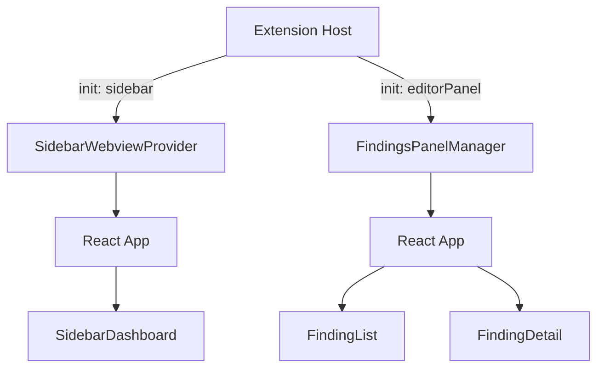

# WebView Application

The WebView app is a single React application in `webview/` that renders in two VS Code contexts: the sidebar panel and the editor area. One Vite build, one bundle, loaded in both places. An `init` message from the extension host tells the app which context it's running in.

## Tech Stack

| Layer | Technology |
|---|---|
| Framework | React 19 |
| Build | Vite 8 |
| Styling | Tailwind CSS v4 (`@tailwindcss/vite` plugin) |
| Components | ShadCN/ui (table, badge, button, card, select, separator) |
| Utility | `class-variance-authority`, `clsx`, `tailwind-merge`, `lucide-react` |

## Source Structure

```
webview/src/
  main.tsx                  # React root mount
  App.tsx                   # Context-aware root with useReducer
  index.css                 # Tailwind import + VS Code theme variable mappings
  hooks/
    useVSCodeAPI.ts         # postMessage bridge + useMessages hook
  types/
    types.ts                # Data model types (copied from vsix/src/models/)
    messages.ts             # Message protocol types (copied from vsix/src/models/)
  components/
    SidebarDashboard.tsx    # Compact sidebar view
    FindingList.tsx         # Full-width finding table with filters
    FindingDetail.tsx       # Finding detail + disposition controls
    SeverityBadge.tsx       # Color-coded severity badge
    DispositionBadge.tsx    # Styled disposition badge
    ui/                     # ShadCN auto-generated components
  lib/
    utils.ts                # cn() utility (clsx + tailwind-merge)
```

## Dual-Context Rendering

The same React app renders different UIs based on which VS Code context it's loaded in:



### App.tsx state machine

`App.tsx` uses `useReducer` with an `AppState` that tracks:

- `context`: `'unknown'` | `'sidebar'` | `'editorPanel'` -- set by the `init` message
- `view`: `'loading'` | `'findingList'` | `'findingDetail'` -- controls editor panel navigation
- Data: `scans`, `summary`, `findings`, `selectedFinding`

On mount, the app sends `requestState` to the extension host. The host responds with `init` (setting the context) followed by state data. The reducer processes all incoming messages through a single `MESSAGE` action type.

### Context routing

| Context | Renders |
|---|---|
| `unknown` | Loading spinner (initial state before `init` arrives) |
| `sidebar` | `SidebarDashboard` |
| `editorPanel` + `findingList` | `FindingList` |
| `editorPanel` + `findingDetail` | `FindingDetail` |

## VS Code Theme Integration

`webview/src/index.css` maps VS Code CSS custom properties to ShadCN/Tailwind design tokens:

```css
:root {
  --background: var(--vscode-editor-background);
  --foreground: var(--vscode-editor-foreground);
  --primary: var(--vscode-button-background);
  --primary-foreground: var(--vscode-button-foreground);
  --border: var(--vscode-panel-border);
  --ring: var(--vscode-focusBorder);
  /* ... additional mappings */
}
```

This makes ShadCN components inherit the active VS Code theme automatically. When the user switches between light and dark themes, CSS variables update and the WebView re-renders with matching colors.

## Key Components

### SidebarDashboard

Compact vertical layout for the sidebar panel:
- Project name header
- "Run Scan" button (sends `startScan` message)
- Triage summary: disposition count badges (Pending, Fix, Suppress, Defer)
- Severity breakdown: color-coded badges (Critical, High, Medium, Low, Info)
- "View Findings" button (sends `openFindings` message)

### FindingList

Full-width table in the editor panel:
- Scan header with date, status, finding count
- Filter bar: severity toggle chips, scanner dropdown, disposition dropdown
- ShadCN `Table` with columns: severity, title, file, scanner, disposition
- Click a row to navigate to finding detail (dispatches `SELECT_FINDING` locally)
- Filters are local React state, not sent to the extension host

### FindingDetail

Detail view replacing the list in the editor panel:
- Breadcrumb navigation ("Findings > [title]") with back button
- Severity badge, rule ID, scanner name
- Disposition button group: four buttons (Pending/Fix/Suppress/Defer) with active state highlighting; clicking sends `setDisposition` to the extension host
- Code location: clickable file path (sends `navigateToCode`), line range, code snippet in `pre` block

### SeverityBadge / DispositionBadge

Reusable components mapping enum values to colored ShadCN `Badge` components. Severity uses red (critical) through gray (info). Disposition uses contextual colors (green for fix, purple for suppress, amber for defer).

## useVSCodeAPI Hook

`webview/src/hooks/useVSCodeAPI.ts` wraps the VS Code WebView API:

- Calls `acquireVsCodeApi()` once at module scope (singleton)
- Exports `postMessage(msg)`: sends a typed `WebviewToExtMessage` to the extension host
- Exports `useMessages(handler)`: React hook that registers a `message` event listener and cleans up on unmount

## Extending / Maintaining

### Adding a new screen

1. Create the component in `webview/src/components/`
2. Add a new `view` state value in `App.tsx`'s `ViewState` type
3. Add a reducer case to transition to the new view
4. Add the render branch in `App.tsx`

### Adding a ShadCN component

```bash
cd webview && npx shadcn@latest add <component-name> --yes
```

Components are generated in `webview/src/components/ui/`. They use the `@/lib/utils` import alias (resolved by both Vite and TypeScript via `@` path alias).

### Shared type changes

Types are manually copied between `vsix/src/models/` and `webview/src/types/`. When modifying `types.ts` or `messages.ts`, update both locations. A future improvement would be a shared package, but the copy approach is intentional for the prototype to avoid monorepo tooling.
