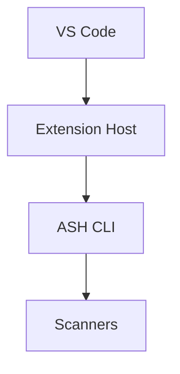

# Documentation System

The ASH Workbench docs site is a Docusaurus v3.9.2 static site with self-organizing sidebars. Adding a page requires only creating a markdown file with `title` frontmatter in the correct directory — no config changes needed.

## How It Works

### Site structure

The Docusaurus project lives at `workbench/docs/` within the monorepo:

```
workbench/docs/
  docusaurus.config.ts       # Site configuration
  sidebars.ts                # Sidebar definitions
  package.json               # Dependencies (Docusaurus 3.9.2, React 19)
  docs/                      # All markdown content
    user-docs/               # End-user documentation
    developer-docs/          # Developer/contributor documentation (you are here)
    working/                 # Ephemeral research and planning docs
  src/
    pages/index.tsx          # Custom homepage
    css/custom.css           # Global style overrides
  static/img/                # Static assets (logo, favicon)
```

### Three-section architecture

The site serves three audiences via separate navbar sections, each with its own autogenerated sidebar:

| Section | Directory | Sidebar ID | Audience |
|---|---|---|---|
| User Docs | `docs/docs/user-docs/` | `userDocsSidebar` | End users of the VS Code extension |
| Developer Docs | `docs/docs/developer-docs/` | `developerDocsSidebar` | Contributors and maintainers |
| Working | `docs/docs/working/` | `workingSidebar` | Development team (excluded from production) |

The sidebars are defined in `workbench/docs/sidebars.ts` using Docusaurus autogenerated mode:

```typescript
const sidebars: SidebarsConfig = {
  userDocsSidebar: [{type: 'autogenerated', dirName: 'user-docs'}],
  developerDocsSidebar: [{type: 'autogenerated', dirName: 'developer-docs'}],
  // workingSidebar included only in non-production builds
};
```

This means every `.md` file in a section's directory automatically appears in that section's sidebar. Subdirectories become collapsible categories. Items sort by `sidebar_position` frontmatter, then alphabetically.

### Production filtering

Working docs are excluded from production builds via the `DOCUSAURUS_ENV` environment variable. When set to `'production'`:

- The `workingSidebar` is omitted from `sidebars.ts`
- The Working navbar item is removed
- Files matching `working/**` are excluded from the docs plugin
- The Working card is hidden on the homepage

This filtering is implemented in four places: `docusaurus.config.ts` (lines 5, 47, 80-85), `sidebars.ts` (lines 2, 8-10), and `src/pages/index.tsx` (lines 33-36).

### Mermaid diagrams

Mermaid is enabled site-wide via `@docusaurus/theme-mermaid`. Use fenced code blocks with the `mermaid` language identifier:

````markdown

````

Mermaid is the preferred diagram format over static images because it's version-controllable, renders natively in Docusaurus, and is easy to maintain.

## Usage

### Running the dev server

```bash
cd workbench/docs
npm install        # first time only
npm run start      # dev server at localhost:3000 with hot reload
```

### Building for production

```bash
# Development build (includes working docs)
npm run build

# Production build (excludes working docs)
DOCUSAURUS_ENV=production npm run build

# Serve the built site locally
npm run serve
```

### Other commands

| Command | Purpose |
|---|---|
| `npm run clear` | Clear the `.docusaurus/` cache (useful when builds behave unexpectedly) |
| `npm run typecheck` | Run TypeScript validation |

### Adding a documentation page

1. Create a `.md` file in the appropriate section directory (e.g., `docs/docs/developer-docs/my-topic.md`)
2. Add YAML frontmatter with at least a `title`:
   ```yaml
   ---
   title: My Topic
   ---
   ```
3. Done. The sidebar picks it up automatically on the next build/hot-reload.

### Adding a sub-section (category)

1. Create a subdirectory: `docs/docs/developer-docs/my-category/`
2. Add `_category_.json`:
   ```json
   {
     "label": "My Category",
     "position": 2,
     "collapsible": true,
     "collapsed": true
   }
   ```
3. Optionally add `README.md` with `title: Overview` as the category index page
4. Add content `.md` files in the directory

### Frontmatter patterns

**Regular page** (minimum):
```yaml
---
title: Page Title
---
```

**Page with explicit sidebar order:**
```yaml
---
title: Page Title
sidebar_position: 2
---
```

**Section overview** (top-level README.md):
```yaml
---
title: Overview
sidebar_label: Overview
sidebar_position: 1
---
```

**Category index** (subdirectory README.md):
```yaml
---
title: Overview
---
```

### Cross-linking between pages

Use relative file paths so Docusaurus validates links at build time:

```markdown
See the [Installation Guide](../user-docs/getting-started/installation.md) for setup.
```

Do not use absolute URL paths like `/docs/user-docs/...` — they bypass validation.

### Using AI doc-authoring skills

Two Claude Code skills are available for writing documentation:

- **`/dev-docs`** — writes developer documentation in `docs/docs/developer-docs/`
- **`/user-docs`** — writes user documentation in `docs/docs/user-docs/`

Both skills enforce a search-first workflow: they search existing docs before creating new files, and will update or consolidate existing pages when appropriate. This prevents documentation sprawl.

## Extending / Maintaining

### Key files to know

| File | When to modify |
|---|---|
| `docusaurus.config.ts` | Site metadata, navbar items, footer links, theme settings |
| `sidebars.ts` | Only if adding a new top-level section (not for adding pages) |
| `src/pages/index.tsx` | Homepage content or layout |
| `src/css/custom.css` | Global color scheme or typography |
| `package.json` | Adding Docusaurus plugins or updating versions |

### Adding a new top-level section

If a fourth documentation audience is needed beyond user/developer/working:

1. Create the content directory: `docs/docs/<new-section>/`
2. Add an autogenerated sidebar in `sidebars.ts`:
   ```typescript
   newSidebar: [{type: 'autogenerated', dirName: '<new-section>'}],
   ```
3. Add a navbar item in `docusaurus.config.ts` pointing to the new sidebar
4. Create a seed `README.md` in the directory

### File naming convention

- **Kebab-case** for all content files: `system-overview.md`, `getting-started.md`
- **README.md** (uppercase) for category index/overview pages
- **`_category_.json`** for sidebar category metadata in subdirectories

### Production filtering gotcha

The working-docs exclusion is implemented in four separate locations. If you add any new surface that references working docs (footer link, search config, a new React component), you must also add a production check. See `docusaurus.config.ts:5` for the `isProduction` constant pattern.

For client-side React components, access the flag via `siteConfig.customFields.isProduction` (set in `docusaurus.config.ts:35-37`). Do not try to read `process.env` directly in React — it only works in Node.js config files.

### Broken link behavior

`onBrokenLinks` is currently set to `'warn'` in `docusaurus.config.ts:22`. Broken cross-links produce build warnings but do not fail the build. This means moving files without updating cross-links won't break CI, but will create dead links. Always search for and update references when moving files.

## Known Issues

- **`url` and `baseUrl` are placeholders** — `docusaurus.config.ts:16-17` need to be set before GitHub Pages deployment. `baseUrl` will likely need to be `'/<repo-name>/'`.
- **CSS colors are template defaults** — `src/css/custom.css` uses stock Docusaurus green/teal palette, not ASH project branding.
- **Logo is a template placeholder** — `static/img/logo.svg` is a decorative SVG, not ASH branding.
- **`docs/README.md` references yarn** — the Docusaurus project root README is stock template text that says `yarn` while the project uses `npm`.

## References

- [Docusaurus Documentation](https://docusaurus.io/docs)
- [Docusaurus Autogenerated Sidebars](https://docusaurus.io/docs/sidebar/autogenerated)
- [Mermaid Diagrams in Docusaurus](https://docusaurus.io/docs/markdown-features/diagrams)
