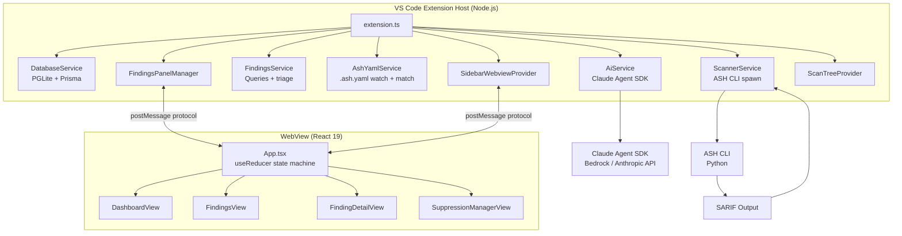

# Project Overview

ASH Workbench is a VS Code extension that provides a graphical interface for the [Automated Security Helper (ASH)](https://github.com/awslabs/automated-security-helper) — an open-source security scanning CLI that aggregates findings from multiple static analysis tools (Bandit, Checkov, Semgrep, cdk-nag, cfn-nag, detect-secrets, Grype, npm-audit).

The extension lets developers run ASH scans, review findings, triage them (fix/suppress/defer), manage suppressions via `.ash.yaml`, and get AI-assisted analysis of findings — all within the VS Code editor.

## Repository Structure

The project is a monorepo with three subprojects:

```
workbench/
  vsix/           # VS Code extension host (TypeScript, Node.js)
  webview/        # React 19 WebView UI (ShadCN/ui, Tailwind v4, Vite)
  docs/           # Docusaurus v3 documentation site
  .claude/        # Claude Code skills and commands
  .specify/       # Specification templates and scripts
```

## Tech Stack

| Layer | Technology | Purpose |
|-------|-----------|---------|
| Extension Host | TypeScript / Node.js | Commands, services, data layer, message bridge |
| WebView | React 19 + ShadCN/ui + Vite | Finding list, detail view, triage controls, suppression forms, AI analysis panel |
| Database | PGLite (in-process WASM PostgreSQL) + Prisma ORM | Persistent storage for projects, scans, findings, AI analysis |
| Scanner | ASH CLI (Python, spawned as child process) | Produces SARIF output consumed by the extension |
| AI Analysis | Claude Agent SDK + MCP tools | Per-finding and batch AI-assisted security analysis |
| Styling | Tailwind CSS v4 + VS Code CSS variables | Theme-aware styling that inherits the active VS Code theme |

## Architecture



## Feature Set

1. **Scan Execution** — Spawn ASH CLI, stream output, parse SARIF, store findings
2. **Finding Review** — Filterable table with severity, scanner, disposition columns; detail view with syntax-highlighted code
3. **Triage Workflow** — Per-finding dispositions (Pending/Fix/Suppress/Defer) with notes, persisted across sessions
4. **Suppression Management** — Full `.ash.yaml` lifecycle: create, edit, remove suppressions with scope, justification, expiration
5. **AI Analysis** — Per-finding and batch analysis via Claude Agent SDK with structured output (explanation, risk assessment, suggested fix)
6. **Scan History** — Tree view of past scans with status icons; scan targets with aggregated metrics
7. **Code Navigation** — Click file paths to jump to the affected line in the VS Code editor
8. **Settings Inheritance** — Auto-detects `~/.claude/settings.json` for AI provider configuration

## Data Model

Four entities stored in PGLite via Prisma:

- **Project** — Scoped to a VS Code workspace (`rootPath` is unique key)
- **ScanTarget** — A directory that has been scanned (unique per project + path)
- **Scan** — One execution of the ASH CLI (status: RUNNING/COMPLETED/FAILED/CANCELLED)
- **Finding** — A single security issue (severity, disposition, optional AI analysis)

See [Database](./architecture/database.md) for schema details and migration strategy.

## Communication Model

The extension host owns all state. The WebView is a pure renderer. Data flows through a typed `postMessage` protocol — the WebView sends user actions, the extension host responds with state updates.

See [Message Protocol](./architecture/message-protocol.md) for the complete protocol reference.

## Development Workflow

The project evolves through numbered specs (e.g., Spec 016 for suppressions, Spec 022 for finding analysis). Each spec produces a specification, implementation plan, and task list.

For build commands, test setup, and development tooling, see:
- [Build Pipeline](./architecture/build-pipeline.md) — npm scripts, Vite config, copy bridge
- [Testing and Quality](./testing-and-quality.md) — Unit/integration tests, linting, formatting
- [Documentation System](./documentation-system.md) — How the Docusaurus site works
