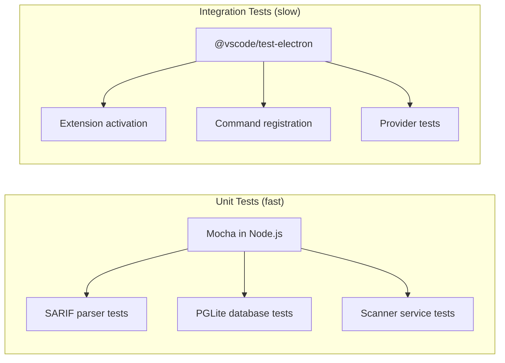

# Testing and Quality

Quality tooling for the VS Code extension (`vsix/`): formatting, linting, TypeScript strictness, and a split test infrastructure with unit tests in plain Node.js and integration tests in VS Code Electron.

## Quick Reference

All commands run from `workbench/vsix/`:

```bash
npm run compile       # TypeScript compile (strict mode)
npm run lint          # ESLint with recommended preset
npm run format        # Auto-format all TypeScript files
npm run format:check  # Check formatting without modifying files
npm run test:unit     # Fast unit tests (Mocha in Node.js, ~1-2s)
npm run test:integration  # Extension tests (VS Code Electron, ~15s)
npm run test          # Both: test:unit then test:integration
```

## Formatting

**Prettier** handles all code formatting. No ESLint formatting rules are used -- `eslint-config-prettier` disables them.

### Configuration

`vsix/.prettierrc`:

| Setting | Value | Rationale |
|---------|-------|-----------|
| `semi` | `true` | Explicit semicolons |
| `singleQuote` | `true` | VS Code ecosystem convention |
| `trailingComma` | `"all"` | Cleaner diffs |
| `printWidth` | `100` | Wider than default 80 for readability |
| `tabWidth` | `2` | Standard TypeScript |

`vsix/.prettierignore` excludes `out/`, `node_modules/`, `*.vsix`, and `prisma/migrations/`.

### Workflow

| Command | When to use |
|---------|-------------|
| `npm run format` | Auto-fix all files. Run after writing new code or before committing. |
| `npm run format:check` | Verify without modifying. Used by CI and pre-commit checks (exits non-zero on unformatted files). |

The `pretest` script runs `compile` then `lint` but does **not** run `format:check`. Run formatting checks separately or add them to your commit workflow.

### Editor integration

If using VS Code as your editor (likely), add to your workspace settings (`vsix/.vscode/settings.json`):

```json
{
  "editor.formatOnSave": true,
  "editor.defaultFormatter": "esbenp.prettier-vscode"
}
```

This auto-formats on every save, so `npm run format:check` never fails locally.

## Linting

ESLint uses `typescript-eslint`'s `recommended` preset (~40 rules) plus project-specific rules. Configuration is in `vsix/eslint.config.mjs`.

### What the recommended preset catches

These are the most impactful rules you'll encounter from `tseslint.configs.recommended`:

| Rule | What it catches | Fix |
|------|-----------------|-----|
| `@typescript-eslint/no-unused-vars` | Declared but never-read variables | Remove the variable, or prefix with `_` if it's a required parameter |
| `@typescript-eslint/no-explicit-any` | Using `any` as a type annotation | Use a specific type, `unknown`, or a generic |
| `@typescript-eslint/no-non-null-assertion` | The `!` postfix operator (`value!.prop`) | Use optional chaining (`value?.prop`) or a type guard |
| `no-unreachable` | Code after `return`, `throw`, `break` | Remove dead code |
| `@typescript-eslint/no-require-imports` | `require()` instead of `import` | Convert to ESM `import` syntax |

### Project-specific rules

All set to `error` (not `warn`), so `npm run lint` fails on violations:

| Rule | Enforcement | Rationale |
|------|-------------|-----------|
| `curly` | All control statements need `{}` | Prevents bugs from dangling else/if-without-braces |
| `eqeqeq` | Must use `===` and `!==` | Prevents type coercion surprises |
| `no-throw-literal` | Must throw `Error` objects | Ensures stack traces on errors |
| `@typescript-eslint/naming-convention` | Imports must be camelCase or PascalCase (`warn` only) | Consistency without blocking builds |

### Test file relaxations

Files under `src/test/**/*.ts` have these rules disabled because test patterns routinely need them:

- `@typescript-eslint/no-non-null-assertion` -- Tests assert on known-good data
- `@typescript-eslint/no-explicit-any` -- Mock objects frequently need `any`
- `@typescript-eslint/no-require-imports` -- Some mocking patterns need `require()`

### Fixing common lint errors

**Unused variable after destructuring:**

```typescript
// Error: 'status' is assigned but never used
const { id, status, findings } = scan;

// Fix: prefix with underscore
const { id, _status, findings } = scan;
// Or destructure only what you need
const { id, findings } = scan;
```

**`any` in production code:**

```typescript
// Error: Unexpected any
function process(data: any) { ... }

// Fix: use unknown and narrow
function process(data: unknown) {
  if (typeof data === 'string') { ... }
}
```

### Adding new ESLint rules

Edit `vsix/eslint.config.mjs`. Add rules to the `rules` object in the first config block (production code) or the second block (test overrides). Use `error` for rules that should block, `warn` for advisories.

:::warning
Always add `eslint-config-prettier` (the `prettierConfig` import) as the **last** entry in the config array. It disables all formatting rules that would conflict with Prettier. Adding rules after it can re-enable conflicts.
:::

## TypeScript Strictness

`vsix/tsconfig.json` enables `strict` mode (which bundles `noImplicitAny`, `strictNullChecks`, `strictFunctionTypes`, and others) plus these additional checks:

| Check | What it catches | Common fix |
|-------|-----------------|------------|
| `noImplicitReturns` | Functions that don't return in all code paths | Add a `return` to every branch, or return early with a default |
| `noFallthroughCasesInSwitch` | Missing `break`/`return` in switch cases | Add `break` or `return`. Use `// falls through` comment only for intentional fallthrough. |
| `noUnusedParameters` | Unused function parameters | Prefix with `_` (e.g., `_context`). Do **not** remove if the parameter is required by an interface contract. |
| `noUnusedLocals` | Unused local variables | Remove the variable. If it's used only for its type, use `import type`. |
| `skipLibCheck` | N/A -- skips type-checking `.d.ts` in node_modules | Required because PGLite's type declarations reference browser/WASM types not available in the Node.js type environment. |

### Working with strict null checks

`strictNullChecks` (enabled via `strict`) means every type excludes `null` and `undefined` unless explicitly included. This is the check you'll encounter most often:

```typescript
// Error: Object is possibly 'undefined'
const name = config.get('ashWorkbench.ashPath').trim();

// Fix: handle the undefined case
const name = config.get('ashWorkbench.ashPath') ?? 'ash';

// Or use a type guard
const raw = config.get('ashWorkbench.ashPath');
if (raw) {
  const name = raw.trim();
}
```

## Test Architecture

### Two runtimes, two runners

VS Code extension testing has a fundamental split:



| Runtime | What it tests | Speed | Runner | Config |
|---------|---------------|-------|--------|--------|
| **Node.js** | Pure logic: parsers, database, utilities | ~1-2s | `mocha` | `vsix/.mocharc.yaml` |
| **VS Code Electron** | Anything using `vscode.*` APIs | ~15s | `vscode-test` | `vsix/.vscode-test.mjs` |

Unit tests run 10-100x faster because they skip downloading and launching VS Code. Always prefer unit tests when the module under test doesn't import `vscode`.

### Directory structure

```
vsix/src/test/
  unit/                            # Plain Node.js tests (npm run test:unit)
    sarif-factory.smoke.test.ts    # SARIF factory validation
    pglite.smoke.test.ts           # PGLite WASM validation
    scanner-mock.smoke.test.ts     # sinon + spawn mock validation
  integration/                     # VS Code Electron tests (npm run test:integration)
    extension.test.ts              # Extension activation test
  fixtures/
    sarif-factory.ts               # SARIF test data builders
```

### Configuration files

**`.mocharc.yaml`** -- Unit test runner:

```yaml
spec: "out/test/unit/**/*.test.js"
timeout: 10000
recursive: true
```

The 10s timeout accommodates PGLite WASM initialization (~500ms on first run).

**`.vscode-test.mjs`** -- Integration test runner:

```javascript
import { defineConfig } from '@vscode/test-cli';

export default defineConfig({
  files: 'out/test/integration/**/*.test.js',
});
```

## Writing Unit Tests

### Assertion library

Use `node:assert/strict` (zero dependencies, strict equality by default):

```typescript
import assert from 'node:assert/strict';

assert.equal(actual, expected);           // strict equality
assert.deepEqual(obj1, obj2);            // deep structural equality
assert.ok(value);                         // truthy check
assert.throws(() => fn(), /pattern/);     // error matching
assert.rejects(asyncFn(), /pattern/);     // async error matching
```

### SARIF test data factory

`vsix/src/test/fixtures/sarif-factory.ts` provides builder functions for generating SARIF 2.1.0 structures. Use these instead of hand-writing JSON fixtures.

**Available functions:**

| Function | Returns | Use case |
|----------|---------|----------|
| `createSarifResult(overrides?)` | `SarifResult` | Single finding with sensible defaults |
| `createSarifRun(results, toolName?)` | `SarifRun` | One scanner's results |
| `createSarifLog(runs)` | `SarifLog` | Complete SARIF document with multiple runs |
| `createSingleRunSarif(results, toolName?)` | `SarifLog` | Shorthand: one log, one run |

**Example:**

```typescript
import { createSarifResult, createSingleRunSarif } from '../fixtures/sarif-factory';

it('parses multi-severity findings', () => {
  const sarif = createSingleRunSarif([
    createSarifResult({ ruleId: 'B101', level: 'error' }),
    createSarifResult({ ruleId: 'B102', level: 'warning' }),
    createSarifResult({
      ruleId: 'B103',
      level: 'note',
      properties: { severity: 'CRITICAL' },  // ASH severity override
    }),
  ], 'bandit');

  const findings = parseSarif(sarif, '/project');
  // ... assertions
});
```

Defaults produce a result with `ruleId: 'test-rule-001'`, `level: 'warning'`, file `file:///project/src/app.ts`, lines 10-15.

### Mocking with sinon

sinon is available for stubs, spies, and fakes. Always call `sinon.restore()` in `afterEach`:

```typescript
import sinon from 'sinon';

afterEach(() => {
  sinon.restore();
});
```

### Mocking `child_process.spawn`

`child_process.spawn` is non-configurable under Node16 modules -- sinon cannot stub it directly. The scanner service uses **dependency injection** instead: it accepts a `SpawnFn` parameter that tests can replace with a sinon stub.

**Pattern for creating a mock child process:**

```typescript
import { EventEmitter } from 'node:events';
import type { ChildProcess } from 'node:child_process';

function createMockProcess(): ChildProcess {
  const proc = new EventEmitter() as any;
  proc.stdout = new EventEmitter();
  proc.stderr = new EventEmitter();
  proc.kill = sinon.stub().returns(true);
  proc.pid = 12345;
  proc.stdin = null;
  proc.stdio = [null, proc.stdout, proc.stderr];
  return proc as ChildProcess;
}
```

**Simulating process lifecycle:**

```typescript
const mockProcess = createMockProcess();
const spawnStub = sinon.stub().returns(mockProcess);

// Trigger events to simulate ASH CLI behavior:
mockProcess.stdout.emit('data', Buffer.from('Scanning...'));
mockProcess.emit('exit', 0, null);   // clean scan
mockProcess.emit('exit', 2, null);   // findings detected
mockProcess.emit('exit', 1, null);   // error
```

### PGLite in tests

PGLite is ESM-only. In the CommonJS test context, use dynamic `import()` in a `before()` hook:

```typescript
let PGlite: any;

before(async () => {
  const mod = await import('@electric-sql/pglite');
  PGlite = mod.PGlite;
});
```

Create in-memory instances for test isolation (no filesystem persistence, no cleanup needed):

```typescript
const db = new PGlite();          // in-memory
await db.exec('CREATE TABLE ...');
await db.query('SELECT ...');
await db.close();                  // data is gone
```

## Writing Integration Tests

Integration tests run inside a real VS Code instance and can use the full `vscode.*` API. They use Mocha's TDD interface (`suite`/`test`) rather than BDD (`describe`/`it`):

```typescript
import * as assert from 'assert';
import * as vscode from 'vscode';

suite('Extension Test Suite', () => {
  test('extension activates', async () => {
    const ext = vscode.extensions.getExtension('ash-workbench');
    assert.ok(ext);
    await ext.activate();
    assert.strictEqual(ext.isActive, true);
  });
});
```

Integration tests are slow (~15s startup) because `@vscode/test-electron` downloads and launches VS Code. Use them only for behavior that requires the VS Code runtime.

## Extending / Maintaining

### Adding a new unit test file

1. Create `vsix/src/test/unit/<name>.test.ts`
2. Use `describe`/`it` (BDD) syntax with `node:assert/strict`
3. Run `npm run compile && npm run test:unit` to verify
4. The `.mocharc.yaml` glob (`out/test/unit/**/*.test.js`) picks it up automatically

### Adding a new integration test file

1. Create `vsix/src/test/integration/<name>.test.ts`
2. Use `suite`/`test` (TDD) syntax -- the VS Code test runner expects this
3. Run `npm run compile && npm run test:integration` to verify
4. The `.vscode-test.mjs` glob (`out/test/integration/**/*.test.js`) picks it up automatically

### Adding test fixtures

Place shared test data builders in `vsix/src/test/fixtures/`. Follow the factory function pattern established by `sarif-factory.ts`:

- Export a `createXxx(overrides?)` function that returns a fully-formed object with sensible defaults
- Accept `Partial<T>` overrides spread onto the defaults
- Keep fixtures stateless -- no side effects, no shared mutable state

### Keeping ESLint rules in sync

When adding new test patterns that clash with ESLint, add targeted overrides in the test file block of `vsix/eslint.config.mjs` rather than disabling rules inline with `// eslint-disable`. This keeps relaxations visible in one place.

### Key files

| File | Purpose |
|------|---------|
| `vsix/package.json` | npm scripts, devDependencies |
| `vsix/tsconfig.json` | TypeScript compiler strictness |
| `vsix/eslint.config.mjs` | ESLint rules and test overrides |
| `vsix/.prettierrc` | Formatting rules |
| `vsix/.prettierignore` | Files excluded from formatting |
| `vsix/.mocharc.yaml` | Unit test runner config |
| `vsix/.vscode-test.mjs` | Integration test runner config |
| `vsix/src/test/fixtures/` | Shared test data builders |
