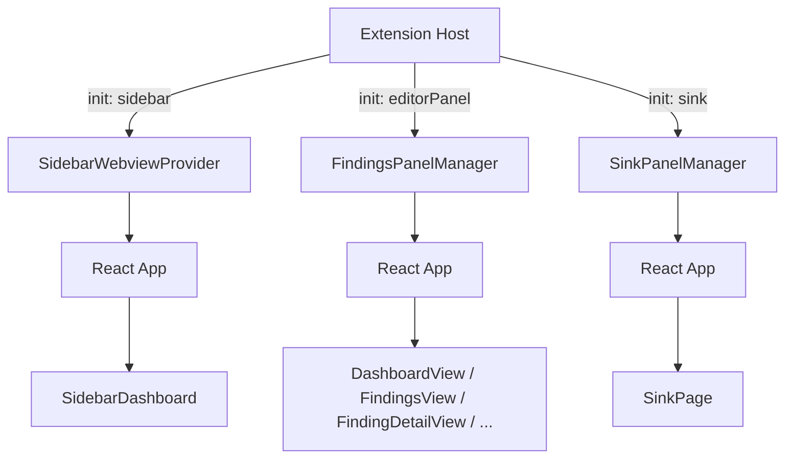

# WebView Application

The WebView app is a single React application in `webview/` that renders in multiple VS Code contexts: the sidebar panel, the editor area, and the dev-only Kitchen Sink. One Vite build, one bundle, loaded in all places. An `init` message from the extension host tells the app which context it's running in.

For the message protocol connecting extension host and WebView, see [Message Protocol](../architecture/message-protocol.md). For build scripts and the copy bridge, see [Build Pipeline](../architecture/build-pipeline.md).

## Tech Stack

| Layer | Technology |
|---|---|
| Framework | React 19 |
| Build | Vite 8 |
| Styling | Tailwind CSS v4 (`@tailwindcss/vite` plugin) |
| Components | ShadCN/ui (22 components: accordion, alert, badge, button, card, checkbox, etc.) |
| Table | `@tanstack/react-table` (sortable, filterable finding table) |
| Utility | `class-variance-authority`, `clsx`, `tailwind-merge`, `lucide-react` |

## Source Structure

```
webview/src/
  main.tsx                  # React root mount
  App.tsx                   # Context-aware root with useReducer state machine
  index.css                 # Tailwind v4 import + VS Code theme variable mappings
  mock-data.ts              # Mock data for development
  hooks/
    useVSCodeAPI.ts         # postMessage bridge + useMessages hook
  types/
    types.ts                # Domain types (copied from vsix/src/models/)
    messages.ts             # Message protocol types (copied from vsix/src/models/)
  lib/
    theme-colors.ts         # Severity/disposition → Tailwind class mappings
    ai-errors.ts            # AI error code → user guidance mapping
    utils.ts                # cn() utility (clsx + tailwind-merge)
  components/
    DashboardView.tsx       # Landing page: stats, scan targets, triage progress
    FindingsView.tsx        # TanStack React Table with filters and batch AI
    FindingDetailView.tsx   # Full detail: code, triage, AI analysis, suppression
    ScanHistoryView.tsx     # Past scan list with metadata cards
    ScanDetailView.tsx      # Single scan metadata + findings
    ScanProgressView.tsx    # Active scan progress indicator
    SidebarDashboard.tsx    # Compact sidebar variant of dashboard
    EmptyStateView.tsx      # Welcome / onboarding state
    AiAnalysisPanel.tsx     # AI analysis result display (accordion)
    AnalysisProgress.tsx    # AI loading state with tool usage
    SuppressionManagerView.tsx  # CRUD for suppressions
    SuppressionPanel.tsx    # Inline suppression on finding detail
    SuppressionForm.tsx     # Full suppression creation form
    SuppressionRuleForm.tsx # Suppression edit/create rule form
    SuppressionTable.tsx    # Suppression list with status and match counts
    ScanCard.tsx            # Card for single scan summary
    ScanTargetCard.tsx      # Card for scan target
    SummaryCard.tsx         # Mini stat card (reusable)
    SeverityBadge.tsx       # Color-coded severity badge
    SeverityChart.tsx       # Severity breakdown bar chart
    DispositionBadge.tsx    # Color-coded disposition badge
    TriageControls.tsx      # Disposition selector dropdown
    TriageNotes.tsx         # Finding notes textarea
    TriageProgressBar.tsx   # Triage progress visualization
    CodeBlock.tsx           # Syntax-highlighted code with line numbers
    AppBreadcrumb.tsx       # Navigation breadcrumb
    FindingNavigation.tsx   # Prev/next finding buttons
    DevNav.tsx              # Dev utilities
    ui/                     # ShadCN auto-generated components (22 files)
  pages/
    sink/                   # Kitchen Sink component showcase (dev-only)
      SinkPage.tsx          # Main page with search filter and demo grid
      sink-registry.ts      # Central registry of all demo components
      components/           # Sink-specific layout components
      demos/                # One demo file per component (~25 files)
```

## Dual-Context Rendering

The same React app renders different UIs based on which VS Code context it's loaded in:



### Context routing

| Context | View States | Renders |
|---|---|---|
| `unknown` | — | Loading spinner (before `init` arrives) |
| `sidebar` | — | `SidebarDashboard` |
| `editorPanel` | `dashboard` | `DashboardView` |
| `editorPanel` | `findingList` | `FindingsView` |
| `editorPanel` | `findingDetail` | `FindingDetailView` |
| `editorPanel` | `scanHistory` | `ScanHistoryView` |
| `editorPanel` | `scanDetail` | `ScanDetailView` |
| `editorPanel` | `scanProgress` | `ScanProgressView` |
| `editorPanel` | `suppressionManager` | `SuppressionManagerView` |
| `editorPanel` | `empty` | `EmptyStateView` |
| `sink` | — | `SinkPage` ([Kitchen Sink](./kitchen-sink.md)) |

## State Management

`App.tsx` uses `useReducer` with an `AppState` that tracks all application state. There is no external state management library.

### AppState (key fields)

```typescript
interface AppState {
  // Context and navigation
  context: 'sidebar' | 'editorPanel' | 'sink' | 'unknown'
  view: ViewState                    // 8 view states (see table above)
  viewHistory: ViewState[]           // Stack for back navigation

  // Project and scans
  scans: ScanSummary[]
  scanTargets: ScanTarget[]
  selectedScanTargetId?: string

  // Findings
  findings: FindingRow[]
  selectedFinding?: FindingRow
  currentFindings: FindingRow[]      // Active scan root findings
  summary: DispositionSummary        // Triage counts by disposition

  // Suppressions
  suppressions: SuppressionEntry[]
  ignorePaths: AshIgnorePath[]
  suppressionSummary: SuppressionSummary
  suppressionFormFindingId: string | null

  // AI analysis
  claudeSettingsDetected: boolean
  detectedProvider: 'bedrock' | 'anthropic-api' | 'none'
  analysisStates: Record<string, AnalysisUIState>  // Per-finding AI state
  batchAnalysisState?: BatchAnalysisUIState         // Batch progress
}
```

### Action types (19 discriminated union)

| Action | Purpose |
|---|---|
| `MESSAGE` | Process inbound `ExtToWebviewMessage` from extension host |
| `NAVIGATE` | Navigate to a view state |
| `BACK` | Pop navigation stack |
| `BACK_TO_LIST` | Reset to findings list |
| `SELECT_FINDING` | Select finding and navigate to detail |
| `SELECT_SCAN` | Select scan and navigate to findings |
| `SET_DISPOSITION` | Optimistic disposition update |
| `SET_NOTES` | Optimistic notes update |
| `TOGGLE_SHOW_SUPPRESSED` | Toggle suppressed findings visibility |
| `OPEN_SUPPRESSION_FORM` | Open inline suppression form for a finding |
| `SET_AI_TEST_STATUS` | Update AI connection test state |
| `DISMISS_ANALYSIS_ERROR` | Clear analysis error for a finding |

The `MESSAGE` action handles all inbound messages by switching on `msg.type`. Each message type updates independent parts of state. The `viewHistory` stack is automatically pushed when navigating, enabling back navigation without a routing library.

### Key patterns

- **All inbound messages** flow through the single `MESSAGE` action type
- **Navigation** uses a `viewHistory` array (push on navigate, pop on back)
- **Per-finding AI state** stored in `analysisStates: Record<string, AnalysisUIState>` for granular loading states
- **Optimistic updates** for dispositions and notes (sent to extension host in parallel)
- **Summary recomputation** via `recomputeSummary()` after disposition changes

## VS Code Theme Integration

### CSS Variable Mapping

`webview/src/index.css` maps VS Code CSS custom properties to ShadCN/Tailwind design tokens:

```css
:root {
  --background: var(--vscode-editor-background);
  --foreground: var(--vscode-editor-foreground);
  --primary: var(--vscode-button-background);
  --primary-foreground: var(--vscode-button-foreground);
  --border: var(--vscode-panel-border);
  --ring: var(--vscode-focusBorder);
  /* ... additional mappings with oklch() fallbacks */
}
```

ShadCN components inherit the active VS Code theme automatically. When the user switches themes, CSS variables update and the WebView re-renders.

### Dark Mode

Dark mode is driven by VS Code's `.vscode-dark` class, not a media query:

```css
@custom-variant dark (&:is(.vscode-dark *));
.vscode-dark { color-scheme: dark; }
```

:::danger
Removing `@custom-variant dark` breaks all Tailwind `dark:` prefixes. Removing `color-scheme: dark` makes native input icons (date picker, search clear) invisible in dark themes.
:::

### Domain Color System

`webview/src/lib/theme-colors.ts` maps severity and disposition values to hardcoded Tailwind classes using a "tinted" pattern:

```typescript
// Example: severity → Tailwind classes
CRITICAL: { base: 'bg-red-500/15 text-red-700 dark:text-red-400', ... }
HIGH:     { base: 'bg-orange-500/15 text-orange-700 dark:text-orange-400', ... }
```

Pattern: `bg-{color}-500/15` (15% opacity background) + `text-{color}-700 dark:text-{color}-400`.

These classes are not dynamically generated — they are string literals that Tailwind scans at build time. Changing them requires updating `theme-colors.ts`, not CSS.

## useVSCodeAPI Hook

`webview/src/hooks/useVSCodeAPI.ts` wraps the VS Code WebView API:

- Calls `acquireVsCodeApi()` once at module scope (singleton)
- Exports `postMessage(msg)`: sends a typed `WebviewToExtMessage` to the extension host
- Exports `useMessages(handler)`: React hook that registers a `message` event listener and cleans up on unmount

:::warning
`acquireVsCodeApi()` can only be called once per webview lifecycle. No other module may call it. The webview cannot run outside a VS Code iframe context.
:::

## Extending / Maintaining

### Adding a new screen

1. Create the component in `webview/src/components/`
2. Add a new `view` state value in `App.tsx`'s `ViewState` type
3. Add a reducer case to transition to the new view
4. Add the render branch in `App.tsx`

### Adding a ShadCN component

```bash
cd webview && npx shadcn@latest add <component-name> --yes
```

Components are generated in `webview/src/components/ui/`. They use the `@/lib/utils` import alias.

### Shared type changes

Types are manually copied between `vsix/src/models/` and `webview/src/types/`. When modifying `types.ts` or `messages.ts`, update both locations.

## Guides

- **[Kitchen Sink](./kitchen-sink.md)** — Dev-only component showcase for visual testing
