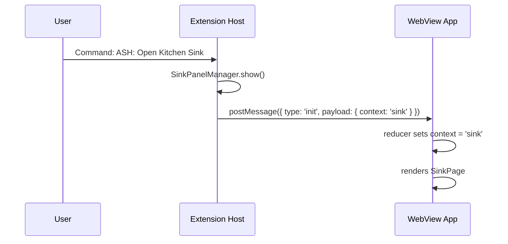

# Kitchen Sink

The Kitchen Sink is a development-only component showcase that renders all UI primitives and app-specific components in a single scrollable panel inside VS Code. Use it to visually verify components against the active VS Code theme (dark, light, high-contrast) without navigating the production UI.

## Usage

### Opening the Kitchen Sink

1. Launch the Extension Development Host (press **F5** from the `vsix/` workspace)
2. Open the Command Palette (`Ctrl+Shift+P` / `Cmd+Shift+P`)
3. Run **ASH: Open Kitchen Sink**

The command is only registered when the extension runs in development mode (`ExtensionMode.Development`). It will not appear in the Command Palette for published builds.

### Navigating

The Kitchen Sink renders all 22 component demos in a vertical grid. Each demo is wrapped in a labeled card. Use the **search filter** in the sticky header to narrow the list by component name.

### What to check

When verifying components in the Kitchen Sink:

- **Dark/light theme:** Switch VS Code between themes (`Ctrl+K Ctrl+T`) and confirm components adapt. Pay special attention to native input controls (date pickers, search fields) — these use `color-scheme` and can be invisible if theming is broken.
- **Text contrast:** Ensure text, borders, and icons are readable against the theme background.
- **Component variants:** Each demo exercises multiple variants (e.g., Button shows all sizes and styles). Confirm all render correctly.
- **App-specific components:** Severity badges and disposition badges use ASH-specific color mappings. Confirm these remain distinct across themes.

## How It Works

The Kitchen Sink is a context of the shared WebView app, not a separate application. The extension host sends an `init` message with `context: 'sink'`, and `App.tsx` renders `SinkPage` instead of the production UI.



Key source files:

| File | Role |
|------|------|
| `vsix/src/providers/sinkPanelManager.ts` | Creates/reveals the WebView panel, sends init message |
| `vsix/src/extension.ts:24-31` | Registers the command (dev mode only) |
| `webview/src/App.tsx:104-106` | Context switch: renders `SinkPage` when `context === 'sink'` |
| `webview/src/pages/sink/SinkPage.tsx` | Main page: search state, filters registry, renders demo grid |
| `webview/src/pages/sink/sink-registry.ts` | Central registry of all demo components |

## Current component demos

The sink contains 22 demos in two categories:

**ShadCN Primitives (19):** Accordion, Alert, Badge, Button, Card, Checkbox, Dialog, Dropdown Menu, Input, Label, Progress, Select, Separator, Skeleton, Switch, Table, Tabs, Textarea, Tooltip

**App-Specific (3):** Severity Badge, Disposition Badge, Tasks (TanStack React Table data table)

## Adding a new component demo

When you add a new ShadCN component or app-specific component to the WebView, add a corresponding Kitchen Sink demo:

### 1. Create the demo file

Create `webview/src/pages/sink/demos/{name}-demo.tsx`:

```typescript
import { MyComponent } from '@/components/ui/my-component';

export function MyComponentDemo() {
  return (
    <div className="flex flex-wrap gap-4">
      <MyComponent>Default</MyComponent>
      <MyComponent variant="secondary">Secondary</MyComponent>
      {/* Exercise all variants, sizes, states */}
    </div>
  );
}
```

Guidelines:
- Use a **named export** (not default)
- Exercise **all variants and states** (default, disabled, error, sizes)
- Include both **light and dark mode** styling where relevant (use `dark:` Tailwind variants)
- Keep demo data **hardcoded** — no API calls, no shared state

### 2. Register in the sink registry

Add the import and registry entry in `webview/src/pages/sink/sink-registry.ts`:

```typescript
import { MyComponentDemo } from './demos/my-component-demo';

export const sinkRegistry: Record<string, SinkComponentConfig> = {
  // ... existing entries
  'my-component': { name: 'My Component', component: MyComponentDemo, type: 'ui' },
};
```

| Field | Value |
|-------|-------|
| `type` | `'ui'` for ShadCN primitives, `'app'` for ASH-specific components |
| `className` | Optional. Use `'w-full'` if the demo needs full width (e.g., tables) |
| `label` | Optional. Set to `'New'` for recently added components |

### 3. Build and verify

```bash
cd vsix && npm run build:webview
```

Then press F5, open the Kitchen Sink, and confirm the new demo renders in both dark and light themes.

## Extending / Maintaining

### Rebuilding after webview changes

The webview builds to `webview/dist/` but the extension loads from `vsix/webview-dist/`. After any change to sink files (or any webview file), you must copy the build output:

```bash
cd vsix && npm run build:webview
```

Then reload the Extension Development Host (`Ctrl+R` / `Cmd+R`). See [Build Pipeline](../architecture/build-pipeline.md) for details.

### Error isolation

Each demo is wrapped in a `ComponentErrorBoundary`. If a demo crashes during rendering, it displays an error message in its card without affecting other demos. However, if a demo throws at **import time** (e.g., a broken module-level constant), `SinkPage` will crash entirely because the error occurs before the boundary renders.

### Native input icons in dark mode

Native browser controls (date picker calendar icon, time picker, search clear button) use the CSS `color-scheme` property to determine icon color. `webview/src/index.css` sets `color-scheme: dark` on `.vscode-dark` and `.vscode-high-contrast`. If this rule is removed, these icons become invisible in dark themes. The Input demo is the best place to verify this.

## Known Issues

- **All demos mount at once.** The search filter hides cards visually but does not prevent rendering. As the demo count grows, initial load may slow. Consider lazy rendering if this becomes noticeable.
- **Sink code ships in the `.vsix` bundle.** The command is gated behind dev mode, but the React components are included in the production webview bundle. This is acceptable for the prototype but may warrant build-time exclusion later.

## References

- [WebView Application](./README.md) — dual-context rendering, state machine, theme integration
- [Build Pipeline](../architecture/build-pipeline.md) — npm scripts, copy bridge, development workflow
- As-built reference: `docs/docs/working/webview/sink/kitchen-sink-as-built.md` — exhaustive implementation details and file inventory (draft working doc, not published)
