# Innovation Patterns Accelerator: Deliverable Security Review Process

As-built documentation of the AI-assisted Deliverable Security Review (DSR) system implemented in the Innovation Patterns Accelerator (IPA) project. This document is written for application process designers who need to model a new application that replicates this process on a different platform.

## 1. Overview

The DSR system is a **human-in-the-loop, AI-assisted security review workflow** designed to evaluate infrastructure-as-code (IaC) and application code before project handoff. It combines automated scanning with structured human judgment to produce documented evidence of security review.

The system has **two independent but complementary processes** that can run in parallel or sequence:

1. **ASH Security Scan** -- An iterative scan/triage/research/remediate/verify loop that uses automated security scanners to find issues, then guides a human through resolving each one.
2. **Security Matrix** -- A question-based evaluation where an AI agent reads infrastructure templates and answers predefined security questions per AWS service, then a human reviews and corrects.

Both processes share a common architectural philosophy:

- The **AI agent** performs mechanical work (running scanners, reading code, generating artifacts, proposing answers).
- The **human builder** makes all disposition decisions (what to fix, what to suppress, what to defer).
- All decisions are **documented as persistent artifacts** that serve as audit evidence.
- Both processes are **resumable across sessions** -- the system detects prior state and offers to continue.
- Both processes are **iterative** -- changes trigger re-evaluation and delta reporting.

### Actors

| Actor | Role | Decision Authority |
|-------|------|--------------------|
| **AI Agent** | Executes scanners, reads code, generates artifacts, proposes answers, tracks state | None -- proposes, never decides |
| **Human Builder** | Reviews findings, assigns dispositions, approves/rejects remediation, reviews answers | All disposition and approval decisions |
| **External Scanners** | ASH tool suite (cdk-nag, checkov, detect-secrets, bandit, cfn-nag, etc.) | N/A -- produces raw findings |
| **Question Catalog** | MCP resource providing service-specific security questions | N/A -- static reference data |

---

## 2. Domain Model

### 2.1 Core Entities

The following entity descriptions define the objects that flow through both processes. Each entity has a lifecycle, relationships to other entities, and a persistence representation.

#### DSR (Deliverable Security Review)

The root aggregate. A DSR contains one Scan Process and one Matrix Process. A DSR is scoped to a project and produces a set of deliverable artifacts for handoff.

#### ScanTarget

A directory path containing code to be scanned (e.g., `infra/cfn/tools/`, `app-lib/`). Each target is scanned independently. Multiple targets require separate scan runs.

**Attributes:**
- `source_dir` -- absolute or relative path to the directory
- `severity_threshold` -- minimum severity to report (LOW, MEDIUM, HIGH)
- `output_dir` -- where results are written

#### ScanRun

A timestamped execution of the scanner against a ScanTarget. Each run produces findings and a summary. Runs are immutable once created -- they form an audit trail.

**Attributes:**
- `run_id` -- timestamp in `YYYY-MM-DDTHH-MM` format
- `timestamp` -- when the scan was executed
- `findings_count` -- total deduplicated findings
- `severity_breakdown` -- counts by severity level
- `previous_run` -- reference to the prior run (null for first run)

**Relationships:**
- Contains many **Finding** instances
- Has one **ScanSummary**
- Has one **DeltaReport** (if not the first run)

#### Finding

An individual security issue detected by a scanner. Findings are the atomic unit of the scan process. They are identified by a composite key of `(rule_id, file)` for matching across runs.

**Attributes:**
- `id` -- sequential identifier (F001, F002, ...)
- `rule_ids` -- array of scanner rule identifiers (e.g., `CKV_AWS_18`, `AwsSolutions-IAM4`)
- `scanners` -- which scanner(s) produced this finding (cdk-nag, checkov, detect-secrets, etc.)
- `severity` -- HIGH, MEDIUM, LOW, INFO
- `file` -- relative path to the affected file
- `start_line` / `end_line` -- line range in the file
- `description` -- human-readable description of the issue
- `snippet` -- code excerpt showing the affected lines
- `disposition` -- current disposition (empty, Research, Fix, Suppress, Defer, Fixed)
- `status` -- lifecycle status (pending, fixed, suppressed)

**Identity/Matching Rule:** Two findings are considered the "same" finding across runs when they share the same `(rule_id, file)` pair. This is used for delta computation.

#### Category

A grouping of related findings by root cause. Categories are the primary unit of human decision-making -- the builder assigns one disposition to a category, which applies to all findings in it.

**Attributes:**
- `cat_id` -- identifier (cat-01, cat-02, ... cat-01b for splits)
- `title` -- human-readable description of the root issue
- `disposition` -- Research | Fix | Suppress | Defer | Fixed
- `severity` -- inherited from highest-severity finding in the group
- `findings` -- array of `{rule_id, file}` pairs
- `theme` -- grouping tag (IAM, Encryption, Logging, Network, etc.)
- `note` -- optional annotation about category state

**Lifecycle:**
```
[Created] --> Research --> Fix/Suppress/Defer --> [Terminal]
[Created] --> Fix --> Fixed (verified by re-scan)
[Created] --> Suppress --> Suppressed (verified by re-scan)
```

Categories can be split (e.g., cat-01 partially resolved, remainder becomes cat-01b) when a subset of findings resolves while others persist.

#### ResearchDocument

A structured investigation document for a category that needs analysis before disposition. Contains pre-populated finding context and sections to be filled during research.

**Attributes:**
- `cat_id` -- the category being researched
- `finding_summary` -- severity, rule IDs, scanners, affected files
- `affected_code` -- quoted code snippets with file paths, line numbers, annotations
- `issue_description` -- what the scanner found and why it matters
- `risks` -- what could break if the fix is applied
- `alternative_options` -- every reasonable approach (fix, parameter, suppress, defer)
- `suppression_justification` -- written even for Fix-disposition categories
- `recommendations` -- agent's recommended disposition with reasoning
- `candidate_files_for_removal` -- files that may be unused
- `change_log` -- audit trail of modifications

**Lifecycle:**
```
[Seed] --> [Researched] --> [Disposition Updated]
```

#### ImplementationPlan

A concrete action plan for remediating a category. Paired with a ResearchDocument.

**Attributes:**
- `cat_id` -- the category being planned
- `summary` -- one sentence describing the change
- `affected_files` -- table of files and required changes
- `steps` -- ordered list of implementation steps
- `verification_checklist` -- criteria for confirming the fix worked

#### SuppressionEntry

A record in `.ash.yaml` that tells the scanner to accept a finding as an acknowledged risk.

**Attributes:**
- `rule_id` -- the scanner rule being suppressed
- `path` -- the file the suppression applies to
- `reason` -- documented justification including category reference
- `expiration` -- date when the suppression should be reviewed (typically 12 months)

#### DeltaReport

The result of comparing two scan runs. Shows what resolved, what's new, and what's unchanged.

**Attributes:**
- `baseline_run` -- the earlier run
- `current_run` -- the later run
- `resolved` -- findings present in baseline but absent in current
- `new` -- findings present in current but absent in baseline
- `unchanged` -- findings present in both
- `summary_counts` -- baseline total, current total, resolved count, new count, unchanged count

**Matching algorithm:** Findings matched by `(rule_id, file)` pair.

#### Inventory

A master list of all findings across all runs with their current status. This is the "single source of truth" for finding state.

**Attributes per row:**
- `finding_id` -- F001, F002, ...
- `status` -- Pending, Fixed, Suppress
- `severity` -- HIGH, MEDIUM, LOW, INFO
- `file` -- affected file path
- `rule_ids` -- scanner rules
- `description` -- finding description
- `disposition` -- category reference (cat-XX) or empty

#### TriageDocument

A human-readable document organizing categories by theme for disposition decisions.

**Structure:**
- Header with scan metadata (dates, counts, threshold)
- Sections grouped by theme (IAM, Encryption, Logging, Network, etc.)
- Each section contains a table of categories with columns: ID, Title, Severity, Count, Files, Disposition
- Footer with suppression justifications for suppress-disposition categories
- Disposition key legend

#### CategoryIndex

A machine-readable JSON companion to the TriageDocument. Used by reconciliation tools to map findings back to categories during iteration.

**Structure:**
```json
{
  "cat-XX": {
    "title": "...",
    "disposition": "Research|Fix|Suppress|Defer|Fixed",
    "findings": [{"rule_id": "...", "file": "..."}],
    "note": "..."
  }
}
```

### 2.2 Matrix Process Entities

#### MatrixResponse

A single answer to a security question about a specific service.

**Attributes:**
- `service_key` -- the AWS service identifier (e.g., `s3`, `iam`, `lambda`)
- `question_id` -- the question identifier (e.g., `S1`, `I5`)
- `question` -- the full question text
- `release_blocker` -- whether a "No" answer blocks release (boolean)
- `response` -- Yes | No | N/A | Discuss
- `evidence` -- file path and relevant property (e.g., `s3/s3-bucket.yml -- BucketEncryption`)
- `notes` -- explanation of the response
- `status` -- answered | skipped
- `reviewed` -- boolean, set during Review phase

**Response Classification Rules:**
| Classification | Response | When to use |
|---------------|----------|-------------|
| Template-answerable | Yes or No | The answer is visible in the infrastructure code |
| Operational | N/A | Account/org-level setting not in IaC |
| Customer-dependent | Discuss | Requires customer input |

#### ReviewStatus

Per-service tracking of the human review state.

**Attributes:**
- `service_key` -- the service being tracked
- `status` -- pending | reviewed | needs_correction
- `reviewed_at` -- timestamp of last review
- `corrections` -- count of answers corrected during review
- `notes` -- reviewer notes

#### MatrixResearchDocument

Investigation document for a matrix question that needs analysis. Similar structure to scan ResearchDocument but scoped to a single question.

**Attributes:**
- `service_key` -- the service
- `question_id` -- the question
- `question_context` -- question text, reason, current response, evidence, release blocker status
- `affected_code` -- quoted template code with file paths and annotations
- `gap_analysis` -- what the question requires vs. what the template provides
- `remediation_options` -- fix in template, add as parameter, accept as-is
- `effort_estimate` -- Low | Medium | High with rationale
- `recommendation` -- recommended response update with reasoning
- `change_log` -- audit trail

#### ServiceMapping

A configuration table mapping infrastructure directory names to question set service keys.

**Structure:**
```
Directory name --> service_key --> question set
```

Supports:
- Direct mappings (e.g., `s3` --> `s3`)
- Renamed mappings (e.g., `rest-lambda` --> `lambda`)
- Shared mappings (e.g., `agent-core` --> `bedrock`, shares question set)
- Embedded services (e.g., ELB embedded in ECS template, CodeBuild embedded in CodePipeline)

### 2.3 Entity Relationship Diagram

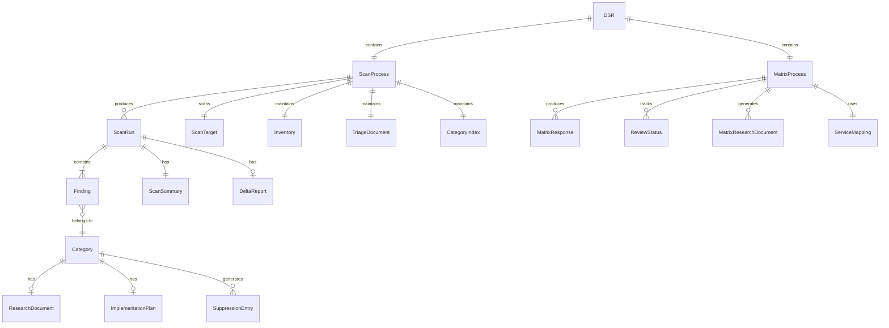

### 2.4 Disposition State Machine

This state machine governs the lifecycle of a Category's disposition:

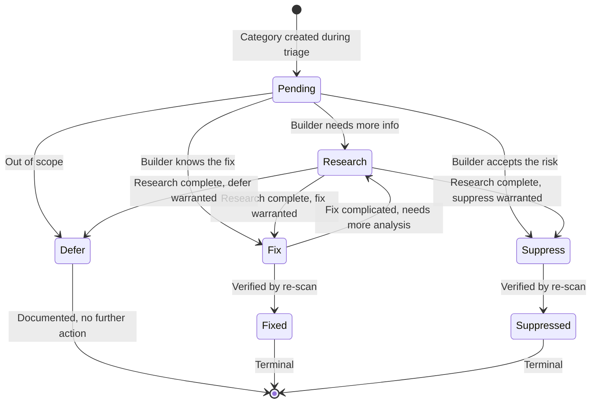

---

## 3. Process Architecture: ASH Security Scan

### 3.1 Process Flow (High Level)

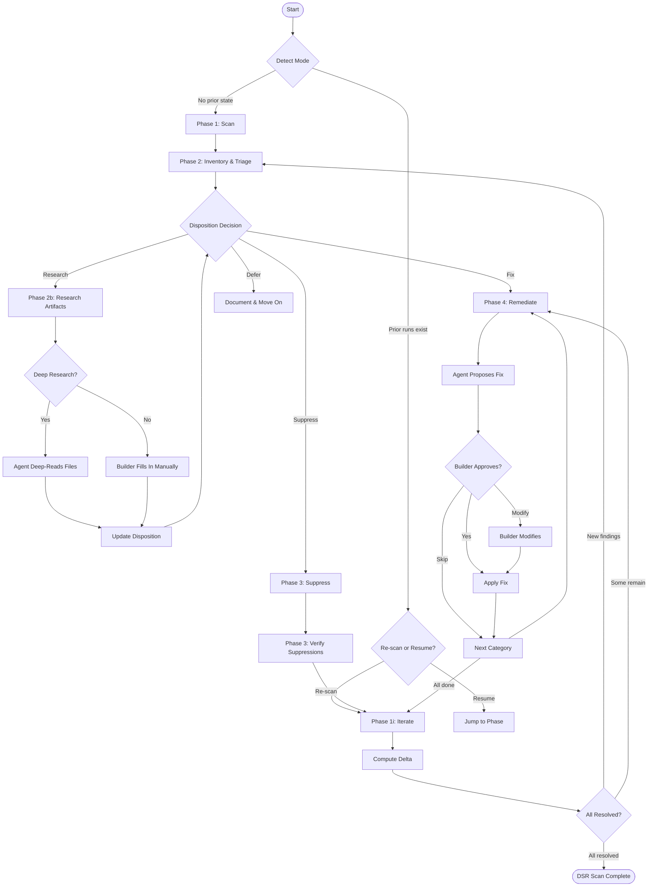

### 3.2 Phase Details

#### Phase 1: Scan & Collect

**Purpose:** Run automated scanners against a target directory and persist structured results.

**Sequence:**

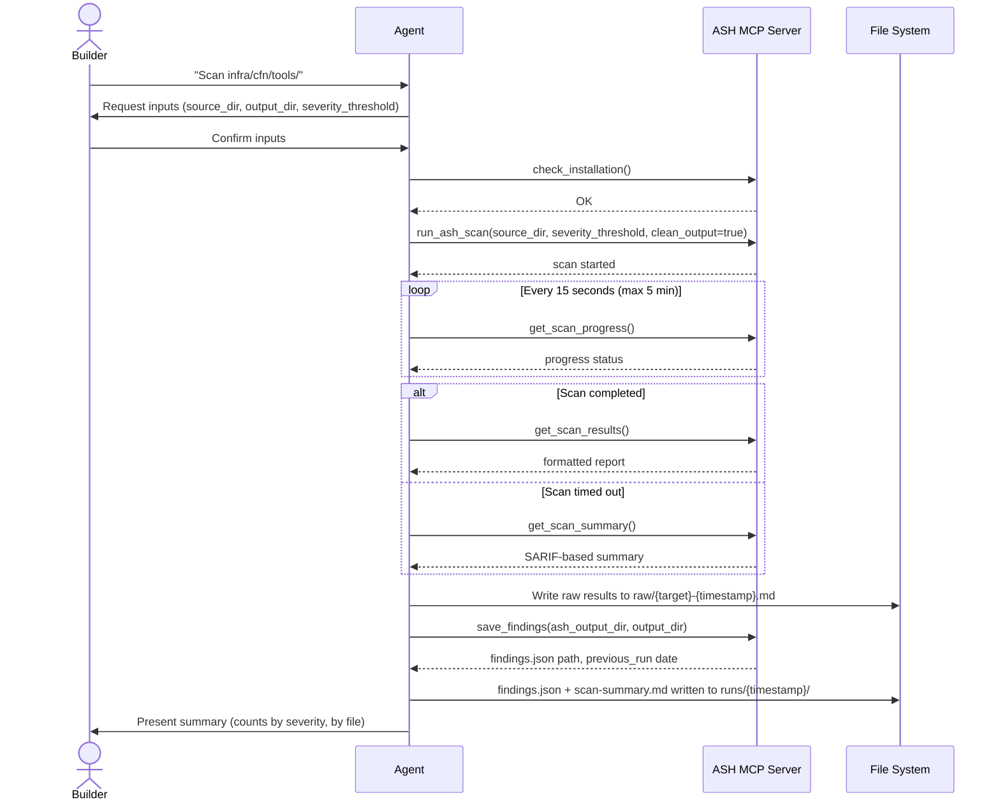

**Key Input/Output:**

| Input | Description |
|-------|-------------|
| `source_dir` | Directory to scan |
| `output_dir` | Where results are written |
| `severity_threshold` | Minimum severity to report |

| Output | Path | Format |
|--------|------|--------|
| Raw results | `{output_dir}/raw/{target}-{timestamp}.md` | Markdown |
| Findings | `{output_dir}/runs/{timestamp}/findings.json` | JSON array |
| Summary | `{output_dir}/runs/{timestamp}/scan-summary.md` | Markdown |

**Finding JSON Schema:**
```json
{
  "id": "F001",
  "rule_ids": ["AwsSolutions-APIG1", "AwsSolutions-APIG3"],
  "scanners": ["cdk-nag"],
  "severity": "HIGH",
  "file": "api-gateway/api-gateway-rest-lambda.yml",
  "start_line": 8,
  "end_line": 8,
  "description": "The API does not have access logging enabled.",
  "snippet": "...(code excerpt)...",
  "disposition": "",
  "status": "pending"
}
```

#### Phase 2: Inventory & Triage

**Purpose:** Group raw findings into categories by root cause, then present categories to the builder for disposition decisions.

**Sequence:**

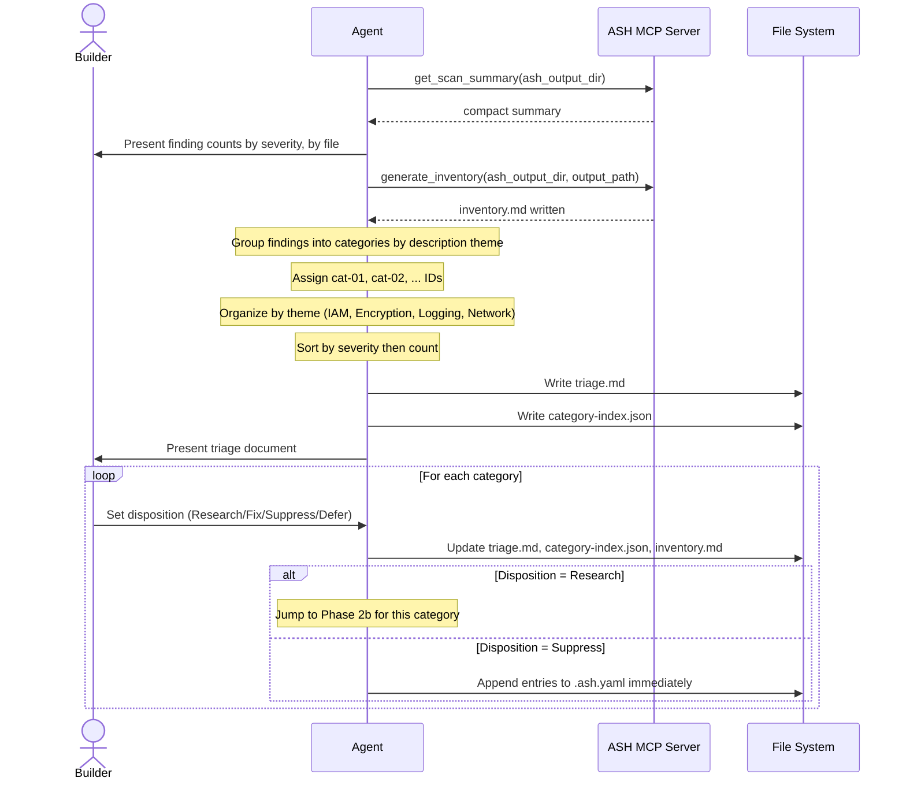

**Categorization Algorithm:**
1. Group findings by "description theme" -- findings with the same root issue across multiple files become one category
2. Assign sequential IDs: cat-01, cat-02, etc.
3. Organize categories by theme group (IAM, Encryption, Logging, Network, API Gateway, etc.)
4. Within each theme, sort by severity (HIGH first), then by finding count
5. Each category has an empty Disposition column for the builder to fill

**Disposition Decision Matrix:**

| Disposition | Criteria | Next Step |
|-------------|----------|-----------|
| **Research** | Builder needs more information | Phase 2b: Generate research artifacts |
| **Fix** | Finding is genuine, fix is known | Phase 4: Agent proposes code change |
| **Suppress** | Acceptable risk for POC scope | Immediately write `.ash.yaml` entries |
| **Defer** | Valid but out of scope | Document rationale, no further action |

#### Phase 2b: Research Artifacts

**Purpose:** For categories needing investigation, create structured research documents and optionally have the agent deep-read code to fill them in.

**Sequence:**

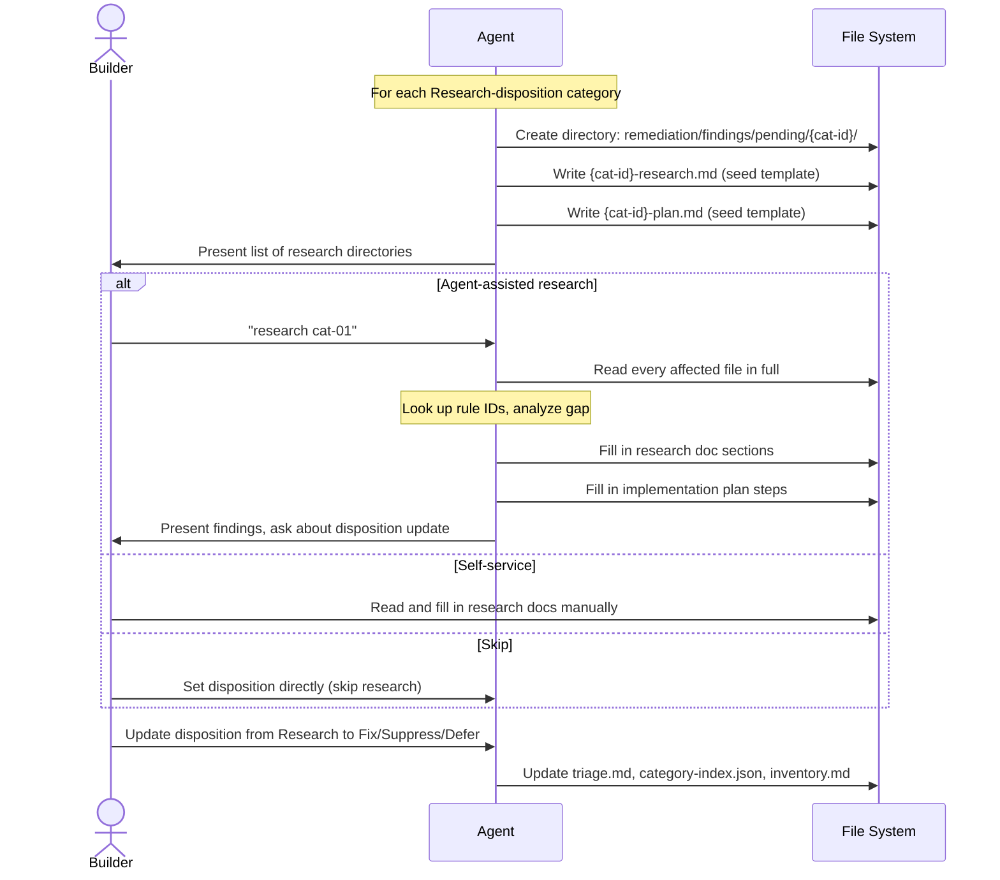

**Research Document Template Sections:**
1. **Finding Summary** -- Pre-populated: severity, rule IDs, scanners, affected files
2. **Affected Code** -- Quoted code snippets with file paths, line numbers, annotations
3. **Issue Description** -- What the scanner found and why it matters
4. **Risks** -- Breaking changes, blast radius, cost impact, complexity, rollback
5. **Alternative Options** -- Fix in template, fix as parameter, suppress, defer
6. **Suppression Justification** -- Always written, even for Fix-disposition
7. **Recommendations** -- Agent's recommended disposition with reasoning
8. **Candidate Files for Removal** -- Unused files that could be deleted
9. **Change Log** -- Audit trail of all modifications

**Implementation Plan Template Sections:**
1. **Summary** -- One sentence: what changes and why
2. **Affected Files** -- Table of files and required changes
3. **Steps** -- Ordered implementation steps (filled after research)
4. **Verification** -- Checklist: re-scan passes, no new findings, inventory updated

#### Phase 3: Verify Suppressions

**Purpose:** Confirm that `.ash.yaml` suppression entries are correctly applied by re-scanning.

**Process:**
1. Verify `.ash.yaml` contains entries for all suppress-disposition categories
2. Generate customer-facing suppression report
3. Re-scan to verify suppressions take effect
4. Reconcile against previous run -- suppressed findings should appear as "resolved"

**Suppression Entry Format:**
```yaml
global_settings:
  suppressions:
    # cat-XX: {Category Title}
    - rule_id: '{rule_id}'
      path: '{file}'
      reason: >
        cat-XX -- {builder's suppression justification}
      expiration: '{date + 12 months, YYYY-MM-DD}'
```

**Deduplication Rule:** Category comment header (`# cat-XX:`) serves as a dedup marker. If the header already exists in `.ash.yaml`, skip that category.

#### Phase 4: Remediate

**Purpose:** Apply code fixes for fix-disposition categories.

**Sequence per category:**

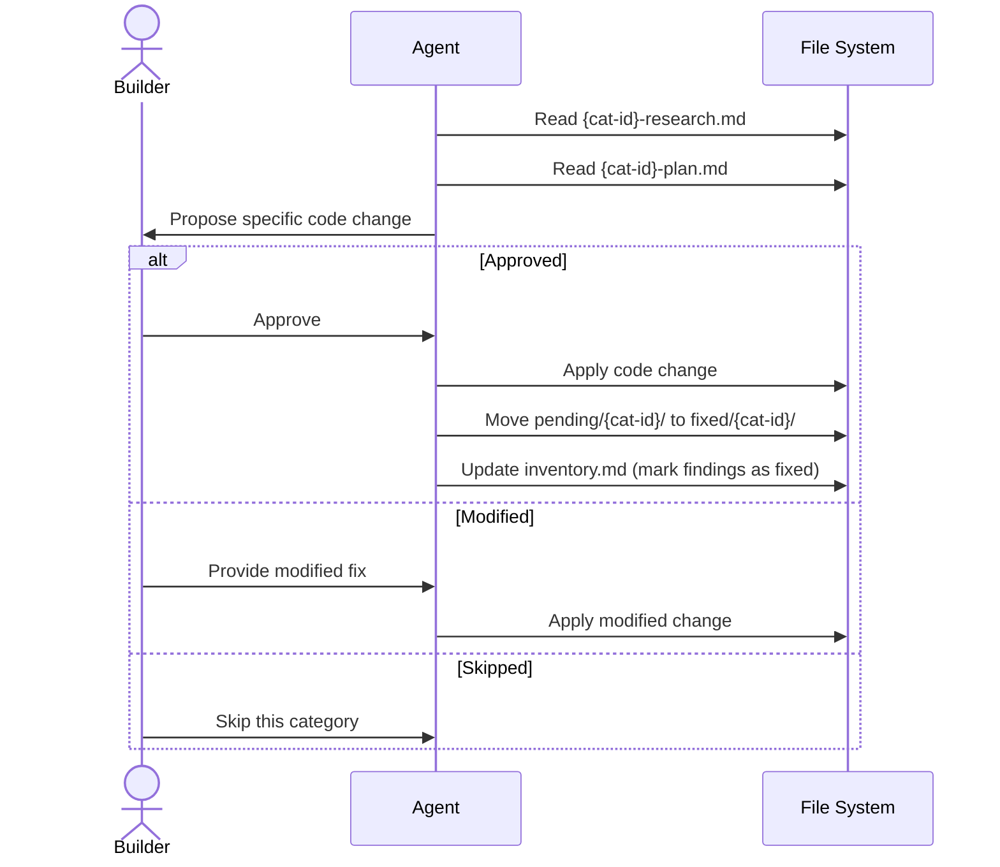

**Directory Movement Pattern:**
```
remediation/findings/pending/cat-XX/  -->  remediation/findings/fixed/cat-XX/
```

This movement is triggered either by the builder explicitly moving after fix, or automatically after verification confirms all findings in the category resolved.

#### Phase 1i / Phase 5: Iterate (Re-scan, Reconcile, Verify)

**Purpose:** Re-run scanner, compute delta against previous run, verify fixes and suppressions, handle new findings.

**Sequence:**

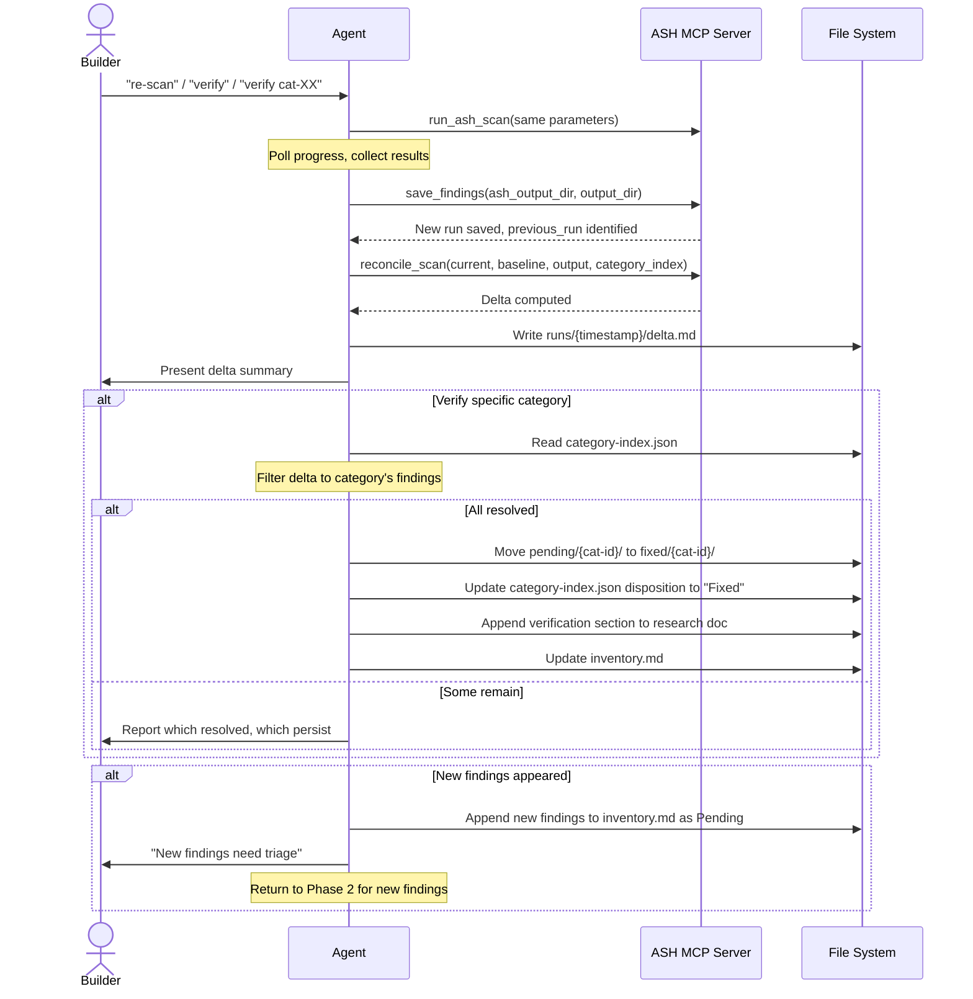

**Delta Matching Algorithm:**
- Match findings by `(rule_id, file)` pair
- Present in baseline only = **resolved**
- Present in current only = **new**
- Present in both = **unchanged**

**Verification Section (appended to research doc):**
```markdown
## Verification -- {date}

Re-scan confirmed {n}/{total} findings in this category are resolved.
Resolved: {list of rule_id + file pairs}
Remaining: {list or "none"}
```

### 3.3 Scan Process Closing Criteria

The scan phase is complete when ALL of the following are true:

- [ ] All fix-disposition findings are resolved (verified by re-scan)
- [ ] All suppress-disposition findings are resolved (suppressed by `.ash.yaml`)
- [ ] All defer-disposition findings are documented
- [ ] No new findings remain untriaged
- [ ] Final inventory reflects complete status of every finding

**Final Summary Format:**
```
Total findings: {N}
Fixed: {N}
Suppressed: {N}
Deferred: {N}
New: 0
```

---

## 4. Process Architecture: Security Matrix

### 4.1 Process Flow (High Level)

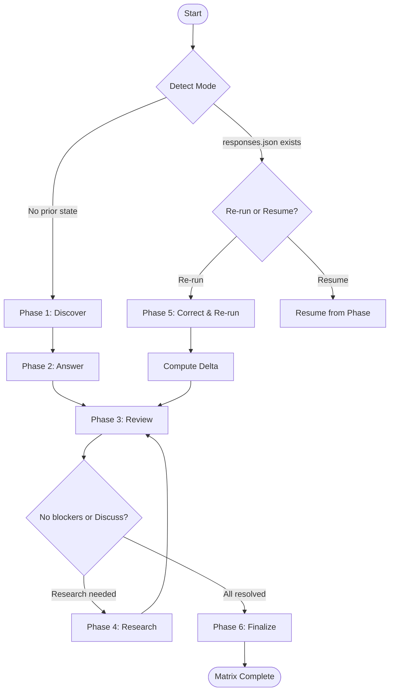

### 4.2 Phase Details

#### Phase 1: Discover

**Purpose:** Identify which AWS services are in scope by scanning the infrastructure directory and matching against available question sets.

**Algorithm:**
1. List directories under `infra/cfn/tools/`
2. Map each directory to a `service_key` using a predefined lookup table
3. Add embedded services (services defined inside other templates, e.g., ALB inside ECS)
4. Read question catalog from MCP resource
5. Intersect: keep only services that appear in BOTH the directory mapping AND the catalog
6. Record unmatched services as "skipped" with reason
7. Present to builder for confirmation

**Service Mapping Pattern:**
The mapping table handles three cases:
- **Direct:** Directory name matches service key (`s3` --> `s3`)
- **Renamed:** Directory name differs from service key (`rest-lambda` --> `lambda`)
- **Shared:** Multiple directories share a question set (`agent-core` --> `bedrock`)
- **Embedded:** Service exists inside another service's template (ALB in ECS, CodeBuild in CodePipeline)

#### Phase 2: Answer

**Purpose:** For each confirmed service, read templates and answer all security questions.

**Processing pattern:** One service at a time (to manage context pressure).

**Sequence per service:**

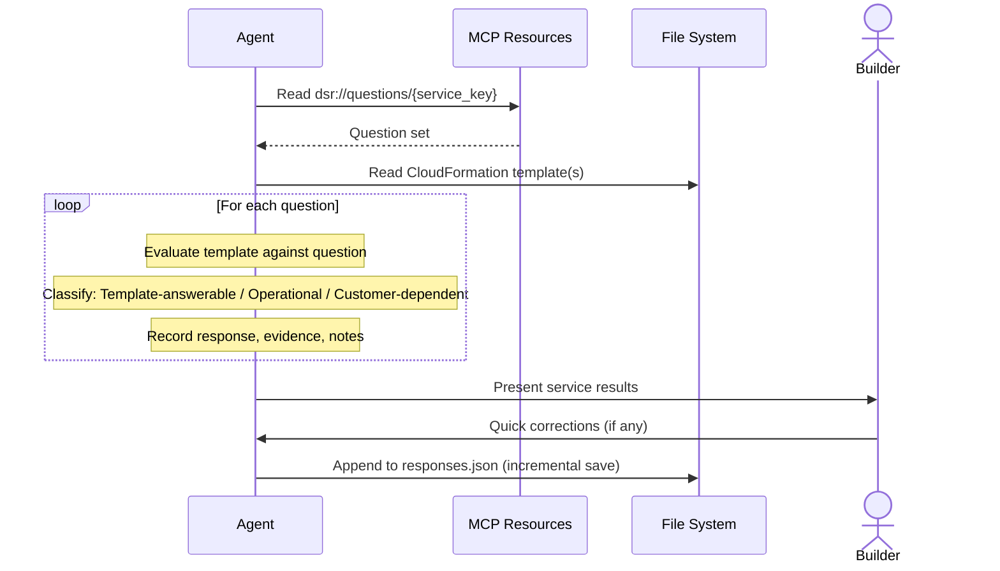

**Incremental Save Pattern:** After each service completes, responses are appended to `responses.json`. This means:
- Session interruption after 8 of 17 services preserves those 8
- Resuming picks up from service 9
- Multiple sessions can contribute to one matrix run

#### Phase 3: Review

**Purpose:** Human reviews agent-generated answers service by service, corrects mistakes, flags items for research.

**Per-service actions:**
- **Approve** -- All answers correct, mark service as reviewed
- **Correct** -- Update specific answers, then mark as reviewed
- **Skip** -- Leave for later

**Special handling for "No" on release blockers:**
- **Research** -- Needs investigation before deciding
- **Accept** -- "No" is correct, add justification to notes
- **Correct** -- Change to "Yes" or "N/A" with evidence

**Special handling for "Discuss" responses:**
- **Research** -- Investigate what customer needs to decide
- **Resolve** -- Replace with concrete response
- **Keep** -- Add notes explaining discussion points

#### Phase 4: Research

**Purpose:** Deep-read templates to investigate questions flagged during review.

Same pattern as scan research:
1. Create research directory: `research/pending/{service_key}-{question_id}/`
2. Write seed `research.md` with template sections
3. Agent deep-reads templates when asked
4. Builder reviews and updates response

**Research Doc Sections (Matrix):**
1. Question Context -- question text, reason, current response, evidence
2. Affected Code -- quoted template code with annotations
3. Gap Analysis -- what the question requires vs. what the template provides
4. Remediation Options -- fix in template, add as parameter, accept as-is
5. Effort Estimate -- Low / Medium / High
6. Recommendation -- recommended response update
7. Change Log

**Directory Movement:** `research/pending/{ref}/` --> `research/resolved/{ref}/` when the response is updated.

#### Phase 5: Correct & Re-run

**Purpose:** After template changes, re-answer questions and produce a delta report.

**Steps:**
1. Snapshot current `responses.json` to `runs/{timestamp}/`
2. Re-answer questions for specified services (or all)
3. Generate delta report (changed, new, removed responses)
4. Reset affected services to `needs_correction` in review status
5. Return to Review phase for changed services

**Delta Matching:** Responses matched by `(service_key, question_id)` pair.

#### Phase 6: Finalize

**Purpose:** Verify closing criteria and generate final reports.

**Closing Criteria:**
- [ ] All questions answered (no skipped)
- [ ] All services reviewed (no pending)
- [ ] No "No" responses on release blockers without research or justification
- [ ] No "Discuss" responses without resolution notes
- [ ] Final reports generated

**Output Formats:**
- `security-matrix.md` -- Human-readable matrix
- `security-matrix.csv` -- Spreadsheet export
- `security-matrix.json` -- Machine-readable

---

## 5. Cross-Cutting Concerns

### 5.1 Session Resumability

Both processes implement the same resumability pattern:

1. **On entry:** Check the output directory for existing state
2. **State detection rules:**
   - No artifacts = fresh start
   - Artifacts exist = offer re-run or resume
   - Legacy format = offer migration
3. **Incremental persistence:** Save after each logical unit of work (per-service for matrix, per-phase for scan)
4. **Timestamped runs:** Each execution creates an immutable timestamped directory

### 5.2 Run History and Audit Trail

Both processes maintain a `runs/` directory with timestamped subdirectories:

```
runs/
  {YYYY-MM-DDTHH-MM}/
    findings.json (scan) or responses.json (matrix)
    scan-summary.md or run-summary.md
    delta.md (present when there's a prior run to compare)
```

This provides:
- Immutable record of each evaluation point
- Ability to compute deltas between any two runs
- Evidence of review progression over time

### 5.3 Human-in-the-Loop Pattern

Every decision point follows the same pattern:
1. Agent generates/proposes
2. Builder reviews
3. Builder decides (approve, correct, skip, or choose disposition)
4. Agent persists the decision
5. Agent updates all derived artifacts to maintain consistency

The agent NEVER:
- Makes disposition decisions
- Applies code changes without builder approval
- Auto-researches all categories (research is expensive, builder chooses which)

### 5.4 Artifact Consistency

Three artifacts must stay in sync for the scan process:
- `triage.md` -- human-readable category dispositions
- `category-index.json` -- machine-readable category dispositions
- `inventory.md` -- per-finding status

Whenever a disposition changes, all three are updated in the same operation.

For the matrix process:
- `responses.json` -- current state of all responses
- `review-status.json` -- per-service review tracking

### 5.5 Research Pattern (Shared)

Both processes use the same research pattern:
1. **Trigger:** Human flags an item for research
2. **Seed:** Agent creates directory + template document with pre-populated context
3. **Investigate:** Agent deep-reads code (expensive, human-initiated) or human fills in manually
4. **Decide:** Human updates disposition/response based on research
5. **Move:** Research directory moves from `pending/` to `fixed/` or `resolved/`

### 5.6 External Tool Integration

The scan process integrates with ASH via MCP (Model Context Protocol):

**ASH MCP Tool Functions:**
| Function | Purpose |
|----------|---------|
| `check_installation` | Verify ASH is available |
| `run_ash_scan` | Execute scanner suite |
| `get_scan_progress` | Poll scan status |
| `get_scan_results` | Get formatted results |
| `get_scan_summary` | Get SARIF-based summary (fallback) |
| `save_findings` | Persist parsed findings to JSON |
| `reconcile_scan` | Compute delta between runs |
| `generate_inventory` | Write initial inventory |
| `generate_ash_yaml` | Generate suppression file |
| `generate_suppression_report` | Write customer-facing suppression report |
| `write_finding_files` | Write per-finding files for remediation |

The matrix process integrates with a question catalog via MCP resources:

**MCP Resources:**
| Resource | Purpose |
|----------|---------|
| `dsr://questions/catalog` | List available question sets |
| `dsr://questions/{service_key}` | Get questions for a specific service |
| `write_security_matrix` | Generate final matrix reports |

---

## 6. Output Directory Structures

### 6.1 Scan Output

```
{output_dir}/
  inventory.md                              # Master finding list with status
  triage.md                                 # Category dispositions by theme
  category-index.json                       # Machine-readable category map
  suppression-report.md                     # Customer-facing suppression doc
  raw/
    {target}-{timestamp}.md                 # Preserved raw scanner output
  runs/
    {YYYY-MM-DDTHH-MM}/
      findings.json                         # Deduplicated findings for this run
      scan-summary.md                       # Counts by severity and file
      delta.md                              # Diff vs previous run (if exists)
  remediation/
    findings/
      pending/
        cat-XX/
          cat-XX-research.md                # Investigation document
          cat-XX-plan.md                    # Implementation plan
      fixed/
        cat-YY/
          cat-YY-research.md                # Research with verification appended
          cat-YY-plan.md                    # Completed plan
      suppressed/
        cat-ZZ/
          cat-ZZ-research.md                # Research with suppression justification
          cat-ZZ-plan.md                    # Plan (suppression entries)
```

### 6.2 Matrix Output

```
{output_dir}/
  responses.json                            # Current state of all responses
  review-status.json                        # Per-service review tracking
  summary.md                                # Current summary
  runs/
    {YYYY-MM-DDTHH-MM}/
      responses.json                        # Snapshot of responses at this point
      run-summary.md                        # Summary at this point
      delta.md                              # Diff vs previous run
  research/
    pending/
      {service_key}-{question_id}/
        research.md                         # Investigation document
    resolved/
      {service_key}-{question_id}/
        research.md                         # Completed research
  reports/
    security-matrix.md                      # Final human-readable report
    security-matrix.csv                     # Spreadsheet export
    security-matrix.json                    # Machine-readable report
```

---

## 7. Process Interaction Between Scan and Matrix

The two processes are independent but have natural interaction points:

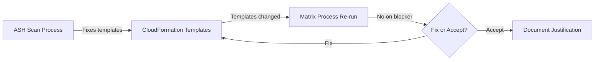

**Recommended execution order:**
1. Run ASH scan first -- it identifies and remediates code issues
2. Run security matrix after -- it evaluates the (now-fixed) templates against security questions
3. If the matrix reveals gaps that require template changes, fix templates and re-run both

---

## 8. Key Design Patterns for Application Modeling

### 8.1 Pattern: Iterative Convergence Loop

Both processes follow the same convergence pattern:
```
Evaluate --> Human Decision --> Act --> Re-evaluate --> Check Convergence
```

The loop terminates when a set of closing criteria are all satisfied. Each iteration produces a delta showing progress toward convergence.

### 8.2 Pattern: Disposition-Driven Workflow

Disposition is the central branching mechanism. A single enum value (`Research`, `Fix`, `Suppress`, `Defer`) determines which process path a finding or question follows. This makes the system highly extensible -- adding a new disposition adds a new path without modifying existing ones.

### 8.3 Pattern: Seed-and-Fill Document Generation

Research documents follow a two-phase creation:
1. **Seed** (automated): Create document with template sections and pre-populated context from available data
2. **Fill** (human-triggered or manual): Deep analysis fills in the investigation sections

This pattern separates the expensive work (deep code reading) from the cheap work (template generation), letting the human control when to spend the expensive operation.

### 8.4 Pattern: Directory-as-State

The file system directory structure encodes workflow state:
- `pending/` = in progress
- `fixed/` = completed (fix verified)
- `suppressed/` = completed (risk accepted)
- `resolved/` = completed (matrix question answered)

Moving a directory between these parents is the state transition mechanism. This makes state visible to both humans (browsing the file system) and agents (checking directory contents).

### 8.5 Pattern: Three-Artifact Consistency

Critical state is maintained in three synchronized views:
1. **Human-readable** (markdown) -- for builder review
2. **Machine-readable** (JSON) -- for tool consumption
3. **Master list** (inventory/responses) -- single source of truth

Any state change updates all three atomically.

### 8.6 Pattern: Incremental Persistence

Work is saved after each logical unit (per-service, per-category, per-phase). This makes the process crash-resilient and session-independent without requiring a database.

### 8.7 Pattern: Delta-Based Progress Tracking

Rather than tracking absolute state, the system tracks deltas between evaluation points. This provides:
- Natural progress reporting (what changed since last check)
- Regression detection (new findings that appeared)
- Audit trail (sequence of deltas tells the story)

---

## 9. Data Flow Summary

### 9.1 Scan Process Data Flow

```
[Scanner Output (SARIF)]
    |
    v
[findings.json] -- deduplicated, structured findings
    |
    v
[inventory.md] -- flat list with status tracking
    |
    v
[category-index.json + triage.md] -- grouped by root cause
    |
    v
[Research Docs + Plans] -- per-category investigation
    |
    v
[Code Changes OR .ash.yaml entries] -- remediation
    |
    v
[Delta Report] -- verification of changes
    |
    v
[Updated inventory, triage, category-index] -- convergence tracking
```

### 9.2 Matrix Process Data Flow

```
[Infrastructure Directories]
    |
    v
[Service Mapping] -- directory to service_key
    |
    v
[Question Catalog (MCP)] -- questions per service
    |
    v
[responses.json] -- answers with evidence
    |
    v
[review-status.json] -- per-service review state
    |
    v
[Research Docs] -- for flagged questions
    |
    v
[Updated responses] -- after review and research
    |
    v
[Final Reports (MD, CSV, JSON)] -- DSR deliverable
```

---

## 10. Key Takeaways

1. **Two independent processes** (Scan and Matrix) share the same architectural patterns but operate on different data: scan findings vs. security questions.

2. **The human makes all decisions.** The AI agent proposes, generates, and tracks -- but every disposition, approval, and correction is human-initiated.

3. **Categories are the unit of decision.** Individual findings are too granular for human review. Grouping by root cause reduces hundreds of findings to ~20 categories.

4. **Four dispositions drive the workflow:** Research, Fix, Suppress, Defer. Each maps to a distinct process path. Research is the "safe default" when unsure.

5. **The file system IS the state machine.** Directory structure (`pending/`, `fixed/`, `suppressed/`, `resolved/`) encodes workflow state. No database required.

6. **Delta reports are the progress mechanism.** Each re-evaluation compares to the previous, showing what resolved, what's new, and what remains.

7. **Research is expensive and human-controlled.** Deep code reading is the most resource-intensive operation. The human chooses when to spend it.

8. **Everything is resumable.** State detection on entry, incremental saves, and timestamped runs mean the process survives session interruptions.

9. **Three synchronized views** (markdown, JSON, master list) keep humans and tools aligned on current state.

10. **Closing criteria are explicit.** Each process defines a specific checklist that must be satisfied before declaring completion. The agent checks these criteria and reports unmet conditions.
