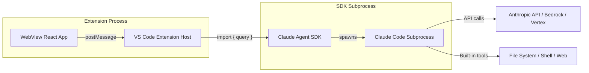
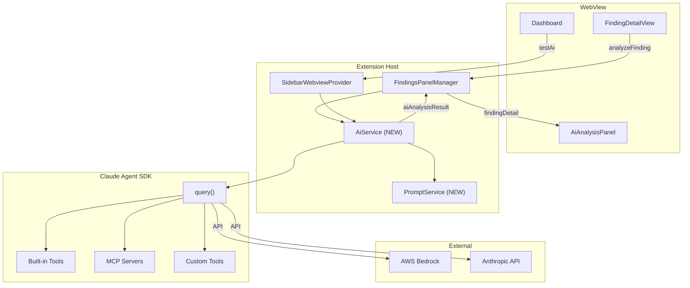
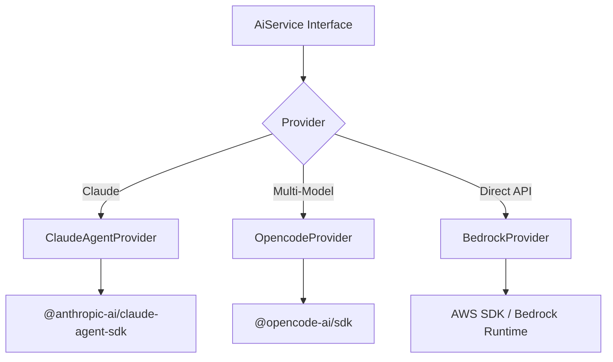
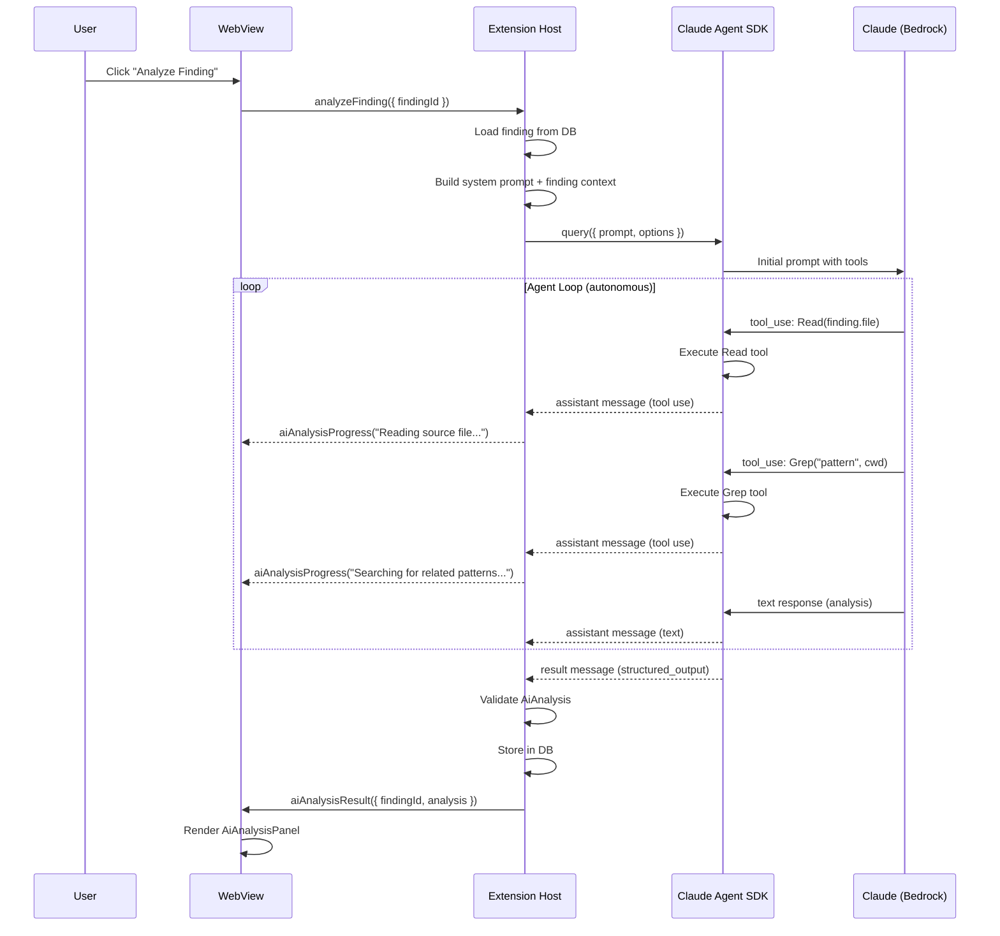

# Claude Agent SDK Integration Research

## Overview

This document investigates integrating the [Claude Agent SDK](https://www.npmjs.com/package/@anthropic-ai/claude-agent-sdk) (`@anthropic-ai/claude-agent-sdk`) into the ASH Workbench VS Code extension as the primary AI integration layer. The Claude Agent SDK (formerly "Claude Code SDK") provides the same tools, agent loop, and context management that power Claude Code, available as a programmable library in TypeScript and Python.

Unlike the OpenCode SDK (researched in `docs/docs/working/opencode/initial/opencode-research.md`) which spawns a separate CLI process and communicates via HTTP REST, the Claude Agent SDK runs **in-process** as a Node.js library. It spawns a Claude Code subprocess that handles tool execution autonomously -- reading files, running commands, editing code, and searching the web -- without requiring you to implement a tool loop. This is a fundamentally different integration model with significant implications for the extension's architecture, deployment, and capabilities.

**Key architectural difference from OpenCode**: OpenCode is a CLI tool that must be installed globally and is spawned as a local HTTP server. The Claude Agent SDK is an npm package that bundles the Claude Code runtime -- it is a **library dependency**, not an external tool dependency. This eliminates the "CLI not installed" prerequisite problem entirely, at the cost of tighter coupling to Anthropic's ecosystem and Claude-only model support.

**Authentication**: The SDK supports three authentication paths:
1. **Anthropic API Key**: `ANTHROPIC_API_KEY` environment variable (direct API)
2. **Amazon Bedrock**: `CLAUDE_CODE_USE_BEDROCK=1` + AWS credentials
3. **Google Vertex AI**: `CLAUDE_CODE_USE_VERTEX=1` + Google Cloud credentials
4. **Microsoft Azure**: `CLAUDE_CODE_USE_FOUNDRY=1` + Azure credentials

For ASH Workbench's AWS-first user base, Bedrock authentication is the primary path.

---

## Architecture

### How the Claude Agent SDK Works



**SDK Architecture:**

1. **`query()`** -- The core function. Takes a prompt string and options, returns an `AsyncGenerator` of `SDKMessage` objects. Internally spawns a Claude Code process that handles the full agent loop: prompt, tool use, observation, repeat until done.

2. **Built-in tool execution** -- Unlike traditional LLM SDKs where you implement tool handlers, the Claude Agent SDK executes tools autonomously. When Claude decides to read a file, it reads the file. When it decides to run a command, it runs it. The SDK handles all tool execution internally.

3. **Streaming messages** -- The `query()` generator yields messages as they occur: assistant text, tool use, tool results, progress updates, and a final result. This enables real-time UI updates.

4. **No HTTP server** -- There is no local server to manage, no port to allocate, no process lifecycle to orchestrate beyond the query itself. Each `query()` call is self-contained.

### Integration with ASH Workbench



### Comparison with OpenCode Integration

| Aspect | OpenCode SDK | Claude Agent SDK |
|--------|-------------|-----------------|
| **Integration model** | HTTP client to CLI server | In-process npm library |
| **Dependency** | Global CLI install required | npm dependency (bundled) |
| **Process management** | Spawn/kill server process | Self-contained per query |
| **Model support** | Multi-provider (Bedrock, OpenAI, etc.) | Claude-only (Bedrock, Vertex, Azure, API) |
| **Tool execution** | Tools optional, can disable | Tools are core feature |
| **Structured output** | Via StructuredOutput tool | Native `outputFormat` option |
| **Session management** | Server-side sessions | File-based sessions (JSONL) |
| **Cold start** | 2-5s server startup | Per-query subprocess spawn |
| **Configuration** | `OPENCODE_CONFIG_CONTENT` env var | Options object in code |
| **Custom tools** | Limited | Full MCP + in-process tools |
| **Subagents** | Not supported | Native subagent spawning |
| **Hooks** | Not supported | Full lifecycle hooks |
| **Cost control** | Token tracking in response | `maxBudgetUsd` option |
| **Prerequisite check** | Must detect CLI installation | No external prereq |

### Existing Extension Scaffolding

The codebase has significant scaffolding ready for AI integration:

- **`AiAnalysis` type** (`vsix/src/models/types.ts`, `webview/src/types/types.ts`): Defines `explanation`, `riskAssessment`, `suggestedFix`, `references`
- **`RiskAssessment` type**: `exploitability`, `impact`, `likelihood` with `RiskLevel` enum and rationales
- **`SuggestedFix` type**: `description`, `diffText`, `language`
- **`AiAnalysisPanel` component** (`webview/src/components/AiAnalysisPanel.tsx`): Full accordion-based UI, already integrated in `FindingDetailView.tsx`
- **`FindingRow.aiAnalysis`** field: Currently hardcoded to `null` in mappers, with mock data demonstrating expected shape
- **LLM settings in `package.json`**: `ashWorkbench.llm.provider` (bedrock), `ashWorkbench.llm.region` (us-east-1), `ashWorkbench.llm.modelId`

---

## Detailed Findings

### Claude Agent SDK API Surface

The SDK exposes a minimal but powerful API:

#### Core Function: `query()`

```typescript
import { query } from "@anthropic-ai/claude-agent-sdk";

function query(params: {
  prompt: string | AsyncIterable<SDKUserMessage>;
  options?: Options;
}): Query;
```

The `Query` object is an `AsyncGenerator<SDKMessage>` with additional control methods:

| Method | Purpose |
|--------|---------|
| `interrupt()` | Cancel current operation |
| `rewindFiles(userMessageId)` | Undo file changes to a checkpoint |
| `setPermissionMode(mode)` | Change permission mode mid-session |
| `setModel(model)` | Switch model mid-session |
| `initializationResult()` | Get init metadata (tools, model, etc.) |
| `supportedModels()` | List available models |
| `mcpServerStatus()` | Check MCP server health |
| `close()` | Terminate the query |

#### Options (Key Properties for ASH Workbench)

| Property | Type | Default | Relevance |
|----------|------|---------|-----------|
| `allowedTools` | `string[]` | `[]` | Control which tools Claude can use |
| `disallowedTools` | `string[]` | `[]` | Always deny specific tools |
| `permissionMode` | `PermissionMode` | `'default'` | How tool approvals work |
| `model` | `string` | CLI default | Model selection |
| `fallbackModel` | `string` | `undefined` | Fallback if primary unavailable |
| `outputFormat` | `{ type: 'json_schema', schema }` | `undefined` | Structured output |
| `maxBudgetUsd` | `number` | `undefined` | Cost cap |
| `maxTurns` | `number` | `undefined` | Limit agent iterations |
| `abortController` | `AbortController` | auto | Cancellation |
| `cwd` | `string` | `process.cwd()` | Working directory |
| `env` | `Record<string, string>` | `process.env` | Environment variables |
| `systemPrompt` | `string \| preset` | minimal | System prompt |
| `hooks` | hook config | `{}` | Lifecycle callbacks |
| `mcpServers` | MCP config | `{}` | External tool servers |
| `agents` | agent definitions | `undefined` | Subagent definitions |
| `thinking` | `ThinkingConfig` | `{ type: 'adaptive' }` | Extended thinking control |
| `effort` | `'low'\|'medium'\|'high'\|'max'` | `'high'` | Response thoroughness |
| `settingSources` | `SettingSource[]` | `[]` | Load CLAUDE.md, settings |
| `plugins` | `SdkPluginConfig[]` | `[]` | Load plugins |
| `persistSession` | `boolean` | `true` | Session persistence |

#### Built-in Tools

The SDK provides these tools out of the box -- no implementation needed:

| Tool | Capability |
|------|-----------|
| `Read` | Read any file in the working directory |
| `Write` | Create new files |
| `Edit` | Make precise edits to existing files |
| `Bash` | Run terminal commands, scripts, git |
| `Glob` | Find files by pattern |
| `Grep` | Search file contents with regex |
| `WebSearch` | Search the web |
| `WebFetch` | Fetch and parse web pages |
| `AskUserQuestion` | Ask clarifying questions with choices |
| `Agent` | Spawn subagents |

**Critical design decision**: The Claude Agent SDK's value proposition is that tools execute autonomously. For our security analysis use case, we have two options:

1. **Allow tools** (recommended): Let Claude read the actual source files, navigate the codebase, and produce contextual analysis. This means the agent can `Read` the file referenced in the finding, `Grep` for related patterns, and `Glob` for similar files -- producing much richer analysis than a text-only approach.

2. **Disable tools**: Use only the prompt with finding context embedded, getting a text-only analysis response. This is simpler but loses the SDK's primary advantage over a raw API call.

### AWS Bedrock Authentication

For Bedrock, the SDK requires:

```bash
export CLAUDE_CODE_USE_BEDROCK=1
# Plus standard AWS credential chain:
# AWS_ACCESS_KEY_ID/AWS_SECRET_ACCESS_KEY, AWS_PROFILE, IAM roles, etc.
```

The extension can pass these via the `env` option:

```typescript
const result = query({
  prompt: analysisPrompt,
  options: {
    env: {
      CLAUDE_CODE_USE_BEDROCK: '1',
      AWS_REGION: settings.region,
      ...(settings.awsProfile ? { AWS_PROFILE: settings.awsProfile } : {}),
    },
    model: settings.modelId, // e.g., 'claude-sonnet-4-20250514'
  }
});
```

**Note**: When using Bedrock, model IDs use Anthropic's naming (e.g., `claude-sonnet-4-20250514`), not Bedrock ARNs. The SDK handles the translation internally.

**Supported Bedrock models**: All Claude models available in the user's Bedrock region. The `supportedModels()` method on the Query object can enumerate available models at runtime.

### Structured Output

The SDK supports native structured output via JSON Schema:

```typescript
const schema = {
  type: "object",
  properties: {
    explanation: { type: "string" },
    riskAssessment: {
      type: "object",
      properties: {
        exploitability: { type: "string", enum: ["CRITICAL", "HIGH", "MEDIUM", "LOW", "NONE"] },
        exploitabilityRationale: { type: "string" },
        impact: { type: "string", enum: ["CRITICAL", "HIGH", "MEDIUM", "LOW", "NONE"] },
        impactRationale: { type: "string" },
        likelihood: { type: "string", enum: ["CRITICAL", "HIGH", "MEDIUM", "LOW", "NONE"] },
        likelihoodRationale: { type: "string" },
      },
      required: ["exploitability", "impact", "likelihood"]
    },
    suggestedFix: {
      type: "object",
      properties: {
        description: { type: "string" },
        diffText: { type: "string" },
        language: { type: "string" },
      }
    },
    references: {
      type: "array",
      items: {
        type: "object",
        properties: {
          title: { type: "string" },
          url: { type: "string" },
        }
      }
    }
  },
  required: ["explanation", "riskAssessment"]
};

for await (const message of query({
  prompt: analysisPrompt,
  options: {
    outputFormat: { type: "json_schema", schema },
    allowedTools: ["Read", "Glob", "Grep"],
  }
})) {
  if (message.type === "result" && message.structured_output) {
    // Validated AiAnalysis object
    const analysis: AiAnalysis = message.structured_output;
  }
}
```

This is a major advantage over OpenCode's approach where we had to embed JSON schema in the prompt and parse the response manually. The SDK validates the output against the schema and retries if it doesn't match.

### Permission Modes

| Mode | Behavior | ASH Use Case |
|------|----------|-------------|
| `default` | Requires `canUseTool` callback for each tool | Interactive approval |
| `acceptEdits` | Auto-approves file edits, asks for destructive | Trusted analysis with code fixes |
| `dontAsk` | Denies anything not in `allowedTools` | Locked-down headless analysis |
| `bypassPermissions` | All tools run without prompts | Sandboxed CI/CD |
| `plan` | No tool execution; Claude plans only | Planning-only mode |

**Recommended for ASH Workbench**: `dontAsk` with explicit `allowedTools: ["Read", "Glob", "Grep"]` for read-only analysis. This ensures the agent can navigate the codebase to understand findings in context, but cannot modify files. For a future "auto-fix" feature, `acceptEdits` would allow Claude to generate and apply patches.

### Custom Tools via MCP

The SDK supports three mechanisms for custom tools:

#### 1. In-Process MCP Server (Recommended for ASH)

```typescript
import { tool, createSdkMcpServer, query } from "@anthropic-ai/claude-agent-sdk";
import { z } from "zod";

const ashTool = tool(
  "get_finding_context",
  "Retrieve full context for a security finding including surrounding code",
  { findingId: z.string(), contextLines: z.number().default(20) },
  async (args) => {
    const finding = await findingsService.getFindingDetail(args.findingId);
    const code = await readFileWithContext(finding.file, finding.startLine, args.contextLines);
    return {
      content: [{
        type: "text",
        text: JSON.stringify({ finding, surroundingCode: code })
      }]
    };
  }
);

const ashServer = createSdkMcpServer({
  name: "ash-workbench",
  version: "1.0.0",
  tools: [ashTool],
});

for await (const message of query({
  prompt: "Analyze this security finding in depth",
  options: {
    mcpServers: { "ash-workbench": ashServer },
    allowedTools: ["Read", "Glob", "Grep", "mcp__ash-workbench__get_finding_context"],
  }
})) { /* ... */ }
```

This is powerful -- we can give Claude direct access to our database, SARIF data, and finding context through type-safe custom tools, while the built-in tools handle file reading and codebase navigation.

#### 2. External MCP Servers (stdio/HTTP)

```typescript
mcpServers: {
  github: {
    command: "npx",
    args: ["-y", "@modelcontextprotocol/server-github"],
    env: { GITHUB_TOKEN: process.env.GITHUB_TOKEN }
  }
}
```

Future use case: connect to GitHub MCP server for PR-aware analysis, or a custom scanner MCP server.

#### 3. Tool Naming Convention

MCP tools follow the pattern `mcp__<server-name>__<tool-name>`. Wildcards work in `allowedTools`:

```typescript
allowedTools: [
  "Read", "Glob", "Grep",              // Built-in tools
  "mcp__ash-workbench__*",             // All ASH custom tools
  "mcp__github__list_issues",          // Specific GitHub tool
]
```

### Hooks System

Hooks provide lifecycle callbacks for monitoring, validation, and transformation:

| Hook Event | Trigger | ASH Use Case |
|-----------|---------|-------------|
| `PreToolUse` | Before tool execution | Block dangerous commands, log tool use |
| `PostToolUse` | After tool execution | Capture file reads for audit trail |
| `Stop` | Agent execution complete | Finalize analysis, cleanup |
| `Notification` | Status messages | Progress updates to WebView |
| `PermissionRequest` | Permission dialog | Route to WebView modal (future) |

**Example: Progress notification hook**

```typescript
const progressHook = async (input: HookInput) => {
  // Forward agent progress to WebView
  panel.webview.postMessage({
    type: 'aiAnalysisProgress',
    payload: { findingId, status: input.notification?.message || 'Analyzing...' }
  });
  return {};
};

const options = {
  hooks: {
    Notification: [{ hooks: [progressHook] }],
    PreToolUse: [{
      matcher: "Bash",
      hooks: [async () => ({ hookSpecificOutput: { permissionDecision: "deny" } })],
    }],
  }
};
```

### Subagents

The SDK supports spawning specialized subagents for focused tasks:

```typescript
const options = {
  allowedTools: ["Read", "Glob", "Grep", "Agent"],
  agents: {
    "code-reviewer": {
      description: "Expert code reviewer for security analysis.",
      prompt: "You are a senior AppSec engineer. Analyze code for vulnerabilities.",
      tools: ["Read", "Glob", "Grep"],
      model: "sonnet",
    },
    "fix-generator": {
      description: "Generate secure code fixes for vulnerabilities.",
      prompt: "Generate minimal, correct fixes for security vulnerabilities.",
      tools: ["Read", "Glob", "Grep"],
      model: "sonnet",
    }
  }
};
```

**ASH use case**: A main agent orchestrates analysis, delegating to specialized subagents for code review vs. fix generation. Subagent messages include `parent_tool_use_id` for tracking.

**Constraint**: Subagents cannot spawn their own subagents (no nesting).

### Session Management

Sessions persist to `~/.claude/projects/<encoded-cwd>/<session-id>.jsonl`:

```typescript
// First query
let sessionId: string;
for await (const message of query({
  prompt: "Analyze finding XYZ...",
  options: { allowedTools: ["Read", "Glob", "Grep"] }
})) {
  if (message.type === "system" && message.subtype === "init") {
    sessionId = message.session_id;
  }
}

// Resume later with full context
for await (const message of query({
  prompt: "Now generate a fix for the vulnerability you found",
  options: { resume: sessionId }
})) { /* ... */ }
```

**ASH use case**: A finding analysis session could be resumed to generate fixes, explore related findings, or refine the analysis -- maintaining full conversation context.

### Message Types

The `query()` generator yields a union of message types:

| Type | Subtype | Content | UI Mapping |
|------|---------|---------|-----------|
| `assistant` | -- | Claude's text + tool use blocks | Show analysis text, tool activity |
| `user` | -- | Synthetic tool results | Internal (not shown) |
| `result` | `success` | Final result, cost, usage, `structured_output` | Analysis complete, show result |
| `result` | `error_max_turns` | Hit turn limit | Show "analysis incomplete" |
| `result` | `error_max_budget_usd` | Hit budget limit | Show "budget exceeded" |
| `system` | `init` | Session ID, tools, model, agents | Internal initialization |
| `partial` | -- | Streaming text chunks | Real-time text display |
| `status` | -- | Agent status updates | Progress indicator |

### AskUserQuestion Tool (Deferred)

The SDK includes an `AskUserQuestion` tool that Claude can invoke to ask the user clarifying questions with multiple-choice options:

```typescript
// Claude sends this tool call:
{
  "questions": [{
    "question": "The finding references a configuration file. Which config format does your project use?",
    "header": "Config",
    "options": [
      { "label": "YAML", "description": "config.yml or config.yaml" },
      { "label": "JSON", "description": "config.json" },
      { "label": "TOML", "description": "config.toml" }
    ],
    "multiSelect": false
  }]
}
```

**Implementation approach (deferred)**: When Claude invokes `AskUserQuestion`, the `canUseTool` callback would:
1. Post a message to the WebView with the question structure
2. WebView renders a modal dialog with the options
3. User selects an answer
4. WebView posts the answer back to the extension host
5. Extension host returns `{ behavior: "allow", updatedInput: answeredInput }` to the SDK

This creates a natural conversational flow where Claude can ask the user for disambiguation during analysis. The `AskUserQuestion` input supports 1-4 questions with 2-4 options each, plus an automatic "Other" option for free-text.

**Deferral rationale**: This requires bidirectional async communication between the SDK callback, extension host, and WebView. It is a significant UX feature but not required for MVP. The initial implementation should use `dontAsk` permission mode which skips all user interaction.

---

## Tool Strategy: All Tools Available

The user requirement is to take the stance that **all tools can be called/used**. This means the Claude agent should have access to the full suite of built-in tools. The implications:

### Read-Only Analysis (Default Mode)

For security finding analysis, the recommended tool set is:

```typescript
allowedTools: ["Read", "Glob", "Grep", "WebSearch", "WebFetch"]
permissionMode: "dontAsk"
```

This allows Claude to:
- **Read** the actual source file containing the vulnerability
- **Grep** for similar patterns across the codebase (finding all instances)
- **Glob** for related files (test files, config files, dependencies)
- **WebSearch** for CVE details, known exploits, remediation guides
- **WebFetch** for specific advisory pages or documentation

### Full Analysis with Fix Generation (Advanced Mode)

```typescript
allowedTools: ["Read", "Write", "Edit", "Bash", "Glob", "Grep", "WebSearch", "WebFetch"]
permissionMode: "acceptEdits"
```

This additionally allows Claude to:
- **Edit** source files to apply fixes directly
- **Write** new test files or configuration
- **Bash** for running tests, checking dependencies, validating fixes

### Custom ASH Tools (via MCP)

Beyond built-in tools, we should provide ASH-specific tools:

| Custom Tool | Purpose |
|-------------|---------|
| `get_finding_context` | Retrieve finding details + surrounding code from DB |
| `list_related_findings` | Find findings with same ruleId/scanner/file |
| `get_scan_summary` | Overview of all findings in the scan |
| `get_disposition_history` | Previous triage decisions for context |

These are implemented as in-process MCP tools using `createSdkMcpServer()`.

---

## Deep Analysis: Implications of Claude Agent SDK Integration

### Advantages Over OpenCode

1. **No external CLI dependency**: The SDK is an npm package. `npm install` and it works. No "opencode not found" errors, no PATH configuration, no version compatibility issues. This eliminates the entire prerequisite detection and dashboard banner feature from the OpenCode plan.

2. **Native structured output**: `outputFormat: { type: 'json_schema', schema }` provides validated JSON output that matches our `AiAnalysis` type exactly. No prompt engineering for JSON format, no fragile response parsing, no partial result handling. The SDK retries automatically if the output doesn't validate.

3. **Autonomous tool execution**: Claude reads files, searches code, and navigates the codebase on its own. This produces dramatically better analysis than embedding code snippets in a prompt -- the agent discovers context that we might not think to include.

4. **Cost control**: `maxBudgetUsd` provides hard cost caps per analysis. No runaway API bills.

5. **Cancellation**: `AbortController` integration means clean cancellation at any point.

6. **Subagents**: Can decompose complex analysis into specialized subtasks (vulnerability analysis, fix generation, impact assessment) running in parallel.

7. **Hooks**: Full lifecycle visibility for logging, progress reporting, and safety guardrails.

8. **Session resumption**: A finding analysis can be resumed for follow-up questions or fix generation without re-analyzing from scratch.

### Risks and Concerns

#### 1. Claude-Only Lock-in

**Risk: HIGH** -- The Claude Agent SDK only works with Anthropic Claude models. There is no way to use OpenAI, Mistral, Llama, or other models through this SDK. If Anthropic's pricing becomes uncompetitive, or if a user's organization mandates a different model provider, the integration cannot adapt.

**Mitigation**: This is the most significant strategic risk. Options:
- Accept the lock-in for the POC and initial releases, since Claude is the best model for code analysis
- Abstract the AI service interface so the implementation can be swapped later
- Maintain the OpenCode integration as a fallback (it supports multiple providers)
- Consider offering both integration paths in the long term

#### 2. SDK Bundle Size and Subprocess Overhead

**Risk: MEDIUM** -- The SDK spawns a Claude Code subprocess for each query. This adds:
- npm package size to the extension's `node_modules`
- Subprocess spawn time per analysis
- Memory overhead from the subprocess

**Inference**: The SDK is designed for development tooling where these costs are acceptable. For a VS Code extension performing occasional analysis, this is likely fine. For batch analysis of hundreds of findings, the subprocess overhead could become noticeable.

**Mitigation**: Use sessions to keep the subprocess alive across multiple analyses. The `resume` option avoids re-spawning for follow-up queries.

#### 3. File System Access Scope

**Risk: MEDIUM** -- When Claude uses built-in tools, it operates on the actual file system. With `allowedTools: ["Read"]`, Claude can read any file in the working directory tree. This is by design (it needs to read source code for analysis), but:
- It could read `.env` files, credentials, or sensitive data
- The `cwd` option controls the root, but Read can traverse up with `../`

**Mitigation**:
- Use `disallowedTools` to block `Bash` and `Write`/`Edit` in read-only mode
- Use hooks to filter file paths (block reads of `.env`, `credentials.*`, etc.)
- Set `cwd` to the project root to limit scope
- Consider `sandbox` option for additional filesystem restrictions

#### 4. Bedrock Authentication Complexity

**Risk: LOW** (reduced from MEDIUM via `settingSources` approach) -- AWS credential chain complexity (SSO, MFA, assumed roles) is largely solved by inheriting `~/.claude/settings.json` via `settingSources: ['user']`. Users who already have Claude Code working with Bedrock get `awsAuthRefresh` credential rotation for free.

**Mitigation**: `settingSources: ['user']` inherits `awsAuthRefresh` from `~/.claude/settings.json`, which automatically refreshes expired credentials before retrying. For users without Claude Code, document the AWS credential setup and offer the `ashWorkbench.llm.awsAuthRefresh` VS Code setting. The SDK's `fallbackModel` option provides graceful degradation if the primary model is unavailable.

#### 5. Branding Constraints

**Risk: LOW** -- Anthropic's branding guidelines state:
- **Not permitted**: "Claude Code" or "Claude Code Agent" branding
- **Allowed**: "Claude Agent", "Claude", "YourAgentName Powered by Claude"

The extension should brand the feature as "AI Analysis" or "ASH AI" with a "Powered by Claude" attribution, not "Claude Code Analysis".

#### 6. Licensing and Terms

**Risk: LOW** -- The Claude Agent SDK is governed by Anthropic's Commercial Terms of Service. It can be used to power products and services for end users. No special license beyond the ToS.

---

## Non-Anthropic Model Support: The OpenCode Question

### The Core Question

The user asks: what would it look like to use Claude Code with other non-Anthropic models, and is it necessary to offer an OpenCode alternative?

### Claude Agent SDK: Claude-Only by Design

The Claude Agent SDK is fundamentally tied to Anthropic's Claude models. The tool execution, agent loop, system prompt, and context management are all optimized for Claude. There is **no configuration option** to point it at an OpenAI, Mistral, or open-source model endpoint. The authentication options (Anthropic API, Bedrock, Vertex, Azure) all terminate at Claude model endpoints.

This is not a limitation that can be worked around -- it is an architectural decision. The SDK is literally "Claude Code as a library." The tools, the thinking, the permissions system, the hooks -- all are built for Claude's specific capabilities.

### When Would Non-Anthropic Models Be Needed?

1. **Cost optimization**: Users wanting to use cheaper models for bulk/simple analyses
2. **Organizational mandates**: Enterprises required to use specific providers (e.g., Azure OpenAI)
3. **Regulatory compliance**: Data residency requirements not met by Anthropic/Bedrock
4. **Model specialization**: Future models that outperform Claude for specific security analysis tasks
5. **Self-hosted models**: Organizations running open-source models on-premises

### OpenCode as the Multi-Model Path

OpenCode supports multiple providers including Bedrock (Claude), OpenAI, and can be extended. If multi-model support becomes a requirement, OpenCode provides:

- Provider abstraction (same API, different backends)
- Model agnostic tool execution
- Community-driven provider support

However, OpenCode has its own costs:
- External CLI dependency (installation friction)
- HTTP server process management
- Less sophisticated tool execution than Claude Agent SDK
- No structured output validation
- No native subagent support

### Recommended Strategy: Abstraction Layer



**Phase 1 (Now)**: Implement with Claude Agent SDK. It is the best tool for the job -- native TypeScript, structured output, autonomous tool use, no external dependencies.

**Phase 2 (If needed)**: Abstract the `AiService` behind an interface:

```typescript
interface AiProvider {
  analyzeFinding(finding: FindingRow, options: AnalysisOptions): AsyncGenerator<AnalysisEvent>;
  testConnection(): Promise<ConnectionTestResult>;
  getCapabilities(): ProviderCapabilities;
}

class ClaudeAgentProvider implements AiProvider { /* Claude Agent SDK */ }
class OpencodeProvider implements AiProvider { /* OpenCode SDK */ }
class DirectBedrockProvider implements AiProvider { /* Raw Bedrock API */ }
```

**Phase 3 (Future)**: If demand warrants, add OpenCode or direct Bedrock provider implementations. The `ashWorkbench.llm.provider` setting already has an enum that can be expanded.

### Direct Bedrock API as a Third Option

For non-Claude models on Bedrock (e.g., Llama, Mistral), a direct Bedrock Runtime API integration is simpler than OpenCode:

```typescript
import { BedrockRuntimeClient, InvokeModelCommand } from "@aws-sdk/client-bedrock-runtime";

const client = new BedrockRuntimeClient({ region: "us-east-1" });
const response = await client.send(new InvokeModelCommand({
  modelId: "meta.llama3-1-70b-instruct-v1:0",
  body: JSON.stringify({ prompt: analysisPrompt }),
}));
```

This loses all the agentic capabilities (tool use, file reading, codebase navigation) but provides simple prompt-response analysis with any Bedrock model. It could serve as a lightweight fallback for users who cannot use Claude.

### Verdict

**The Claude Agent SDK is the right choice for the initial implementation.** Its advantages (no CLI dependency, structured output, autonomous tool use, subagents, hooks) far outweigh the lock-in risk. Claude is the best model for code security analysis, and the SDK is purpose-built for exactly this use case.

**OpenCode should be kept as a documented alternative path**, not a primary implementation. If multi-model support becomes a hard requirement, the abstraction layer can be introduced at that point without rewriting the core analysis logic.

**A direct Bedrock API fallback** is the most pragmatic escape hatch for non-Claude models -- simpler than OpenCode, with no external dependencies.

---

## Configuration and Environment

### Settings Philosophy: Inherit from Claude Code by Default

**Key insight**: Many ASH Workbench users will already have a working Claude Code / Bedrock environment configured in `~/.claude/settings.json`. The extension should **not** override this with VS Code setting defaults. Instead, the primary configuration strategy is:

1. **Default**: Load the user's existing `~/.claude/settings.json` via `settingSources: ['user']`
2. **Override**: Only apply VS Code settings when explicitly configured by the user

This means a user with an already-configured Bedrock environment (credentials, region, model, `awsAuthRefresh`) gets AI features working **out of the box** with zero additional configuration in VS Code.

### `awsAuthRefresh` and `settingSources` Integration

The Claude Agent SDK supports Claude Code's `awsAuthRefresh` setting -- a shell command that automatically refreshes expired AWS credentials before retrying Bedrock API calls. This is loaded via the `settingSources` option:

```typescript
// This picks up awsAuthRefresh, env, model, etc. from ~/.claude/settings.json
for await (const message of query({
  prompt: "Analyze this finding...",
  options: {
    settingSources: ['user'],  // loads ~/.claude/settings.json
  }
})) { /* ... */ }
```

**Example `~/.claude/settings.json`** (what the SDK inherits):

```json
{
  "awsAuthRefresh": "isengardcli assume my-role --role Bedrock-Access",
  "env": {
    "CLAUDE_CODE_USE_BEDROCK": "1",
    "AWS_REGION": "us-east-1",
    "AWS_PROFILE": "my-profile-Bedrock-Access"
  },
  "model": "us.anthropic.claude-opus-4-6-v1"
}
```

When `settingSources: ['user']` is set, the SDK loads all of these settings -- including `awsAuthRefresh` -- and the credential refresh mechanism works automatically. The extension does not need to implement any credential refresh logic.

### VS Code Settings: Override Layer

VS Code settings serve as an **optional override** layer on top of the inherited Claude Code settings. A master toggle controls whether VS Code settings take precedence:

| Setting Key | Type | Default | Description |
|-------------|------|---------|-------------|
| `ashWorkbench.llm.useClaudeSettings` | boolean | `true` | Inherit settings from `~/.claude/settings.json`. When true, VS Code settings below are only applied if explicitly changed from defaults. |
| `ashWorkbench.llm.provider` | enum | `""` | LLM provider override (bedrock, anthropic-api). Empty = inherit. |
| `ashWorkbench.llm.region` | string | `""` | AWS region override. Empty = inherit. |
| `ashWorkbench.llm.modelId` | string | `""` | Model identifier override. Empty = inherit. |
| `ashWorkbench.llm.awsProfile` | string | `""` | AWS profile override. Empty = inherit. |
| `ashWorkbench.llm.awsAuthRefresh` | string | `""` | Shell command to refresh AWS credentials. Empty = inherit from `~/.claude/settings.json`. |
| `ashWorkbench.llm.maxBudgetUsd` | number | `1.00` | Max cost per analysis (always applied) |
| `ashWorkbench.llm.toolMode` | enum | `"read-only"` | Tool access level (always applied) |

**Resolution logic:**

```typescript
function buildQueryOptions(vscodeSettings: AiConfig): Partial<Options> {
  const options: Partial<Options> = {};

  // Always load user's Claude Code settings as the base layer
  if (vscodeSettings.useClaudeSettings) {
    options.settingSources = ['user'];
  }

  // VS Code settings override only when explicitly set (non-empty)
  const env: Record<string, string> = {};
  if (vscodeSettings.provider) {
    if (vscodeSettings.provider === 'bedrock') env.CLAUDE_CODE_USE_BEDROCK = '1';
  }
  if (vscodeSettings.region) env.AWS_REGION = vscodeSettings.region;
  if (vscodeSettings.awsProfile) env.AWS_PROFILE = vscodeSettings.awsProfile;

  if (Object.keys(env).length > 0) options.env = env;
  if (vscodeSettings.modelId) options.model = vscodeSettings.modelId;

  // These settings always apply (not inherited from Claude Code)
  options.maxBudgetUsd = vscodeSettings.maxBudgetUsd;

  return options;
}
```

**User experience flow:**

1. User installs ASH Workbench, already has Claude Code configured with Bedrock
2. `ashWorkbench.llm.useClaudeSettings` defaults to `true`
3. Extension loads `~/.claude/settings.json` -- model, region, credentials, `awsAuthRefresh` all work
4. User clicks "Test AI Connection" -- succeeds with zero configuration
5. If user wants different settings for ASH (different model, region, etc.), they set specific VS Code overrides

**User documentation note**: User docs should explain that existing Claude Code users get AI features for free, with instructions for non-Claude-Code users to configure from scratch via VS Code Settings.

### No External Prerequisites

Unlike OpenCode which requires a globally installed CLI, the Claude Agent SDK is a standard npm dependency:

```json
{
  "dependencies": {
    "@anthropic-ai/claude-agent-sdk": "^1.x.x"
  }
}
```

This eliminates:
- The prerequisite detection system
- The dashboard "OpenCode not installed" banner
- The `ashWorkbench.opencodePath` setting
- The ENOENT error handling pattern

The only prerequisite is a valid API key or Bedrock credentials. For existing Claude Code users, this is already satisfied.

---

## Message Types

### New Extension-to-WebView Messages

```typescript
// AI Analysis lifecycle
| { type: 'aiAnalysisStarted'; payload: { findingId: string; model: string } }
| { type: 'aiAnalysisProgress'; payload: { findingId: string; status: string; toolUse?: string } }
| { type: 'aiAnalysisResult'; payload: { findingId: string; analysis: AiAnalysis; cost?: number } }
| { type: 'aiAnalysisError'; payload: { findingId: string; error: string; errorType: string } }

// Connection test
| { type: 'aiTestResult'; payload: { success: boolean; message: string; model?: string; latencyMs: number } }

// Agent question (deferred)
| { type: 'aiQuestion'; payload: { findingId: string; questions: AskUserQuestionInput } }
```

### New WebView-to-Extension Messages

```typescript
| { type: 'testAiConnection' }
| { type: 'analyzeFinding'; payload: { findingId: string } }
| { type: 'cancelAiAnalysis'; payload: { findingId: string } }
| { type: 'answerAiQuestion'; payload: { findingId: string; answers: Record<string, string> } }  // deferred
```

---

## Sequence: Finding Analysis with Claude Agent SDK



---

## Patterns and Conventions

### Service Layer Pattern

Following existing codebase patterns:

```typescript
// services/aiService.ts
export class AiService {
  constructor(
    private findingsService: FindingsService,
    private context: vscode.ExtensionContext,
  ) {}

  async analyzeFinding(
    findingId: string,
    onProgress?: (status: string) => void,
    abortSignal?: AbortSignal,
  ): Promise<AiAnalysis> { /* ... */ }

  async testConnection(): Promise<{ success: boolean; message: string; latencyMs: number }> { /* ... */ }
}
```

### AbortController Pattern

The SDK's `abortController` option maps cleanly to VS Code's cancellation tokens:

```typescript
const abortController = new AbortController();

// Wire to VS Code cancellation
const disposable = cancellationToken.onCancellationRequested(() => {
  abortController.abort();
});

const result = query({
  prompt: analysisPrompt,
  options: {
    abortController,
    maxBudgetUsd: settings.maxBudgetUsd,
    maxTurns: 10,
  }
});
```

### Type Duplication Pattern

Same as existing: types defined in `vsix/src/models/types.ts` are manually copied to `webview/src/types/types.ts`. New message types must be duplicated in both `vsix/src/models/messages.ts` and `webview/src/types/messages.ts`.

---

## Testing Coverage

### Unit Testing Strategy

- **AiService**: Mock the `query()` function, test prompt construction, response parsing, error handling
- **Custom MCP tools**: Test tool handlers directly with mock data
- **Hooks**: Test hook callbacks with simulated inputs
- **Message handling**: Test the WebView message routing for new AI message types

### Integration Testing

- **Test Connection**: Validate Bedrock auth + model access (requires real credentials)
- **Finding Analysis**: End-to-end with a real finding and model response
- **Cancellation**: Verify AbortController properly terminates the query
- **Budget limits**: Confirm `maxBudgetUsd` stops analysis before exceeding limit

### Mock Strategy

The SDK's `query()` function can be mocked to return a sequence of `SDKMessage` objects:

```typescript
// In tests
jest.mock('@anthropic-ai/claude-agent-sdk', () => ({
  query: jest.fn(async function* () {
    yield { type: 'system', subtype: 'init', session_id: 'test-session' };
    yield { type: 'assistant', message: { content: [{ type: 'text', text: 'Analysis...' }] } };
    yield {
      type: 'result',
      subtype: 'success',
      structured_output: mockAiAnalysis,
      total_cost_usd: 0.003,
    };
  }),
}));
```

---

## Issues and Risks

### 1. Claude-Only Model Lock-in

**Risk: HIGH** -- Cannot use non-Claude models. This is acceptable for POC but must be addressed for production if multi-model support is required.

**Mitigation**: Abstract `AiProvider` interface, keep OpenCode as documented alternative. See "Non-Anthropic Model Support" section above.

### 2. SDK Subprocess Behavior in VS Code

**Risk: MEDIUM** -- The Claude Agent SDK spawns a subprocess for tool execution. VS Code extensions run in a restricted Node.js environment. Potential issues:
- Subprocess spawning permissions
- PATH resolution for the bundled Claude Code binary
- Memory usage from long-running sessions

**Mitigation**: Test subprocess behavior in VS Code's extension host environment early. The SDK's `pathToClaudeCodeExecutable` option may be needed to point to the bundled binary. Monitor memory with `process.memoryUsage()`.

### 3. Tool Execution Security

**Risk: MEDIUM** -- With tools enabled, Claude can read files, run commands, and potentially access sensitive data. While `dontAsk` mode restricts to `allowedTools`, a misconfiguration could expose dangerous capabilities.

**Mitigation**:
- Default to read-only tools (`Read`, `Glob`, `Grep`)
- Never include `Bash` in default `allowedTools`
- Use `disallowedTools` as a deny-list safety net
- Implement `PreToolUse` hook to filter sensitive file paths
- Consider `sandbox` option for additional isolation

### 4. Cost Transparency

**Risk: MEDIUM** -- Each analysis incurs API costs. Users may not realize how much each analysis costs, especially with tool-using agents that make multiple API calls per analysis.

**Mitigation**: The `result` message includes `total_cost_usd`. Display cost in the `AiAnalysisPanel`. Use `maxBudgetUsd` to cap per-analysis spend. Show a confirmation dialog for analyses estimated to exceed a threshold.

### 5. Cold Start Latency

**Risk: LOW-MEDIUM** -- Each `query()` call spawns a subprocess. First analysis in a session will be slower.

**Mitigation**: Use session resumption to keep the subprocess warm. Show clear "Starting AI analysis..." indicator. Consider pre-warming on extension activation (lazy, background).

### 6. Structured Output Retry Behavior

**Risk: LOW** -- When `outputFormat` validation fails, the SDK retries internally. If the model consistently fails to match the schema, it will eventually return an `error_max_structured_output_retries` result.

**Mitigation**: Handle the error result type gracefully. Fall back to extracting partial data from text responses if structured output fails.

### 7. Network Requirements

**Risk: LOW** -- The SDK requires network access to Bedrock/Anthropic API. Offline analysis is not possible.

**Mitigation**: Clear error messaging when network is unavailable. No offline fallback planned.

---

## Key Takeaways

1. **The Claude Agent SDK eliminates the external CLI dependency problem.** Unlike OpenCode which requires a globally installed CLI, the SDK is an npm package. `npm install` and it works. This is the single biggest advantage for developer experience.

2. **Autonomous tool execution changes the analysis paradigm.** Instead of embedding code snippets in prompts, Claude navigates the codebase itself. It reads the file, greps for patterns, finds related files. This produces dramatically richer analysis.

3. **Native structured output solves the response parsing problem.** The `outputFormat` option with JSON Schema validation means we get typed `AiAnalysis` objects directly from the SDK, with automatic retry on validation failure. No fragile JSON extraction from markdown.

4. **The existing scaffolding is ready.** Types, UI components, settings, and database fields for AI analysis all exist. The integration is primarily a service-layer addition.

5. **Claude-only is the strategic trade-off.** The SDK locks you into Claude models. This is acceptable because Claude is the best model for code analysis, and the SDK's capabilities (tools, structured output, subagents) far exceed what a provider-agnostic solution offers. An abstraction layer can be added later if multi-model support becomes critical.

6. **Read-only analysis should be the default.** `allowedTools: ["Read", "Glob", "Grep"]` with `permissionMode: "dontAsk"` provides powerful codebase-aware analysis without any file modification risk. Full tool access can be offered as an advanced option.

7. **AskUserQuestion creates a natural conversation flow (deferred).** The agent can ask the user clarifying questions via a modal in the WebView. This is a premium UX feature that should be deferred past the MVP but designed for from the start.

8. **Cost control is built in.** `maxBudgetUsd` and `maxTurns` provide hard limits per analysis. Token usage and cost are reported in the result message for transparency.

9. **No OpenCode alternative is needed initially.** The Claude Agent SDK covers the primary use case (Bedrock + Claude) comprehensively. An OpenCode or direct Bedrock API fallback should be planned architecturally (provider interface) but not implemented until there is concrete demand for non-Claude models.

10. **Existing Claude Code users get zero-config AI.** By loading `~/.claude/settings.json` via `settingSources: ['user']`, users who already have Claude Code configured with Bedrock get model, region, credentials, and `awsAuthRefresh` credential rotation for free. VS Code settings serve as an optional override layer, not the primary configuration. User docs should highlight this "it just works" path for existing Claude Code users.

---

## Resolved Decisions

The following questions were raised during research and have been resolved:

### Architecture

1. **SDK subprocess persistence**: Use the simplest approach -- persist sessions within a scan analysis batch, clean up on scan completion. Session resumption avoids cold start for follow-up queries within a batch.

2. **Analysis result persistence**: Yes, persist to database. Add a JSON column (`aiAnalysis`) to the Finding table in the Prisma schema. Cache results across sessions to avoid re-analyzing the same finding.

3. **SDK package size**: Install `@anthropic-ai/claude-agent-sdk` as a standard dependency. No size concern -- the SDK is designed for development tooling and the VSIX size impact is acceptable.

4. **SDK subprocess sandboxing**: Do nothing for now. Use the simplest approach (no `sandbox` configuration). Revisit only if security concerns arise during testing.

5. **Backwards compatibility**: Not a concern. The project is still in active development with no pre-existing AI analysis results. No migration or compatibility shims needed.

### User Experience

6. **Tool activity visibility**: Yes, show tool activity via the `Notification` hook. Keep it non-intrusive (status bar or subtle progress indicator, not modal).

7. **Multi-finding batch analysis**: Sequential analysis with session resumption for the initial implementation. Simplest approach first.

8. **Tool access level choice**: Settings-level toggle (`ashWorkbench.llm.toolMode`) with `"read-only"` as default.

### Provider Strategy

9. **Abstraction layer**: Yes, define an `AiProvider` interface even if only `ClaudeAgentProvider` is implemented initially. The interface is cheap and future-proofs against provider changes.

10. **Direct Anthropic API auth**: Yes, support both Bedrock and direct API auth. The SDK handles both via environment variables. `settingSources: ['user']` inherits whichever the user has configured.

11. **Vertex AI and Azure**: Defer until user demand. The `provider` enum is extensible. `settingSources: ['user']` will pick up Vertex/Azure config if the user has it in `~/.claude/settings.json`.

### Settings Behavior

12. **"Use Claude Settings" toggle vs. workspace-level VS Code settings**: Explicit workspace settings always win. When `useClaudeSettings` is true AND a workspace overrides `ashWorkbench.llm.modelId`, the workspace value takes precedence. `settingSources: ['user']` loads the base layer; VS Code settings (user or workspace level) overlay on top. This matches VS Code's standard settings precedence model.

13. **Detection of `~/.claude/settings.json` for first-run guidance**: Yes, check on activation. If `~/.claude/settings.json` exists and contains Bedrock config, show a "Ready to go" indicator on the dashboard. If it does not exist, show contextual setup instructions guiding the user to either install Claude Code or configure manually via VS Code Settings.

All questions resolved. See `claude-code-recommended-specs.md` for the ordered spec list derived from these decisions.

---

## Recommended Implementation Plan

### Phase 1: Foundation -- SDK Integration, Settings, and Test Connection

1. **Install Claude Agent SDK** -- Add `@anthropic-ai/claude-agent-sdk` to `vsix/package.json` dependencies
2. **Define AiProvider interface** -- Create the provider abstraction layer even if only one implementation exists initially
3. **Create ClaudeAgentProvider** -- Implement `AiProvider` using the Claude Agent SDK `query()` function, loading `~/.claude/settings.json` via `settingSources: ['user']` as the default configuration source (inherits Bedrock auth, `awsAuthRefresh`, model, region)
4. **Create AiService** -- High-level orchestration service that uses the provider, manages sessions, handles cancellation
5. **Implement settings with inheritance** -- Add `ashWorkbench.llm.useClaudeSettings` (default: true), `ashWorkbench.llm.awsAuthRefresh`, `ashWorkbench.llm.maxBudgetUsd`, `ashWorkbench.llm.toolMode` to `package.json`. Override-only VS Code settings default to empty strings so they don't clobber an already-configured Bedrock/Claude Code environment
6. **Add AI message types** -- `testAiConnection`, `aiTestResult`, `analyzeFinding`, `aiAnalysisResult`, `aiAnalysisError`, `aiAnalysisProgress` in both vsix and webview message types
7. **Implement "Test AI Connection"** -- Dashboard button that runs a minimal `query()` to validate Bedrock auth and model access, reports success/failure with latency

### Phase 2: Finding Analysis -- Core AI Feature

1. **Add aiAnalysis to Prisma schema** -- JSON column on Finding table for persisting analysis results
2. **Update mappers** -- Populate `FindingRow.aiAnalysis` from DB instead of null
3. **Build system prompt** -- Security analysis prompt template with finding context, output schema expectations
4. **Configure structured output** -- Define `AiAnalysis` JSON Schema for the `outputFormat` option
5. **Create custom MCP tools** -- `get_finding_context`, `list_related_findings` using `createSdkMcpServer()`
6. **Implement analysis flow** -- `AiService.analyzeFinding()` with tool-using agent, progress hooks, cost tracking, persist result to DB
7. **Wire messages in providers** -- Handle `analyzeFinding` in `FindingsPanelManager`, route progress/result/error to WebView
8. **Add "Analyze" button to FindingDetailView** -- Show when `aiAnalysis` is null, with loading/progress state
9. **Display cost and tool activity** -- Show tokens used, cost, and tools invoked in the `AiAnalysisPanel`

### Phase 3: Polish and Advanced Features

1. **Add cancel support** -- Wire `AbortController` to UI cancel button
2. **Implement PreToolUse safety hook** -- Block reads of `.env`, credential files, and other sensitive paths
3. **Batch analysis** -- Sequential analysis of all findings in a scan with progress tracking
4. **Session resumption** -- Allow resuming analysis for follow-up questions or fix generation

### Phase 4: User Interaction, Docs, and Multi-Model (Deferred)

1. **User documentation** -- Document the zero-config experience for existing Claude Code/Bedrock users (settings inheritance from `~/.claude/settings.json`). Separate setup guide for non-Claude-Code users configuring from scratch via VS Code Settings
2. **AskUserQuestion integration** -- Route agent questions to WebView modal, collect answers, return to SDK
3. **Fix generation mode** -- Enable `Edit` tool with `acceptEdits` permission for auto-fix feature
4. **OpenCode fallback provider** -- Implement `OpencodeProvider` for multi-model support if demand warrants
5. **Direct Bedrock provider** -- Simple prompt-response for non-Claude Bedrock models
