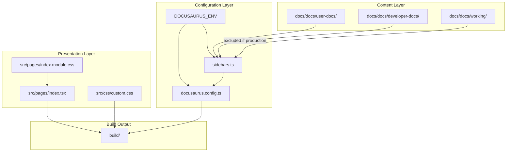
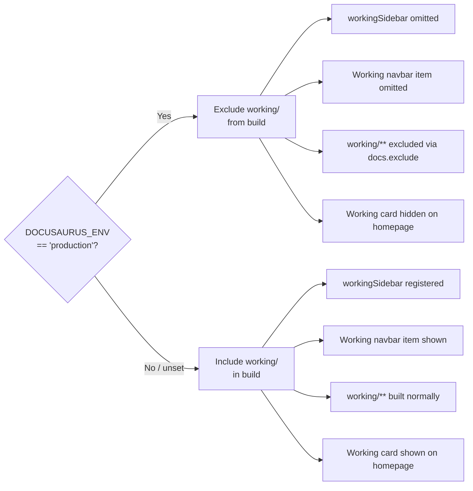

# As-Built: ASH Workbench Documentation Site

## Overview

The ASH Workbench documentation site is a Docusaurus v3.9.2 static site that serves three distinct audiences through separate navigation sections: end users, developers/contributors, and the development team (ephemeral working documents). The site uses a single docs plugin with three autogenerated sidebars, meaning new pages are picked up automatically when a markdown file is dropped into the correct directory -- zero configuration changes required.

The site lives at `workbench/docs/` within the ASH monorepo. It was built from the Docusaurus classic template, then overhauled: all template placeholders were replaced, the blog was disabled, Mermaid diagram support was added, a custom homepage was created, and an environment-variable-based system was implemented to exclude working documents from production builds.

## Architecture

### Core Design Decision: Single Plugin, Three Sidebars

The site uses one `@docusaurus/plugin-content-docs` instance (via the `classic` preset) with three autogenerated sidebars, rather than three separate plugin instances. This was chosen because:

- Simpler configuration (one `sidebars.ts`, one content directory)
- Easy cross-linking between sections (relative file paths work naturally)
- All content shares the `/docs/` URL prefix, which is an acceptable tradeoff

The alternative (multi-instance plugins with separate URL prefixes like `/user-docs/`, `/dev-docs/`) was evaluated and rejected for this stage. See `docs/docs/working/docs/docs-research.md:66-72` for the full comparison.

### Data Flow



### Production Filtering Mechanism

The `DOCUSAURUS_ENV` environment variable controls whether working docs appear:



This is implemented across four files, all keyed off the same `isProduction` constant:
- `docusaurus.config.ts:5` -- defines `isProduction`
- `docusaurus.config.ts:47` -- conditionally adds `exclude: ['working/**']` to docs plugin
- `docusaurus.config.ts:80-85` -- conditionally spreads Working navbar item
- `sidebars.ts:2,8-10` -- conditionally includes `workingSidebar`
- `src/pages/index.tsx:33-36` -- filters Working card from homepage via `customFields.isProduction`

## File Inventory

### Configuration Files

| File | Responsibility |
|---|---|
| `docs/docusaurus.config.ts` | Main site config: metadata, navbar, footer, presets, themes, production filtering |
| `docs/sidebars.ts` | Sidebar definitions: three autogenerated sidebars from `dirName` |
| `docs/package.json` | Dependencies and build scripts |
| `docs/tsconfig.json` | TypeScript config (extends `@docusaurus/tsconfig`, editor experience only) |
| `docs/.gitignore` | Excludes `node_modules/`, `build/`, `.docusaurus/`, cache files |

### React Source (Presentation)

| File | Responsibility |
|---|---|
| `docs/src/pages/index.tsx` | Custom homepage: hero banner + three card links to doc sections |
| `docs/src/pages/index.module.css` | Homepage-specific styles (hero, cards, layout) |
| `docs/src/css/custom.css` | Global CSS overrides for Infima framework (color palette, code highlighting) |

### Content: User Docs

| File | Responsibility |
|---|---|
| `docs/docs/user-docs/README.md` | Section overview / landing page for User Docs sidebar |

No subcategories or content pages exist yet. This section has only the seed overview.

### Content: Developer Docs

| File | Responsibility |
|---|---|
| `docs/docs/developer-docs/README.md` | Section overview / landing page for Developer Docs sidebar |

No subcategories or content pages exist yet. This section has only the seed overview.

### Content: Working Docs

| File | Responsibility |
|---|---|
| `docs/docs/working/README.md` | Section overview explaining purpose of working docs |
| `docs/docs/working/_category_.json` | Category metadata: label "Working", position 3 |
| `docs/docs/working/docs/_category_.json` | Subcategory metadata: label "Docs", position 1 |
| `docs/docs/working/docs/docs-research.md` | Architectural research for the documentation system design |
| `docs/docs/working/docs/docusaurus-config-plan.md` | Implementation plan (6 phases) for the Docusaurus configuration |
| `docs/docs/working/docs/dev-docs-skill-guidance.md` | AI skill guidance for writing developer documentation |
| `docs/docs/working/docs/user-docs-skill-guidance.md` | AI skill guidance for writing user documentation |
| `docs/docs/working/docs/as-built.md` | This document |

### Static Assets

| File | Responsibility |
|---|---|
| `docs/static/img/logo.svg` | Site logo (Octocat-style SVG, displayed in navbar) |
| `docs/static/img/favicon.ico` | Browser tab favicon |
| `docs/static/.nojekyll` | Prevents GitHub Pages from processing with Jekyll |

### AI Skills (Doc Authoring)

| File | Responsibility |
|---|---|
| `.claude/skills/dev-docs/SKILL.md` | Claude Code skill for writing/updating developer docs |
| `.claude/skills/user-docs/SKILL.md` | Claude Code skill for writing/updating user docs |

### Stock Template README

| File | Responsibility |
|---|---|
| `docs/README.md` | Docusaurus stock template README (yarn commands, not project-specific) |

## Implementation Details

### `docusaurus.config.ts` (122 lines)

The main configuration file. Key sections:

**Metadata** (`docs/docusaurus.config.ts:7-20`):
- `title: 'ASH Workbench'`, `tagline: 'Automated Security Helper Workbench'`
- `url: 'https://github.com'` -- placeholder, not yet set for deployment
- `baseUrl: '/'` -- will change to `'/<repo-name>/'` for GitHub Pages
- `organizationName: 'awslabs'`, `projectName: 'automated-security-helper'`
- `onBrokenLinks: 'warn'` -- lenient during development, should tighten to `'throw'` for production

**Future compatibility** (`docs/docusaurus.config.ts:12-14`):
- `future: { v4: true }` -- opts into Docusaurus v4 forward-compatible behavior

**Mermaid** (`docs/docusaurus.config.ts:29-33`):
- `markdown: { mermaid: true }` enables Mermaid parsing in markdown
- `themes: ['@docusaurus/theme-mermaid']` loads the Mermaid renderer

**Production filtering** (`docs/docusaurus.config.ts:5,36-37,47,80-85`):
- `isProduction` constant reads `process.env.DOCUSAURUS_ENV === 'production'`
- Passed to client via `customFields: { isProduction }` for React component access
- Conditionally excludes `working/**` from docs build
- Conditionally includes/excludes Working navbar item using array spread

**Preset options** (`docs/docusaurus.config.ts:39-55`):
- Classic preset with docs plugin, blog disabled (`blog: false`)
- `editUrl` points to the correct GitHub tree path for "Edit this page" links
- Custom CSS loaded from `./src/css/custom.css`

**Navbar** (`docs/docusaurus.config.ts:61-91`):
- Logo + title "ASH Workbench"
- Three `docSidebar` items: User Docs, Developer Docs, Working (conditional)
- GitHub link on the right

**Footer** (`docs/docusaurus.config.ts:93-114`):
- Dark style, two columns: Documentation links (User/Developer Docs) and Project (GitHub)
- Dynamic copyright year

**Syntax highlighting** (`docs/docusaurus.config.ts:115-118`):
- Prism themes: `github` for light mode, `dracula` for dark mode

**Color mode** (`docs/docusaurus.config.ts:58-60`):
- `respectPrefersColorScheme: true` -- follows OS dark/light preference

### `sidebars.ts` (13 lines)

Minimal file. Defines three autogenerated sidebars, each pointing to a `dirName`:

- `userDocsSidebar` -> `user-docs/`
- `developerDocsSidebar` -> `developer-docs/`
- `workingSidebar` -> `working/` (conditionally included based on `isProduction`)

The autogenerated sidebar mechanism means:
- Every `.md` file in the target directory becomes a sidebar item
- Every subdirectory becomes a collapsible category
- Items sort by `sidebar_position` frontmatter (ascending), then alphabetically by filename
- `_category_.json` files control category labels and positions
- `README.md` files become clickable category indices

### Homepage (`src/pages/index.tsx`, 62 lines)

Custom React component replacing the stock Docusaurus template. Structure:

1. **Data**: `allSections` array defines three cards (User Docs, Developer Docs, Working) with title, route, and description
2. **Filtering**: In production, the Working card is filtered out using `siteConfig.customFields.isProduction`
3. **Layout**: Hero banner (title + tagline) above a responsive 3-column card grid
4. **Routing**: Each card links to its section's Overview page via `<Link to={...}>`

### Homepage CSS (`src/pages/index.module.css`, 20 lines)

Four CSS classes:
- `.heroBanner` -- centered header with vertical padding
- `.subtitle` -- tagline styling using Infima emphasis color
- `.sections` -- flexbox centering for the card row
- `.card` -- bordered, rounded card containers with full height

### Global CSS (`src/css/custom.css`, 30 lines)

Overrides Infima CSS variables for the site's color palette:
- Light mode primary: `#2e8555` (green)
- Dark mode primary: `#25c2a0` (teal)
- Code font size: 95%
- Highlighted code line backgrounds for both modes

These are the stock Docusaurus template colors and have not been customized for ASH branding.

### Content Convention: Frontmatter

Three frontmatter patterns are used:

**Top-level section README.md** (e.g., `user-docs/README.md`):
```yaml
---
title: Overview
sidebar_label: Overview
sidebar_position: 1
---
```

**Subdirectory category index README.md** (e.g., `working/README.md` acts this way for its category):
```yaml
---
title: Overview
---
```

**Regular content pages** (e.g., `docs-research.md`):
```yaml
---
title: docs-research
---
```

### AI Documentation Skills

Two Claude Code skills automate documentation authoring:

**`/dev-docs`** (`.claude/skills/dev-docs/SKILL.md`, 204 lines):
- Triggered by developer documentation requests
- Enforces search-first workflow: must search existing docs before creating new files
- Supports four actions: update, augment, consolidate, or create
- Consolidation threshold: 6-8 files in a flat directory signals grouping is overdue
- Document template: intro, How It Works, Usage, Extending/Maintaining, Known Issues, References
- 11-item verification checklist

**`/user-docs`** (`.claude/skills/user-docs/SKILL.md`, 195 lines):
- Triggered by user documentation requests (default when audience is unspecified)
- Same search-first workflow as dev-docs
- Loads detailed guidance from `docs/docs/working/docs/user-docs-skill-guidance.md` at Step 0
- Document template: intro, Getting Started, Configuration, Tips, Troubleshooting, Related Features
- Product terminology dictionary (ASH, ASH Workbench, scan, finding, scanner, severity, suppression, actionable finding)
- 14-item verification checklist

Both skills share the same anti-sprawl philosophy: augment existing docs before creating new ones, consolidate related scattered pages into categories, and never modify `sidebars.ts` or `docusaurus.config.ts`.

### Working Docs Guidance Documents

Two detailed guidance documents exist to serve as authoritative references for the AI skills:

**`dev-docs-skill-guidance.md`** (~400 lines): Complete specification for developer doc authoring. Covers project context, search-first workflow, file placement, naming rules, frontmatter conventions, document structure template, cross-linking, Mermaid diagrams, code snippets, admonitions, writing style, anti-patterns, and a 12-item pre-flight checklist. Includes a complete example page.

**`user-docs-skill-guidance.md`** (~440 lines): Complete specification for user doc authoring. Covers product context (ASH scanner ecosystem), documentation system overview, search-first workflow with consolidation example, file placement, naming, frontmatter, content structure template, proposed directory structure (getting-started, scanning, results, configuration, scanners, integrations, troubleshooting), writing style rules, Mermaid diagrams, Docusaurus features (admonitions, tabs, titled code blocks), and a checklist.

## Patterns and Conventions

### Self-Organizing Sidebar

The autogenerated sidebar is the central design pattern. Adding a page requires only:
1. Create a `.md` file in the right directory
2. Add `title` frontmatter
3. Done

Adding a sub-section requires:
1. Create a subdirectory with `_category_.json` (label, position)
2. Optionally add `README.md` as category index
3. Add content files

No config files are touched. This enables both humans and AI agents to add documentation with minimal knowledge of the system.

### Environment-Based Build Filtering

The `DOCUSAURUS_ENV` variable is checked in three places (config, sidebars, homepage component) via a shared `isProduction` constant. The pattern is:
- Node.js config files read `process.env.DOCUSAURUS_ENV` directly
- Client-side React components access it via `siteConfig.customFields.isProduction`
- Each conditional uses the spread operator to add or omit items from arrays/objects

### Search-First Documentation Workflow

Both doc-authoring skills enforce a search-before-write pattern. The decision tree is: update > augment > consolidate > create (in preference order). This prevents documentation sprawl where AI-authored docs accumulate as disconnected pages.

### File Naming

- **Kebab-case** for all content filenames
- **README.md** (uppercase) for category indices
- **`_category_.json`** for sidebar category metadata
- No spaces, underscores, or camelCase

## Configuration and Environment

### Environment Variables

| Variable | Purpose | Values |
|---|---|---|
| `DOCUSAURUS_ENV` | Controls working docs inclusion | `'production'` to exclude working docs; any other value or unset to include them |

### Build Commands

| Command | Purpose |
|---|---|
| `npm run start` | Dev server with hot reload (includes working docs) |
| `npm run build` | Production build to `build/` (includes working docs unless `DOCUSAURUS_ENV=production`) |
| `npm run serve` | Serve production build locally |
| `npm run clear` | Clear `.docusaurus/` cache |
| `npm run typecheck` | TypeScript validation |

### Dependencies

| Package | Version | Purpose |
|---|---|---|
| `@docusaurus/core` | 3.9.2 | Docusaurus framework |
| `@docusaurus/preset-classic` | 3.9.2 | Classic preset (docs plugin, theme, etc.) |
| `@docusaurus/theme-mermaid` | ^3.9.2 | Mermaid diagram rendering |
| `@mdx-js/react` | ^3.0.0 | MDX support for React in markdown |
| `clsx` | ^2.0.0 | CSS class composition utility |
| `prism-react-renderer` | ^2.3.0 | Code syntax highlighting |
| `react` / `react-dom` | ^19.0.0 | UI framework |
| `typescript` | ~5.6.2 | Type checking (devDep) |

### Engine Requirements

- Node.js >= 20.0

## Integration Points

### Monorepo Context

The docs site at `workbench/docs/` is one component of the `workbench/` directory alongside the VS Code extension at `workbench/ash-workbench/`. The docs will document the extension's features, architecture, and usage.

### GitHub Integration

- `editUrl` in `docusaurus.config.ts:45-46` points to `https://github.com/awslabs/automated-security-helper/tree/main/workbench/docs/` enabling "Edit this page" links on every doc page
- GitHub link in navbar and footer
- `.nojekyll` in `static/` prevents GitHub Pages Jekyll processing

### Claude Code Skills

The `.claude/skills/` directory contains two skills that target this documentation system. They are the primary mechanism for AI-assisted doc authoring and enforce all conventions documented in the working docs guidance files.

### Parent ASH Project

The docs site documents the ASH Workbench extension but references the parent ASH tool (at the repo root). User docs should link to the parent project's README for CLI-specific documentation rather than duplicating it.

## Maintenance and Gotchas

### Production Filtering is Implemented in Four Places

The working-docs exclusion touches `docusaurus.config.ts` (lines 5, 47, 80-85), `sidebars.ts` (lines 2, 8-10), and `src/pages/index.tsx` (lines 33-36). If you add a new surface that shows working docs (e.g., a footer link, a search result), you must also add a production check there. Missing one location will leak working docs into production builds.

### `onBrokenLinks` is Set to `'warn'`, Not `'throw'`

During early development, broken links only produce warnings, not build failures (`docusaurus.config.ts:22`). This should be tightened to `'throw'` before deploying to production. Until then, broken cross-links after moving files will not fail the build -- they'll only appear as warnings in build output that are easy to miss.

### `url` and `baseUrl` Are Placeholders

`url` is set to `'https://github.com'` and `baseUrl` is `'/'` (`docusaurus.config.ts:16-17`). These must be updated before GitHub Pages deployment. For a project site, `baseUrl` will likely need to be `'/<repo-name>/'`.

### `docs/README.md` is Stock Template Content

The `README.md` at the Docusaurus project root (`docs/README.md`) still contains the stock Docusaurus template text with `yarn` commands. It references `yarn` while the project uses `npm`. This file is not built into the site -- it's only visible in the GitHub file browser.

### No `_category_.json` at Top-Level Sections

The `user-docs/` and `developer-docs/` directories have no `_category_.json` files. They don't need them because each has its own sidebar via the `dirName` directive in `sidebars.ts`. The sidebar label comes from the navbar item, not from a category file. Only subdirectories within these sections need `_category_.json`.

### CSS Colors Are Still Template Defaults

The Infima color variables in `src/css/custom.css` are the stock Docusaurus template values (green light mode, teal dark mode). They have not been customized for ASH project branding.

### Logo is a Decorative SVG, Not ASH Branding

The `static/img/logo.svg` is a decorative SVG from the Docusaurus template (a green notepad/plant character). It should be replaced with actual ASH or AWS branding before production deployment.

### The Homepage Uses `customFields` to Bridge Server/Client

The `isProduction` flag is a Node.js value (`process.env`). React components can't access `process.env` directly in Docusaurus. The bridge is `customFields` in `docusaurus.config.ts:35-37`, accessed via `useDocusaurusContext()` in `index.tsx:33`. If you need production awareness in another React component, use this same pattern -- do not try to read `process.env` directly.

### Working Docs Guidance Files Are the Source of Truth

The skill files (`.claude/skills/dev-docs/SKILL.md` and `.claude/skills/user-docs/SKILL.md`) are concise operational workflows. The detailed guidance documents (`docs/docs/working/docs/dev-docs-skill-guidance.md` and `user-docs-skill-guidance.md`) are the authoritative references. If the skill file and guidance file conflict, the guidance file wins. The user-docs skill explicitly loads its guidance file as Step 0.

## Testing

### No Unit Tests

Docusaurus configuration is validated by the build process itself. There are no unit tests, integration tests, or e2e tests for the docs site.

### Validation Method

| What to validate | How |
|---|---|
| Config loads correctly | `npm run start` -- site starts without errors |
| All three sidebars work | Navigate via navbar, confirm Overview page in each section |
| Mermaid renders | Add a `mermaid` fenced block to any doc and view in browser |
| Production filtering works | `DOCUSAURUS_ENV=production npm run build && npm run serve` -- Working section absent |
| No broken links | `npm run build` -- check for warnings (currently `warn` level) |
| Homepage renders | Visual inspection at `/` |

## Key Takeaways

1. **Single plugin, three sidebars** -- all content lives under `docs/docs/` with autogenerated sidebars from `dirName`. No multi-instance complexity.
2. **Zero-config page addition** -- drop a `.md` file with `title` frontmatter in the right directory. That's it.
3. **Production filtering is spread across four files** -- `docusaurus.config.ts`, `sidebars.ts`, and `index.tsx` all check `isProduction`. Keep them in sync.
4. **`url` and `baseUrl` are placeholders** -- must be set before deployment.
5. **`onBrokenLinks: 'warn'`** -- tighten to `'throw'` before going live.
6. **Two AI skills enforce documentation conventions** -- `/dev-docs` and `/user-docs` implement a search-first, consolidate-before-create workflow.
7. **Guidance docs are the source of truth** -- the skill files defer to `dev-docs-skill-guidance.md` and `user-docs-skill-guidance.md` for detailed conventions.
8. **CSS and logo are template defaults** -- need branding before production.
9. **Stock README.md at project root** -- references `yarn`, project uses `npm`.
10. **Content sections are seeded but empty** -- User Docs and Developer Docs each have only a README.md overview page. All real content is still to be written.
