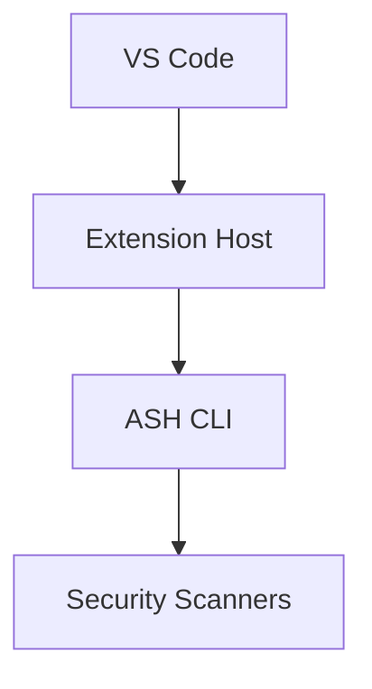

# Developer Documentation Skill Guidance

This document provides complete instructions for an AI assistant (Claude Code skill) to write developer documentation for the **ASH Workbench** project. Follow these instructions exactly when creating or updating developer-facing documentation.

## Project Context

**ASH (Automated Security Helper)** is an open-source AWS security scanning tool. **ASH Workbench** is a VS Code extension that provides IDE integration for ASH. The documentation site is built with Docusaurus v3.9.2 and lives inside a monorepo:

```
automated-security-helper/
  workbench/
    ash-workbench/       # VS Code extension source (TypeScript)
    docs/                # Docusaurus project root
      docs/              # Content directory
        developer-docs/  # <-- Developer documentation goes here
        user-docs/       # End-user documentation (not your concern)
        working/         # Ephemeral research/planning docs
      docusaurus.config.ts
      sidebars.ts
      src/               # React source (homepage, components)
      static/            # Static assets
```

The extension source code you will be documenting lives at:
- `workbench/ash-workbench/src/` — TypeScript extension source
- `workbench/ash-workbench/package.json` — Extension manifest and contributions

The parent ASH tool (Python CLI with scanners like Bandit, Semgrep, Checkov, cfn_nag, Grype, etc.) lives at the repository root. Developer docs may reference this but should focus on the Workbench extension.

## Before You Write: Search for Existing Documentation

:::danger CRITICAL — DO THIS FIRST
Never create a new document without first searching for existing documentation on the same topic or a closely related one. Documentation sprawl — many small, overlapping pages scattered across the tree — is the single biggest threat to documentation quality. Your default action should be to **augment what exists**, not create something new.
:::

### Step 1: Search the existing docs tree

Before writing anything, search the entire `workbench/docs/docs/developer-docs/` directory (and its subdirectories) for documentation that already covers your topic or a closely related one. Search by:

- **Filename**: Look for files whose names relate to your topic (e.g., if you're documenting the scanner integration, search for `scan`, `scanner`, `integration`).
- **Content**: Grep within existing `.md` files for key terms, class names, module names, or concepts you plan to document.
- **Section headings**: Scan the `## ` headings in existing docs — your topic might already be a section inside a broader document.

### Step 2: Decide your action

Based on what you find, choose **one** of these paths — listed in order of preference:

| What you find | Action |
|---|---|
| **An existing doc covers this topic** | **Update that doc.** Add missing information, correct outdated content, or expand thin sections. Do not create a second page. |
| **An existing doc covers a parent/sibling topic and your content is a natural subsection** | **Add a section to that doc.** For example, if `command-registration.md` exists and you're documenting a new command, add it as a section there rather than creating a separate file. |
| **Multiple existing standalone docs are related to your topic, forming an emerging theme** | **Consolidate into a subdirectory.** Create a new subdirectory, move the related existing docs into it, add `_category_.json` and `README.md`, and then add your new content as a page in that subdirectory. See [Consolidating related docs into a section](#consolidating-related-docs-into-a-section) below. |
| **No existing doc relates to your topic** | **Only then create a new page.** Follow the instructions in [Where to Write Files](#where-to-write-files). |

### Step 3: When updating an existing doc

- Preserve the existing structure and voice. Don't rewrite sections that don't need it.
- Add your content in the section where it logically belongs. If no existing section fits, add a new `##` section in the appropriate position per the [Document Structure Template](#document-structure-template).
- Update the `title` or frontmatter only if the scope of the document has genuinely changed.
- If the document grows beyond ~300 lines after your additions, that is the signal to split — but split by extracting sections into a subdirectory (consolidation), not by leaving a bloated doc and also creating a new one.

### Consolidating related docs into a section

When you find two or more standalone files in `developer-docs/` that share a theme (e.g., `command-registration.md`, `command-palette.md`, and you're about to create `command-keybindings.md`), consolidate them:

1. **Create the subdirectory**: `developer-docs/<theme>/`
2. **Add `_category_.json`** with an appropriate label and position.
3. **Add `README.md`** with `title: Overview` that briefly introduces the theme and links to the pages within.
4. **Move the existing files** into the subdirectory. Do not change their filenames unless they need to be disambiguated.
5. **Update any cross-links** in other documents that pointed to the old file paths. Search the entire `docs/docs/` tree for references to the moved files and fix them.
6. **Add your new page** to the subdirectory.

This is the primary mechanism for evolving the documentation from a flat list of pages into a well-organized hierarchy. It should happen naturally and frequently as the documentation grows. A flat directory with more than ~6-8 files is a strong signal that consolidation is overdue.

:::warning
When moving files, always search for and update all cross-links that reference the old paths. A broken internal link will fail the Docusaurus build.
:::

### Why this matters

Documentation written by AI agents tends toward sprawl: each task creates a new file, and over time the docs become a flat pile of overlapping pages with no coherent structure. The search-first workflow prevents this by:

- **Keeping related information together** so readers find everything in one place
- **Evolving structure organically** — subdirectories emerge when a theme accumulates enough pages, not as upfront guesses
- **Preventing contradictions** — two docs covering the same topic will inevitably diverge and confuse readers
- **Reducing maintenance burden** — fewer, richer documents are easier to keep current than many thin ones

## Where to Write Files

All developer documentation goes under this absolute path within the repo:

```
workbench/docs/docs/developer-docs/
```

This maps to the URL path `/docs/developer-docs/...` on the built site and appears under the "Developer Docs" navbar section with its own sidebar.

### Adding a page to an existing section

Create the file directly in the appropriate subdirectory:

```
workbench/docs/docs/developer-docs/<subdirectory>/<kebab-case-filename>.md
```

No other files need to change. The autogenerated sidebar picks it up automatically.

### Creating a new section (subdirectory)

When the topic doesn't fit an existing subdirectory, create a new one. You must create **three files**:

1. **The directory itself** with a `_category_.json`:

```
workbench/docs/docs/developer-docs/<new-section>/
```

2. **`_category_.json`** — controls how the section appears in the sidebar:

```json
{
  "label": "Human-Readable Section Name",
  "position": <integer>,
  "collapsible": true,
  "collapsed": true
}
```

Choose a `position` value that places the section logically among its siblings. Lower numbers appear first. Check existing `_category_.json` files in sibling directories to avoid collisions.

3. **`README.md`** — the section overview page (becomes the clickable category index):

```yaml
---
title: Overview
---
```

Then add your content `.md` files to the directory.

## File Naming Rules

- **Kebab-case** for all filenames: `system-overview.md`, `getting-started.md`, `extension-host-api.md`
- **README.md** (uppercase) for category overview/index pages only
- **`_category_.json`** (exact casing) for directory metadata
- Never use spaces, underscores, or camelCase in filenames

## Required Frontmatter

Every markdown file must have YAML frontmatter. The minimum is:

```yaml
---
title: Human-Readable Page Title
---
```

### For regular pages (optional positioning)

```yaml
---
title: Extension Architecture
sidebar_position: 2
---
```

If `sidebar_position` is omitted, pages sort alphabetically by filename. This is acceptable for most content. Only set `sidebar_position` when ordering matters (e.g., a sequential guide).

### For top-level section overview (developer-docs/README.md)

```yaml
---
title: Overview
sidebar_label: Overview
sidebar_position: 1
---
```

### For subdirectory category indices (README.md inside a subdirectory)

```yaml
---
title: Overview
---
```

No `sidebar_position` needed — the category index is inherently the cover page.

## Document Structure Template

Every developer doc page should follow this structure. Omit sections that don't apply, but preserve the ordering of those that remain:

```markdown
---
title: <Topic Name>
---

# <Topic Name>

Brief orientation: what this is and why it exists. One to three sentences.

## How It Works

Concise explanation of the implementation. Include code snippets where helpful.
Reference source files using relative paths from the repo root:
`workbench/ash-workbench/src/someModule.ts`

## Usage

How to use or interact with this from a developer perspective. Include examples.

## Extending / Maintaining

What a developer needs to know to modify this component. Key files, patterns,
gotchas, and dependencies.

## Known Issues

Current limitations, workarounds, planned improvements.
Omit this section entirely if there are no known issues.

## References

Links to related docs (use relative file paths for internal links), external
resources, and relevant source files.
```

### Section guidelines

- **How It Works**: Focus on the "why" and "how", not line-by-line code walkthroughs. Use code snippets to illustrate key patterns, not to reproduce entire files. Reference source file paths so the reader can find the full implementation.
- **Usage**: Provide concrete examples. Show commands, configuration, or code a developer would actually write.
- **Extending / Maintaining**: This is the most valuable section for developer docs. Call out non-obvious coupling, ordering dependencies, and places where changes have ripple effects.
- **Known Issues**: Be specific. Link to GitHub issues when they exist.
- **References**: Use relative file path links for internal cross-references so Docusaurus validates them at build time.

## Cross-Linking

Use relative file path references for links between documentation pages. Docusaurus validates these at build time:

```markdown
See the [Installation Guide](../user-docs/getting-started/installation.md) for setup instructions.
```

Do NOT use absolute URL paths like `/docs/user-docs/...` — these bypass build-time link validation.

## Diagrams

Use **Mermaid** for all diagrams (architecture, flow charts, sequence diagrams, state machines, ER diagrams). Mermaid renders natively in Docusaurus, is version-controllable as text, and is easy to maintain.

````markdown

````

Do not use static images for diagrams unless the diagram cannot be represented in Mermaid (e.g., screenshots of UI). If a static image is necessary, place it in `workbench/docs/static/img/developer-docs/` and reference it as `/img/developer-docs/<filename>.png`.

## Code Snippets

- Use fenced code blocks with language identifiers: ` ```typescript `, ` ```json `, ` ```bash `
- Keep snippets focused — show the relevant 5-20 lines, not entire files
- When referencing source files, include the repo-relative path: `workbench/ash-workbench/src/extension.ts`
- Use `// highlight-next-line` or `// highlight-start` / `// highlight-end` comments for Docusaurus line highlighting when drawing attention to specific lines

## Admonitions

Use Docusaurus admonitions for callouts:

```markdown
:::note
Supplementary information the reader might find useful.
:::

:::tip
Advice for best practices or shortcuts.
:::

:::warning
Something that could cause problems if ignored.
:::

:::danger
Something that will cause data loss, security issues, or breaking changes.
:::

:::info
General context or background information.
:::
```

Use admonitions sparingly. If every other paragraph is an admonition, none of them stand out.

## Writing Style

- **Audience**: Developers contributing to or extending ASH Workbench. Assume TypeScript/VS Code extension development familiarity.
- **Tone**: Direct, technical, concise. No filler phrases ("In this document we will explore..."). Get to the point.
- **Voice**: Second person ("you") or imperative ("Run the command"). Avoid first person ("I", "we").
- **Tense**: Present tense for descriptions ("The extension activates when..."), imperative for instructions ("Install the dependency").
- **Length**: Prefer shorter documents that cover one topic well over long documents that cover many topics superficially. If a document exceeds ~300 lines, consider splitting it.
- **Jargon**: Use technical terms without over-explaining them. Define project-specific terms (e.g., "scan profile", "finding") on first use.
- **No fluff**: Do not add introductory paragraphs that restate the title. Do not add concluding summaries. Do not add sections with no real content ("This section is TBD").

## What NOT to Do

- Do not create a new file without first searching existing docs for overlapping content — update or consolidate instead
- Do not leave a flat directory with more than ~6-8 files without considering consolidation into subdirectories
- Do not move files into subdirectories without searching for and updating all cross-links that reference the old paths
- Do not write files outside of `workbench/docs/docs/developer-docs/` (or its subdirectories) for developer documentation
- Do not modify `sidebars.ts` or `docusaurus.config.ts` — the autogenerated sidebar handles new pages automatically
- Do not create `.mdx` files unless React components are genuinely needed in the page — plain `.md` is preferred
- Do not add blog posts — the blog is disabled
- Do not duplicate content that exists in `user-docs/` — cross-link to it instead
- Do not include `working/` content in developer docs — working docs are ephemeral and excluded from production builds
- Do not add empty placeholder pages or sections with "TODO" content. Only create pages that have real content.
- Do not add images to `docs/docs/` — static assets go in `docs/static/img/`

## Pre-Flight Checklist

Before considering a developer doc complete, verify:

1. You searched existing docs for overlapping content and confirmed a new file is warranted (not an update to an existing doc)
2. If related standalone docs exist, you consolidated them into a subdirectory and updated all cross-links
3. The file is in `workbench/docs/docs/developer-docs/` or a subdirectory thereof
4. The file has valid YAML frontmatter with at least a `title` field
5. The filename is kebab-case with a `.md` extension
6. If a new subdirectory was created, it has both `_category_.json` and `README.md`
7. All internal links use relative file paths (not absolute URL paths)
8. All diagrams use Mermaid (not static images) where possible
9. Code snippets have language identifiers on fenced blocks
10. The document follows the structure template (sections in correct order)
11. No empty or placeholder sections remain
12. The document reads clearly to a developer unfamiliar with the specific topic

## Example: Complete Developer Doc Page

```markdown
---
title: Extension Activation
sidebar_position: 1
---

# Extension Activation

The ASH Workbench extension activates when VS Code opens a workspace that
contains files ASH can scan. Activation is lazy — the extension does not load
until its activation events fire.

## How It Works

Activation events are declared in the extension manifest
(`workbench/ash-workbench/package.json`) under `activationEvents`. When VS Code
matches an activation event, it calls the `activate()` function exported from
`workbench/ash-workbench/src/extension.ts`.

The activation function:

1. Registers commands defined in `package.json` contributes
2. Initializes the ASH CLI connection
3. Sets up the results panel webview

` ``typescript
export function activate(context: vscode.ExtensionContext) {
  const scanCommand = vscode.commands.registerCommand(
    'ash-workbench.runScan',
    () => runSecurityScan(context)
  );
  context.subscriptions.push(scanCommand);
}
` ``

## Usage

To test activation during development:

1. Open the extension project in VS Code
2. Press F5 to launch the Extension Development Host
3. Open a workspace with scannable files
4. Run the "ASH: Run Security Scan" command from the command palette

## Extending / Maintaining

To add a new command:

1. Add the command ID to `contributes.commands` in `package.json`
2. Register it in `activate()` with `vscode.commands.registerCommand`
3. Add the handler implementation

:::warning
Commands registered outside of `activate()` will not be disposed when the
extension deactivates, causing memory leaks.
:::

## References

- [VS Code Extension Activation](https://code.visualstudio.com/api/references/activation-events)
- [Extension Manifest](../user-docs/getting-started/installation.md) for end-user setup
```

Note: The example above uses a space in the code fence closing (` `` `) to avoid rendering issues in this guidance document. In actual documentation, use standard triple backticks with no spaces.
