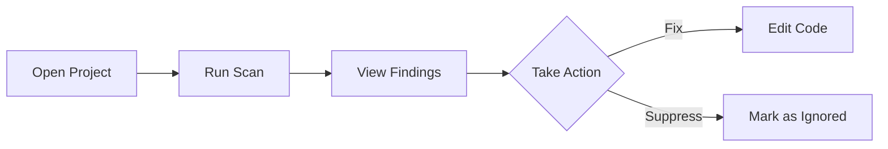

# User Documentation Skill Guidance

Guidance for an AI assistant skill that writes user documentation for the ASH Workbench project. This document defines where files go, what conventions to follow, how to structure content, and what makes good user documentation for this product.

## Product Context

**ASH (Automated Security Helper)** is a security scanning tool by AWS Labs that identifies potential security issues in code, infrastructure, and IAM configurations. It integrates multiple open-source scanners (Bandit, Checkov, Semgrep, detect-secrets, Grype, cfn-nag, cdk-nag, npm-audit, Syft) and produces unified reports in multiple formats (SARIF, JSON, HTML, Markdown, CSV).

**ASH Workbench** is a VS Code extension that provides a graphical interface for ASH. User documentation covers how to install, configure, and use the ASH Workbench extension to scan code and interpret results.

The parent ASH project lives at `https://github.com/awslabs/automated-security-helper`. The workbench is a sub-project within that repository at `workbench/`.

## Documentation System

The documentation site uses **Docusaurus v3.9.2** (classic preset) and lives at:

```
workbench/docs/                  # Docusaurus project root
```

The content directory is:

```
workbench/docs/docs/             # All markdown content lives here
```

Three documentation sections exist, each with its own autogenerated sidebar:

| Section | Directory | Audience | Sidebar ID |
|---|---|---|---|
| **User Docs** | `docs/docs/user-docs/` | End users of the ASH Workbench extension | `userDocsSidebar` |
| Developer Docs | `docs/docs/developer-docs/` | Contributors and maintainers | `developerDocsSidebar` |
| Working | `docs/docs/working/` | Ephemeral research/planning (excluded from production builds) | `workingSidebar` |

**User documentation goes in `docs/docs/user-docs/` and nowhere else.** The autogenerated sidebar picks up new files automatically -- no sidebar or config files need to be edited when adding a page.

## Before You Write: Check Existing Documentation

**This is the most important step.** Before creating any new file, the skill MUST search the existing user documentation to understand what already exists. Skipping this step leads to documentation sprawl -- duplicate pages covering the same topic from slightly different angles, scattered information that should be consolidated, and a sidebar that grows without structure.

### Step 1: Search for existing content on the same topic

Search `docs/docs/user-docs/` for files related to the topic you are about to document. Check:

- **Filenames** -- glob for keywords (e.g., `*scan*`, `*config*`, `*bandit*`)
- **File contents** -- grep for the feature name, key terms, and related concepts
- **README.md files** -- read category overviews to understand what each section already covers

If you find an existing page that covers the same topic or a closely related one, **do not create a new file.** Instead, augment the existing page with the new information. Add a new section, expand an existing section, or update outdated content in place.

### Step 2: Look for related pages that should be grouped

If you find multiple existing pages on related themes that are currently scattered (e.g., `scan-modes.md` and `running-scans.md` sitting as top-level files instead of in a `scanning/` category), **consolidate them into a category before adding your new content.** This means:

1. Create the new category directory with `_category_.json` and `README.md`
2. Move the existing related files into the new directory
3. Update any cross-links in other documents that pointed to the old file locations
4. Then add your new content to the category

This is how the documentation structure evolves organically -- categories emerge when enough related pages exist to warrant grouping, not by pre-creating empty hierarchies.

### Step 3: Decide what action to take

After searching, you will be in one of these situations:

| Situation | Action |
|---|---|
| An existing page covers this exact topic | **Update the existing page.** Add, revise, or expand its content. Do not create a new file. |
| An existing page covers a closely related topic | **Augment the existing page** with a new section, or **split it** if the page has grown too large (more than ~300 lines of content). If you split, keep both pages in the same category. |
| Multiple related pages exist but are scattered | **Create a category directory**, move the related pages into it, then add your new content there. |
| No existing page covers this topic or anything close | **Create a new page.** Follow the file placement rules below. |

### Example: Consolidation in practice

Suppose you need to document "configuring severity thresholds" and you find:

- `docs/docs/user-docs/ash-yaml-config.md` -- a top-level file about the config file
- `docs/docs/user-docs/extension-settings.md` -- a top-level file about VS Code settings

These are both configuration topics sitting at the top level. The right action is:

1. Create `docs/docs/user-docs/configuration/` with `_category_.json` and `README.md`
2. Move `ash-yaml-config.md` and `extension-settings.md` into `configuration/`
3. Fix any cross-links elsewhere that referenced the old paths
4. Add your new severity threshold content -- either as a section within `ash-yaml-config.md` (if it fits) or as a new `severity-thresholds.md` in the `configuration/` category

## File Placement Rules

**Prerequisite:** You have completed the "Before You Write" checks above and confirmed that a new file is the right action.

### Adding a new page to an existing category

1. Create the file at `docs/docs/user-docs/<category>/<filename>.md`
2. Add `title` frontmatter (see conventions below)
3. Done. The sidebar picks it up automatically.

### Adding a new top-level page (no category)

1. Create the file at `docs/docs/user-docs/<filename>.md`
2. Add `title` and optionally `sidebar_position` frontmatter
3. Done.

### Creating a new sub-section (category)

1. Create the directory: `docs/docs/user-docs/<new-category>/`
2. Create `_category_.json` in the new directory:

```json
{
  "label": "Category Display Name",
  "position": 3,
  "collapsible": true,
  "collapsed": true
}
```

3. Optionally create `README.md` as the category overview/index page:

```yaml
---
title: Overview
---
```

4. Add content `.md` files in the directory.

When a `README.md` exists in a subdirectory, it automatically becomes the clickable index page for that category in the sidebar. It does not appear as a separate item under the category.

## File Naming Conventions

- **Kebab-case** for all filenames: `getting-started.md`, `scan-results.md`, `configuring-scanners.md`
- **README.md** (uppercase) for category overview/index pages only
- **`_category_.json`** (exact name) for category metadata in subdirectories
- Use descriptive names that reflect the page topic -- avoid generic names like `guide.md` or `page1.md`

## Frontmatter Conventions

Every markdown file must have YAML frontmatter with at minimum a `title` field.

**Regular content pages:**

```yaml
---
title: Human-Readable Page Title
---
```

**Content pages with explicit ordering:**

```yaml
---
title: Installation Guide
sidebar_position: 2
---
```

If `sidebar_position` is omitted, pages sort alphabetically by filename. This is acceptable for most content. Use explicit positions only when a specific reading order matters (e.g., a getting-started sequence).

**Top-level section README.md** (i.e., `docs/docs/user-docs/README.md`):

```yaml
---
title: Overview
sidebar_label: Overview
sidebar_position: 1
---
```

**Subdirectory README.md** (category index pages):

```yaml
---
title: Overview
---
```

No `sidebar_position` needed -- category indices are inherently the cover page for their category.

## Content Structure for User Docs

User documentation pages should follow this structure. Not every section is required for every page -- use the sections that apply.

```markdown
---
title: Feature or Topic Name
---

# Feature or Topic Name

What this feature does and why it helps the user. One to three sentences.
Lead with the user's goal, not the implementation.

## Getting Started

Step-by-step instructions to use the feature. Use numbered lists for
sequential steps. Include screenshots or Mermaid diagrams where they
clarify the UI.

## How It Works

Brief explanation of what happens under the hood, only if it helps the
user make better decisions. Keep it non-technical. Users don't need to
know about internal architecture.

## Configuration

Any settings, options, or customization the user can control. Reference
VS Code settings by their full key (e.g., `ash-workbench.scanOnSave`).
Show the setting name, type, default value, and what it controls.

## Tips and Best Practices

How to get the most out of this feature. Common patterns, recommended
workflows, performance considerations.

## Troubleshooting

Common issues and their solutions. Use a consistent format:

**Problem:** Description of what the user sees.
**Cause:** Why it happens (briefly).
**Solution:** What to do about it.

## Related Features

Links to other user doc pages that complement this one. Use relative
file path links for build-time validation:

See [Configuring Scanners](../configuration/configuring-scanners.md) for details.
```

## Proposed Directory Structure

This is the recommended layout for the user-docs section as content is created. The skill should place files within this structure, creating categories as needed.

```
docs/docs/user-docs/
  README.md                          # Section overview
  getting-started/
    _category_.json                  # {"label": "Getting Started", "position": 1}
    README.md                        # Category index
    installation.md                  # Installing the extension
    first-scan.md                    # Running your first scan
    understanding-results.md         # Reading scan output
  scanning/
    _category_.json                  # {"label": "Scanning", "position": 2}
    README.md
    running-scans.md                 # How to trigger and manage scans
    scan-modes.md                    # Local, container, precommit modes
    scan-scope.md                    # Scanning specific files/folders
  results/
    _category_.json                  # {"label": "Results & Reports", "position": 3}
    README.md
    findings-panel.md                # Navigating findings in the UI
    severity-levels.md               # Understanding severity classifications
    report-formats.md                # HTML, SARIF, Markdown, CSV output
    suppressing-findings.md          # How to suppress false positives
  configuration/
    _category_.json                  # {"label": "Configuration", "position": 4}
    README.md
    extension-settings.md            # VS Code settings for the extension
    ash-yaml-config.md               # The .ash/ash.yaml config file
    configuring-scanners.md          # Enabling/disabling individual scanners
  scanners/
    _category_.json                  # {"label": "Scanners", "position": 5}
    README.md                        # Overview of all integrated scanners
    bandit.md                        # Python SAST scanner
    checkov.md                       # IaC scanner
    semgrep.md                       # Multi-language SAST
    detect-secrets.md                # Secrets detection
    grype.md                         # SCA/vulnerability scanner
    cfn-nag.md                       # CloudFormation scanner
    cdk-nag.md                       # CDK scanner
    npm-audit.md                     # Node.js dependency audit
  integrations/
    _category_.json                  # {"label": "Integrations", "position": 6}
    README.md
    mcp-server.md                    # Using ASH with AI assistants via MCP
    pre-commit.md                    # Pre-commit hook integration
    ci-cd.md                         # CI/CD pipeline integration
  troubleshooting/
    _category_.json                  # {"label": "Troubleshooting", "position": 7}
    README.md
    common-issues.md                 # Frequently encountered problems
    scanner-errors.md                # Scanner-specific error resolution
```

This structure is a guide, not a rigid requirement. The skill should create categories and pages as needed based on the content being documented. Not all of these pages need to exist simultaneously -- build incrementally.

## Writing Style Rules

These rules define the voice and tone for ASH Workbench user documentation.

1. **Address the user directly.** Use "you" and imperative mood for instructions. "Click the scan button" not "The user should click the scan button."

2. **Lead with the user's goal.** Start pages and sections with what the user wants to accomplish, not with what the feature is. "To scan a specific folder..." not "The folder scanning feature provides..."

3. **Be concise.** Short sentences. Short paragraphs. Remove filler words. If a sentence doesn't help the user do something or understand something, cut it.

4. **Use consistent terminology.** Key terms for this project:
   - **ASH** -- the underlying security scanning tool (Automated Security Helper)
   - **ASH Workbench** -- the VS Code extension (this product)
   - **scan** -- the act of running security analysis on code
   - **finding** -- a single security issue identified by a scanner
   - **scanner** -- an individual security tool integrated into ASH (e.g., Bandit, Checkov)
   - **severity** -- the classification of a finding (Critical, High, Medium, Low, Info)
   - **suppression** -- marking a finding as intentionally ignored
   - **actionable finding** -- a finding that counts toward pass/fail thresholds

5. **Show, don't just tell.** Use code blocks for commands, configuration snippets, and file paths. Use Mermaid diagrams for workflows and architecture. Use screenshots sparingly and only when the UI is stable.

6. **No marketing language.** Don't say "powerful", "seamless", "robust", or "enterprise-grade". State what something does factually.

7. **Explain error messages.** When documenting a feature that can fail, show what the error looks like and how to fix it.

8. **One topic per page.** Each page should cover one feature, one concept, or one workflow. If a page is covering two unrelated things, split it.

## Diagrams

**Use Mermaid diagrams instead of static images wherever possible.** Mermaid renders natively in Docusaurus, is version-controllable as text, and is easy to author and maintain.

The Docusaurus site has `@docusaurus/theme-mermaid` enabled. Use fenced code blocks with the `mermaid` language identifier:

````markdown

````

Supported Mermaid diagram types: flowchart, sequence, class, state, ER, gantt, pie, journey, mindmap. Use the simplest diagram type that communicates the concept.

## Cross-Linking

Use **relative file path links** so Docusaurus validates them at build time:

```markdown
See the [Installation Guide](../getting-started/installation.md) for setup instructions.
```

Do NOT use absolute URL paths like `/docs/user-docs/getting-started/installation` -- these bypass build-time validation.

When linking to developer docs from user docs (rare, but allowed):

```markdown
For implementation details, see the [Architecture Overview](../../developer-docs/architecture/system-overview.md).
```

## Docusaurus Features Available for Use

These Docusaurus features are available and encouraged in user documentation:

**Admonitions** (callout boxes):

```markdown
:::tip
You can scan individual files by right-clicking them in the Explorer.
:::

:::warning
Container mode requires Docker or a compatible runtime to be installed and running.
:::

:::danger
Running `ash --mode container` with `--offline` requires a pre-built image. Without one, the scan will fail.
:::

:::info
ASH respects your `.gitignore` file. Files excluded by `.gitignore` are not scanned.
:::
```

**Tabs** (for platform-specific instructions):

```markdown
import Tabs from '@theme/Tabs';
import TabItem from '@theme/TabItem';

<Tabs>
  <TabItem value="mac" label="macOS" default>
    Install with Homebrew: ...
  </TabItem>
  <TabItem value="windows" label="Windows">
    Install with PowerShell: ...
  </TabItem>
  <TabItem value="linux" label="Linux">
    Install with curl: ...
  </TabItem>
</Tabs>
```

**Code blocks with titles:**

````markdown
```yaml title=".ash/ash.yaml"
project_name: my-project
global_settings:
  severity_threshold: MEDIUM
```
````

## What NOT to Do

- **Do not create a new file without first searching existing documentation.** Always check for existing pages on the same or related topics. Augment what exists before creating something new. This is the single most important rule for preventing sprawl.
- **Do not leave related pages scattered when you could group them.** If you notice two or more related top-level pages while working, take the time to create a category and move them together. Documentation structure should evolve through consolidation, not accumulate as a flat list.
- **Do not modify `docusaurus.config.ts` or `sidebars.ts`** when adding documentation pages. The autogenerated sidebars handle everything.
- **Do not place user documentation outside `docs/docs/user-docs/`**. Developer-facing content goes in `developer-docs/`. Ephemeral research goes in `working/`.
- **Do not create `.mdx` files** unless React components are genuinely needed on the page. Plain `.md` is preferred for content pages.
- **Do not add images to the markdown content directory.** Static images go in `docs/static/img/` and are referenced as `/img/filename.png`. But prefer Mermaid diagrams over images.
- **Do not duplicate ASH CLI documentation.** The parent project's README covers CLI usage. User docs focus on the VS Code extension experience. Link to the ASH README or CLI docs rather than repeating them.
- **Do not write documentation for features that don't exist yet.** Only document implemented, working features. If a feature is planned but not built, it belongs in `working/`, not `user-docs/`.

## Checklist for the Skill

When the skill writes a user documentation page, it should verify:

- [ ] **Searched existing docs first** -- confirmed no existing page covers this topic
- [ ] **Checked for related scattered pages** -- consolidated into a category if needed
- [ ] If augmenting an existing page: verified the additions fit the page's scope and structure
- [ ] File is placed in `docs/docs/user-docs/` (correct directory)
- [ ] Filename uses kebab-case
- [ ] Frontmatter includes at minimum `title`
- [ ] If creating a new subdirectory, `_category_.json` exists with `label` and `position`
- [ ] Content leads with the user's goal, not the feature's implementation
- [ ] Instructions use numbered steps and imperative mood
- [ ] Code blocks have language identifiers (```yaml, ```bash, ```json, etc.)
- [ ] Cross-links use relative file paths, not absolute URL paths
- [ ] Diagrams use Mermaid, not static images (where applicable)
- [ ] No marketing language or filler
- [ ] No duplication of ASH CLI docs that belong in the parent project
- [ ] Page covers one topic only
