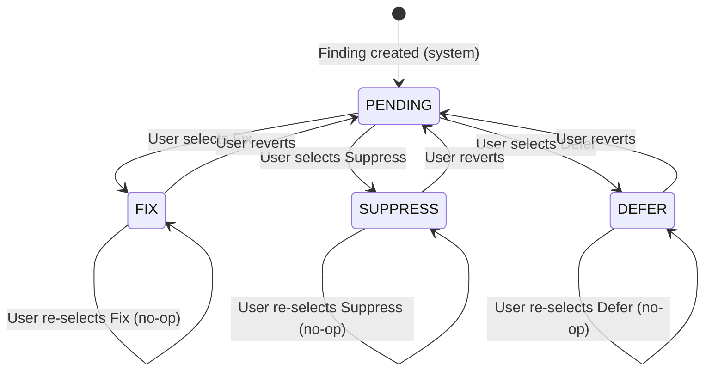

# Functional Specification Research: Best Practice Guidance for AI-Consumable Specifications

Deep analysis of the ASH Workbench functional design document and synthesis of best practice guidance for writing functional specifications that are optimized for both human review and AI-driven implementation. This research is the foundation for a skill that teaches AI agents how to write functional specifications.

## Overview

A functional specification defines **what** a system does and **what the user experiences**, without prescribing **how** it is built. When an AI agent reads a functional spec, it must extract enough information to: (1) understand the product's purpose and boundaries, (2) generate a correct technical design, (3) produce implementation code that matches the described behavior, and (4) write tests that verify the behavior. The quality of every downstream artifact -- technical design, implementation plan, code, tests -- is bounded by the quality and precision of the functional spec.

This document analyzes the ASH Workbench functional design (`docs/docs/developer-docs/architecture/software-design-specification/functional-design.md`) as a reference specimen, identifies what it does well, what it could improve, and synthesizes transferable best practices for any project.

---

## Architecture of the Example Document

### Structural Inventory

The ASH Workbench functional design uses nine top-level sections:

| # | Section | Purpose | Lines |
|---|---------|---------|-------|
| 1 | POC Scope | Boundaries: what's in, what's out, exit criteria | ~60 |
| 2 | User Stories | Prioritized user-facing requirements | ~35 |
| 3 | Data Model | Entity definitions, relationships, state machines | ~60 |
| 4 | Feature Specifications | Detailed behavior per feature | ~155 |
| 5 | UI Architecture | Layout, information flow, communication protocol | ~110 |
| 6 | Technical Integration | External system interfaces (CLI, database, WebView) | ~40 |
| 7 | Interaction Flows | End-to-end sequence diagrams for key workflows | ~140 |
| 8 | Future Roadmap | Ordered post-POC feature plan | ~30 |
| 9 | Outstanding Questions | Unresolved decisions requiring human input | ~15 |

**Document header** includes a one-paragraph description and three explicit design principles (KISS, YAGNI, Progressive foundation).

### How the Example Document Relates to Its Ecosystem

The functional design is one document in a three-document specification system:

```
README.md (Overview)        -- What the product is, 30-second context
functional-design.md        -- What it does, user experience, data model
technical-design.md         -- How it's built, code structure, integration details
planned-specs.md            -- Ordered implementation specs derived from both
```

The functional design was informed by working notes:
- `functional-design-notes.md` -- Raw user stories (informal, pre-spec)
- `finding-information-notes.md` -- Deep-dive on finding detail tiers
- `technical-design-notes.md` -- Technology choices (terse, decision-only)
- `ipa-existing-as-built-notes.md` -- Reference system documentation (50+ pages)

**Key observation:** The specification evolved from informal notes through iterative refinement. The raw user stories in `functional-design-notes.md` are 30 lines of unstructured text. The functional design is 780 lines of structured specification. The notes served as input; the spec is the refined, authoritative output.

---

## Detailed Analysis: What the Example Does Well

### 1. Explicit Scope Boundaries with Rationale

The document defines scope in three complementary ways:

**a. Capability table ("What's In")** -- A concise table listing every capability with a one-sentence description. This gives AI agents a finite, enumerable set of features to implement.

**b. Deferral table with rationale ("What's Out")** -- Every deferred feature includes *why* it was deferred. This is critical for AI agents: without rationale, an agent might infer that the deferred feature is a gap and attempt to build it. The rationale gives the agent permission to stop.

**c. Exit criteria** -- A numbered checklist of concrete, verifiable behaviors that define "done." Each criterion is a user-observable action, not an internal technical state. This translates directly to acceptance test scenarios.

**Why this matters for AI:** Scope is the single most important section for AI consumption. AI agents are optimized to be helpful, which creates a bias toward building *more* rather than *less*. Explicit "What's Out" boundaries with rationale counteract this bias. Exit criteria give the agent a concrete stopping condition.

### 2. User Stories with Structured Acceptance Criteria

Stories are organized by priority tier (P0/P1/P2) with a consistent table format: ID, story, acceptance criteria. The ID system enables cross-referencing from other documents.

**Strength:** Every story has a single-sentence acceptance criterion that describes the observable outcome, not the implementation.

**Weakness identified:** The acceptance criteria are informal prose. They work for human review but are ambiguous for AI parsing. For example, US-04 says "Finding list shows severity, title, file, scanner, status. Sortable, filterable." An AI agent must infer *which* fields are sortable and *which* fields are filterable from the feature specification later in the document.

### 3. Data Model as Contract

The data model section is unusually detailed for a functional spec, and this is a strength. It defines:

- **Entity fields with types** -- Every field has a name, type, and explanatory notes
- **Relationships** -- An ER diagram in Mermaid syntax
- **Identity rules** -- Explicit definition of when two findings are "the same" (composite key logic)
- **State machines** -- A disposition state diagram showing all valid transitions

**Why this is critical for AI:** The data model is the contract between the functional spec and the technical spec. When an AI agent reads "finding deduplication by `(ruleId, file)`", it can generate the correct database index, the correct deduplication logic, and the correct test cases -- all from one sentence. Vague data models produce vague implementations.

**Improvement opportunity:** The data model includes implementation-level details (JSON column types, denormalized FKs) that belong in the technical spec. The functional spec should define *what data exists and how it relates*, not *how it's stored*.

### 4. Feature Specifications as Behavior Descriptions

Each feature spec follows a consistent pattern:
- **Behavior** -- Numbered steps or descriptive paragraphs of what happens
- **Constraints** -- Explicit limits (e.g., "One scan at a time per project")
- **What it does NOT do** -- Negative scope per feature
- **UI surface** -- Where the feature appears in the interface

**Strength:** The scan execution spec (Section 4.2) describes behavior as a numbered workflow (steps 1-7), including error states and cancellation. This is the ideal format for AI consumption -- it maps directly to a state machine or workflow implementation.

**Weakness identified:** Not all features follow the same structure. Project management (4.1) is prose, while scan execution (4.2) is a numbered workflow. Inconsistent structure forces the AI agent to parse each section differently.

### 5. Communication Protocol as Specification

The WebView communication protocol (Section 5.3) defines every message type with its payload and trigger condition. This is presented as two tables: Extension-to-WebView (state pushes) and WebView-to-Extension (user actions).

**Why this is powerful:** This protocol definition is machine-parseable. An AI agent can directly generate TypeScript type definitions, message handler switch statements, and integration tests from these tables. It's the most implementation-ready section of the document.

### 6. Interaction Flows as Sequence Diagrams

Seven interaction flows (First Run, Run Scan, Triage a Finding, Navigate to Code, Reset Application, Application Upgrade) are defined as Mermaid sequence diagrams. Each shows the actors, the messages between components, and the data flow.

**Why this matters for AI:** Sequence diagrams resolve temporal ambiguity. "The user clicks Run Scan and sees findings" doesn't tell an AI agent whether the findings appear immediately, after a progress indicator, or after a page navigation. The sequence diagram makes the order explicit.

### 7. Outstanding Questions as First-Class Citizens

The document ends with a numbered questions table. Each question includes context (why it matters) and impact (what it affects). This prevents an AI agent from making assumptions about unresolved decisions.

---

## Detailed Analysis: What the Example Could Improve

### 1. Missing Glossary

The document uses domain terms -- "disposition", "scan target", "severity threshold", "SARIF" -- without defining them. A human reader familiar with security scanning understands these. An AI agent will approximate their meaning from context, which introduces drift.

**Recommendation:** Add a glossary section early in the document that defines every domain-specific term precisely. The glossary serves double duty: it aligns human readers and anchors AI interpretation.

### 2. Functional/Technical Boundary Bleeds

The functional spec mentions PGLite, Prisma, React, ShadCN, `postMessage`, and `TreeDataProvider` -- all implementation technologies. A pure functional spec should describe behavior in technology-agnostic terms.

Examples of boundary bleeding:
- "Project data persists in a PGLite database stored within the extension's global storage path" (Section 4.1) -- functional concern is "Project data persists across sessions." Storage technology is a technical design decision.
- "Table in a WebView panel (React + ShadCN)" (Section 4.4) -- functional concern is "rich table with filtering and sorting." Framework choice is technical.
- "`vscode.commands.executeCommand('vscode.open', uri, { selection })`" (Section 4.5) -- this is literal code in a functional spec.

**Why this matters:** When the functional spec names technologies, it constrains the technical design unnecessarily. More importantly for AI, it conflates *what* with *how*, making it harder for the agent to distinguish requirements from implementation decisions.

**Recommendation:** Write a "pure" functional spec that describes behavior in terms of user actions and system responses. Technology choices belong in the technical design, which explicitly references the functional spec for requirements.

**Counterpoint:** For a POC where technology decisions are already made and the same person/AI writes both documents, some technology naming in the functional spec reduces cross-referencing overhead. This is a pragmatic tradeoff, but the guidance should default to separation.

### 3. No Non-Functional Requirements

The document has no section for:
- **Performance** -- How fast should a scan target picker load? How many findings should the list handle before pagination is needed?
- **Accessibility** -- Keyboard navigation, screen reader support, color contrast
- **Reliability** -- What happens during a VS Code crash mid-scan? Is data consistent on restart?
- **Data limits** -- Maximum findings per scan, maximum scans per project
- **Security** -- CSP policy requirements, data at rest, credential handling

**Why this matters for AI:** Without non-functional requirements, an AI agent will implement the "happy path" and ignore performance, accessibility, and edge cases. Non-functional requirements are the most commonly omitted section and the most impactful omission.

### 4. Inconsistent Feature Spec Structure

Different feature specs use different structures:
- Section 4.1 (Project Management): prose paragraphs
- Section 4.2 (Scan Execution): numbered workflow + constraints
- Section 4.4 (Finding List): behavioral bullets + UI surface
- Section 4.7 (Settings): subsections with tables

**Recommendation:** Define a standard feature spec template and use it for every feature. Consistency allows an AI agent to parse every feature the same way.

### 5. Acceptance Criteria Need Formalization

User story acceptance criteria are informal:
> "Project created with name and root path. Persists across VS Code sessions."

This is testable by a human but ambiguous for an AI agent generating test cases. What constitutes "persists"? Across extension restarts? Across VS Code window closes? Across machine reboots?

**Recommendation:** Use structured acceptance criteria with explicit preconditions, actions, and postconditions. Not necessarily Given/When/Then syntax (which adds verbosity), but structured enough that each criterion maps to one test case.

### 6. Missing Error States and Edge Cases

Feature specs describe the happy path thoroughly but often omit error handling:
- What happens if the user tries to create a project when one already exists?
- What if the scan target directory is deleted while a scan is running?
- What if the database file is corrupted on startup?
- What if two VS Code windows open the same workspace?

The technical design addresses some of these (Section 5.4), but error behavior is a *functional* concern -- the user experiences the error, not the code.

### 7. Screen Definitions Lack Visual Hierarchy

Section 5.4 defines four screens with bullet-point descriptions. These are sufficient for a human designer but insufficient for an AI agent to generate a UI. There's no indication of:
- Visual hierarchy (what's most prominent)
- Layout structure (columns, rows, panels)
- Responsive behavior
- Empty states (what the screen looks like with no data)

**Recommendation:** Include wireframe-level descriptions or ASCII mockups for each screen. These don't need to be pixel-perfect -- they need to convey layout, hierarchy, and the relationship between elements.

---

## Synthesized Best Practices: The Ideal AI-Consumable Functional Specification

### Structural Template

Based on the analysis above, the recommended structure for a functional specification optimized for AI consumption:

```
1.  Document Header (title, version, date, purpose)
2.  Design Principles (3-5 governing principles with rationale)
3.  Glossary (every domain term, defined precisely)
4.  Scope
    4a. Included Capabilities (enumerable table)
    4b. Excluded Capabilities with Rationale (enumerable table)
    4c. Exit Criteria (numbered, verifiable checklist)
5.  User Stories (prioritized, with structured acceptance criteria)
6.  Domain Model
    6a. Entity Definitions (fields, types, constraints, validation rules)
    6b. Entity Relationships (ER diagram)
    6c. State Machines (all state transitions with triggers and guards)
    6d. Identity & Uniqueness Rules (when are two things "the same")
7.  Feature Specifications (one per feature, consistent template)
8.  Communication Interfaces (message protocols, API contracts)
9.  Screen Definitions (layout, hierarchy, empty states, error states)
10. Interaction Flows (sequence diagrams for key workflows)
11. Non-Functional Requirements (performance, accessibility, limits, security)
12. Future Considerations (deferred features, roadmap context)
13. Outstanding Questions (unresolved decisions, grouped by theme)
14. Change History (version log for multi-iteration specs)
```

### Principle 1: Enumerate, Don't Describe

AI agents parse enumerable structures (tables, numbered lists, state machines) more reliably than prose paragraphs. Every piece of structured information should be in a parseable format.

**Instead of:**
> "The finding list supports filtering by severity, scanner, disposition, and file path. Users can sort by severity or file name."

**Write:**

| Filter | Type | Options | Default |
|--------|------|---------|---------|
| Severity | Multi-select | CRITICAL, HIGH, MEDIUM, LOW, INFO | All selected |
| Scanner | Single-select | (dynamic from scan data) | All |
| Disposition | Multi-select | PENDING, FIX, SUPPRESS, DEFER | All selected |
| File path | Text search | Substring match | Empty (no filter) |

| Sort Field | Direction | Default |
|------------|-----------|---------|
| Severity | Descending (CRITICAL first) | Yes (primary) |
| File path | Ascending (alphabetical) | No |
| Scanner | Ascending (alphabetical) | No |

Tables are unambiguous. An AI agent can generate filter UI components, query parameters, and test cases directly from these tables.

### Principle 2: Define Explicit Boundaries at Every Level

Scope boundaries must exist at three levels:
1. **Document level** -- What the product does and doesn't do
2. **Feature level** -- What each feature does and doesn't do
3. **Field level** -- What each data field contains and doesn't contain

**Document-level example** (from the specimen): The "What's Out" table with rationale.

**Feature-level example** (recommended improvement):

> **What Finding Triage Does NOT Do:**
> - No propagation to categories (no categories exist in this version)
> - No generation of suppression files
> - No automated verification via re-scan
> - No batch operations (one finding at a time)

**Field-level example** (missing from specimen, recommended):

| Field | Contains | Does NOT Contain |
|-------|----------|-----------------|
| `description` | Scanner-provided finding description, plain text | AI-generated analysis, HTML markup, severity information |
| `file` | Relative path from project root | Absolute paths, `file://` URIs, line numbers |
| `snippet` | Raw code text, nullable | Syntax-highlighted HTML, surrounding context lines |

Negative definitions ("does NOT contain") prevent an AI agent from inferring broader semantics than intended.

### Principle 3: Make State Machines Exhaustive

Every enumerated value should have:
- A definition
- All valid transitions (from which states, to which states)
- The trigger for each transition (user action, system event, timer)
- Guards on transitions (preconditions that must be true)

**The specimen's disposition state machine is good but incomplete. An improved version:**



| Transition | Trigger | Guard | Side Effects |
|------------|---------|-------|-------------|
| `* -> PENDING` | Finding created by scan | None | Initial state, no user action |
| `PENDING -> FIX` | User clicks "Fix" button | Finding is in PENDING state | Persist to database, update summary counts |
| `FIX -> PENDING` | User clicks "Revert" button | Finding is in FIX state | Persist to database, update summary counts |
| `FIX -> FIX` | User clicks "Fix" again | Finding already FIX | No operation |

The transition table eliminates ambiguity about self-transitions (clicking the same button twice), which the original state diagram doesn't address.

### Principle 4: Separate Functional from Technical

The functional spec should describe behavior in terms of:
- **User actions** -- "The user clicks a button to start a scan"
- **System responses** -- "The system shows a progress indicator"
- **Observable state changes** -- "The finding's status changes from Pending to Fix"
- **Data relationships** -- "Each scan belongs to one project"

It should NOT contain:
- Technology names (React, PGLite, Prisma, Docker)
- Code samples or API calls
- File paths or module names
- Database column types or index definitions
- Protocol-level details (postMessage, HTTP methods)

**Exception:** When the functional spec is specifically about a plugin/extension for a named platform (VS Code, Figma, Slack), the platform name is a functional concern. "Opens the file in VS Code at the correct line" is a functional statement. "`vscode.window.showTextDocument(uri, { selection })`" is a technical statement.

**The boundary test:** If you could implement the same behavior on a different technology stack without changing the functional spec, the spec is properly separated. If changing from React to Vue or from PostgreSQL to SQLite would require rewriting the functional spec, technical details have leaked in.

### Principle 5: Write Acceptance Criteria as Verifiable Assertions

Each acceptance criterion should be a single, testable assertion. Format:

```
Given [precondition], when [action], then [observable outcome].
```

**Instead of (from the specimen):**
> "Project created with name and root path. Persists across VS Code sessions."

**Write:**
1. Given no project exists for the current workspace, when the user creates a project with name "MyProject", then the project is created and appears in the status bar.
2. Given a project named "MyProject" was created, when the user closes and reopens the workspace, then the project "MyProject" is automatically loaded without user intervention.
3. Given a project exists for the current workspace, when the user opens the extension, then no project creation prompt is shown.

Three assertions, each mapping to one test case. An AI agent can generate test code directly from these.

### Principle 6: Define Empty States and Error States Explicitly

For every screen and feature, specify:
- **Empty state** -- What the user sees when there's no data (no scans, no findings, no project)
- **Error state** -- What the user sees when something goes wrong
- **Loading state** -- What the user sees while data is being fetched
- **Boundary state** -- What happens at limits (1000 findings, 50 scans, very long file paths)

**Example:**

| Screen | Empty State | Error State | Loading State |
|--------|-------------|-------------|---------------|
| Dashboard | "No scans yet. Click 'Run Scan' to start." with prominent CTA button | "Failed to load dashboard: [error message]" with retry button | Skeleton loading with shimmer animation |
| Finding List | "No findings match your filters" (when filters active) or "This scan found no security issues" (when no filters) | "Failed to load findings" with retry | Table skeleton with 5 placeholder rows |
| Finding Detail | (N/A -- detail requires selection) | "Finding not found" (if deleted between list and detail load) | Content skeleton |

### Principle 7: Use Diagrams as Specification, Not Decoration

Mermaid diagrams should be *normative* (the source of truth), not *illustrative* (a visual aid). This means:

- **ER diagrams** define the complete set of entities and relationships. If an entity isn't in the diagram, it doesn't exist.
- **State diagrams** define the complete set of states and transitions. If a transition isn't in the diagram, it's not allowed.
- **Sequence diagrams** define the exact order of operations. If a message isn't in the diagram, it doesn't happen.

**The specimen does this well for sequence diagrams** -- the scan execution flow (Section 7.2) shows every message between every component. An AI agent can implement the flow by reading the diagram alone.

**The specimen could improve on state diagrams** -- the disposition state machine shows the major transitions but omits self-transitions and doesn't specify guard conditions.

### Principle 8: Version the Specification

Functional specs evolve. Without version tracking, an AI agent can't determine whether the spec it's reading is current or superseded.

**Recommended header:**

```yaml
---
title: Functional Design - [Product Name]
version: 1.3
date: 2026-03-18
status: approved  # draft | review | approved | superseded
supersedes: functional-design-v1.2.md
change-summary: Added Settings & Administration feature (Section 4.7)
---
```

### Principle 9: Cross-Reference with Stable Identifiers

Every referenceable element should have a stable ID:
- User stories: `US-01`, `US-02`
- Features: `F-01`, `F-02`
- Entities: `E-PROJECT`, `E-SCAN`, `E-FINDING`
- Screens: `SCR-01`, `SCR-02`
- Message types: `MSG-01`, `MSG-02`

**The specimen does this well for user stories** (US-01 through US-19) but not for other elements. Feature specifications are referenced by section number (4.1, 4.2), which breaks when sections are reordered.

### Principle 10: Write for the Specification Chain

A functional spec is read by three downstream consumers:
1. **Technical design** -- needs: data model, interfaces, behavior constraints, non-functional requirements
2. **Implementation plan** -- needs: feature boundaries, dependencies between features, acceptance criteria
3. **Test specification** -- needs: acceptance criteria, state machines, error states, boundary conditions

Each section should be written with awareness of who reads it downstream. The data model feeds the technical design. The acceptance criteria feed the test spec. The feature boundaries feed the implementation plan.

**The specimen demonstrates this well** through its `planned-specs.md` document, which directly references functional design sections as requirements for each implementation spec (e.g., "Functional design Section 4.2 (Scan Execution behavior)").

---

## Recommended Feature Specification Template

Based on the analysis, each feature should follow this consistent template:

```markdown
### F-XX: [Feature Name]

**Purpose:** One sentence describing why this feature exists.

**Actors:** Who initiates or interacts with this feature.

**Preconditions:** What must be true before this feature can be used.

#### Behavior

[Numbered workflow steps for the primary flow]

1. [Step 1]
2. [Step 2]
3. ...

#### Alternate Flows

| Trigger | Behavior | Outcome |
|---------|----------|---------|
| [condition] | [what happens] | [end state] |

#### Error Handling

| Error Condition | User Experience | System Behavior |
|----------------|-----------------|-----------------|
| [condition] | [what user sees] | [what system does] |

#### Data Affected

| Entity | Operation | Fields Changed |
|--------|-----------|---------------|
| [entity] | Create/Read/Update/Delete | [field list] |

#### UI Specification

- **Location:** Where this feature appears
- **Layout:** Visual structure description
- **Empty state:** What appears with no data
- **Controls:** Interactive elements with their behaviors

#### Acceptance Criteria

1. Given [precondition], when [action], then [outcome].
2. ...

#### Constraints

- [Constraint 1]
- [Constraint 2]

#### Not In Scope

- [Explicitly excluded behavior 1]
- [Explicitly excluded behavior 2]
```

---

## Domain Model Best Practices for AI Consumption

### Entity Definition Template

Each entity should include:

```markdown
#### [Entity Name]

**Purpose:** [One sentence: what this entity represents in the domain]

**Lifecycle:** [How instances are created, modified, and deleted]

**Identity:** [What makes two instances "the same" -- natural key or composite key]

| Field | Type | Required | Default | Validation | Notes |
|-------|------|----------|---------|------------|-------|
| `id` | UUID | Yes | Auto-generated | — | Primary key |
| `name` | String | Yes | — | 1-255 characters, non-empty | User-provided |

**Relationships:**
- Belongs to one [Parent Entity]
- Has many [Child Entity] (cascade delete: yes/no)

**Invariants:**
- [Rule that must always be true for valid instances]
```

The **validation** column is critical for AI consumption. Without it, the agent must guess field constraints, which produces either over-permissive implementations (no validation) or incorrect validation (wrong limits, wrong patterns).

The **invariants** section defines business rules that span multiple fields. Example: "A Scan's `completedAt` must be after its `startedAt`" or "A Finding's `endLine` must be >= its `startLine`."

---

## Communication Interface Best Practices

### Message Protocol Template

For any system with a communication boundary (WebView/extension, client/server, microservice/microservice):

```markdown
## Communication Protocol

### Request Messages ([Source] -> [Destination])

| ID | Type | Payload | Trigger | Expected Response |
|----|------|---------|---------|-------------------|
| REQ-01 | `startScan` | `{ targetPath: string }` | User clicks "Run Scan" | `scanProgress` messages, then `scanComplete` |
| REQ-02 | `cancelScan` | `{ scanId: string }` | User clicks "Cancel" | `scanCancelled` |

### Response Messages ([Destination] -> [Source])

| ID | Type | Payload | Trigger | Notes |
|----|------|---------|---------|-------|
| RES-01 | `scanProgress` | `{ scanId: string, status: string, elapsed: number }` | Periodic during scan | Sent every 1s |
| RES-02 | `scanComplete` | `{ scanId: string, findingsCount: number }` | Scan finishes | Terminal message |

### Message Sequencing

[Sequence diagram showing valid message ordering]
```

The **Expected Response** column in request messages is the key improvement over the specimen. It creates explicit request/response pairs, which an AI agent can use to generate both the sender and receiver implementations.

---

## Interaction Flow Best Practices

### When to Use Sequence Diagrams

Use sequence diagrams for any workflow involving:
- **Multiple components** communicating (user, UI, backend, database, external service)
- **Temporal ordering** that matters (step 3 must happen after step 2)
- **Conditional branching** (success vs. failure paths)
- **Asynchronous operations** (scan running in background while UI updates)

### Sequence Diagram Checklist

Every sequence diagram should show:
1. All participating actors/components
2. Every message with its payload (at least the type)
3. Return values for synchronous calls
4. Error/failure branches as `alt` blocks
5. Loops with their conditions
6. The final state of the system after the flow completes

**The specimen does this excellently** for the scan execution flow (Section 7.2) but could improve by adding `alt` blocks for error paths.

---

## Non-Functional Requirements Template

```markdown
## Non-Functional Requirements

### Performance

| Metric | Target | Measurement |
|--------|--------|-------------|
| Finding list render | < 200ms for 500 findings | Time from data received to UI painted |
| Scan history load | < 100ms for 50 scans | Time from request to display |
| Finding detail open | < 50ms | Time from click to detail shown |

### Data Limits

| Entity | Soft Limit | Hard Limit | Behavior at Limit |
|--------|-----------|-----------|-------------------|
| Findings per scan | 5,000 | 10,000 | Warning shown; pagination enforced |
| Scans per project | 100 | 500 | Oldest scans auto-archived |

### Accessibility

| Requirement | Standard | Notes |
|-------------|----------|-------|
| Keyboard navigation | All features operable via keyboard | Tab order follows visual order |
| Color independence | Information not conveyed by color alone | Severity uses icons + color |
| Screen reader | ARIA labels on all interactive elements | Table headers, buttons, badges |

### Security

| Concern | Requirement |
|---------|------------|
| Data at rest | Database file readable only by current user |
| Code execution | No eval() or dynamic code execution from scan data |
| Content Security Policy | Strict CSP on WebView (no inline scripts) |
```

---

## AI-Specific Optimization Patterns

### Pattern 1: The Disambiguation Table

When a concept could be interpreted multiple ways, add a disambiguation table:

| When we say... | We mean... | We do NOT mean... |
|----------------|------------|-------------------|
| "Finding" | A single security issue detected by one scanner in one file | A category of related issues, or a finding from a different scan |
| "Disposition" | A triage decision (Pending/Fix/Suppress/Defer) set by the user | An automated status change, or a code fix |
| "Scan target" | A directory path within the project that ASH scans | A specific file, a URL, or a remote repository |

### Pattern 2: The Decision Record

For every non-obvious design decision, include a brief record:

> **Decision:** Dispositions are scoped per scan target, not per project.
>
> **Context:** The same rule violation in two different directories may have different risk profiles (production code vs. test code).
>
> **Consequence:** The same `(ruleId, file)` finding in different scan targets has independent dispositions. Finding counts are always shown per-target unless explicitly aggregated.

This pattern (adapted from Architecture Decision Records) prevents an AI agent from "optimizing" by consolidating dispositions across targets.

### Pattern 3: The Completeness Signal

At the end of each major section, include a completeness assertion:

> **Completeness:** The disposition enum has exactly four values: PENDING, FIX, SUPPRESS, DEFER. No other disposition values exist in this version. The state machine above shows all valid transitions. Any transition not shown is not allowed.

This prevents an AI agent from extrapolating additional states or transitions from context in other documents.

### Pattern 4: The Cross-Reference Map

At the end of the document, include a map showing how each section feeds downstream documents:

| Section | Feeds Into | Used For |
|---------|-----------|----------|
| 3. Data Model | Technical Design Section 4 (Prisma Schema) | Schema definition, index design |
| 4. Feature Specs | Implementation Plan (all specs) | Feature scope and behavior |
| 5.3 Message Protocol | Technical Design Section 6.3 | TypeScript type definitions |
| 7. Interaction Flows | Implementation Plan (end-to-end specs) | Integration test scenarios |
| 2. User Stories | Test Specification | Acceptance test cases |

---

## Key Takeaways

1. **Scope boundaries are the most important section for AI.** Define what's in, what's out, and why. AI agents over-build without explicit stop signals.

2. **Tables beat prose for structured information.** Filters, fields, states, messages -- anything with a finite set of attributes should be a table.

3. **State machines must be exhaustive.** Show every state, every transition, every trigger, and every guard. Missing transitions are interpreted as "allowed" by some AI agents.

4. **Separate functional from technical.** Technology names in a functional spec create false constraints and conflate requirements with implementation.

5. **Every feature needs error states and empty states.** AI agents implement happy paths well and error handling poorly. The spec must define both.

6. **Acceptance criteria must be individually testable.** One criterion per test case. Compound criteria ("created and persists and shows in status bar") are ambiguous.

7. **Use consistent templates.** When every feature follows the same structure, AI agents parse them reliably. Inconsistent structure requires per-section adaptation.

8. **Diagrams are specification, not illustration.** ER diagrams, state machines, and sequence diagrams should be normative -- if it's not in the diagram, it doesn't exist.

9. **Version the spec.** AI agents read whatever they're given. Without version tracking, outdated specs produce outdated implementations.

10. **Write for the specification chain.** The functional spec feeds the technical design, implementation plan, and test specification. Each section should anticipate its downstream consumer.

---

## Outstanding Questions

| # | Question | Context | Impact |
|---|----------|---------|--------|
| 1 | Should the functional spec template include a "Glossary" section, or should the glossary be a separate shared document? | A glossary in every spec creates duplication. A shared glossary requires cross-document linking. | Template structure, skill design |
| 2 | How prescriptive should the template be about diagram notation? | Mermaid is widely supported but limited. PlantUML and D2 offer richer notation but less tool support. | Diagram standardization |
| 3 | Should acceptance criteria use Given/When/Then syntax or a lighter format? | GWT is standard in BDD but adds verbosity. A lighter "When X, then Y" format may be sufficient for AI parsing. | Acceptance criteria format |
| 4 | Should the feature spec template include a "Dependencies" field? | Knowing which features depend on which others helps implementation planning, but it may belong in the implementation plan rather than the functional spec. | Template scope |
| 5 | How should the spec handle features that span multiple screens? | The specimen's finding triage appears in both the finding list (disposition badges) and finding detail (disposition controls). The spec describes it once, but UI implications span screens. | Feature-to-screen mapping |

---

## Recommended Implementation Plan

### Phase 1: Template Definition

1. **Create base functional spec template** -- Markdown template with all sections, placeholder content, and inline guidance comments
2. **Create feature spec sub-template** -- Standardized per-feature template with behavior, errors, data, UI, acceptance criteria
3. **Create domain model sub-template** -- Entity definition format with fields, relationships, invariants, validation rules
4. **Define diagram standards** -- Specify Mermaid notation conventions for ER, state, and sequence diagrams

### Phase 2: Skill Development

1. **Write the functional spec skill** -- Claude Code skill that takes a product description and produces a functional specification following the template
2. **Build context-gathering phase** -- The skill should ask clarifying questions about scope, domain terms, and technology constraints before writing
3. **Add iterative refinement** -- The skill should support `/clarify`-style iteration to fill gaps and resolve ambiguities
4. **Integrate with spec chain** -- The skill should produce output that feeds cleanly into a technical design skill and implementation planning skill

### Phase 3: Validation

1. **Test against the ASH Workbench specimen** -- Verify the skill can reproduce a spec of equivalent quality given the same inputs
2. **Test on a fresh project** -- Verify the skill produces a useful spec for a project with no existing documentation
3. **Test AI consumption** -- Feed skill output to a technical design skill and verify it produces correct downstream artifacts
