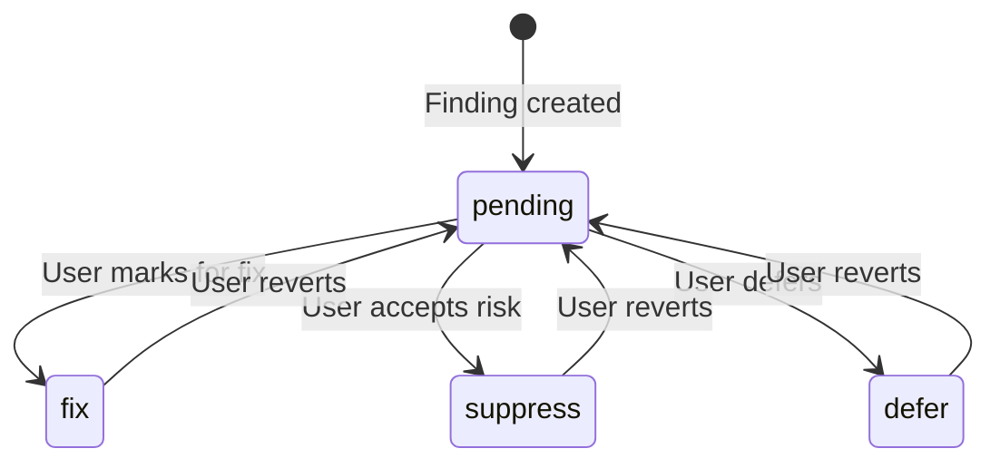
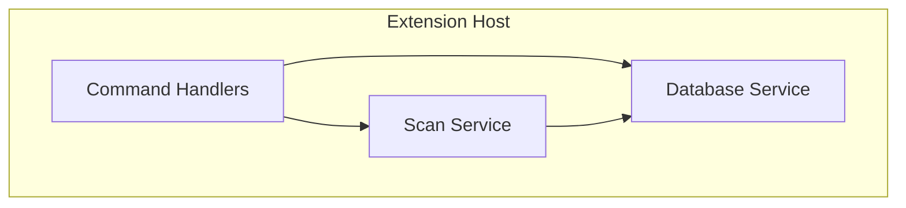
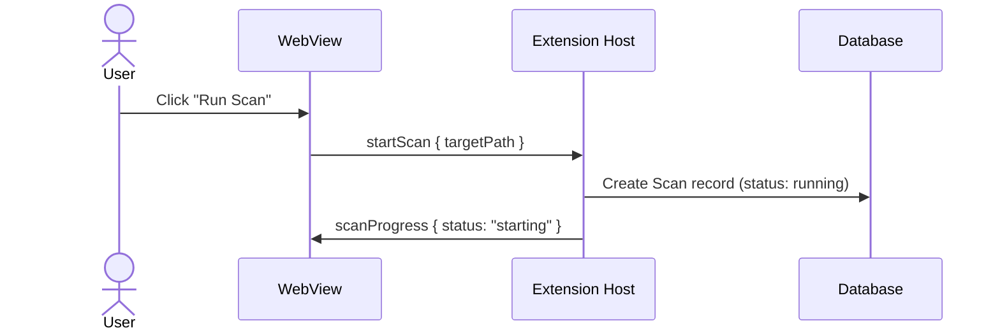

# Technical Specification Research: Best Practice Guidance for AI-Readable System Designs

Deep research into what makes a technical specification document effective as an implementation blueprint -- especially one that will be consumed by AI agents (LLMs, code generation tools, specification-to-implementation pipelines) to understand and build a system. Based on analysis of the ASH Workbench technical design document and its surrounding governance ecosystem.

## 1. Overview

This document answers the question: **What makes a technical specification document good enough that an AI can read it and build the system correctly?**

The answer matters because technical specifications have historically been written for human architects and developers who bring implicit context, professional judgment, and the ability to ask clarifying questions in real time. AI readers lack all three. A specification that is "clear enough for a senior engineer" may be fatally ambiguous for an AI agent that will interpret every gap literally -- or worse, fill gaps with plausible-sounding hallucinations.

The findings below are synthesized from:
- Deep analysis of the ASH Workbench technical design (`docs/docs/developer-docs/architecture/software-design-specification/technical-design.md`) -- a ~44KB document that successfully drove 11 implementation specifications via AI-assisted tooling
- The companion functional design, planned specs, and constitution documents that form the complete governance system
- The speckit workflow that consumed these documents to produce working code
- First-principles reasoning about what AI agents need vs. what humans need from specifications

**Audience for this guidance:** Anyone writing a technical specification that will be consumed by AI tooling (LLM-based code generation, specification-to-implementation pipelines, autonomous coding agents) or by human developers working alongside AI assistants. The guidance is project-agnostic.

---

## 2. Why AI Readers Are Different

### 2.1 The Fundamental Problem

Human readers bring context. When a specification says "use standard authentication," a senior engineer infers OAuth2/OIDC, JWT tokens, secure cookie handling, CSRF protection, and a dozen other implicit requirements based on professional experience. An AI reader may generate basic username/password auth with session cookies, or pick a random auth library, or implement something technically correct but architecturally wrong for the project.

**The cost of ambiguity scales with autonomy.** When AI is a copilot (human reviews every line), ambiguity causes slowdowns. When AI is an agent (implementing entire specifications autonomously), ambiguity causes incorrect implementations that may pass tests but violate architectural intent.

### 2.2 What AI Readers Need That Humans Don't

| Need | Why | Human equivalent |
|------|-----|------------------|
| **Explicit boundaries** | AI will implement exactly what's specified -- or hallucinate what's not. No "common sense" filter. | Experienced engineers know what's in scope implicitly. |
| **Concrete examples over abstractions** | AI excels at pattern-matching from examples. Abstract descriptions produce abstract code. | Humans can generalize from principles alone. |
| **Negative constraints** (what NOT to do) | Without explicit "don't do X," AI may do X if it seems reasonable. | Humans avoid anti-patterns from experience. |
| **Named patterns with definitions** | "Use the service layer pattern" means nothing without showing what that pattern looks like in THIS codebase. | Humans look up patterns or ask colleagues. |
| **Decision rationale** (the "why") | AI can't evaluate tradeoffs it doesn't know about. Knowing WHY a decision was made prevents AI from "optimizing" it away. | Humans can infer rationale from experience or ask. |
| **Typed contracts** | Concrete type definitions are unambiguous machine-readable contracts. Prose descriptions of data shapes invite interpretation. | Humans sketch types mentally and verify at review time. |
| **Cross-reference precision** | "See the functional design" is useless to an agent. "See functional-design.md Section 4.2, paragraphs 3-4" is actionable. | Humans browse documents and find relevant sections. |

### 2.3 The Signal-to-Noise Problem

AI context windows are finite. Every sentence in a specification competes for attention with every other sentence. A 50-page specification with 10 pages of useful content forces the AI to identify which 20% matters for each implementation task -- and it will often guess wrong.

**Principle: Density over length. Every sentence should either constrain an implementation decision or provide a concrete example. If it does neither, cut it.**

---

## 3. Anatomy of an Effective Technical Specification

### 3.1 Document Architecture

The strongest technical specifications follow a **zoom-in structure**: start with the broadest context and progressively narrow to implementation-specific detail. Each level provides the frame for interpreting the next.

**Recommended section sequence:**

```
1. Opening Context (what this document is, what to read first, key constraints)
2. System Architecture (high-level, how components connect)
3. Module Structure (mid-level, what goes where, dependency directions)
4. Data Model (entities, relationships, identity rules, state machines)
5. Feature Specifications (per-feature behavior, UI surface, constraints)
6. Integration Points (external systems, protocols, parsing rules)
7. Interaction Flows (end-to-end sequences for key user journeys)
8. Build & Test Strategy (how to compile, test, deploy)
9. Future Roadmap (what's deferred and why)
10. Outstanding Questions (what's still unknown)
```

This sequence works because each section provides context needed by subsequent sections. The data model defines terms used in feature specs. Feature specs define behaviors illustrated by interaction flows. Integration points constrain how features are implemented.

### 3.2 The Opening Context Block

**This is the single most important section for AI readers.** It establishes the interpretive frame for everything that follows.

**Must contain:**

1. **Document purpose statement** -- One sentence: what this document specifies and what it doesn't.
2. **Prerequisite documents** -- What to read first, with links. If the functional design defines the "what," this document defines the "how."
3. **Design constraints** -- The 3-5 non-negotiable constraints that override all other decisions. These are the AI's guardrails.

**Example (from ASH Workbench, effective pattern):**

```markdown
Technical design for the ASH Workbench VS Code extension. This document
specifies how the application is built: architecture, module structure,
data layer, integration patterns, build system, and testing strategy.
Read the [Functional Design](./functional-design.md) first for the what;
this document covers the how.

**Design constraints:**
- **Ship fast** -- Prefer proven patterns over novel ones.
- **Single developer** -- Architecture must be understandable by one person.
- **VS Code native** -- Leverage VS Code APIs where they exist.
```

**Why this works for AI:** The constraint list acts as a decision filter. When the AI faces an ambiguous choice during implementation, it can check: "Does option A or option B better satisfy 'ship fast' and 'single developer'?" Without this, the AI defaults to whatever seems most "correct" in the abstract -- which is often the most complex option.

### 3.3 The "What Not to Build" Section

**This is as important as the "what to build" section -- and nearly every specification omits it.**

Specifications typically define scope positively: "The system will do X, Y, Z." But AI agents are generative -- they will add features that seem logical extensions of the specification unless explicitly told not to. A finding triage system will grow batch operations, undo history, approval workflows, and notification systems unless the specification says "these are out of scope."

**Pattern: In/Out scope tables**

```markdown
### What's In
| Capability | Description |
|-----------|-------------|
| Finding triage | Set disposition per finding: Pending, Fix, Suppress, Defer |

### What's Out (Future Versions)
| Deferred Capability | Rationale |
|--------------------|-----------|
| Batch operations | Useful but not essential for POC |
| Category grouping | Requires categorization algorithm not yet designed |
```

**The rationale column is critical for AI.** It explains WHY something is deferred, which prevents the AI from re-deriving the feature from first principles and including it anyway because "it makes sense."

### 3.4 Exit Criteria

**Tell the AI what "done" looks like.** A numbered list of concrete, verifiable outcomes that define when the specification is fully implemented.

```markdown
### POC Exit Criteria

The POC is complete when a user can:
1. Open a workspace in VS Code and create an ASH Workbench project
2. Run an ASH scan against a directory in that workspace
3. See scan progress and completion
...
10. Delete an old scan and its findings
```

**Why this matters for AI:** Without exit criteria, an AI agent has no stopping condition. It will keep "improving" the implementation, adding edge case handling, refactoring for elegance, and implementing adjacent features. Exit criteria provide the termination signal: "When these 10 things work, stop."

---

## 4. Specification Patterns That Work for AI

### 4.1 Typed Contracts Over Prose Descriptions

**The single highest-leverage improvement for AI-readable specifications is replacing prose data descriptions with typed contracts.**

Prose:
> "The scan has a status that can be running, completed, failed, or cancelled. It tracks the number of findings and a breakdown by severity."

Typed contract:
```
| Field | Type | Notes |
|-------|------|-------|
| status | Enum | running, completed, failed, cancelled |
| findingsCount | Int | Total findings (populated on completion) |
| severityBreakdown | JSON | { high: N, medium: N, low: N, info: N } |
```

The typed contract is unambiguous. The prose version invites questions: Is severity breakdown a string? A JSON blob? Separate columns? What's the key casing? The AI will guess, and it may guess wrong.

**Rule: If a data shape matters, specify it as a table or type definition, not as prose.**

### 4.2 State Machines as Diagrams

State transitions are among the most error-prone areas in AI-generated code because the valid transitions are a small subset of all possible transitions, and nothing in the code structure prevents invalid ones.

**Pattern: Mermaid state diagrams**



**Why Mermaid specifically:** It's machine-parseable, widely supported by documentation tools, and LLMs are trained on it extensively. The diagram encodes both the valid states AND the valid transitions AND the trigger conditions. Prose descriptions of state machines almost always have gaps ("can the user go directly from Fix to Suppress without going through Pending first?").

### 4.3 Architecture Diagrams with Dependency Direction

AI agents need to understand which components depend on which others to avoid circular dependencies and to implement in the correct order.

**Pattern: Mermaid graph with explicit data flow direction**



The arrows encode dependency direction. `CMD --> SCAN` means Command Handlers depend on Scan Service, not the reverse. This is information that prose descriptions often leave implicit.

### 4.4 Message Protocol Tables

When components communicate via messages (WebView `postMessage`, WebSocket events, API endpoints), the message protocol is the most critical contract in the system. Ambiguity here causes integration failures.

**Pattern: Separate tables for each direction, with payload types**

```markdown
**Extension to WebView (state pushes):**

| Message Type | Payload | When |
|-------------|---------|------|
| scanList | Array of scan summaries | On load, after scan completes |
| findingDetail | Single finding with full data | On finding selection |

**WebView to Extension (user actions):**

| Message Type | Payload | Effect |
|-------------|---------|--------|
| startScan | { targetPath: string } | Begin ASH scan |
| setDisposition | { findingId, disposition } | Update finding status |
```

**Critical column: "When" / "Effect".** These tell the AI not just WHAT to send but WHEN to send it and WHAT SHOULD HAPPEN when it's received. Without these, the AI implements the message shapes correctly but the orchestration logic (when messages fire, what triggers them) is wrong.

### 4.5 Interaction Flows as Sequence Diagrams

Sequence diagrams are the highest-value diagram type for AI readers because they encode **temporal ordering** -- which action happens before which, who initiates, who responds.

**Pattern: Mermaid sequence diagrams for every key user journey**



**Why this works for AI:** The sequence diagram tells the AI exactly which component calls which, in what order, with what data. Without it, the AI must infer the orchestration from scattered prose -- and it will get the ordering wrong, miss steps, or implement bidirectional calls where only unidirectional ones are needed.

**Coverage guidance:** Write sequence diagrams for:
- The happy path of every major user journey
- Error/failure paths for complex operations
- Initialization/startup sequences
- Cleanup/shutdown sequences

### 4.6 Code Samples as Specification

When the exact implementation pattern matters (not just the behavior), include a code sample in the specification. This is controversial -- specifications are supposed to be implementation-agnostic. But for AI readers, a code sample is worth a thousand words of prose.

**When to include code samples:**
- When the pattern is specific to this codebase and can't be inferred from general knowledge
- When the exact API usage matters (VS Code API calls, ORM query patterns)
- When the integration with a specific library has non-obvious requirements

**When NOT to include code samples:**
- When the implementation is straightforward and the AI can derive it from the typed contracts
- When including a sample would lock in unnecessary implementation details

**Pattern: Code samples with explanatory comments**

```typescript
// Spawn ASH CLI -- use spawn (not exec) for streaming stdout
const proc = spawn(ashPath, [
  '--source-dir', absolutePath,
  '--output-dir', tempDir,
  '--output-formats', 'sarif',  // plural flag name
  '--color', 'false',           // disable ANSI in captured output
], { cwd: workspaceRoot });
```

The comments explain WHY specific choices were made (spawn vs exec, --color false). Without them, an AI might "improve" the code by using `exec` (simpler API) and omitting `--color false` (seems unnecessary).

### 4.7 Explicit File-to-Responsibility Mapping

AI agents need to know which file to create or modify for each piece of functionality. A module structure section that maps files to responsibilities prevents the AI from creating files in the wrong location or splitting/combining responsibilities incorrectly.

**Pattern: Module tree with responsibility annotations**

```
vsix/src/
  extension.ts          -- Entry point. Activate/deactivate lifecycle.
  commands/
    scanCommands.ts     -- Command palette and context menu scan commands
  services/
    database.ts         -- PGLite initialization, migration runner, Prisma client
    scanner.ts          -- ASH CLI process spawning, output parsing, finding storage
    findings.ts         -- Finding queries, filters, summary computation
  providers/
    findingsPanelManager.ts  -- WebView panel lifecycle, message bridge
    scanTreeProvider.ts      -- Sidebar tree view data provider
  models/
    types.ts            -- Shared type definitions (FindingRow, ScanSummary, etc.)
    messages.ts         -- WebView message protocol types
```

**Why single-line descriptions matter:** They tell the AI "database concerns go in `database.ts`, not in `extension.ts`" and "message handling goes in `findingsPanelManager.ts`, not in a new file." Without this, AI agents create new files liberally (because creating is easier than understanding where existing code should go).

---

## 5. Anti-Patterns to Avoid

### 5.1 Specification by Omission

**Anti-pattern:** Leaving a decision unspecified because "the implementer will figure it out."

**Why it's worse for AI:** A human implementer will ask a question or make a conservative choice. An AI will make a choice silently, and it will be whatever the training data suggests is most common -- which may be completely wrong for this project.

**Fix:** For every significant decision, either:
1. Specify the decision explicitly
2. Mark it as `[NEEDS CLARIFICATION]` with context about what the options are
3. List it in an "Outstanding Questions" section

The ASH Workbench technical design handles this well with its outstanding questions table:

```markdown
| # | Question | Context | Impact |
|---|----------|---------|--------|
| 1 | What ASH CLI flags control output format? | Integration assumes --format sarif | Scan execution, finding parsing |
```

### 5.2 Abstracting Away Implementation Details

**Anti-pattern:** Writing specifications at a level of abstraction that sounds clean but doesn't constrain implementation.

**Example (too abstract):**
> "The system should persist finding data efficiently."

**Example (appropriately concrete):**
> "Findings are stored in PGLite via Prisma ORM. Index on `(projectId, ruleId, file)` for deduplication queries. Index on `(scanId, severity)` for filtered finding lists."

**Rule of thumb:** If two competent engineers could read the specification and produce structurally different implementations, the specification is too abstract. For AI readers, make it even more concrete -- if the specification could produce two different database schemas, file structures, or API signatures, it needs more detail.

### 5.3 Implicit Patterns

**Anti-pattern:** Assuming the reader knows codebase conventions.

**Example (implicit):**
> "Add a new service for admin operations."

**Example (explicit):**
> "Create `vsix/src/services/admin.ts` -- `AdminService` class with injected `PrismaClient` dependency via constructor. Follows the same pattern as `DatabaseService` and `ScannerService`: async methods, named exports, no static methods."

The second version tells the AI: here's the file path, here's the class name, here's the dependency injection pattern, and here are two examples of the pattern already in the codebase that it can reference.

### 5.4 Narrative Flow Over Structured Reference

**Anti-pattern:** Writing specifications as flowing prose narratives.

Prose narratives work well for human readers who read start-to-finish and build a mental model. They work poorly for AI agents that need to find specific information quickly (e.g., "what type is the severity field?" or "what message triggers when a scan completes?").

**Fix:** Use structured reference formats (tables, lists, type definitions) for information that will be looked up during implementation. Reserve prose for:
- Rationale explanations (the "why")
- Behavior descriptions that have temporal ordering
- Context that helps interpret the structured reference sections

### 5.5 Unanchored Cross-References

**Anti-pattern:** "See the functional design for details."

**Fix:** "See functional-design.md Section 4.2 (Scan Execution behavior), specifically the scan target picker dialog interaction."

Precise cross-references serve two purposes: they tell the AI exactly where to look, and they confirm that the reference actually exists (if you can't cite a specific section, the reference may be to information that isn't actually written down anywhere).

---

## 6. The Specification Ecosystem

### 6.1 A Technical Spec Never Stands Alone

The ASH Workbench project demonstrates that a technical specification is most effective when it exists within an ecosystem of complementary documents:

| Document | Role | Relationship to Technical Spec |
|----------|------|-------------------------------|
| **Functional Design** | Defines WHAT the system does (behaviors, user stories, data model, UI screens) | The technical spec assumes you've read this first. References it for behavior definitions. |
| **Technical Design** | Defines HOW the system is built (architecture, modules, integrations, build/test) | This is the document itself. |
| **Constitution** | Defines the non-negotiable principles and constraints | The technical spec must comply. Implementers check the constitution before and after planning. |
| **Planned Specs** | Defines the ordered sequence of implementation units | Breaks the technical spec into buildable, testable chunks. References specific sections. |
| **Synopsis/README** | Provides a 2-minute overview for orientation | Answers "what is this project?" before diving into design details. |

**Key insight:** The technical specification doesn't need to be exhaustive if the ecosystem is complete. It can reference the functional design for user stories, the constitution for coding conventions, and the planned specs for implementation ordering. This keeps the tech spec focused on architecture and integration decisions.

### 6.2 The Functional/Technical Split

The most important split in the document ecosystem is between functional and technical design:

- **Functional design** = WHAT + WHY (user stories, behaviors, scope, data model at the domain level)
- **Technical design** = HOW + WHERE (architecture, module structure, technology choices, integration patterns)

**Why separate them:**
1. Different audiences review different documents (product/UX reviews functional; engineering reviews technical)
2. Functional requirements are stable; technical approaches change
3. AI agents can be given the technical spec for implementation without being distracted by business justification
4. The functional spec can be written before technology decisions are made

**What goes where:**

| Topic | Functional | Technical |
|-------|-----------|-----------|
| User stories | Yes | No (reference functional) |
| Data model (entities, relationships) | Yes (domain level) | Yes (database level, indexes, types) |
| UI screens (what the user sees) | Yes (layout, content) | Yes (technology: React/ShadCN, build pipeline) |
| Behavior descriptions | Yes | No (reference functional) |
| Architecture diagrams | No | Yes |
| Module/file structure | No | Yes |
| Integration details (CLI flags, parsing rules) | No | Yes |
| State machines | Yes (domain states) | Yes (implementation, if different from domain) |
| Message protocols | Brief (what messages exist) | Detailed (payloads, types, triggering conditions) |

### 6.3 The Constitution Pattern

A **constitution** is a governance document that defines non-negotiable principles, architectural constraints, and coding conventions for a project. It is checked before and after every planning and implementation cycle.

**Why constitutions matter for AI-driven development:**

Without a constitution, every specification must re-state the project's constraints. "Use TypeScript strict mode" appears in every spec. "No external services" appears in every spec. "Push disposables to context.subscriptions" appears in every spec. This is wasteful and error-prone (one spec will inevitably omit a constraint).

With a constitution, the specification can say: "Compliant with constitution v1.1.0" and the AI agent reads both documents. The constitution provides the invariant rules; the specification provides the feature-specific decisions.

**Constitution structure (recommended):**

```
1. Core Principles (numbered, with NON-NEGOTIABLE markers)
   - Each principle: statement + bullet list of specific rules + violation examples
2. Architecture Constraints (structural facts, not aspirational)
   - Monorepo layout, tech stack (with version pins), data model summary
3. Quality and Coding Conventions
   - Formatting, linting, test strategy, naming conventions
4. Governance
   - How the constitution is amended, versioned, and enforced
```

**The "Violations" list is the most AI-useful part of each principle.** It tells the AI what WRONG looks like, which is often more actionable than what RIGHT looks like.

---

## 7. Specification Quality Checklist

Use this checklist to evaluate whether a technical specification is ready for AI consumption.

### 7.1 Structural Completeness

- [ ] **Opening context** establishes document purpose, prerequisites, and design constraints
- [ ] **Scope boundaries** clearly define what's in AND what's out (with rationale for exclusions)
- [ ] **Exit criteria** define what "done" looks like as a numbered, verifiable list
- [ ] **Architecture diagram** shows component relationships and dependency directions
- [ ] **Module structure** maps files/directories to responsibilities
- [ ] **Data model** defines entities with typed fields (tables, not prose)
- [ ] **State machines** are diagrammed for any entity with lifecycle states
- [ ] **Integration points** specify exact protocols, flags, parsing rules, error handling
- [ ] **Interaction flows** cover happy path + error path for major user journeys
- [ ] **Outstanding questions** are explicitly listed (not hidden as vague prose)

### 7.2 AI-Readability

- [ ] **No implicit knowledge required** -- every convention, pattern, and constraint is stated or referenced
- [ ] **Typed contracts** replace prose descriptions for all data shapes
- [ ] **Cross-references are precise** (document name, section number, specific topic)
- [ ] **Negative constraints** ("what NOT to do") accompany positive requirements
- [ ] **Decision rationale** explains WHY for every significant technical choice
- [ ] **Examples included** for codebase-specific patterns that can't be inferred from general knowledge
- [ ] **Terminology is consistent** -- the same concept uses the same word everywhere (no synonyms)
- [ ] **Diagrams are machine-parseable** (Mermaid preferred over images)

### 7.3 Implementability

- [ ] **Each feature section** contains: behavior, constraints, UI surface, and (where needed) code sample
- [ ] **Acceptance criteria** exist for each feature or spec unit
- [ ] **Fallback plans** exist for risky technology choices
- [ ] **Dependency order** is clear (what must be built before what)
- [ ] **Test strategy** specifies what to test, how, and what frameworks to use
- [ ] **File creation list** for each spec unit names every new file and its responsibility

---

## 8. Template: Technical Specification Document

Based on this research, here is a recommended template structure. Sections marked `(REQUIRED)` should always be present. Sections marked `(CONDITIONAL)` should be included when applicable.

```markdown
# [Project Name]: Technical Design ([Version / Scope])

[One sentence: what this document specifies.]
Read the [Functional Design](./functional-design.md) first for the what;
this document covers the how.

**Design constraints:**
- **[Constraint 1]** -- [One sentence explanation]
- **[Constraint 2]** -- [One sentence explanation]
- **[Constraint 3]** -- [One sentence explanation]

---

## 1. System Architecture (REQUIRED)

### 1.1 High-Level Architecture
[Mermaid diagram showing major components and their relationships]
[One paragraph describing the runtime environment and deployment model]

### 1.2 Module Structure
[File/directory tree with single-line responsibility annotations]
[Dependency direction rules: "X depends on Y, never the reverse"]

### 1.3 Technology Stack
[Table: Component | Technology | Version | Notes]

---

## 2. Data Model (REQUIRED)

### 2.1 Entity Definitions
[For each entity: table with Field | Type | Notes]
[Identity rules: what makes two records "the same thing"]
[Indexes: which queries are optimized]

### 2.2 Entity Relationships
[Mermaid ER diagram]
[Cascade rules: what happens when a parent is deleted]

### 2.3 State Machines (CONDITIONAL)
[Mermaid state diagram for each entity with lifecycle states]
[Transition triggers: what causes each state change]

---

## 3. Feature Specifications (REQUIRED)

### 3.N [Feature Name]

**Behavior:** [What happens, step by step]

**Constraints:** [Limits, invariants, business rules]

**UI Surface:** [Where this appears, what technology renders it]

**Code Sample:** (CONDITIONAL) [When the pattern is non-obvious]

---

## 4. Integration Points (CONDITIONAL)

### 4.N [External System Name]

**Invocation:** [Exact command, API call, or protocol]
**Input:** [What we send, with types]
**Output:** [What we receive, with parsing rules]
**Error handling:** [Every error condition and the response]
**Code sample:** [When the integration has non-obvious requirements]

---

## 5. Communication Protocols (CONDITIONAL)

### 5.1 [Protocol Name] (e.g., WebView Message Protocol)

**[Direction A] Messages:**
| Message Type | Payload | When/Effect |

**[Direction B] Messages:**
| Message Type | Payload | When/Effect |

---

## 6. Interaction Flows (REQUIRED)

### 6.N [Flow Name] (e.g., Run Scan, First Launch)
[Mermaid sequence diagram]
[Notes on error paths, alternative flows]

---

## 7. Build, Test & Deploy (REQUIRED)

### 7.1 Build Pipeline
[Commands, output locations, dependencies between build steps]

### 7.2 Test Strategy
[Table: Test Type | What It Tests | Speed | Framework | When to Use]
[Test data strategy: fixtures, factories, mocks]

### 7.3 Configuration
[Table: Setting | Type | Default | Description]

---

## 8. Future Roadmap (REQUIRED)

[Ordered list of deferred features with rationale for deferral]
[How the current design accommodates future additions without rewrites]

---

## 9. Outstanding Questions (REQUIRED)

| # | Question | Context | Impact |
|---|----------|---------|--------|
```

---

## 9. Detailed Findings from the ASH Workbench Technical Design

### 9.1 What the Document Does Well

**Strengths identified (patterns to replicate):**

1. **Design constraints in the opening paragraph.** Three constraints that filter every subsequent decision. This is the highest-value content per character in the entire document.

2. **Mermaid diagrams throughout.** Architecture (graph TB), ER diagrams, state machines, sequence diagrams. All machine-parseable, all encoding structural information that prose would convey ambiguously.

3. **Message protocol tables with "When" column.** The bidirectional message tables don't just list message types -- they specify the triggering conditions. This is the difference between an AI that implements the message shapes and an AI that implements the orchestration correctly.

4. **Sequence diagrams for every major flow.** First run, scan execution, triage, code navigation, reset, upgrade. Six flows, each encoding the exact temporal ordering of component interactions.

5. **Entity definitions as typed tables.** Every field has a type and notes column. No ambiguity about whether `severityBreakdown` is a string or JSON object.

6. **Explicit "What's Out" table with rationale.** Prevents scope creep during implementation by naming deferred features and explaining why they're deferred.

7. **Exit criteria as a numbered list.** Ten concrete, testable outcomes that define "done."

8. **Integration details at the flag level.** The ASH CLI integration specifies exact command-line flags, exit codes, SARIF paths, and severity mappings. An implementer (human or AI) can build the integration from this section alone.

9. **Fallback plans for risky choices.** The PGLite + Prisma combination is flagged as unproven, with SQLite named as the fallback. This prevents an AI from spending unbounded effort making a risky choice work.

10. **Outstanding questions table.** Six open questions, each with context and impact assessment. This prevents an AI from making silent assumptions about unresolved issues.

### 9.2 Where the Document Could Be Stronger

**Gaps identified (areas for improvement in future specs):**

1. **No explicit error handling matrix.** The document describes error handling in prose within each feature section, but there is no consolidated table mapping error conditions to user-visible responses. A table like `| Error | Source | User Message | Recovery Action |` would be more actionable for AI.

2. **Code samples are sparse.** The document references code samples in specific sections (e.g., "See technical design Section 3.4 for the implementation pattern") but the actual document contains limited inline code. For AI readers, inline code samples at the point of discussion are more effective than cross-references to code that may not exist yet.

3. **Naming conventions are mentioned but not exhaustive.** The constitution covers naming (camelCase, PascalCase), but the technical design doesn't specify naming rules for messages, database tables, or API endpoints. An AI might name a message `SCAN_COMPLETED` or `scanCompleted` or `scan-completed` depending on what it sees in training data.

4. **Configuration defaults are stated but validation rules are not.** The settings table lists defaults but doesn't specify: What happens if `ashPath` points to a non-existent file? What's the valid range for `scanTimeout`? What happens if `llm.region` is invalid? AI will often skip validation unless explicitly told to validate.

5. **No performance requirements or constraints.** The document doesn't specify expected scan duration ranges, maximum finding counts, database size limits, or memory constraints. For a POC this is acceptable, but for production specifications, performance constraints prevent AI from implementing O(n^2) algorithms where O(n) is required.

6. **The "Future Roadmap" section lacks architectural preparation notes.** It lists deferred features but doesn't explain what architectural decisions in the current spec were made specifically to accommodate them. For example, the `ruleId + file` composite key exists for future delta reporting -- but this connection is stated in the data model section, not in the roadmap section. Cross-linking these would help AI understand which current decisions are load-bearing for future features.

### 9.3 How the Planned Specs Consume the Technical Design

The planned specs document (`planned-specs.md`) demonstrates the most effective pattern for breaking a technical specification into implementable units:

**Each spec contains:**
- **Dependencies** (which specs must be implemented first)
- **New files to create** (with exact paths and responsibility descriptions)
- **Existing files to modify** (with specific changes described)
- **Tests to create** (with specific test cases listed)
- **Acceptance criteria** (numbered, verifiable conditions)
- **Fallback plans** (for risky components)
- **Precise cross-references** (to specific sections of the technical design)

**Why this pattern works:** Each spec is a self-contained implementation brief. An AI agent can read one spec and implement it without reading the entire technical design -- the spec includes everything it needs or references exactly where to find it.

**Key lesson for spec writers:** If your technical specification is not structured in a way that allows it to be decomposed into atomic, independently implementable specs with precise back-references, it needs restructuring.

---

## 10. Principles for Writing AI-Consumable Technical Specifications

Distilled from all findings above, these are the core principles:

### Principle 1: Constrain, Don't Describe

**Every sentence should eliminate possible implementations, not describe the desired one.**

"The system stores findings in a database" eliminates nothing -- the AI still doesn't know which database, what schema, or what queries to use. "Findings are stored in PGLite via Prisma ORM with indexes on `(projectId, ruleId, file)` and `(scanId, severity)`" eliminates almost every wrong implementation.

### Principle 2: Types Are Specifications

**Typed contracts (tables, interfaces, enums) are more precise than prose and should be the primary specification mechanism for data shapes, message protocols, and API contracts.**

When you find yourself writing a paragraph to describe a data structure, stop and write a type table instead. The paragraph can exist as a note below the table to explain WHY, but the table is the normative specification.

### Principle 3: Show the Negative Space

**Explicitly state what the system does NOT do, what patterns to avoid, and what's deferred.**

For every "the system will X," consider adding "the system will NOT Y" where Y is a plausible extension or common misinterpretation. For every design decision, consider naming the alternatives that were rejected and why.

### Principle 4: Diagrams Encode Structure; Prose Explains Intent

**Use diagrams (Mermaid) for structural information (architecture, state machines, sequences, ER models). Use prose for intent, rationale, and temporal behavior descriptions.**

Diagrams are superior to prose for encoding relationships, dependencies, and valid transitions because they're unambiguous and machine-parseable. Prose is superior for explaining WHY decisions were made and WHAT behavior the user should experience.

### Principle 5: Precision in References

**Every cross-reference should identify document, section, and specific topic.**

"See the functional design" is a reference to a 30KB document. "See functional-design.md Section 4.2, paragraph 3 (scan target picker dialog)" is a reference to a specific paragraph. AI agents cannot browse documents the way humans do -- precise references let them find the right information.

### Principle 6: Examples Over Abstractions

**When a pattern is codebase-specific, include a concrete example. When a pattern is industry-standard, name it precisely.**

"Use dependency injection" is sufficient for a well-known pattern. "Use dependency injection of `SpawnFn` for the scanner service because sinon cannot stub `child_process.spawn` under Node16 modules" is necessary for a codebase-specific constraint.

### Principle 7: Separate the Stable from the Volatile

**Put slowly-changing information (principles, data model, architecture) in the constitution and technical design. Put rapidly-changing information (implementation order, specific file changes) in planned specs or task documents.**

This separation prevents specification documents from becoming stale. The architecture doesn't change when you reorder the implementation. The data model doesn't change when you adjust acceptance criteria. By separating these concerns, each document stays accurate longer.

### Principle 8: Design for Decomposition

**Write the technical specification so it can be broken into atomic, independently implementable units, each with clear inputs, outputs, dependencies, and acceptance criteria.**

If a specification can only be implemented as a monolithic whole, it's too coupled. Each section should be self-contained enough that an AI agent can implement it given only that section plus its referenced dependencies. This is the pattern demonstrated by the ASH Workbench planned specs.

### Principle 9: Make Implicit Knowledge Explicit

**Never assume the reader knows your codebase conventions, industry norms, or "obvious" patterns.**

If your codebase uses a specific service layer pattern, describe it. If your team has a convention for error handling, specify it. If there's a "standard way" to add a new feature, document the steps. AI has broad but shallow knowledge -- it knows many patterns but can't infer which one YOUR codebase uses.

### Principle 10: Outstanding Questions Are Features, Not Bugs

**Explicitly listing what you don't know is more valuable than pretending you know everything.**

An outstanding questions section serves three purposes: (1) it prevents AI from silently filling knowledge gaps with hallucinations, (2) it signals to human reviewers which areas need attention before implementation, and (3) it creates a tracking mechanism for resolving uncertainties over time.

---

## 11. Key Takeaways

1. **The opening context block (purpose + prerequisite docs + design constraints) is the most important section for AI readers.** It establishes the decision framework that governs everything else.

2. **Typed contracts, not prose, are the primary specification mechanism** for data shapes, message protocols, and configuration. Prose explains; types specify.

3. **The "What's Out" section is as important as "What's In."** AI agents are generative -- without explicit exclusions, they will implement features you didn't ask for.

4. **Mermaid diagrams are the preferred format** for architecture (graph), data models (erDiagram), state machines (stateDiagram), and interaction flows (sequenceDiagram).

5. **A technical specification lives in an ecosystem** of functional design, constitution, planned specs, and synopsis. The tech spec doesn't need to be exhaustive if the ecosystem is complete.

6. **Design for decomposition.** Every section should be self-contained enough to become an independent implementation unit with clear inputs, outputs, dependencies, and acceptance criteria.

7. **The test of specification quality is: could two independent AI agents produce structurally identical implementations from this document?** If yes, the specification is sufficiently precise. If not, the ambiguous areas need more detail.

---

## 12. Outstanding Questions

| # | Question | Context | Impact |
|---|----------|---------|--------|
| 1 | How should specifications handle versioning as the system evolves? | The ASH Workbench tech spec is for "POC / v1" -- what happens when v2 needs to extend it? | Long-term specification maintenance |
| 2 | What is the optimal specification size for AI context windows? | The ASH Workbench tech spec is ~44KB. Larger specs may exceed context limits or dilute attention. | Specification structure decisions |
| 3 | Should code samples in specifications use pseudocode or real language syntax? | Real syntax is more precise but locks in language choice. The ASH Workbench uses TypeScript samples. | Template design for multi-language projects |
| 4 | How should specifications handle multi-team projects where different teams own different components? | The ASH Workbench is single-developer. Multi-team specs may need interface contracts between teams. | Scaling the specification pattern |
| 5 | What level of test specification belongs in the technical design vs. planned specs? | The ASH Workbench tech spec includes test strategy but detailed test cases are in planned specs. The boundary could be more clearly defined. | Specification decomposition |

---

## 13. Recommended Next Steps

### Phase 1: Skill Creation
1. **Extract the template** (Section 8) into a standalone skill that generates technical specifications
2. **Embed the quality checklist** (Section 7) as a validation gate in the skill
3. **Include the principles** (Section 10) as the skill's decision guidance for the AI

### Phase 2: Ecosystem Integration
1. **Create a functional specification skill** using the same research methodology against `functional-design.md`
2. **Create a constitution skill** (already exists as `speckit.constitution`) -- verify alignment with this research
3. **Create a planned specs skill** that decomposes a technical spec into atomic implementation units

### Phase 3: Validation
1. **Test the technical specification skill** on a different project to verify it generalizes beyond ASH Workbench
2. **Measure implementation accuracy** -- do AI agents produce more correct implementations from specs generated by the skill vs. ad-hoc specs?
3. **Iterate on the template** based on real-world usage patterns
