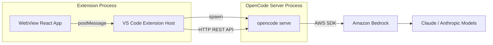
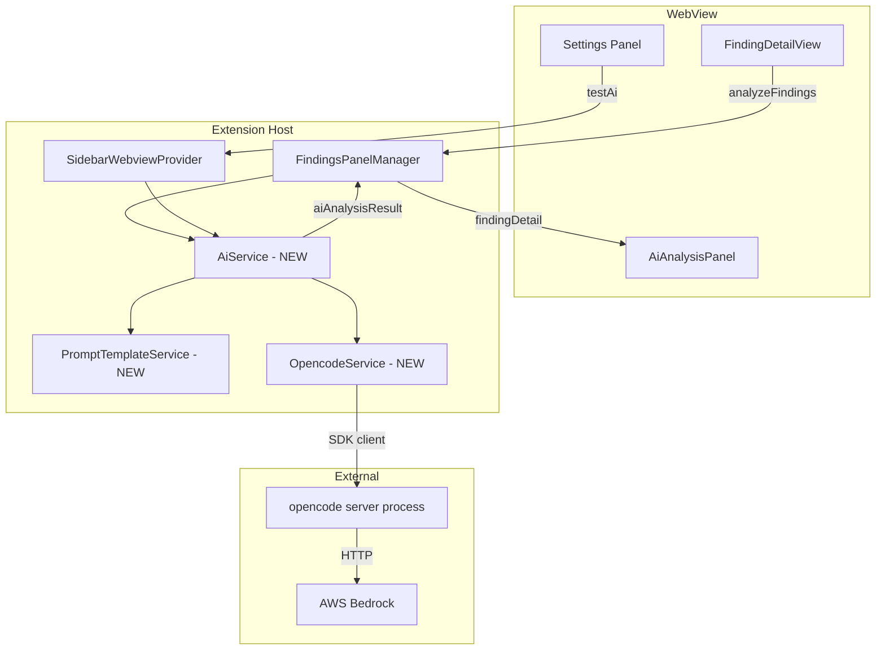
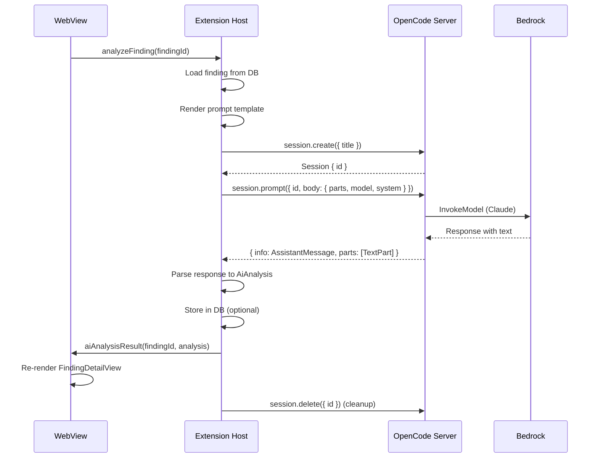
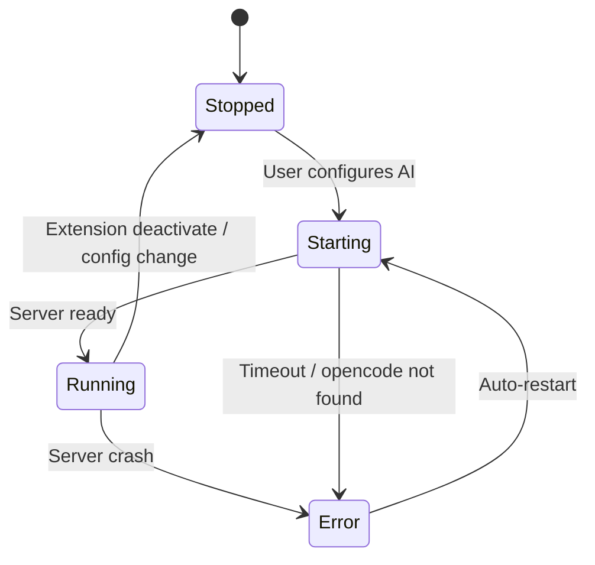
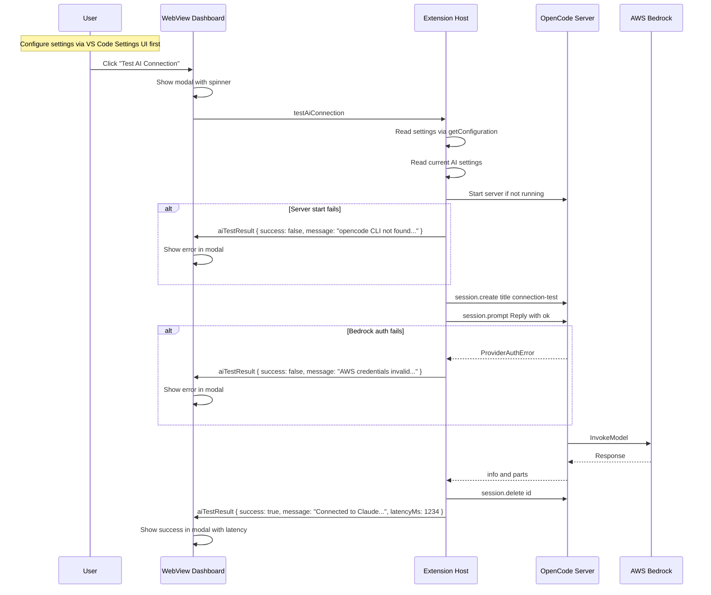

# OpenCode SDK Integration Research

## Overview

This document investigates integrating the [OpenCode SDK](https://www.npmjs.com/package/@opencode-ai/sdk) (`@opencode-ai/sdk@1.2.27`) into the ASH Workbench VS Code extension to provide AI-powered security finding analysis. The integration would enable users to initiate AI-assisted investigations of individual security findings, producing structured analyses including risk assessments, attack vector explanations, and remediation guidance.

OpenCode is a developer-focused AI coding assistant that exposes a full HTTP server + TypeScript SDK. The SDK spawns an `opencode` CLI process as a local server, then communicates with it via REST API. It supports multiple LLM providers — critically including **AWS Bedrock** — and provides session-based conversation management with structured output support.

**Key insight**: OpenCode is not a library that calls Bedrock directly. It is a CLI tool (`opencode`) that must be **installed on the host machine** and is **spawned as a child process** by the SDK. The SDK is a thin HTTP client that communicates with this spawned server. This architectural fact has significant implications for the extension's deployment, configuration, and error handling strategy.

---

## Architecture

### How the OpenCode SDK Works



**SDK Architecture:**

1. **`createOpencodeServer(options)`** — spawns `opencode serve --hostname=127.0.0.1 --port=4096` as a child process. Configuration is passed via the `OPENCODE_CONFIG_CONTENT` environment variable as JSON. Waits for `opencode server listening on http://...` on stdout, then resolves with the URL.

2. **`createOpencodeClient({ baseUrl })`** — creates an HTTP client that connects to the server's REST API. Returns an `OpencodeClient` with typed methods for sessions, config, providers, events, etc.

3. **`createOpencode(options)`** — convenience that combines both: starts server + creates client.

**Source**: `dist/server.js:1-66` — the server is literally a `spawn('opencode', ['serve', ...])` call.

### Integration with ASH Workbench

The proposed integration fits into the existing extension architecture as a new service:



### Existing Scaffolding

The codebase already has significant scaffolding for AI analysis:

- **`AiAnalysis` type** (`vsix/src/models/types.ts:47-52`, `webview/src/types/types.ts:47-52`): Defines the structured output shape — `explanation`, `riskAssessment`, `suggestedFix`, `references`.
- **`RiskAssessment` type** (`types.ts:38-45`): Exploitability, impact, likelihood with `RiskLevel` enum and rationales.
- **`SuggestedFix` type** (`types.ts:32-36`): `description`, `diffText`, `language`.
- **`AiAnalysisPanel` component** (`webview/src/components/AiAnalysisPanel.tsx`): Full accordion-based UI for rendering AI analysis results. Already integrated in `FindingDetailView.tsx:144-148`.
- **`FindingRow.aiAnalysis`** field (`types.ts:77`): Currently hardcoded to `null` in the mapper (`vsix/src/models/mappers.ts:64`), with mock data in `webview/src/mock-data.ts` demonstrating the expected shape.
- **LLM settings in `package.json`** (`vsix/package.json:125-142`): `ashWorkbench.llm.provider` (enum: bedrock), `ashWorkbench.llm.region` (default: us-east-1), `ashWorkbench.llm.modelId` (default: `anthropic.claude-sonnet-4-20250514`). Currently unused.

---

## Detailed Findings

### OpenCode SDK API Surface

The `OpencodeClient` provides a comprehensive API organized into resource classes:

| Resource | Key Methods | Relevance |
|----------|-------------|-----------|
| `config` | `get()`, `update()`, `providers()` | Configure Bedrock provider, validate settings |
| `provider` | `list()`, `auth()` | Enumerate available providers and models |
| `session` | `create()`, `prompt()`, `promptAsync()`, `messages()`, `abort()`, `delete()` | Core: create analysis sessions, send prompts, get responses |
| `event` | `subscribe()` | SSE stream for real-time updates (progress, parts) |
| `app` | `agents()`, `log()` | List custom agents, write logs |
| `tool` | `ids()`, `list()` | Discover available tools |
| `instance` | `dispose()` | Shutdown server |

**Critical paths for our use case:**

1. **`session.create()`** — Creates a conversation session. Body: `{ title?: string }`.
2. **`session.prompt()`** — Sends a message and returns the complete response. Body includes:
   - `model: { providerID: string, modelID: string }` — provider/model override
   - `system?: string` — system prompt
   - `parts: TextPartInput[]` — message content
   - `tools?: Record&lt;string, boolean&gt;` — enable/disable tools
   - `noReply?: boolean` — inject context without triggering response
3. **Response structure**: `{ info: AssistantMessage, parts: Part[] }` where `Part` includes `TextPart`, `ReasoningPart`, `ToolPart`, etc.

### AWS Bedrock Configuration

OpenCode supports Bedrock as a first-class provider with the ID `"amazon-bedrock"`.

**Authentication methods (priority order):**
1. `AWS_BEARER_TOKEN_BEDROCK` environment variable
2. Standard AWS credential chain: `AWS_ACCESS_KEY_ID`/`AWS_SECRET_ACCESS_KEY`, `AWS_PROFILE`, shared credentials file, IAM roles, Web Identity Tokens

**Configuration via opencode.json / Config API:**

```json
{
  "provider": {
    "amazon-bedrock": {
      "options": {
        "region": "us-east-1",
        "profile": "my-aws-profile"
      }
    }
  },
  "model": "amazon-bedrock/anthropic.claude-sonnet-4-20250514"
}
```

**Passing config programmatically:**
The `createOpencodeServer()` function accepts a `config` option that is serialized to `OPENCODE_CONFIG_CONTENT` env var. This means the extension can dynamically configure the provider without writing any files:

```typescript
const { client, server } = await createOpencode({
  config: {
    model: 'amazon-bedrock/anthropic.claude-sonnet-4-20250514',
    provider: {
      'amazon-bedrock': {
        options: {
          region: 'us-east-1',
          profile: 'my-profile', // optional, uses default chain if omitted
        },
      },
    },
    // Disable all tools — we only want text responses
    tools: {},
  },
});
```

### Model Type and Capabilities

The `Model` type (`types.gen.d.ts:1278-1334`) exposes:

- `capabilities.reasoning: boolean` — whether the model supports extended thinking
- `capabilities.temperature: boolean` — whether temperature is configurable
- `capabilities.toolcall: boolean` — whether the model supports tool use
- `status: "alpha" | "beta" | "deprecated" | "active"`
- `cost: { input, output, cache: { read, write } }` — pricing information
- `limit: { context, output }` — token limits
- `options: Record&lt;string, unknown&gt;` — model-specific options

**Anthropic Opus features** (thought, effort, etc.) would be passed via the `AgentConfig` type:

```typescript
agent: {
  'security-analyzer': {
    model: 'amazon-bedrock/anthropic.claude-opus-4-20250514',
    temperature: 0.1,
    // Provider-specific options pass through
    reasoningEffort: 'high',
  }
}
```

The `AgentConfig` type (`types.gen.d.ts:835-875`) is extensible with `[key: string]: unknown`, allowing arbitrary provider-specific parameters.

### Structured Output Support

OpenCode supports structured output via JSON schema validation (documented in SDK docs). However, structured output in OpenCode uses a `StructuredOutput` tool internally. For our use case, it may be simpler to:

1. Include the desired JSON schema in the system prompt
2. Parse the response text manually
3. Validate against the `AiAnalysis` TypeScript type

This avoids coupling to OpenCode's structured output mechanism and gives us full control over the prompt engineering.

### Session and Message Lifecycle



**Key decisions:**

- **One session per analysis**: Create a fresh session for each finding analysis, then delete it. This avoids context pollution between findings.
- **Synchronous prompt**: Use `session.prompt()` (blocking) rather than `session.promptAsync()` since we need the response before updating the UI.
- **Tool disabling**: Disable all tools (`tools: {}` or specific false flags) since we want pure text analysis, not code editing.

### Server Lifecycle Management

The OpenCode server is a child process that must be managed across the extension lifecycle:



**Critical concerns:**

1. **`opencode` CLI must be installed**: The `server.js` literally calls `spawn('opencode', ...)`. If the CLI is not on PATH, the server fails with ENOENT. This should be handled like the ASH CLI prerequisite — proactive detection on activation, a prominent dashboard indicator when missing, runtime ENOENT catch as safety net (see `scanner.ts:302-311`), and a configurable path setting (`ashWorkbench.opencodePath`).
2. **Port conflicts**: Default port 4096 could be in use. Should use port 0 (random) or a configurable port.
3. **Startup time**: The server has a 5000ms default timeout. In practice, Bedrock provider initialization may take longer.
4. **Process cleanup**: Must kill the server on extension deactivation to avoid zombie processes.
5. **Single instance**: Only one server per extension instance should run.

### Prompt Template System

**User story**: As a builder, I need to control AI prompts using editable Jinja markdown templates.

**Proposed structure:**

```
vsix/
  prompts/
    security-analysis.md.j2    # Main finding analysis prompt
    test-connection.md.j2       # "Test AI" connection test prompt
```

**Template variables available to each prompt:**

```
finding.title
finding.description
finding.severity
finding.scanner
finding.ruleId
finding.filePath
finding.startLine
finding.endLine
finding.codeSnippet
finding.notes
finding.disposition

project.name
project.rootPath
```

**Example `security-analysis.md.j2`:**

````markdown
You are a senior application security engineer performing a detailed analysis of a security finding from an automated scanner.

## Finding Details

- **Title**: {{ finding.title }}
- **Scanner**: {{ finding.scanner }}
- **Rule ID**: {{ finding.ruleId }}
- **Severity**: {{ finding.severity }}
- **File**: {{ finding.filePath }}:{{ finding.startLine }}-{{ finding.endLine }}
- **Description**: {{ finding.description }}

## Source Code

```{{ finding.language | default('') }}
{{ finding.codeSnippet }}
```

## Required Analysis

Provide your analysis in the following JSON format:

```json
{
  "explanation": "Detailed explanation of the vulnerability...",
  "riskAssessment": {
    "exploitability": "CRITICAL|HIGH|MEDIUM|LOW|NONE",
    "exploitabilityRationale": "Why this exploitability rating",
    "impact": "CRITICAL|HIGH|MEDIUM|LOW|NONE",
    "impactRationale": "Why this impact rating",
    "likelihood": "CRITICAL|HIGH|MEDIUM|LOW|NONE",
    "likelihoodRationale": "Why this likelihood rating"
  },
  "suggestedFix": {
    "description": "Plain language description of the fix",
    "diffText": "Code diff showing the fix (unified diff format)",
    "language": "programming language of the fix"
  },
  "references": [
    { "title": "Reference title", "url": "https://..." }
  ]
}
```

Be specific to this code. Do not provide generic advice. Reference the actual variable names, function names, and patterns in the code.
````

**Jinja implementation**: Use a lightweight Jinja-compatible template engine for TypeScript. Options:

- **`nunjucks`** (Mozilla) — full-featured Jinja2 implementation for JS, mature, well-tested
- **`liquidjs`** — Shopify's Liquid implementation (similar to Jinja but not identical)
- **Simple string replacement** — for POC, a basic `{{ var }}` replacement may suffice without a full template engine

**Recommendation**: Use `nunjucks` for full Jinja2 compatibility. It is approximately 50KB gzipped, battle-tested, and matches the "Jinja markdown template" requirement exactly. However, for a lean POC, start with simple string interpolation and upgrade later.

---

## Settings and Configuration

### Approach: Standard VS Code Settings

All AI/Bedrock configuration should live in the **normal VS Code settings system** (`contributes.configuration` in `package.json`). This is the same approach used for all existing ASH Workbench settings (`ashWorkbench.ashPath`, `ashWorkbench.ashMode`, `ashWorkbench.scanTimeout`, etc.) and provides several advantages:

- Users configure AI settings via the standard VS Code Settings UI (searchable, with descriptions and validation)
- Settings sync across machines via VS Code Settings Sync
- Workspace-level overrides work out of the box (per-project model selection)
- No custom settings storage or WebView admin panel needed for core configuration
- Extension host reads settings via `vscode.workspace.getConfiguration('ashWorkbench')` — the same pattern already used by `ScannerService.getConfig()` (`scanner.ts:78-84`)

The WebView does **not** need its own settings editor for these values. Users go to VS Code Settings and search "ASH Workbench" to find all configuration in one place. The "Test AI Connection" button can live in the WebView dashboard or sidebar as a simple action button that reads current settings and validates the pipeline.

### Current Settings (already in `package.json:125-142`)

```json
"ashWorkbench.llm.provider": { "enum": ["bedrock"], "default": "bedrock" }
"ashWorkbench.llm.region": { "default": "us-east-1" }
"ashWorkbench.llm.modelId": { "default": "anthropic.claude-sonnet-4-20250514" }
```

These exist but are **currently unused** — no code reads them.

### Proposed Settings (full schema)

Expand the existing `ashWorkbench.llm.*` namespace and add `ashWorkbench.opencodePath`:

| Setting Key | Type | Default | Description |
|-------------|------|---------|-------------|
| `ashWorkbench.opencodePath` | string | `"opencode"` | Path to the OpenCode CLI executable |
| `ashWorkbench.llm.provider` | enum | `"bedrock"` | LLM provider (bedrock only for POC) |
| `ashWorkbench.llm.region` | string | `"us-east-1"` | AWS region for Bedrock |
| `ashWorkbench.llm.modelId` | string | `"anthropic.claude-sonnet-4-20250514"` | Bedrock model identifier |
| `ashWorkbench.llm.awsProfile` | string | `""` | AWS profile name (empty = default credential chain) |
| `ashWorkbench.llm.temperature` | number | `0.0` | Model temperature (0.0 = deterministic) |
| `ashWorkbench.llm.maxTokens` | number | `4096` | Maximum output tokens |

**Design notes:**

- **Temperature default is `0.0`** — Security analysis should be deterministic and reproducible. Users can increase if they want more varied suggestions.
- **AWS Profile default is empty string** — Empty means "use the default AWS credential chain" (env vars, shared credentials, IAM roles, etc.). When non-empty, the value is passed as the `profile` option to the OpenCode Bedrock provider config.
- **`opencodePath` mirrors `ashPath`** — Same pattern: configurable executable path, default assumes it is on PATH.
- **Max tokens default is `4096`** — Sufficient for a detailed `AiAnalysis` JSON response. The `AiAnalysis` type produces roughly 500-2000 tokens depending on finding complexity.

**Deferred settings (for later iterations):**

| Setting | Notes |
|---------|-------|
| Extended thinking / Reasoning effort | Requires Opus model; Bedrock API support varies. Could add `ashWorkbench.llm.reasoningEffort` (enum: off/low/medium/high) |
| Other providers (OpenAI, Anthropic direct) | Expand `ashWorkbench.llm.provider` enum when needed |
| Cost tracking / budget limits | OpenCode tracks token costs in `AssistantMessage`; could surface in UI |

### Reading Settings in Extension Host

Following the existing `ScannerService.getConfig()` pattern:

```typescript
// In OpencodeService or AiService
static getAiConfig() {
  const cfg = vscode.workspace.getConfiguration('ashWorkbench');
  return {
    opencodePath: cfg.get<string>('opencodePath', 'opencode') ?? 'opencode',
    provider: cfg.get<string>('llm.provider', 'bedrock') ?? 'bedrock',
    region: cfg.get<string>('llm.region', 'us-east-1') ?? 'us-east-1',
    modelId: cfg.get<string>('llm.modelId', 'anthropic.claude-sonnet-4-20250514'),
    awsProfile: cfg.get<string>('llm.awsProfile', '') ?? '',
    temperature: cfg.get<number>('llm.temperature', 0.0) ?? 0.0,
    maxTokens: cfg.get<number>('llm.maxTokens', 4096) ?? 4096,
  };
}
```

This config is then mapped to the OpenCode `Config` type when starting the server:

```typescript
const opcConfig: Config = {
  model: `amazon-bedrock/${aiConfig.modelId}`,
  provider: {
    'amazon-bedrock': {
      options: {
        region: aiConfig.region,
        ...(aiConfig.awsProfile ? { profile: aiConfig.awsProfile } : {}),
      },
    },
  },
  tools: {}, // disable all tools — text-only analysis
};
```

### New Message Types Required

Since settings live in VS Code's native system, the WebView does **not** need `requestAiSettings` / `updateAiSettings` messages. The only new messages needed are for AI actions:

```typescript
// Extension Host → WebView
| { type: 'aiTestResult'; payload: {
    success: boolean;
    message: string;
    latencyMs: number
  } }
| { type: 'aiAnalysisResult'; payload: {
    findingId: string;
    analysis: AiAnalysis
  } }
| { type: 'aiAnalysisError'; payload: {
    findingId: string;
    error: string
  } }
| { type: 'aiAnalysisProgress'; payload: {
    findingId: string;
    status: string
  } }

// WebView → Extension Host
| { type: 'testAiConnection' }
| { type: 'analyzeFinding'; payload: { findingId: string } }
| { type: 'cancelAiAnalysis'; payload: { findingId: string } }
```

Note the elimination of `requestAiSettings` and `updateAiSettings` — settings are managed entirely through VS Code's settings UI.

### Test AI Button Implementation

The "Test AI" button validates the full pipeline:



**Error categories to detect and display:**

1. **`opencode` not installed**: ENOENT on spawn → "OpenCode CLI not found. Install with: `npm install -g opencode`"
2. **Server startup timeout**: Timeout → "OpenCode server failed to start within 10 seconds"
3. **AWS credentials missing**: `ProviderAuthError` → "AWS credentials not found. Configure AWS_PROFILE or ensure default credential chain is set up"
4. **AWS credentials invalid**: `APIError` with 403 → "AWS credentials are invalid or do not have Bedrock access"
5. **Model not available**: `APIError` with 404 → "Model is not available in the configured region. Check Model Access in AWS Console"
6. **Region not enabled**: → "Bedrock is not enabled in the configured region"
7. **Network error**: → "Cannot reach AWS Bedrock. Check network connectivity and VPN"

---

## Patterns and Conventions

### Service Layer Pattern

Following the existing pattern in `vsix/src/services/`:

- `DatabaseService` — static methods, manages PGLite lifecycle
- `ScannerService` — instance with dependencies, manages child process
- `FindingsService` — instance with DB client

The new services should follow the same pattern:

- **`OpencodeService`** — manages the OpenCode server lifecycle (start, stop, restart, health check). Similar to `ScannerService` in managing a child process.
- **`AiService`** — high-level API for finding analysis. Takes `OpencodeService`, `FindingsService`, and `PromptTemplateService` as dependencies.
- **`PromptTemplateService`** — loads and renders Jinja templates from the `prompts/` directory.

### Message Passing Pattern

Following the existing unidirectional pattern:

1. WebView sends a request message (`analyzeFinding`)
2. Extension host processes asynchronously
3. Extension host sends result message (`aiAnalysisResult` or `aiAnalysisError`)
4. No request/response correlation needed — message types implicitly correlate

### Type Duplication Pattern

Types defined in `vsix/src/models/types.ts` are manually copied to `webview/src/types/types.ts`. New types (`AiSettings`, extended messages) must be duplicated in both locations.

---

## Configuration and Environment

### OpenCode CLI Dependency

The OpenCode SDK requires the `opencode` CLI to be installed globally:

```bash
npm install -g opencode
# or
npx opencode
```

**Version compatibility**: The SDK v1.2.27 should work with the latest `opencode` CLI. The SDK and CLI are versioned together from the same monorepo.

### Environment Variables

The extension should forward relevant environment variables to the OpenCode server process:

| Variable | Purpose |
|----------|---------|
| `AWS_ACCESS_KEY_ID` | Static AWS credentials |
| `AWS_SECRET_ACCESS_KEY` | Static AWS credentials |
| `AWS_SESSION_TOKEN` | Temporary session token |
| `AWS_PROFILE` | Named profile |
| `AWS_REGION` | Default region |
| `AWS_DEFAULT_REGION` | Fallback region |
| `AWS_CONFIG_FILE` | Custom config file path |
| `AWS_SHARED_CREDENTIALS_FILE` | Custom credentials path |

The extension should pass the user's configured `AWS_PROFILE` via the `OPENCODE_CONFIG_CONTENT` mechanism:

```typescript
const config = {
  provider: {
    'amazon-bedrock': {
      options: {
        region: settings.region,
        ...(settings.awsProfile ? { profile: settings.awsProfile } : {}),
      },
    },
  },
  model: `amazon-bedrock/${settings.modelId}`,
};
```

### VS Code Settings Schema (`package.json` contributes.configuration)

The full `package.json` settings block for AI configuration. The three existing `ashWorkbench.llm.*` settings are updated (temperature default changed to `0.0`) and new settings are added:

```json
{
  "ashWorkbench.opencodePath": {
    "type": "string",
    "default": "opencode",
    "description": "Path to the OpenCode CLI executable"
  },
  "ashWorkbench.llm.provider": {
    "type": "string",
    "enum": ["bedrock"],
    "default": "bedrock",
    "description": "LLM provider for AI-assisted analysis"
  },
  "ashWorkbench.llm.region": {
    "type": "string",
    "default": "us-east-1",
    "description": "AWS region for Bedrock"
  },
  "ashWorkbench.llm.modelId": {
    "type": "string",
    "default": "anthropic.claude-sonnet-4-20250514",
    "description": "Bedrock model identifier"
  },
  "ashWorkbench.llm.awsProfile": {
    "type": "string",
    "default": "",
    "description": "AWS profile name (leave empty to use the default AWS credential chain)"
  },
  "ashWorkbench.llm.temperature": {
    "type": "number",
    "default": 0.0,
    "minimum": 0,
    "maximum": 1,
    "description": "Model temperature (0.0 = deterministic, recommended for security analysis)"
  },
  "ashWorkbench.llm.maxTokens": {
    "type": "number",
    "default": 4096,
    "minimum": 256,
    "maximum": 16384,
    "description": "Maximum output tokens for AI responses"
  }
}
```

---

## Issues and Risks

### 1. OpenCode CLI Installation Dependency

**Risk: HIGH** — The SDK spawns `opencode` as a child process. Users must install it separately. This is a significant friction point.

**Precedent — ASH CLI detection pattern**: The extension already handles this exact class of problem for the ASH CLI. In `vsix/src/services/scanner.ts:302-311`, the `ScannerService` catches `ENOENT` on the spawned process and displays a clear error message: `ASH CLI not found at "{path}". Install it with: pip install automated-security-helper`. The OpenCode prerequisite should follow the **same pattern** but go further with proactive detection:

1. **Proactive check on activation** — On extension activation (or first WebView render), run a lightweight detection check (e.g., `which opencode` or attempt `opencode --version`). Store the result as a boolean `opencodeAvailable` flag.
2. **Dashboard prerequisite indicator** — When `opencodeAvailable` is false, display a **prominent banner or card** on the Dashboard and in the AI Settings panel explaining that OpenCode is required for AI analysis features. The banner should include:
   - Clear statement: "AI analysis requires the OpenCode CLI"
   - Install command: `npm install -g opencode`
   - A "Check Again" button to re-run detection
   - (Later iteration) A link that opens a documentation page with detailed installation instructions
3. **Graceful degradation** — When OpenCode is not installed, AI-related UI elements (Analyze button, AI Settings panel) should be visible but disabled with a tooltip explaining the missing prerequisite. The extension should not crash or show cryptic errors.
4. **Runtime ENOENT handling** — As a safety net, also catch `ENOENT` at server spawn time (same pattern as `scanner.ts:302-311`) with a user-friendly error message.

**This is analogous to how the ASH CLI is handled** — the ASH path is configurable via `ashWorkbench.ashPath` setting, and errors surface at scan time. OpenCode should similarly be configurable via an `ashWorkbench.opencodePath` setting (default: `"opencode"`), with the addition of proactive detection and a dashboard indicator since AI features affect the overall UI state (disabled analysis buttons, empty AI panels).

**Mitigation options for missing CLI:**

- A. Bundle the OpenCode server binary with the extension (increases VSIX size significantly)
- B. Auto-install via `npx opencode serve` (avoids global install, but slower cold start)
- C. Proactive detection with dashboard indicator + install instructions (recommended)
- D. Use `npx` as the spawn command instead of bare `opencode`

**Recommendation**: Option C as primary approach. Proactive detection on activation, prominent dashboard banner when missing, graceful degradation of AI features. Option B (`npx` fallback) can supplement this as an automatic fallback before showing the "not installed" banner. Later iterations can add a link from the banner to a documentation page with platform-specific installation instructions.

### 2. Server Process Management in VS Code

**Risk: MEDIUM** — VS Code extensions run in a restricted environment. Child process management needs care:

- The server process must be killed on extension deactivation
- Port conflicts must be handled gracefully
- The process must not block VS Code's event loop
- `AbortController` should be used for clean shutdown

### 3. AWS Credential Chain Complexity

**Risk: MEDIUM** — Users may have complex AWS setups (SSO, assumed roles, MFA). The OpenCode server inherits the extension host's environment, which may differ from the user's terminal environment.

**Mitigation**: Allow explicit `AWS_PROFILE` configuration. Document that SSO credentials must be refreshed externally (`aws sso login`).

### 4. Cold Start Latency

**Risk: LOW-MEDIUM** — Starting the OpenCode server takes 2-5 seconds. First analysis will be slower.

**Mitigation options:**

- Lazy start on first AI action (not on extension activation)
- Keep server running once started (singleton pattern)
- Show clear "Starting AI service..." indicator

### 5. Structured Output Parsing

**Risk: LOW** — LLM responses may not perfectly match the expected JSON schema. Even with instructions, models can produce invalid JSON.

**Mitigation**: Robust JSON extraction (find JSON block in markdown response), validation against `AiAnalysis` type, graceful degradation with partial results.

### 6. Cost Visibility

**Risk: LOW** — Users should understand they are making API calls that cost money. The `AssistantMessage` type includes cost and token information.

**Mitigation**: Display token usage and estimated cost after each analysis. Consider a confirmation dialog before first use.

### 7. Prompt Template Security

**Risk: LOW** — Jinja templates include user-controlled data (finding descriptions, code snippets). While this is a prompt injection risk to the LLM, not a code execution risk, the templates should avoid exposing sensitive extension internals.

### 8. Concurrency and Rate Limiting

**Risk: LOW** — Bedrock has per-account rate limits. If a user analyzes many findings rapidly, they could hit throttling.

**Mitigation**: Queue analysis requests, respect retry-after headers, show clear error on throttling.

---

## Key Takeaways

1. **OpenCode is a CLI-first tool**: The SDK is a thin wrapper around `opencode serve`. The CLI must be installed on the host machine. This should be handled identically to how ASH CLI installation is handled — proactive detection on activation, a prominent dashboard banner when missing, graceful degradation of AI features, and a configurable path setting (`ashWorkbench.opencodePath`).

2. **The existing `AiAnalysis` scaffolding is ready**: Types, UI components (`AiAnalysisPanel`), mock data, and `FindingDetailView` integration all exist. The WebView rendering layer is essentially complete — we just need to populate `aiAnalysis` with real data instead of `null`.

3. **Bedrock is well-supported**: OpenCode has first-class Bedrock support with standard AWS credential chain, named profiles, region configuration, and VPC endpoints. The configuration model maps cleanly to our settings.

4. **Configuration passes inline**: `OPENCODE_CONFIG_CONTENT` env var means we never need to write an `opencode.json` file. All configuration can be dynamic and driven from VS Code settings.

5. **Session-per-analysis is the right pattern**: Creating a fresh session for each finding analysis keeps context clean and makes resource cleanup simple.

6. **Settings belong in standard VS Code settings**: All AI/Bedrock configuration uses `contributes.configuration` in `package.json`, the same system as existing ASH settings. No custom WebView settings panel needed — users configure via the standard VS Code Settings UI, settings sync across machines, and the extension reads them with `vscode.workspace.getConfiguration('ashWorkbench')`.

7. **The prompt template system is straightforward**: Markdown Jinja files with finding data interpolation. `nunjucks` provides full Jinja2 compatibility if needed, but simple string interpolation works for POC.

8. **Start with "Test AI" to validate the pipeline**: Implementing settings + test button first proves the entire integration path (CLI detection, server lifecycle, Bedrock auth, model access) before tackling the analysis feature.

---

## Outstanding Questions

### Architecture

1. **Should the OpenCode server persist across sessions or restart per-analysis?** A persistent server avoids cold start latency but requires lifecycle management. Recommendation: persistent server, started lazily on first AI action, killed on deactivation.

2. **Should analysis results be persisted in the database?** The `aiAnalysis` field exists in the `FindingRow` type but not in the Prisma schema. Adding a JSON column would allow caching results and showing them across sessions. Recommendation: yes, persist to avoid re-analyzing the same finding.

3. **Should the extension bundle the `opencode` CLI?** This would eliminate the install dependency but significantly increase extension size. Recommendation: no, require separate install for POC with proactive detection and dashboard indicator (same pattern as ASH CLI). Revisit bundling for production.

### User Experience

4. **Should "Analyze Finding" be a button on every finding, or only triggered explicitly?** Current UI has the `AiAnalysisPanel` conditionally rendered when `finding.aiAnalysis` is not null. An "Analyze" button should be shown when `aiAnalysis` is null.

5. **Should batch analysis (analyze all findings in a scan) be supported?** This is valuable but adds complexity (queuing, progress tracking, rate limiting). Recommendation: single-finding analysis for POC.

6. **What happens when AI settings change while analyses are in progress?** The server should be restarted with new config. In-progress analyses should be aborted.

### Provider-Specific

7. **Which Bedrock models should be in the recommended list?** Suggested: `anthropic.claude-sonnet-4-20250514` (fast, affordable), `anthropic.claude-opus-4-20250514` (thorough), `anthropic.claude-haiku-4-20250514` (quick summaries).

8. **How should extended thinking (Opus) be exposed?** The `AgentConfig` type supports arbitrary key-value options. Anthropic's `reasoningEffort` could map to a dropdown (low/medium/high). Defer for initial POC.

---

## Recommended Implementation Plan

### Phase 1: Foundation — VS Code Settings, Prerequisite Detection, and OpenCode Server Management

1. **Install OpenCode SDK** — Add `@opencode-ai/sdk` to `vsix/package.json` dependencies
2. **Expand VS Code settings schema** — Update existing `ashWorkbench.llm.*` settings (change temperature default to `0.0`) and add `ashWorkbench.opencodePath`, `ashWorkbench.llm.awsProfile`, `ashWorkbench.llm.temperature`, `ashWorkbench.llm.maxTokens` to `package.json` contributes.configuration. All settings use standard VS Code settings UI — no custom WebView settings panel needed
3. **Create OpencodeService** — Server lifecycle management (start, stop, health check, singleton pattern), CLI detection (proactive `which opencode` / `opencode --version` check on activation), ENOENT error handling (same pattern as `scanner.ts:302-311`), reads config via `vscode.workspace.getConfiguration('ashWorkbench')` following the `ScannerService.getConfig()` pattern
4. **Add prerequisite status to state updates** — Include `opencodeAvailable: boolean` flag in `stateUpdate` messages so the WebView knows whether AI features are available
5. **Add AI action message types** — `testAiConnection`, `aiTestResult`, `analyzeFinding`, `aiAnalysisResult`, `aiAnalysisError`, `aiAnalysisProgress` in both `vsix/src/models/messages.ts` and `webview/src/types/messages.ts` (no settings-related messages needed — settings are managed by VS Code)
6. **Wire AI messages in providers** — Handle new message types in `SidebarWebviewProvider` and `FindingsPanelManager`

### Phase 2: Prerequisite Indicator and Test AI — Verify Integration End-to-End

1. **Add prerequisite banner to Dashboard** — When `opencodeAvailable` is false, show a prominent banner/card on the DashboardView and SidebarDashboard explaining that OpenCode CLI is required for AI features. Include install command (`npm install -g opencode`), a "Check Again" button to re-run detection, and placeholder for a future link to installation docs
2. **Disable AI controls when prerequisite missing** — "Analyze" buttons should be visually disabled with tooltips when `opencodeAvailable` is false
3. **Implement "Test AI Connection" button** — Button on Dashboard/sidebar (not a separate settings panel), triggers modal with activity indicator, calls `testAiConnection`, displays success (with model name + latency) or categorized error (not installed, auth failed, model unavailable, etc.). Settings are configured via VS Code Settings UI beforehand
4. **Write test connection prompt template** — Minimal prompt to validate the full pipeline
5. **End-to-end validation** — Verify: prerequisite detection, VS Code settings read correctly, server starts with config, Bedrock auth works, response received, modal shows success

### Phase 3: Prompt Template System

1. **Create PromptTemplateService** — Load `.md.j2` files from `vsix/prompts/`, render with finding context
2. **Write security analysis prompt template** — Main `security-analysis.md.j2` targeting the `AiAnalysis` JSON schema
3. **Add response parser** — Extract JSON from LLM response, validate against `AiAnalysis` type, handle partial/malformed responses

### Phase 4: Finding Analysis Feature

1. **Create AiService** — Orchestrates analysis: load finding, render prompt, create session, send prompt, parse response, return `AiAnalysis`
2. **Add analysis message types** — `analyzeFinding`, `aiAnalysisResult`, `aiAnalysisError`, `aiAnalysisProgress`
3. **Wire analysis in FindingsPanelManager** — Handle `analyzeFinding` message, call `AiService`, send result/error back
4. **Add "Analyze" button to FindingDetailView** — Show when `aiAnalysis` is null, with loading state during analysis
5. **Update AiAnalysisPanel for live results** — Handle transition from null to loading to populated analysis

### Phase 5: Persistence and Polish

1. **Add aiAnalysis column to Prisma schema** — JSON column on Finding table for caching analysis results
2. **Update mappers** — Populate `FindingRow.aiAnalysis` from DB instead of hardcoding `null`
3. **Add cancel support** — Abort in-progress analysis via `session.abort()`
4. **Error UX polish** — Inline error display in FindingDetailView, retry button, cost/token display
5. **Documentation** — User docs for AI setup, developer docs for prompt template authoring

**Note on Phase 2 priority**: The plan is deliberately sequenced so that Phase 2 validates the entire integration pipeline (CLI detection, server start, Bedrock auth, model response) before any analysis features are built. This de-risks the implementation significantly — if the OpenCode/Bedrock connection works in the test, it will work for analysis.
