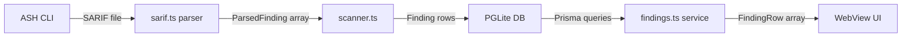
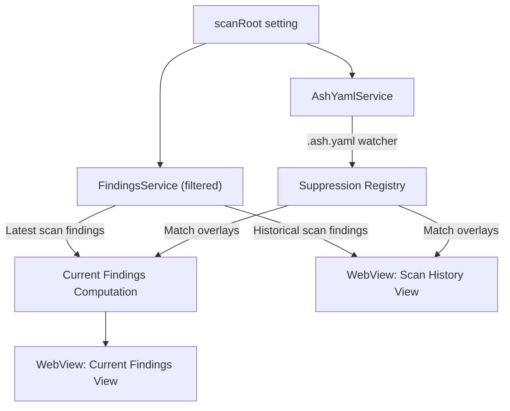

# Unified Findings Model: Research & Gap Analysis

Deep research into the current findings implementation, ASH CLI suppression mechanisms, and the architectural changes needed to deliver a unified "current findings" experience with `.ash.yaml`-backed suppression as the single source of truth.

## Overview

The ASH Workbench currently treats findings as scan-scoped database rows with an in-app `Disposition` enum (`PENDING | FIX | SUPPRESS | DEFER`). Suppression data exists only as a `SuppressionData` type stub (`suppression: null` on every `FindingRow`). The ASH CLI, meanwhile, has a mature suppression system backed by `.ash.yaml` that applies to SARIF output. These two systems are completely disconnected today.

The user's vision is:

1. **"Current findings"** = findings from the latest scan, with suppressions overlaid from `.ash.yaml`
2. **`.ash.yaml` is the single source of truth** for suppression triage
3. **A `scanRoot` setting** simplifies everything by scoping the app to one root at a time
4. **Past scan findings** remain accessible but show whether they're currently suppressed
5. **Future AI-assisted suppression** generates justifications written to `.ash.yaml`

---

## Architecture: Current State

### Data Flow



### Key Files

| Component | File | Purpose |
|-----------|------|---------|
| SARIF types | `vsix/src/types/sarif.ts` | `SarifResult`, `SarifRun`, `SarifLog` interfaces |
| SARIF parser | `vsix/src/services/sarif.ts` | Parses SARIF, deduplicates by `(ruleId, file)` |
| Scanner | `vsix/src/services/scanner.ts` | Spawns ASH CLI, stores findings in DB |
| Findings service | `vsix/src/services/findings.ts` | CRUD for findings, summary queries |
| Project service | `vsix/src/services/project.ts` | Uses first workspace folder as project root |
| Panel manager | `vsix/src/providers/findingsPanelManager.ts` | Routes WebView messages, coordinates state |
| DB schema | `vsix/prisma/schema.prisma` | `Project`, `ScanTarget`, `Scan`, `Finding` models |
| Type definitions | `vsix/src/models/types.ts` | Shared types (`FindingRow`, `Disposition`, etc.) |
| Mapper layer | `vsix/src/models/mappers.ts` | Prisma model `->` view model conversion |
| App state | `webview/src/App.tsx` | Reducer-based state, view navigation |
| Suppression panel | `webview/src/components/SuppressionPanel.tsx` | UI for suppression details (stub) |

### Database Schema

```
Project (rootPath: unique)
  ├── ScanTarget (projectId + path: unique)
  │     ├── Scan (status, findingsCount, severityBreakdown)
  │     │     └── Finding (ruleId, file, severity, disposition, notes)
  │     └── Finding (direct relation)
  └── Scan / Finding (direct relations)
```

**Key observations:**

- `Project.rootPath` = first workspace folder (`project.ts:14`)
- `ScanTarget.path` = the `targetPath` provided at scan time (can be any directory)
- Findings are tied to a specific `Scan` (cascade delete), a `ScanTarget`, and a `Project`
- `Disposition` is stored per-finding in the DB, not derived from `.ash.yaml`
- No concept of "current findings" exists; views are always scan-scoped or scan-target-scoped

### Current Disposition Model

`mappers.ts:65` hardcodes `suppression: null` on every `FindingRow`. The `SuppressionData` type exists:

```typescript
interface SuppressionData {
  justification: string;
  yamlEntry: string;
  expiresAt: string | null;
  createdAt: string;
}
```

But it's never populated. The `SuppressionPanel` component (`SuppressionPanel.tsx:13`) only renders when `disposition === 'SUPPRESS'`, but displays empty fields since `suppression` is always `null`.

### Current Scan Root Handling

There is no `scanRoot` setting. The project root is implicitly the first workspace folder (`project.ts:13-14`). Scan targets can be any arbitrary path:

- The `ScanTargetPicker` UI lets users pick workspace root, existing targets, or a custom path
- `scanner.ts:112-125` upserts a `ScanTarget` for whatever `targetPath` is provided
- No filtering by root path occurs — all targets/scans/findings for the project are shown

---

## ASH CLI Configuration System (`.ash.yaml`)

### File Discovery & Loading

**Filenames searched** (defined in `core/constants.py:26-31`):
`.ash.yml`, `.ash.yaml`, `.ash.json`, `ash.yml`, `ash.yaml`, `ash.json`

**Locations checked** (relative to `--source-dir` / scan root):
1. Root directory (e.g., `./. ash.yaml`)
2. `.ash/` subdirectory (e.g., `./.ash/.ash.yaml`)

**Environment variable interpolation** (`ash_config.py:519-558`):
```yaml
# ${VAR_NAME} or ${VAR_NAME:default_value}
project_name: ${ASH_PROJECT_NAME:my-project}
global_settings:
  severity_threshold: ${ASH_SEVERITY:MEDIUM}
```

**CLI runtime overrides** (`resolve_config.py:111-148`):
```bash
ash --config-overrides 'scanners.bandit.enabled=true'
ash --config-overrides 'global_settings.severity_threshold=LOW'
ash --config-overrides 'global_settings.ignore_paths+=[{"path":"build/","reason":"Generated"}]'
```

### Top-Level Configuration Structure

The `AshConfig` class (`ash_config.py:437-510`) defines these top-level sections:

```yaml
# .ash.yaml — complete top-level structure
project_name: "my-project"          # Default: $ASH_PROJECT_NAME or "ash-scan"
fail_on_findings: true               # Default: true — exit non-zero if findings found
ash_plugin_modules: []               # Python modules with custom ASH plugins
external_reports_to_include: []      # Paths to external SARIF/CycloneDX to merge

global_settings:                     # Global defaults shared across scanners
  severity_threshold: "MEDIUM"       # ALL | LOW | MEDIUM | HIGH | CRITICAL
  ignore_paths: []                   # Paths to exclude from scanning
  suppressions: []                   # Finding suppression rules

build: {}                            # Build-time configuration
converters: {}                       # File converter settings (archive, jupyter)
scanners: {}                         # Per-scanner enable/disable and options
reporters: {}                        # Output report format settings
mcp_resource_management: {}          # MCP server resource limits
```

### Global Settings Section

**Class:** `AshConfigGlobalSettingsSection` (`ash_config.py:410-434`)

#### `severity_threshold`

Global minimum severity. Findings below this level are excluded from reports.

| Value | Description |
|-------|-------------|
| `ALL` | Report all findings |
| `LOW` | LOW and above |
| `MEDIUM` | MEDIUM and above (default) |
| `HIGH` | HIGH and above |
| `CRITICAL` | CRITICAL only |

Default: `$ASH_DEFAULT_SEVERITY_LEVEL` env var, or `"MEDIUM"`.

#### `ignore_paths`

Global paths excluded from scanning. Uses `IgnorePathWithReason` model (`models/core.py:35-42`):

```yaml
global_settings:
  ignore_paths:
    - path: 'tests/test_data'        # Required: path or glob pattern
      reason: 'Test fixtures only'   # Required: reason for exclusion
      expiration: '2025-12-31'       # Optional: YYYY-MM-DD auto-expire
    - path: 'node_modules/**'
      reason: 'Third-party dependencies'
    - path: 'build/'
      reason: 'Generated output'
```

Ignore paths are applied **before scanning** — excluded files are never sent to scanners.

#### `suppressions`

Finding suppression rules. Uses `AshSuppression` model (`models/core.py:57-97`):

```yaml
global_settings:
  suppressions:
    - path: 'src/*.py'               # Required: file path or glob pattern
      reason: 'False positive'       # Required: justification text
      rule_id: 'B101'                # Optional: rule ID (supports globs, e.g. 'B*')
      line_start: 10                 # Optional: start line
      line_end: 15                   # Optional: end line (must be >= line_start)
      expiration: '2025-12-31'       # Optional: YYYY-MM-DD expiration date
```

**Matching logic** (`suppression_matcher.py:15-141`):
1. **Rule ID**: `fnmatch` glob matching (`B*` matches `B605`)
2. **File path**: `fnmatch` glob matching (`src/**/*.py`)
3. **Line range**: Overlap check between suppression and finding line ranges
4. **Expiration**: Expired suppressions are skipped during matching

**Validation** (`core.py:70-96`):
- `line_end` must be `>=` `line_start` if both provided
- Expiration date must be in the future at config load time
- Date format strictly `YYYY-MM-DD`

### Suppression SARIF Integration

ASH applies suppressions **after** SARIF generation, **before** reporting (`scan_phase.py:1426-1436`):

```python
suppression = Suppression(
    kind=Kind1.external,
    justification=f"(ASH) Suppressing finding for rule '{result.ruleId}' ..."
)
result.suppressions.append(suppression)
```

**Critical finding:** The SARIF output from ASH already contains suppression data in `result.suppressions[]`. However, the workbench's `SarifResult` type (`vsix/src/types/sarif.ts`) **does not include a `suppressions` field**, so this data is silently dropped during parsing.

### Suppression Lifecycle Events

**Expiration checker** (`suppression_expiration_checker.py`):
- Runs on `EXECUTION_START` event (before scanning)
- Warns if suppressions expire within 30 days
- Expired suppressions are automatically skipped during matching

**Unused suppressions reporter** (`unused_suppressions_reporter.py`):
- Generates `ash.unused-suppressions.json` and `ash.unused-suppressions.md`
- Tracks which `.ash.yaml` suppression entries didn't match any findings
- Suppression ID format: `path|rule_id|line_start|line_end` (wildcards for unset fields)

### `build` Section

**Class:** `BuildConfig` (`ash_config.py:100-118`)

```yaml
build:
  build_mode: "ONLINE"               # ONLINE | OFFLINE — container image build mode
  tool_install_scripts:               # Map of tool name → install commands
    my_tool:
      - "pip install my-tool"
  custom_scanners: []                 # Custom scanner plugin definitions
```

### `converters` Section

**Class:** `ConverterConfigSegment` (`ash_config.py:121-139`)

File converters run **before** scanners to transform non-scannable formats:

```yaml
converters:
  archive:
    enabled: true                     # Extract ZIP/TAR/GZIP before scanning
    options: {}
  jupyter:
    enabled: true                     # Convert .ipynb to .py before scanning
    options: {}
```

### `scanners` Section

**Class:** `ScannerConfigSegment` (`ash_config.py:141-188`)

All scanners share a common config pattern:

```yaml
scanners:
  SCANNER_NAME:
    enabled: true                     # Enable/disable this scanner
    options:
      severity_threshold: null        # Override global threshold (or null to inherit)
      # ...scanner-specific options
```

#### Built-in Scanners

| Scanner | Language/Domain | Key Options |
|---------|----------------|-------------|
| `bandit` | Python SAST | `config_file`, `confidence_level` (all/low/medium/high), `ignore_nosec`, `excluded_paths`, `tool_version` |
| `checkov` | IaC SAST | `config_file`, `frameworks` (all/CloudFormation/Terraform/Kubernetes/...), `skip_frameworks`, `offline`, `tool_version` |
| `semgrep` | Multi-lang SAST | `config` ("auto" or custom), `exclude`, `exclude_rule`, `severity` (INFO/WARNING/ERROR), `offline` |
| `opengrep` | Multi-lang SAST | Same options as semgrep plus `patterns`, `version` |
| `detect_secrets` | Secrets scanning | `baseline_file`, `scan_settings` (inline plugins/filters config) |
| `cdk_nag` | AWS CDK IaC | `nag_packs` with toggles: `AwsSolutionsChecks` (default on), `HIPAASecurityChecks`, `NIST80053R4Checks`, `NIST80053R5Checks`, `PCIDSS321Checks` |
| `cfn_nag` | CloudFormation IaC | (no scanner-specific options) |
| `grype` | Vulnerability SCA | `config_file`, `severity_threshold`, `offline` |
| `npm_audit` | Node.js SCA | `offline` |
| `syft` | SBOM generation | `config_file`, `exclude`, `additional_outputs` (cyclonedx-json, spdx-json, syft-table, etc.) |

**Common options across UV-managed scanners** (bandit, checkov, semgrep, opengrep):
- `tool_version`: Version constraint for UV tool installation (e.g., `">=1.7.0,<2.0.0"`)
- `install_timeout`: Timeout in seconds for tool installation (default: 300)

**Example scanner configuration:**

```yaml
scanners:
  bandit:
    enabled: true
    options:
      confidence_level: "medium"
      excluded_paths:
        - path: "tests/"
          reason: "Test code - lower risk"
  checkov:
    enabled: true
    options:
      frameworks: ["cloudformation", "terraform"]
      offline: true
  semgrep:
    enabled: false                   # Disabled — using opengrep instead
  grype:
    enabled: true
    options:
      severity_threshold: "HIGH"     # Only report HIGH+ vulnerabilities
  cdk_nag:
    enabled: true
    options:
      nag_packs:
        AwsSolutionsChecks: true
        HIPAASecurityChecks: true
```

### `reporters` Section

**Class:** `ReporterConfigSegment` (`ash_config.py:190-254`)

Controls which output formats are generated. All reporters follow:

```yaml
reporters:
  REPORTER_NAME:
    enabled: true                    # Enable/disable
    extension: ".ext"                # Output file extension (auto-determined if omitted)
    options: {}                      # Reporter-specific options
```

#### Built-in Reporters

| Reporter | Extension | Default Enabled | Notable Options |
|----------|-----------|-----------------|-----------------|
| `sarif` | `.sarif` | Yes | (none) |
| `csv` | `.csv` | Yes | (none) |
| `html` | `.html` | Yes | (none) |
| `markdown` | `.md` | Yes | `include_summary`, `include_findings_table`, `max_detailed_findings` (20), `top_hotspots_limit` (10), `use_collapsible_details` |
| `text` | `.summary.txt` | Yes | `include_summary`, `include_findings_table`, `include_detailed_findings`, `max_detailed_findings` (20) |
| `flat-json` | `.flat.json` | Yes | `include_scanner_metrics`, `include_summary_metrics`, `include_metadata` |
| `junitxml` | `.junit.xml` | Yes | `respect_severity_threshold` |
| `cyclonedx` | `.cdx.json` | Yes | (none) |
| `gitlab-sast` | `.gl-sast-report.json` | Yes | (none) |
| `ocsf` | `.ocsf.json` | Yes | (none) |
| `unused-suppressions` | `.unused-suppressions.json` | Yes | `output_format` ("json", "markdown", or "both") |
| `spdx` | `.spdx.json` | No | (none) |
| `yaml` | `.yaml` | No | (none) |

### `mcp_resource_management` Section

**Class:** `MCPResourceManagementConfig` (`ash_config.py:257-408`)

Controls ASH's MCP server mode resource limits:

```yaml
mcp_resource_management:
  # Concurrency
  max_concurrent_scans: 3            # 1-10
  max_concurrent_tasks: 20           # 1-50
  thread_pool_max_workers: 4         # 1-20

  # Timeouts (seconds)
  scan_timeout_seconds: 1800         # 60-7200 (default: 30 min)
  operation_timeout_seconds: 180     # 30-600 (default: 3 min)
  shutdown_timeout_seconds: 30       # 5-300

  # Resource limits
  memory_warning_threshold_mb: 1024  # 100-8192
  memory_critical_threshold_mb: 2048 # 200-16384
  max_message_size_bytes: 10485760   # 1KB-100MB (default: 10MB)
  max_directory_size_mb: 1000        # 10-10240 (default: 1GB)

  # Health monitoring
  enable_health_checks: true
  health_check_interval_seconds: 60  # 10-300
```

### Other Top-Level Fields

#### `fail_on_findings`

```yaml
fail_on_findings: true               # Default: true
```

When `true`, ASH exits with code 2 if any findings are detected (after severity threshold filtering). When `false`, always exits 0 on successful completion. The workbench scanner service already handles both exit codes (`scanner.ts:329`).

#### `ash_plugin_modules`

```yaml
ash_plugin_modules:
  - "my_custom_plugin"               # Python module with ASH event subscribers
  - "another_plugin.scanners"
```

Loads custom scanner, converter, or reporter plugins from Python modules.

#### `external_reports_to_include`

```yaml
external_reports_to_include:
  - "./third-party-scan.sarif"       # SARIF or CycloneDX report paths
  - "./vendor-audit.cdx.json"
```

Merges external security reports into ASH's aggregated output. Useful for incorporating results from tools ASH doesn't run directly.

### Key Environment Variables

| Variable | Default | Used By |
|----------|---------|---------|
| `ASH_PROJECT_NAME` | `"ash-scan"` | `project_name` field default |
| `ASH_DEFAULT_SEVERITY_LEVEL` | `"MEDIUM"` | `global_settings.severity_threshold` default |
| `ASH_OFFLINE` | `"NO"` | Default for scanner `offline` options |
| `UV_EXECUTABLE` | (system UV) | Custom UV tool path |

### Relevance to Workbench

**Directly relevant to findings/suppression:**
- `global_settings.suppressions` — the single source of truth for finding suppression
- `global_settings.ignore_paths` — determines what files were never scanned (context for "why don't I see findings for X?")
- `global_settings.severity_threshold` — determines the minimum severity in scan output; the workbench should be aware of this to avoid confusion when findings seem "missing"
- `fail_on_findings` — informs exit code handling (already handled)
- `reporters.unused-suppressions` — the workbench could parse this report to show unused suppression info

**Potentially relevant for future workbench features:**
- `scanners.*` — the workbench could show which scanners are enabled/configured
- `project_name` — could be displayed in the dashboard instead of the workspace folder name
- `external_reports_to_include` — context for why some findings come from unexpected scanners
- Scanner `severity_threshold` overrides — could explain per-scanner severity filtering

---

## Gap Analysis

### Gap 1: No `scanRoot` Setting

**Current:** Project root = first workspace folder (hardcoded in `project.ts`). Scan targets can be any path.

**Needed:** A `ashWorkbench.scanRoot` VS Code setting that:
- Defaults to `${workspaceFolder}`
- Scopes all dashboard/scan/findings operations to that root
- Filters out scans/findings from non-matching roots when changed
- Takes effect in real-time via `vscode.workspace.onDidChangeConfiguration`

**Impact:** Simplifies the entire data model. With a single scan root, the `ScanTarget` concept becomes largely unnecessary (there's only one target). The "scan target picker" simplifies to just "run scan."

### Gap 2: SARIF Suppressions Not Captured

**Current:** `SarifResult` type (`vsix/src/types/sarif.ts`) lacks a `suppressions` field. The SARIF parser (`sarif.ts`) ignores suppression data entirely.

**Needed:** Extend `SarifResult` to include:
```typescript
suppressions?: Array<{
  kind: 'external' | 'inSource';
  justification?: string;
}>;
```

The parser should check `result.suppressions` and set `disposition: 'SUPPRESS'` automatically when ASH has already suppressed a finding.

### Gap 3: `.ash.yaml` Not Read by the Extension

**Current:** The extension never reads `.ash.yaml`. Dispositions are purely in-app DB state.

**Needed:** A service that:
1. Reads `.ash.yaml` from the scan root (and `.ash/.ash.yaml`)
2. Parses the `global_settings.suppressions` array
3. Provides a `matchesSuppression(finding)` function using the same logic as ASH CLI (glob matching on path, ruleId; line range overlap; expiration check)
4. Watches for `.ash.yaml` changes (`vscode.workspace.createFileSystemWatcher`)

### Gap 4: No "Current Findings" Concept

**Current:** Findings are always viewed per-scan or per-scan-target. Every scan creates its own finding rows. There's no merged/unified view.

**Needed:** A "current findings" view that:
1. Takes findings from the **latest completed scan** for the scan root
2. Overlays suppression status from `.ash.yaml` (not from DB disposition)
3. Shows this as the default/primary view
4. Deduplicates findings by the existing `(ruleId, file)` composite key

### Gap 5: Disposition Model Mismatch

**Current:** Disposition (`PENDING | FIX | SUPPRESS | DEFER`) is a per-finding DB column. `SUPPRESS` is just another in-app flag.

**Needed:**
- `SUPPRESS` disposition should derive from `.ash.yaml` matching (read-only from the workbench's perspective for the current state)
- Writing a suppression in the workbench should write to `.ash.yaml` (the source of truth)
- `FIX` and `DEFER` can remain as in-app triage states (they don't map to `.ash.yaml`)
- A finding can be both "suppressed in .ash.yaml" and have an in-app triage note

### Gap 6: No `.ash.yaml` Write Capability

**Current:** The extension never writes `.ash.yaml`.

**Needed:** When a user marks a finding as `SUPPRESS`:
1. Generate the appropriate `.ash.yaml` entry (path, rule_id, reason, optionally line_start/end, expiration)
2. Append it to `.ash.yaml` (creating the file if it doesn't exist)
3. This becomes the future hook point for AI-generated justifications

### Gap 7: Past Scan Findings Missing Suppression Overlay

**Current:** Historical findings show their disposition at the time of triage. No indication of whether `.ash.yaml` currently suppresses them.

**Needed:** When viewing historical scan findings, overlay current `.ash.yaml` suppression status. Show a "currently suppressed" indicator even if the finding was from a previous scan. This tells the user: "this issue exists in this old scan, but your current `.ash.yaml` would suppress it."

### Gap 8: No Suppression Management Interface

**Current:** The `SuppressionPanel` component exists but shows empty data. No way to view or manage `.ash.yaml` entries from the UI.

**Needed:** A dedicated suppression management interface showing:
- All current suppressions from `.ash.yaml`
- Which suppressions are active vs expired
- Which suppressions matched findings in the latest scan
- Which suppressions are unused
- Ability to add, edit, remove suppressions (writes to `.ash.yaml`)

### Gap 9: Settings Watcher Not Implemented

**Current:** Settings are read once at scan time (`scanner.ts:72-85`). No change listener.

**Needed:** The `scanRoot` setting must trigger real-time updates:
- `vscode.workspace.onDidChangeConfiguration` handler
- Re-filter displayed data immediately
- Possibly re-read `.ash.yaml` from new root

---

## Detailed Design Considerations

### Scan Root Simplification

With a `scanRoot` setting:

1. **One root, one active context.** The dashboard shows findings for the scan root only.
2. **ScanTarget model can be retained** but there's effectively one "active" target matching `scanRoot`.
3. **Switching roots** doesn't delete data — it just filters the view. Historical scans from other roots are hidden but preserved.
4. **Default:** `${workspaceFolder}` resolves to the first workspace folder's path at runtime.

### "Current Findings" Computation

```
currentFindings = latestScan.findings
  .map(f => ({
    ...f,
    isCurrentlySuppressed: ashYamlService.matchesSuppression(f),
    suppressionSource: ashYamlService.getMatchingSuppression(f), // null or suppression entry
  }))
```

The "current findings" is not a database concept — it's a **computed view** derived from:
1. The latest completed scan's findings
2. The current `.ash.yaml` state

This means no schema change is needed for the "current" concept — it's a service-layer computation.

### Suppression Matching in the Extension

The extension needs to replicate ASH CLI's matching logic:
- `fnmatch`-style glob matching (use `picomatch` or `minimatch` npm package)
- Line range overlap check
- Expiration date check

This is straightforward — the ASH CLI logic in `suppression_matcher.py` is ~130 lines and maps cleanly to TypeScript.

### `.ash.yaml` File Operations

**Reading:**
- Parse YAML using `js-yaml` (already a common dependency)
- Look in `${scanRoot}/.ash.yaml` and `${scanRoot}/.ash/.ash.yaml`
- Cache parsed result; invalidate on file system watcher events

**Writing (for suppression creation):**
- Read existing `.ash.yaml` (or create with skeleton structure)
- Append new suppression entry to `global_settings.suppressions` array
- Write back with `js-yaml` dump
- Preserve comments where possible (consider `yaml` npm package for comment preservation)

### State Architecture



### AI-Assisted Suppression (Future)

The architecture should support:
1. User clicks "Suppress" on a finding
2. Extension optionally calls LLM to generate justification
3. Generated justification + YAML entry shown in `SuppressionPanel`
4. User confirms/edits
5. Entry written to `.ash.yaml`

The `SuppressionData` type already has `justification` and `yamlEntry` fields — these just need to be populated.

---

## Patterns and Conventions

### Extension Host Owns State (Constitution Principle II)

The `.ash.yaml` service must live in the extension host, not the WebView. The WebView receives computed `FindingRow` objects with suppression status already resolved.

### Typed Contracts at Boundaries (Constitution Principle IV)

The `FindingRow` type needs updating to carry suppression status:

```typescript
interface FindingRow {
  // ... existing fields ...
  suppression: SuppressionData | null;       // Matched .ash.yaml entry
  isCurrentlySuppressed: boolean;            // Quick-check flag
  suppressionSource: 'ash_yaml' | 'sarif' | null;  // Where suppression came from
}
```

### Configuration Pattern

Follow existing VS Code settings pattern in `package.json`. The `scanRoot` should use `scope: "resource"` to support multi-root workspaces:

```json
"ashWorkbench.scanRoot": {
  "type": "string",
  "default": "${workspaceFolder}",
  "scope": "resource",
  "description": "Root directory for ASH scans. Defaults to workspace root."
}
```

---

## Issues and Risks

### Risk 1: Suppression Matching Fidelity

The extension's suppression matcher must produce **identical results** to the ASH CLI's Python implementation. Any divergence means the UI shows a suppression state that doesn't match what ASH actually does. Mitigation: port the matcher logic precisely; write extensive tests with shared test fixtures.

### Risk 2: `.ash.yaml` Write Conflicts

If the user edits `.ash.yaml` externally while the extension is also writing, data could be lost. Mitigation: use a read-modify-write pattern with file locking, or at minimum re-read before writing.

### Risk 3: SARIF Suppressions vs `.ash.yaml` Overlap

ASH applies suppressions before writing SARIF. When we also read `.ash.yaml` independently, we might double-count. The SARIF already marks some results as suppressed; the extension also checks `.ash.yaml`. Need a clear precedence: SARIF `suppressions[]` is informational, but `.ash.yaml` is authoritative. If `.ash.yaml` changes after the scan, the overlay should reflect the **current** `.ash.yaml`, not what was in SARIF at scan time.

### Risk 4: Performance with Large Finding Sets

Matching every finding against every suppression rule on each `.ash.yaml` change could be slow for large codebases. Mitigation: cache match results; only re-compute on file change or new scan.

### Risk 5: `${workspaceFolder}` Variable Resolution

VS Code supports variable substitution in settings. Need to resolve `${workspaceFolder}` at runtime. This is standard VS Code behavior but needs explicit handling.

---

## Key Takeaways

1. **The SARIF output already contains suppression data** (`result.suppressions[]`) but the workbench silently drops it. This is the lowest-hanging fruit.

2. **`.ash.yaml` must be the single source of truth.** The in-app `Disposition` column for `SUPPRESS` should become a derived state from `.ash.yaml`, not a DB column.

3. **"Current findings" is a computed view**, not a database concept. It's `latestScan.findings + ashYaml.suppressions`.

4. **The `scanRoot` setting eliminates multi-target complexity.** With one root, dashboard/scan/findings simplify dramatically.

5. **AI-assisted suppression maps cleanly** to the `.ash.yaml` write path. The architecture should be designed so that human and AI suppressions use the same write pipeline.

6. **Historical findings get a "currently suppressed" overlay** from `.ash.yaml`, giving users context about what their current suppression rules would do to old findings.

---

## Outstanding Questions

1. **Should `FIX` and `DEFER` dispositions persist in the DB or also externalize?** They don't map to `.ash.yaml` suppressions. Keeping them in-DB seems correct since they're workbench-specific triage state. But should we consider an `.ash-workbench.yaml` for non-suppression triage?

2. **How should the extension handle `.ash.yaml` entries that were not created by the workbench?** Users may hand-edit `.ash.yaml` or have it committed in their repo. The workbench should be a good citizen and not overwrite/mangle these entries.

3. **Should the "Current Findings" view allow filtering by suppression status?** e.g., "Show me all findings including suppressed ones" vs. "Show me only non-suppressed findings." The default should probably hide suppressed findings (matching ASH CLI behavior) with a toggle to show them.

4. **When switching `scanRoot`, should the DB be cleaned up or just filtered?** Keeping old data is safer but may grow the PGLite database. A periodic cleanup command could help.

5. **Should SARIF suppression data be parsed at all, or should the extension always re-derive from `.ash.yaml`?** Using only `.ash.yaml` is simpler and more correct (it reflects current state), but SARIF data could serve as a cross-check or fallback if `.ash.yaml` is missing.

---

## Recommended Implementation Plan

### Phase 1: Scan Root Setting & Foundation

1. **Add `scanRoot` setting** — Register `ashWorkbench.scanRoot` in `package.json` with `${workspaceFolder}` default; add `getEffectiveScanRoot()` utility to resolve the variable
2. **Add settings change listener** — Wire `onDidChangeConfiguration` in `extension.ts`; propagate root changes to all services and trigger UI refresh
3. **Filter services by scan root** — Modify `FindingsService.getScanSummaries()`, `getScanTargets()`, and `getSummary()` to filter by the active scan root path
4. **Simplify scan initiation** — Default `startScan` to use `scanRoot` instead of requiring a target path from the picker; retain the picker for one-off custom paths

### Phase 2: `.ash.yaml` Read Service

1. **Create `AshYamlService`** — New service in `vsix/src/services/ashYaml.ts` that reads and parses `.ash.yaml` from scan root (both `.ash.yaml` and `.ash/.ash.yaml` locations)
2. **Implement suppression matcher** — Port ASH CLI's matching logic (`fnmatch` glob for path/rule_id, line range overlap, expiration check) using `picomatch` npm package
3. **Add file system watcher** — Watch `.ash.yaml` for changes; re-parse and re-match on change; debounce for rapid edits
4. **Unit test the matcher** — Port relevant test cases from ASH CLI's `test_suppression_matcher.py`; ensure identical matching behavior

### Phase 3: Current Findings Computation

1. **Implement `getCurrentFindings()`** — New method that fetches latest scan's findings and overlays suppression status from `AshYamlService`
2. **Update `FindingRow` type** — Add `isCurrentlySuppressed: boolean` and `suppressionSource: 'ash_yaml' | 'sarif' | null`; populate `suppression: SuppressionData` from matched `.ash.yaml` entries
3. **Add "Current Findings" as default view** — Make the dashboard default to current findings instead of requiring scan selection
4. **Historical scan overlay** — When viewing past scan findings, show "currently suppressed" indicator by matching against current `.ash.yaml`

### Phase 4: `.ash.yaml` Write & Suppression Management

1. **Implement `.ash.yaml` writer** — Read-modify-write service that appends suppression entries to `.ash.yaml`; creates file with skeleton structure if absent
2. **Wire "Suppress" action to `.ash.yaml`** — When user sets `SUPPRESS` disposition, generate `.ash.yaml` entry and write it; populate `SuppressionPanel` with real data
3. **Build suppression management view** — Dedicated interface listing all `.ash.yaml` suppressions: active vs expired, matched vs unused, with edit/remove capability
4. **SARIF suppression parsing** — Extend `SarifResult` type to include `suppressions[]`; use as informational cross-reference in the UI

### Phase 5: UI Polish & Integration

1. **Update dashboard for unified findings** — Show current findings count, suppressed count, triage progress against non-suppressed findings
2. **Add suppression filter toggle** — Allow showing/hiding suppressed findings in all finding list views
3. **Refine scan history with suppression overlay** — Past scans show which findings are currently suppressed by `.ash.yaml`
4. **Prepare AI suppression hook** — Design the `suppressWithAI()` flow that generates justification via LLM and writes to `.ash.yaml` (implementation deferred to AI feature work)

---

## Recommended `speckit.specify` Inputs

The following feature specifications should be created via `/speckit.specify` to drive implementation. Suggested sequence matches the phases above.

### Spec 1: Scan Root Setting (`scanRoot`)

```
Feature: Scan Root Setting

Add an `ashWorkbench.scanRoot` VS Code setting that scopes all scan, findings,
and dashboard operations to a single root directory. Defaults to ${workspaceFolder}.
Configurable via standard VS Code settings UI (user/folder/workspace levels).
Changes take effect in real-time.

When scanRoot changes:
- All views filter to show only scans/findings matching the new root
- Scan initiation defaults to the new root
- .ash.yaml is re-read from the new root

Simplifies the application by eliminating multi-target complexity.
```

### Spec 2: `.ash.yaml` Integration (Read)

```
Feature: .ash.yaml Suppression Read Service

Introduce a service that reads .ash.yaml from the scanRoot, parses the
global_settings.suppressions array, and provides a matchesSuppression(finding)
function that replicates ASH CLI's matching logic (glob patterns for path/rule_id,
line range overlap, expiration check).

File system watcher triggers re-parse on .ash.yaml changes. Cached suppression
registry is available to all findings queries.

This is the foundation for making .ash.yaml the single source of truth for
suppression state in the workbench.
```

### Spec 3: Unified Current Findings View

```
Feature: Unified Current Findings

Replace the scan-scoped findings view with a "Current Findings" concept:
- Current findings = latest completed scan's findings + .ash.yaml suppression overlay
- Default dashboard view shows current findings (not per-scan)
- Suppressed findings are hidden by default with a toggle to show them
- Triage progress is computed against non-suppressed findings only
- Historical scans remain accessible and show "currently suppressed" indicators
  for findings that match current .ash.yaml rules
```

### Spec 4: `.ash.yaml` Write & Suppression Management

```
Feature: .ash.yaml Write and Suppression Management UI

Enable writing suppression entries to .ash.yaml when users mark findings as SUPPRESS:
- Generate path, rule_id, reason fields from finding data
- Show generated entry in SuppressionPanel for review before writing
- Create .ash.yaml with skeleton structure if it doesn't exist
- Preserve existing file contents (append-only for suppressions)

Add dedicated suppression management interface showing:
- All .ash.yaml suppression entries
- Active vs expired status
- Matched vs unused suppressions from latest scan
- Edit/remove capabilities (modify .ash.yaml)

Future: AI-generated justification plugs into this write pipeline.
```

### Recommended Sequence

1. **Spec 1 (Scan Root)** first — this simplifies everything downstream
2. **Spec 2 (`.ash.yaml` Read)** second — establishes the suppression data source
3. **Spec 3 (Current Findings)** third — delivers the primary user experience
4. **Spec 4 (`.ash.yaml` Write)** fourth — enables the triage-to-suppression workflow
