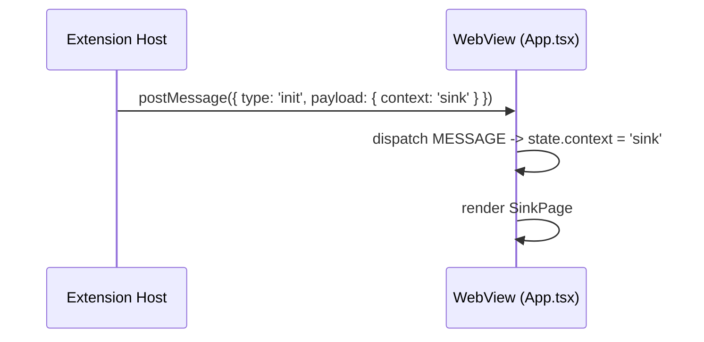
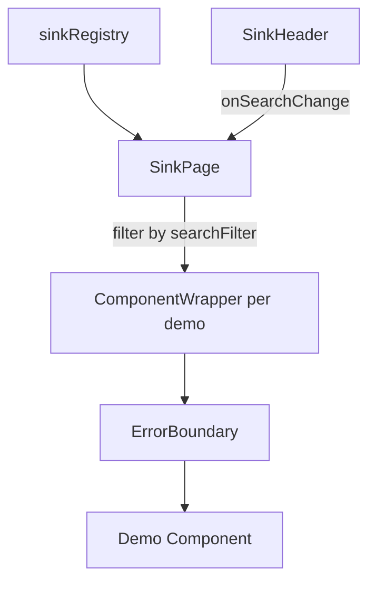

# Kitchen Sink — As-Built Documentation

## Overview

The Kitchen Sink is a **development-only** component showcase that renders inside a dedicated VS Code editor panel. It serves as a living reference for every UI primitive and app-specific component available in the webview design system, allowing developers to visually inspect components against the real VS Code theme (dark, light, or high-contrast) without navigating the production application.

The sink is activated via a `postMessage` context switch — the extension host sends `{ type: 'init', payload: { context: 'sink' } }` to the shared webview, which renders `SinkPage` instead of the production UI. The command is gated behind `ExtensionMode.Development`, so it is invisible in published builds.

The Kitchen Sink currently houses **22 component demos** (19 ShadCN primitives + 3 app-specific components) registered through a central registry. Every demo is isolated with its own error boundary so a failure in one component never crashes the entire showcase.

## Architecture

### Context-Driven Rendering (No Router)

The webview app does **not** use React Router. Instead, the extension host controls which UI renders by sending an `init` message with a `context` discriminator:



`App.tsx` uses a `useReducer` to track `context`, which can be `'sidebar'`, `'editorPanel'`, `'sink'`, or `'unknown'`. When `context === 'sink'`, it renders `<SinkPage />` directly — no routing, no lazy loading.

### Entry Points (Two Paths)

There are two ways to open the Kitchen Sink:

1. **Command Palette:** `ASH: Open Kitchen Sink` (`ashWorkbench.openKitchenSink`) — registered in `extension.ts:27` only when `extensionMode === Development`. Creates a new `WebviewPanel` via `SinkPanelManager`.

2. **Sidebar message:** The sidebar webview can send `{ type: 'openSink' }`, which the `SidebarWebviewProvider` handles at `sidebarWebviewProvider.ts:61` by calling `sinkPanelManager.show()`.

Both paths end at `SinkPanelManager.show()`, which creates (or reveals) a panel and posts the `init` message with `context: 'sink'`.

### Component Registry

The registry (`sink-registry.ts`) is the single source of truth for all showcased components:

```typescript
type SinkComponentConfig = {
  name: string;                    // Display name
  component: ComponentType;        // The demo component
  className?: string;              // Optional wrapper class override
  type: 'ui' | 'app';             // Category: ShadCN primitive vs app-specific
  label?: string;                  // Optional badge label (e.g., "New")
};
```

Components typed as `ui` are ShadCN design system primitives. Components typed as `app` are ASH Workbench-specific components (e.g., `SeverityBadge`, `DispositionBadge`).

### Data Flow



All rendering is synchronous and local. No API calls, no state management beyond the search filter, no communication back to the extension host.

## File Inventory

### Extension Host (vsix/)

| File | Responsibility |
|------|---------------|
| `vsix/src/providers/sinkPanelManager.ts` | Creates/reveals the Kitchen Sink `WebviewPanel`, sends `init` message with `context: 'sink'` |
| `vsix/src/extension.ts:24-31` | Registers `ashWorkbench.openKitchenSink` command (dev mode only) |
| `vsix/src/providers/sidebarWebviewProvider.ts:61-64` | Handles `openSink` message from sidebar webview |
| `vsix/src/providers/webviewHtml.ts` | Generates webview HTML shell (shared across all webview contexts) |
| `vsix/src/models/messages.ts:22` | Declares `openSink` message type |
| `vsix/package.json:52-55` | Declares `ashWorkbench.openKitchenSink` command in contributes |

### WebView — Core Pages

| File | Responsibility |
|------|---------------|
| `webview/src/App.tsx:104-106` | Context switch: renders `<SinkPage />` when `state.context === 'sink'` |
| `webview/src/pages/sink/SinkPage.tsx` | Main page: search state, filters registry, renders grid of `ComponentWrapper` |
| `webview/src/pages/sink/sink-registry.ts` | Central registry mapping keys to demo components with metadata |
| `webview/src/pages/sink/components/sink-header.tsx` | Sticky header with title, separator, and search input |
| `webview/src/pages/sink/components/component-wrapper.tsx` | Card wrapper with error boundary, name header, and content area |

### Component Demos (22 files)

All located in `webview/src/pages/sink/demos/`. Each file exports a single named demo function.

**ShadCN Primitives (19):**

| Demo | ShadCN Components Exercised |
|------|---------------------------|
| `accordion-demo.tsx` | Accordion, AccordionItem, AccordionTrigger, AccordionContent |
| `alert-demo.tsx` | Alert, AlertTitle, AlertDescription (default + destructive + custom amber) |
| `badge-demo.tsx` | Badge (all variants: default, secondary, destructive, outline, pill counters) |
| `button-demo.tsx` | Button (all variants x 3 sizes + icon buttons + disabled) |
| `card-demo.tsx` | Card, CardHeader, CardTitle, CardDescription, CardContent, CardFooter (7 layout combinations) |
| `checkbox-demo.tsx` | Checkbox |
| `dialog-demo.tsx` | Dialog with form + Dialog with scrollable content |
| `dropdown-menu-demo.tsx` | DropdownMenu with label, items, separator |
| `input-demo.tsx` | Input (14 HTML input types: email, text, password, number, file, tel, url, search, date, datetime-local, month, time, week + disabled) |
| `label-demo.tsx` | Label with Checkbox, Input, disabled Input, Textarea |
| `progress-demo.tsx` | Progress (animated + 4 static values) |
| `select-demo.tsx` | Select with groups + large list (50 items) + disabled |
| `separator-demo.tsx` | Separator (horizontal + vertical) |
| `skeleton-demo.tsx` | Skeleton (avatar + text lines + 3 card placeholders) |
| `switch-demo.tsx` | Switch (default + custom color + card-style label wrapper) |
| `table-demo.tsx` | Table with header, body, footer, caption (7-row invoice data) |
| `tabs-demo.tsx` | Tabs |
| `textarea-demo.tsx` | Textarea |
| `tooltip-demo.tsx` | Tooltip (default + 4 placement sides + icon trigger) |

**App-Specific Components (3):**

| Demo | Component | Source |
|------|-----------|--------|
| `severity-badge-demo.tsx` | `SeverityBadge` | `components/SeverityBadge.tsx` — renders all 5 ASH severity levels (CRITICAL, HIGH, MEDIUM, LOW, INFO) |
| `disposition-badge-demo.tsx` | `DispositionBadge` | `components/DispositionBadge.tsx` — renders all 4 disposition states (PENDING, FIX, SUPPRESS, DEFER) |
| `tasks-demo.tsx` | TanStack React Table | Inline data table with sorting, filtering, pagination, row selection, dropdown actions, and status/priority badges with dark mode styles |

### Theme Infrastructure

| File | Responsibility |
|------|---------------|
| `webview/src/index.css` | VS Code theme bridge: maps `--vscode-*` CSS variables to ShadCN design tokens; sets `color-scheme: dark` on `.vscode-dark` and `.vscode-high-contrast` |

## Implementation Details

### SinkPage Rendering

`SinkPage` maintains a single `searchFilter` state. It filters the registry by display name (case-insensitive) and renders each matching entry inside a `ComponentWrapper`:

```tsx
// webview/src/pages/sink/SinkPage.tsx
const filtered = Object.entries(sinkRegistry).filter(
  ([, config]) => config.name.toLowerCase().includes(searchFilter.toLowerCase())
);

return (
  <div className="flex flex-col min-h-screen">
    <SinkHeader searchFilter={searchFilter} onSearchChange={setSearchFilter} />
    <div className="grid flex-1 gap-4 p-4">
      {filtered.map(([key, config]) => (
        <ComponentWrapper key={key} name={key} className={config.className}>
          <Demo />
        </ComponentWrapper>
      ))}
    </div>
  </div>
);
```

The layout is a single scrollable column — no sidebar, no detail pages, no multi-panel navigation.

### SinkHeader

A sticky header (`top-0 z-10`) with:
- "Kitchen Sink" title
- Vertical separator
- Plain `<input>` (not the ShadCN `Input` component) for filtering
- Conditional "Clear" button when filter is active

The header uses `bg-[var(--background)]` directly to ensure it matches the VS Code editor background when sticky.

### ComponentWrapper and Error Boundary

Each demo is wrapped in a `ComponentWrapper` that provides:
1. A bordered card container with rounded corners
2. A header bar showing the component name (auto-generated from the kebab-case registry key via `getComponentName()`)
3. A content area with padding and flex centering
4. A class-based `ComponentErrorBoundary` that catches render errors per-demo

The error boundary logs to console and renders a red error message. This prevents a broken demo from taking down the entire page.

### SinkPanelManager (Extension Host)

`SinkPanelManager` manages a singleton `WebviewPanel`:
- **First call to `show()`:** Creates a new panel (`ashWorkbench.kitchenSink`, title "ASH Kitchen Sink"), sets HTML via shared `getWebviewHtml()`, sends `init` message, and listens for `onDidReceiveMessage` to re-send init on webview ready
- **Subsequent calls:** Reveals the existing panel and re-sends the `init` message
- **Panel disposal:** Clears the reference so the next `show()` creates a fresh panel

Panel options: `enableScripts: true`, `localResourceRoots: [extensionUri/webview-dist]`, `retainContextWhenHidden: true`.

### Dark Mode / Theme Integration

The webview inherits VS Code's theme via CSS custom properties. Key mechanism:

1. VS Code injects `--vscode-*` CSS variables and a class on `<body>` (`.vscode-dark`, `.vscode-light`, or `.vscode-high-contrast`)
2. `index.css` maps these to ShadCN design tokens (e.g., `--background: var(--vscode-editor-background, ...)`)
3. Tailwind's dark variant is remapped via `@custom-variant dark (&:is(.vscode-dark *))` so `dark:` utilities work
4. `color-scheme: dark` is set on `.vscode-dark` and `.vscode-high-contrast` so native browser controls (date picker icons, scrollbars, etc.) render with light-colored icons against dark backgrounds

### Tasks Demo (Data Table)

The most complex demo — `tasks-demo.tsx` — demonstrates TanStack React Table with:
- Checkbox row selection (header "select all" + per-row)
- Sortable/filterable columns
- Paginated display with Previous/Next controls
- Dropdown row actions (copy ID, view details, edit)
- Status badges with dark-mode-aware color mappings (e.g., `dark:bg-blue-900 dark:text-blue-200`)
- Inline filter input

Data is hardcoded (12 tasks). No external data source.

## Patterns and Conventions

### File Organization

- One demo per file in `demos/` directory
- Named exports only (e.g., `export function ButtonDemo()`)
- No default exports on demo components
- Registry key matches filename without `-demo` suffix (e.g., `button` -> `button-demo.tsx`)

### Naming Convention

- Demo files: `{component-name}-demo.tsx` (kebab-case)
- Registry keys: `{component-name}` (kebab-case)
- Display names: Auto-generated via `getComponentName()` in `component-wrapper.tsx:44` — replaces hyphens with spaces, capitalizes each word

### Component Registration

Every new UI component should have a corresponding demo registered in `sink-registry.ts`:

1. Create `demos/{name}-demo.tsx` with a named export
2. Import and add to the `sinkRegistry` object in `sink-registry.ts`
3. Set `type: 'ui'` for ShadCN primitives, `'app'` for ASH-specific components
4. Optionally add `className` for layout overrides (e.g., `'w-full'` for the tasks table)
5. Optionally add `label` for recently added components

### Demo Data

All demo data is hardcoded within demo files. No external API calls, no auth dependencies, no shared application state. The tasks demo uses inline data arrays. No JSON file imports.

## Configuration and Environment

| Setting | Value | Source |
|---------|-------|--------|
| Dev-only command registration | `context.extensionMode === ExtensionMode.Development` | `vsix/src/extension.ts:25` |
| Dev-only rendering | Context message `{ context: 'sink' }` sent only by `SinkPanelManager` | `vsix/src/providers/sinkPanelManager.ts:12` |
| Panel ID | `ashWorkbench.kitchenSink` | `sinkPanelManager.ts:17` |
| Command ID | `ashWorkbench.openKitchenSink` | `extension.ts:27`, `package.json:53` |
| Panel retention | `retainContextWhenHidden: true` | `sinkPanelManager.ts:24` |

No environment variables, feature flags, or runtime configuration affect the Kitchen Sink beyond the extension mode check.

## Integration Points

### Consumes From Main App

- **Shared webview HTML shell:** `getWebviewHtml()` generates the same HTML for sink, sidebar, and editor panels
- **Shared `App.tsx` reducer:** The sink context is one branch of the same `useReducer` that handles sidebar and editor panel contexts
- **Message protocol:** Uses the same `ExtToWebviewMessage` / `WebviewToExtMessage` types as the production webview
- **ShadCN UI primitives:** All shared UI components (`Button`, `Card`, `Dialog`, `Input`, etc.)
- **App components:** `SeverityBadge`, `DispositionBadge` — these are production components being exercised
- **Types:** `Severity`, `Disposition` from `types/types.ts`
- **Theme CSS:** `index.css` with VS Code variable bridge and `color-scheme` support
- **Utility functions:** `cn()` for class merging

### Does Not Consume

- Database or any persistence layer
- ASH CLI or scanner services
- Authentication or workspace state
- React Router (there is none in the app)

### Consumed By

Nothing depends on the Kitchen Sink. It is a leaf node in the dependency graph.

## Maintenance and Gotchas

### Dev-Only Gate Is on the Command, Not the Code

The `SinkPanelManager` class is always instantiated in `extension.ts:24`. Only the **command registration** is gated behind `ExtensionMode.Development` at `extension.ts:25`. The `SinkPage` component and all 22 demo files are always included in the webview bundle. This is acceptable because the webview is not published independently (it's embedded in the `.vsix`), but be aware that the sink code **does** ship in the packaged extension — it just can't be triggered.

### Webview Build Must Be Copied to vsix/

The webview builds to `webview/dist/` but the extension loads from `vsix/webview-dist/`. After any webview change (including sink changes), run `cd vsix && npm run build:webview` or `npm run copy:webview`. Forgetting this step is the most common reason changes don't appear after F5. See the [Build Pipeline](../../../developer-docs/architecture/build-pipeline.md) docs.

### `color-scheme: dark` Is Required for Native Input Icons

Native browser controls (date picker calendar icon, time picker icon, search clear button, file input button, scrollbars) use the CSS `color-scheme` property to determine icon color. Without `color-scheme: dark`, these render with dark icons that are invisible against VS Code's dark background. The fix is in `index.css:97-103` — `.vscode-dark` and `.vscode-high-contrast` both set `color-scheme: dark`. If this is accidentally removed, the Input demo's date/time/search/file inputs will appear broken in dark themes.

### No Detail View — All Demos Render on One Page

Unlike the previous architecture (which had index/detail routing), the current sink renders all 22 demos in a single scrolling grid. As the demo count grows, page load and scroll performance may degrade. The search filter mitigates this somewhat, but does not prevent rendering — all demos mount, they're just hidden via the filter.

### Error Boundary Does Not Catch Module-Level Errors

The `ComponentErrorBoundary` catches errors during React rendering. If a demo throws at **import time** (e.g., a broken module-level constant or missing dependency), the error will crash `SinkPage` entirely because it occurs before the error boundary renders. The tasks demo's inline data is safe, but be cautious with demos that import from external data files.

### SinkHeader Uses a Plain HTML Input

The search input in `sink-header.tsx:13` is a plain `<input>` element, not the ShadCN `Input` component. This is intentional — using a ShadCN component inside the sink's own chrome would create a circular dependency if the Input demo itself had a rendering bug. The styling uses inline Tailwind classes with `bg-transparent`.

### Tasks Demo Has Hardcoded Dark Mode Classes

The tasks demo at `tasks-demo.tsx:43-54` uses explicit `dark:bg-*` and `dark:text-*` Tailwind classes for status and priority badge colors. These rely on the custom variant `@custom-variant dark (&:is(.vscode-dark *))` in `index.css:4`. If the dark variant mapping changes, these badge colors will stop adapting.

### Panel Reuse via `retainContextWhenHidden`

The sink panel uses `retainContextWhenHidden: true`, which keeps the webview alive when the tab is not visible. This preserves search filter state and scroll position but uses more memory. If the panel is disposed (closed), the next `show()` creates a fresh panel and the init message is re-sent.

### Two Message Paths for Init

The `SinkPanelManager` sends the `init` message twice: once immediately after setting HTML (`sinkPanelManager.ts:12` for reveal, or after creating the panel), and once in the `onDidReceiveMessage` handler (`sinkPanelManager.ts:29`). The second path handles the case where the webview's JavaScript loads after the first message was sent. The webview triggers this by sending `{ type: 'requestState' }` on mount (`App.tsx:97`), which the panel receives and responds to with the init message.

## Testing

There are **no dedicated tests** for the Kitchen Sink. The feature is dev-only and entirely visual. Verification is manual:

1. Press F5 to launch the Extension Development Host
2. Open Command Palette and run `ASH: Open Kitchen Sink`
3. Scroll through the page to verify all 22 component demos render
4. Use the search filter to verify filtering works
5. Switch VS Code between dark and light themes to verify visual consistency — pay special attention to native input icons (calendar, clock) in the Input demo
6. Verify the command does **not** appear in the Command Palette when running the extension in production mode

## Key Takeaways

- **Message-driven, not routed:** The sink renders via `postMessage` context switching (`context: 'sink'`), not React Router
- **Dev-only command:** `ashWorkbench.openKitchenSink` is registered only when `extensionMode === Development`
- **22 demos in a flat grid:** 19 ShadCN primitives + 3 app-specific (SeverityBadge, DispositionBadge, Tasks table)
- **Central registry:** `sink-registry.ts` is the single source of truth — add demos here
- **Two component types:** `ui` for ShadCN primitives, `app` for ASH-specific components
- **Error isolation:** Each demo gets its own error boundary via `ComponentWrapper`
- **`color-scheme: dark` is critical:** Without it, native input icons (calendar, etc.) are invisible in dark themes — see `index.css:97-103`
- **Copy step required:** After webview changes, run `cd vsix && npm run build:webview` before F5
- **Code ships but can't trigger:** Sink code is in the production bundle but the command is not registered outside dev mode
- **Search filter is the only navigation:** No sidebar, no detail pages, no breadcrumbs — just a text filter in the sticky header
