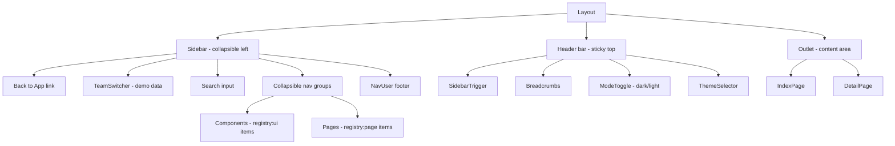
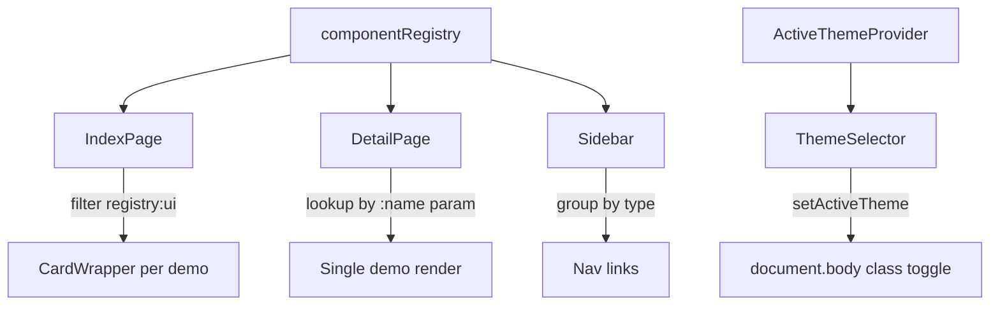

# Kitchen Sink — As-Built Documentation

## Overview

The Kitchen Sink is a **development-only** component showcase and living style guide that renders at the `/sink` route. It serves as a central reference for every UI primitive and page-level pattern available in the design system, allowing developers to visually inspect, theme, and interact with components without navigating the production application.

The feature is completely tree-shaken from production builds via Vite's `import.meta.env.DEV` guard. It has zero impact on production bundle size. In development, it provides a self-contained environment with its own layout, sidebar navigation, breadcrumbs, and a real-time theme-switching system that exercises every visual dimension of the design system (color, size, font, radius).

The Kitchen Sink houses **55 individual component demos** and **5 full-page demos** registered through a central component registry. Every demo is isolated with its own error boundary so a failure in one component never crashes the entire showcase.

## Architecture

### Routing

The sink routes are conditionally injected into the application's route tree:

```
/sink            -> Layout (standalone layout wrapper)
  index          -> IndexPage (all component cards in a grid)
  :name          -> DetailPage (single component detail view)
```

The conditional inclusion is handled at the route definition level:

```typescript
const sinkRoutes: RouteObject[] = import.meta.env.DEV
  ? [{ path: '/sink', lazy: () => import('pages/sink/Layout'), children: [...] }]
  : []
```

All three route modules use named `Component` exports with `displayName` set, following the project's lazy-loading convention for React Router.

### Layout Hierarchy



The layout is standalone — it does **not** reuse the main application layout. This separation allows the sink to demonstrate sidebar patterns, theme switching, and navigation independently.

### Component Registry

The registry is the single source of truth for all showcased components. Each entry contains:

```typescript
type ComponentConfig = {
  name: string                         // Display name
  component: React.ComponentType       // The demo component
  className?: string                   // Optional wrapper class
  type: 'registry:ui' | 'registry:page'  // Rendering mode
  href: string                         // Route path
  label?: string                       // Badge label (e.g., "New")
}
```

Components typed as `registry:ui` render inside card wrappers on the index page. Components typed as `registry:page` get full-viewport rendering on their detail page (no padding wrapper).

### Data Flow



## File Inventory

### Core Pages

| File | Responsibility |
|------|---------------|
| `pages/sink/Layout.tsx` | Standalone layout with sidebar, header, breadcrumbs, theme controls |
| `pages/sink/IndexPage.tsx` | Index page — renders all `registry:ui` demos in a responsive card grid |
| `pages/sink/DetailPage.tsx` | Detail page — renders a single component by `:name` URL param |
| `pages/sink/component-registry.ts` | Central registry mapping keys to demo components, types, routes, labels |

### Layout Components

| File | Responsibility |
|------|---------------|
| `pages/sink/components/sidebar.tsx` | Collapsible sidebar with search, team switcher, component nav groups |
| `pages/sink/components/breadcrumbs.tsx` | Context-aware breadcrumbs: "Kitchen Sink" at root, "Kitchen Sink then Name" on detail |
| `pages/sink/components/theme-selector.tsx` | Multi-dimension theme picker (size, color, font, radius) |
| `pages/sink/components/component-wrapper.tsx` | Card wrapper with error boundary, name header, and content area |
| `pages/sink/components/nav-user.tsx` | Sidebar footer with user avatar and dropdown menu (demo data) |
| `pages/sink/components/team-switcher.tsx` | Sidebar team selector with dropdown (demo data) |

### Component Demos (55 files)

All located in `pages/sink/components/`. Each file exports a single named demo component. Listed by functional category:

**Form Inputs:**
`input-demo`, `textarea-demo`, `select-demo`, `native-select-demo`, `radio-group-demo`, `checkbox-demo`, `switch-demo`, `input-otp-demo`, `input-group-demo`, `combobox-demo`, `date-picker-demo`, `slider-demo`, `calendar-demo`

**Buttons and Toggles:**
`button-demo`, `button-group-demo`, `toggle-demo`, `toggle-group-demo`

**Layout and Structure:**
`card-demo`, `separator-demo`, `aspect-ratio-demo`, `scroll-area-demo`, `resizable-demo`, `collapsible-demo`, `accordion-demo`, `tabs-demo`

**Overlays and Popovers:**
`dialog-demo`, `drawer-demo`, `alert-dialog-demo`, `popover-demo`, `hover-card-demo`, `sheet-demo`, `tooltip-demo`

**Navigation:**
`breadcrumb-demo`, `navigation-menu-demo`, `menubar-demo`, `pagination-demo`

**Data Display:**
`table-demo`, `badge-demo`, `avatar-demo`, `chart-demo` (with sub-demos: `chart-area-demo`, `chart-bar-demo`, `chart-bar-mixed`, `chart-line-demo`)

**Feedback:**
`alert-demo`, `progress-demo`, `skeleton-demo`, `spinner-demo`, `sonner-demo`

**Menus:**
`context-menu-demo`, `dropdown-menu-demo`, `command-demo`

**Other:**
`label-demo`, `kbd-demo`, `item-demo`, `empty-demo`, `field-demo`, `form-demo`, `carousel-demo`

Components marked with `label: 'New'` in the registry: Button Group, Empty, Field, Input Group, Item, Kbd, Native Select, Spinner.

### Page Demos (5 pages)

| Page | Directory | Key Files |
|------|-----------|-----------|
| **Forms** | `pages/sink/pages/forms/` | FormsPage, shipping-form, appearance-settings, chat-settings, display-settings, notion-prompt-form, ship-registration-form |
| **React Hook Form** | `pages/sink/pages/react-hook-form/` | ReactHookFormPage, example-form |
| **Tasks** | `pages/sink/pages/tasks/` | TasksPage, components/ (columns, data-table, pagination, toolbar, faceted-filter, view-options, row-actions, column-header), data/ (schema, data, tasks.json) |
| **Playground** | `pages/sink/pages/playground/` | PlaygroundPage, components/ (model-selector, temperature-selector, maxlength-selector, top-p-selector, preset-selector, preset-save, preset-share, preset-actions, code-viewer), data/ (models, presets) |
| **Chat** | `pages/sink/pages/chat/` | ChatPage |

### Shared Infrastructure

| File | Responsibility |
|------|---------------|
| `components/active-theme.tsx` | `ActiveThemeProvider` context + `useActiveTheme` hook — manages theme class on `document.body`, persists to localStorage |
| `components/mode-toggle.tsx` | Dark/light mode toggle (shared with main app) |
| `components/assistant-ui/thread.tsx` | Chat thread component (shared with main app, used by Chat page demo) |

## Implementation Details

### Index Page Rendering

The index page filters the registry for `registry:ui` entries and renders each inside a card wrapper. The layout uses a `@container` grid for container-query-based responsive behavior:

```tsx
<div className="@container grid flex-1 gap-4 p-4">
  {Object.entries(componentRegistry)
    .filter(([, component]) => component.type === 'registry:ui')
    .map(([key, component]) => (
      <ComponentWrapper key={key} name={key}>
        <Demo />
      </ComponentWrapper>
    ))}
</div>
```

### Detail Page Rendering

The detail page looks up the component by URL param. Pages (`registry:page`) render full-bleed with no padding; components (`registry:ui`) get `p-6` padding:

```tsx
const isPage = component.type === 'registry:page'
return (
  <div className={isPage ? undefined : 'p-6'}>
    <Demo />
  </div>
)
```

If the `:name` param doesn't match any registry key, the page redirects to `/sink`.

### Error Boundary Isolation

The card wrapper includes a class-based error boundary that catches render errors per-demo. This prevents a broken demo from taking down the entire index page. The error boundary logs to console and renders a red error message with the component name.

### Theme System

The theme selector provides four independent theme axes:

| Axis | Options |
|------|---------|
| **Sizes** | Default, Scaled, Mono |
| **Colors** | Blue, Green, Amber, Rose, Purple, Orange, Teal |
| **Fonts** | Inter, Noto Sans, Nunito Sans, Figtree |
| **Radius** | None, Small, Medium, Large, Full |

When a theme value is selected, `useActiveTheme()` calls `setActiveTheme()` which:

1. Strips all `theme-*` classes from `document.body`
2. Adds `theme-{value}` class
3. Adds `theme-scaled` if the value ends with `-scaled`
4. Persists to localStorage under key `active-theme`

Default theme on fresh load: `blue-scaled`.

### Sidebar Navigation

The sidebar groups components into two collapsible sections ("Components" for `registry:ui`, "Pages" for `registry:page`). Both sections default to open when the path includes `/sink`. Active state is tracked by comparing `pathname === item.href`.

Components with a `label` property (e.g., "New") render a small blue dot indicator next to the name in the sidebar nav.

### Form Demo Patterns

The sink showcases two distinct form patterns:

1. **Legacy Form wrapper** (form-demo): Uses `Form` / `FormField` / `FormItem` / `FormLabel` / `FormControl` wrappers from the UI library. Demonstrates React Hook Form + Zod validation with many field types (text input, select, textarea, radio group, checkbox, date picker, switch).

2. **Field-based forms** (shipping-form and other forms page demos): Uses the newer `Field` / `FieldSet` / `FieldGroup` / `FieldLabel` / `FieldDescription` components. This is the recommended pattern per project conventions.

Both patterns are preserved in the sink to show the evolution and to document what each approach looks like.

### Tasks Page (Data Table Demo)

The Tasks page demonstrates TanStack React Table integration with:

- Zod schema validation of JSON task data (`z.array(taskSchema).parse(tasksData)`)
- Column definitions with sorting and filtering
- Toolbar with faceted filters
- Pagination controls
- Row actions
- View options (column visibility)

This serves as the reference implementation for data table patterns used elsewhere in the application.

### Playground Page

A complex multi-panel layout simulating an AI model interaction interface:

- **Mobile-responsive**: Shows a fallback message on small screens, full UI on `md+`
- **Three tabs**: Complete, Insert, Edit — each with different textarea layouts
- **Parameter sidebar**: Model selector, temperature/max-length/top-p sliders
- **Preset management**: Save, share, load presets via dialogs
- **Code viewer**: Shows configuration as code

### Chat Page

Integrates the assistant-ui library with a local runtime adapter:

- Demo model adapter echoes back user input after an 800ms simulated delay
- Supports abort signals for cancellation
- Renders in a full-height container (100vh minus 3.5rem to account for the header)

## Patterns and Conventions

### File Organization

- One demo per file in `components/` directory
- Named exports only (e.g., `export function ButtonDemo()`)
- Page demos get their own subdirectory under `pages/` with co-located sub-components and data files
- No default exports on demo components; pages that need lazy loading export `Component` with `displayName`

### Naming Convention

- Demo files: `{component-name}-demo.tsx` (kebab-case)
- Registry keys: `{component-name}` (kebab-case, matching the file without `-demo`)
- Display names: Title Case conversion via `getComponentName()` (replaces hyphens with spaces, capitalizes words)

### Component Registration

Every new component added to the design system should have a corresponding demo registered in `component-registry.ts`. The registration process:

1. Create `components/{name}-demo.tsx` with a named export
2. Import and add to the `componentRegistry` object
3. Set `type: 'registry:ui'` for primitives, `'registry:page'` for full-page demos
4. Optionally add `label: 'New'` for recently added components
5. Optionally add `className` for layout overrides (e.g., `'w-full'` for charts)

### Demo Data

All demo data is hardcoded within the sink files. No external API calls, no auth dependencies, no shared application state. The sidebar uses mock user/team data. The Tasks page loads from a local JSON file.

## Configuration and Environment

| Setting | Value | Source |
|---------|-------|--------|
| Dev-only inclusion | `import.meta.env.DEV` | Vite environment variable |
| Default theme | `blue-scaled` | Hardcoded in active theme provider |
| Theme persistence | localStorage key `active-theme` | Browser storage |
| Sidebar default state | Open | Hardcoded in layout |
| Sidebar collapsible mode | `icon` (collapses to icon bar) | Hardcoded in sidebar |

No environment variables, feature flags, or runtime configuration affect the Kitchen Sink. It is entirely self-contained.

## Integration Points

### Consumes From Main App

- **UI primitives**: All shared UI components (Button, Card, Dialog, etc.)
- **Theme provider**: The active theme provider wraps the entire app; the sink's theme selector interacts with it
- **Dark mode toggle**: Shared mode toggle component
- **Chat thread**: Shared assistant-ui thread component
- **Utility functions**: `cn()` for class merging

### Does Not Consume

- Authentication (no auth required for `/sink`)
- API services (no data-fetching hooks, no backend calls)
- Application state (no store interaction)
- Routing guards (no protected route wrappers)

### Consumed By

Nothing depends on the Kitchen Sink. It is a leaf node in the dependency graph. It exists purely for developer reference.

## Maintenance and Gotchas

### Production Build Safety

The `import.meta.env.DEV` guard at the route definition level ensures the entire sink module tree is eliminated during production builds. **Do not move the conditional check inside the component** — it must remain at the route array level for proper tree-shaking. If the guard is accidentally removed or refactored into a runtime check, the entire sink (including all 55+ demo files and their dependencies like the assistant-ui local adapter) will ship to production.

### Error Boundary Scope

Each card wrapper has its own error boundary. If you render a demo outside of the wrapper (e.g., directly in the detail page for `registry:page` items), there is **no error boundary**. A crash in a page demo will crash the detail view. Consider wrapping page demos if stability becomes an issue.

### Theme Class Side Effects

The theme system manipulates `document.body.classList` directly. Theme classes set while viewing the sink **persist** after navigating back to the main application because they're stored in localStorage and reapplied by the theme provider on mount. This is by design (the theme applies globally), but can be surprising if a developer switches to an unusual theme in the sink and then wonders why the main app looks different.

### Sidebar Search Is Non-Functional

The search input in the sidebar header (placeholder: "Search the docs...") is a **UI placeholder only**. It has no filtering logic attached. If you need searchable component navigation, the search must be implemented.

### Form Demo Uses Legacy Pattern

The form-demo component uses the older Form / FormField / FormItem pattern which is **deprecated** in project conventions. The recommended pattern uses Controller + Field directly. The demo is retained to show what the legacy pattern looks like, but new form work should follow the Field-based approach demonstrated in the shipping form demo.

### New Component Label Hygiene

Components marked with `label: 'New'` in the registry display a blue dot in the sidebar. There is no automated mechanism to remove these labels. Over time, "new" components become established and the labels become misleading. Periodically audit the registry and remove label entries for components that are no longer new.

### Chat Demo Runtime Dependency

The Chat page imports assistant-ui/react which is a relatively heavy dependency. Because the entire sink is tree-shaken from production, this has no bundle impact. However, it **does** affect dev server cold-start time and HMR performance. If the chat demo is not actively needed, its lazy import helps mitigate this.

### Tasks Demo Data File

The Tasks page loads data from a static JSON file and validates it with Zod at import time. If the JSON file is modified to not match the schema, the Tasks page will throw on load. The error boundary on the detail page does **not** catch this because the error occurs during module initialization, not during render.

### Container Query Grid

The index page uses `@container` for its grid layout. This is a CSS container query, not a media query. Components respond to the **container width**, not the viewport width. This means the grid layout changes when the sidebar is toggled open/closed, which is the desired behavior but can be confusing if you're debugging responsive breakpoints with browser DevTools viewport controls.

## Testing

There are **no dedicated tests** for the Kitchen Sink. The feature is dev-only and entirely visual. Verification is manual:

1. Navigate to the `/sink` route during development
2. Scroll through the index page to verify all component demos render
3. Click individual components to verify detail view rendering
4. Toggle between themes and dark/light mode to verify visual consistency
5. Verify the sidebar navigation links work and active states highlight correctly
6. Verify the production build does **not** include `/sink` routes (check the build output or attempt to navigate to `/sink` in a production build)

## Key Takeaways

- **Dev-only**: The entire sink is tree-shaken from production via `import.meta.env.DEV` at the route level — do not move this guard
- **Self-contained**: No auth, no API calls, no shared state — all data is hardcoded demo data
- **Central registry**: The component registry file is the single source of truth for all showcased components; new components must be registered here
- **Two types**: `registry:ui` renders in card grid on index; `registry:page` renders full-viewport on detail page
- **Error isolation**: Each component demo is wrapped in its own error boundary via the card wrapper
- **Theme persistence**: Theme changes in the sink persist globally via localStorage and affect the main app
- **Two form patterns**: Legacy Form/FormField (deprecated) and modern Field/FieldSet (recommended) are both demonstrated
- **Search is a placeholder**: The sidebar search input has no filtering implementation
- **No tests**: Verification is entirely manual and visual
- **Clean up "New" labels**: There is no auto-expiry on `label: 'New'` badges; audit periodically
