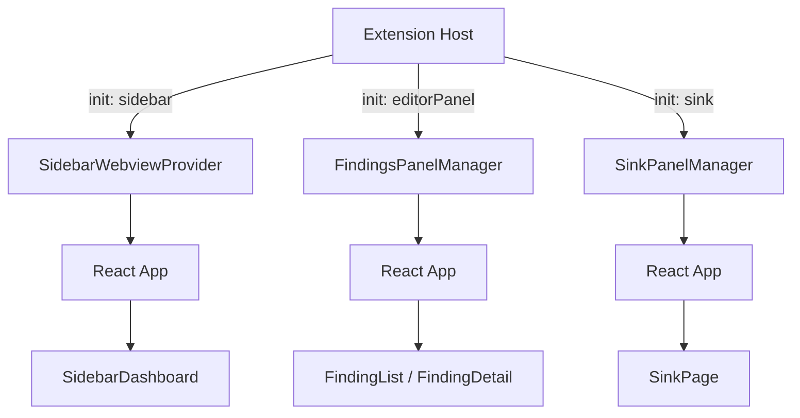

# WebView Skill Research

## Overview

This document captures everything a `/webview` skill needs to know to develop the React WebView application in `webview/`. The goal is to produce guidance equivalent to the existing `.claude/skills/vsix/SKILL.md` (which covers extension host development), but scoped to the WebView: the React components, state management, VS Code theme integration, ShadCN components, the Kitchen Sink, and the copy-bridge build pipeline.

The webview is a single Vite-built React 19 application that renders inside VS Code in multiple contexts (sidebar panel, editor panel, and the dev-only Kitchen Sink). It communicates with the extension host exclusively via typed `postMessage` calls. It has no direct access to Node.js APIs, the file system, or VS Code extension APIs -- those responsibilities belong to the extension host.

## Architecture

### Context-Driven Rendering (No Router)

The webview uses a single `useReducer` state machine in `App.tsx` to decide which UI to render. The extension host sends an `init` message with a `context` discriminator. There is no React Router.



**Context routing in `App.tsx`:**

| Context | View State | Renders |
|---|---|---|
| `unknown` | any | Loading spinner (initial state before `init` arrives) |
| `sidebar` | any | `SidebarDashboard` |
| `editorPanel` | `findingList` | `FindingList` |
| `editorPanel` | `findingDetail` | `FindingDetail` |
| `sink` | any | `SinkPage` (dev-only Kitchen Sink) |

### State Machine

`App.tsx:12-19` defines the state shape:

```typescript
interface AppState {
  context: 'sidebar' | 'editorPanel' | 'sink' | 'unknown';
  scanId: string | undefined;
  scans: ScanSummary[];
  summary: DispositionSummary;
  findings: FindingRow[];
  selectedFinding: FindingRow | undefined;
  view: ViewState; // 'loading' | 'findingList' | 'findingDetail'
}
```

Three action types (`App.tsx:22-25`):
- `MESSAGE` -- processes inbound `ExtToWebviewMessage` from the extension host
- `SELECT_FINDING` -- local navigation: user clicked a finding row
- `BACK_TO_LIST` -- local navigation: user clicked the back breadcrumb

The reducer (`App.tsx:37-85`) is the single source of truth for all webview state. All extension host messages flow through the `MESSAGE` action type, which switches on `msg.type`.

### Message Protocol

Types defined in `webview/src/types/messages.ts` (copied from `vsix/src/models/messages.ts`).

**Extension Host -> WebView (`ExtToWebviewMessage`):**

| Type | Payload | Purpose |
|---|---|---|
| `init` | `{ context: 'sidebar' }` or `{ context: 'editorPanel', scanId }` or `{ context: 'sink' }` | Tells the WebView which UI to render |
| `stateUpdate` | `{ scans, summary }` | Sidebar dashboard data |
| `findingsUpdate` | `{ scanId, findings }` | Finding list for editor panel |
| `findingDetail` | `FindingRow` | Single finding detail |
| `dispositionUpdated` | `{ findingId, disposition }` | Confirms a disposition change |

**WebView -> Extension Host (`WebviewToExtMessage`):**

| Type | Payload | Purpose |
|---|---|---|
| `requestState` | *(none)* | Request initial state (sent on mount) |
| `selectScan` | `{ scanId }` | User selected a scan |
| `selectFinding` | `{ findingId }` | User clicked a finding row |
| `setDisposition` | `{ findingId, disposition }` | User changed a disposition |
| `navigateToCode` | `{ filePath, startLine }` | User clicked a file path link |
| `startScan` | *(none)* | User clicked "Run Scan" |
| `openFindings` | `{ scanId }` | User clicked "View Findings" |
| `openSink` | *(none)* | Request to open Kitchen Sink panel |

**Handshake protocol:**
1. Extension host sets `webview.html` (React app loads)
2. React app mounts, registers `message` event listener via `useMessages()`
3. React app sends `requestState` (`App.tsx:96-98`)
4. Extension host responds with `init` then context-appropriate data

### Data Model

Types defined in `webview/src/types/types.ts` (copied from `vsix/src/models/types.ts`):

| Type | Values |
|---|---|
| `ScanStatus` | `RUNNING`, `COMPLETED`, `FAILED`, `CANCELLED` |
| `Severity` | `CRITICAL`, `HIGH`, `MEDIUM`, `LOW`, `INFO` |
| `Disposition` | `PENDING`, `FIX`, `SUPPRESS`, `DEFER` |

Key interfaces: `Project`, `ScanSummary`, `FindingRow`, `DispositionSummary`.

## Source Structure

```
webview/
  package.json              # Dependencies, build scripts
  vite.config.ts            # Vite + React + Tailwind, fixed output filenames
  tsconfig.json             # Project references (tsconfig.app.json + tsconfig.node.json)
  tsconfig.app.json         # Strict mode, path alias @/ -> ./src/
  tsconfig.node.json        # Node config for vite.config.ts
  eslint.config.js          # Flat config: react-hooks, react-refresh, typescript-eslint
  src/
    main.tsx                # React root mount (StrictMode + createRoot)
    App.tsx                 # Context-aware root: useReducer state machine, message handling
    index.css               # Tailwind v4 import + VS Code theme variable mappings
    hooks/
      useVSCodeAPI.ts       # postMessage bridge + useMessages hook (singleton)
    types/
      types.ts              # Data model types (COPIED from vsix/src/models/types.ts)
      messages.ts           # Message protocol types (COPIED from vsix/src/models/messages.ts)
    components/
      SidebarDashboard.tsx  # Compact sidebar view with scan button, triage summary
      FindingList.tsx       # Full-width finding table with severity/disposition/scanner filters
      FindingDetail.tsx     # Finding detail view with disposition controls, code location
      SeverityBadge.tsx     # Color-coded severity badge (5 levels)
      DispositionBadge.tsx  # Styled disposition badge (4 states)
      ui/                   # ShadCN auto-generated components (24 files)
    pages/
      sink/                 # Kitchen Sink component showcase (dev-only)
        SinkPage.tsx        # Main page: search state, filters registry, renders grid
        sink-registry.ts    # Central registry of all demo components
        components/
          component-wrapper.tsx  # Card wrapper + ComponentErrorBoundary
          sink-header.tsx        # Sticky header with title, separator, search input
        demos/              # One demo file per component (22 files)
    lib/
      utils.ts              # cn() utility (clsx + tailwind-merge)
```

### ShadCN Components Installed (24)

Located in `src/components/ui/`:

accordion, alert, badge, button, card, checkbox, dialog, dropdown-menu, input, label, progress, select, separator, skeleton, switch, table, tabs, textarea, tooltip (19 ShadCN primitives), plus slot (Radix dependency).

### Application Components (5)

Located in `src/components/`:

| Component | File | Purpose |
|---|---|---|
| `SidebarDashboard` | `SidebarDashboard.tsx` | Sidebar panel: project header, scan button, triage summary, severity breakdown |
| `FindingList` | `FindingList.tsx` | Editor panel: findings table with filter bar (severity toggles, disposition toggles, scanner select) |
| `FindingDetail` | `FindingDetail.tsx` | Editor panel: single finding detail with disposition controls, breadcrumb back navigation, code location link |
| `SeverityBadge` | `SeverityBadge.tsx` | Reusable badge mapping `Severity` enum to colored Badge |
| `DispositionBadge` | `DispositionBadge.tsx` | Reusable badge mapping `Disposition` enum to colored Badge |

## Tech Stack

| Layer | Technology | Version |
|---|---|---|
| Framework | React | 19.2.x |
| Build | Vite | 8.x |
| Styling | Tailwind CSS v4 | 4.2.x (`@tailwindcss/vite` plugin) |
| Components | ShadCN/ui | Latest (added via `npx shadcn@latest add`) |
| Animations | tw-animate-css | 1.4.x |
| Table | TanStack React Table | 8.21.x |
| Utility | class-variance-authority, clsx, tailwind-merge, lucide-react | |
| TypeScript | strict mode | 5.9.x |
| Linting | ESLint (flat config: react-hooks, react-refresh, typescript-eslint) | 9.x |

## Patterns and Conventions

### Component Pattern

Application components use **named exports**, receive data via props, and communicate with the extension host via `postMessage()`:

```typescript
// Example: components/SidebarDashboard.tsx
import { postMessage } from '../hooks/useVSCodeAPI';
import type { ScanSummary, DispositionSummary } from '../types/types';

interface SidebarDashboardProps {
  scans: ScanSummary[];
  summary: DispositionSummary;
}

export function SidebarDashboard({ scans, summary }: SidebarDashboardProps) {
  // ...render UI, use postMessage() for user actions
}
```

**Conventions:**
- Named exports (not default) for all components except `App` and `SinkPage` (which uses default for lazy-loadability)
- Props interfaces defined in the same file, immediately above the component
- Import ShadCN components from `@/components/ui/*`
- Import app components from relative paths (`../components/*` or `./ComponentName`)
- Import utilities from `@/lib/utils`
- Import types via `type` imports (`import type { ... }`)
- Import `postMessage` / `useMessages` from `../hooks/useVSCodeAPI`
- PascalCase filenames for app components (`SidebarDashboard.tsx`)
- kebab-case filenames for ShadCN UI components (`button.tsx`, `dropdown-menu.tsx`)

### Styling Pattern

Components use Tailwind CSS utility classes. ShadCN components use `class-variance-authority` (CVA) for variant management. The `cn()` utility merges Tailwind classes:

```typescript
import { cn } from '@/lib/utils';

<div className={cn("flex items-center gap-2", className)} />
```

**VS Code-specific inline styles** are used when a VS Code CSS variable needs to be applied directly (e.g., `style={{ background: 'var(--vscode-textCodeBlock-background)' }}`). This is acceptable for one-off cases where a Tailwind utility doesn't exist for that specific variable.

**Color mappings for domain types** use `Record<EnumType, string>` objects mapping enum values to Tailwind class strings:

```typescript
const severityStyles: Record<Severity, string> = {
  CRITICAL: 'bg-red-700 text-white hover:bg-red-800',
  HIGH: 'bg-orange-600 text-white hover:bg-orange-700',
  // ...
};
```

### `useVSCodeAPI` Hook

`webview/src/hooks/useVSCodeAPI.ts` wraps the VS Code WebView API:

- `acquireVsCodeApi()` is called **once** at module scope (line 12) -- it's a singleton
- `postMessage(msg)`: sends a typed `WebviewToExtMessage` to the extension host
- `useMessages(handler)`: React hook that registers a `message` event listener and cleans up on unmount

**Critical constraint:** `acquireVsCodeApi()` can only be called once per webview lifecycle. The module-scope call ensures this. If another module attempts to call it, VS Code will throw.

### Path Alias

`@/` resolves to `./src/` via both Vite (`vite.config.ts:11-13`) and TypeScript (`tsconfig.json:7-9`). Always use `@/` for imports from `src/` subdirectories:

```typescript
import { Button } from '@/components/ui/button';
import { cn } from '@/lib/utils';
```

### Adding a New Message

1. Add the message variant to `ExtToWebviewMessage` or `WebviewToExtMessage` in `vsix/src/models/messages.ts`
2. Copy the updated types to `webview/src/types/messages.ts`
3. Add the handler in the relevant provider on the extension host side
4. Add the reducer case in `App.tsx` if it's an inbound message
5. Add the `postMessage()` call in the relevant React component if it's an outbound message

**Type safety:** Both sides use identical type definitions. TypeScript enforces conformance at compile time via discriminated unions.

### Adding a New Screen

1. Create the component in `webview/src/components/`
2. Add a new `view` state value to `ViewState` type in `App.tsx`
3. Add a reducer case to transition to the new view
4. Add the render branch in `App.tsx`

### Adding a ShadCN Component

```bash
cd webview && npx shadcn@latest add <component-name> --yes
```

Components are generated in `webview/src/components/ui/`. They use the `@/lib/utils` import alias.

**ShadCN MCP tools are available** and should be used when inspecting or adding components:

| Tool | When to Use |
|---|---|
| `mcp__shadcn__list_items_in_registries` | List all available components before installing |
| `mcp__shadcn__search_items_in_registries` | Search for a specific component by name |
| `mcp__shadcn__view_items_in_registries` | View component source and dependencies before installing |
| `mcp__shadcn__get_item_examples_from_registries` | Get official example usage for demos |
| `mcp__shadcn__get_add_command_for_items` | Get the exact CLI command to install |

**Workflow for adding any ShadCN component:**
1. `mcp__shadcn__view_items_in_registries` -- inspect source and dependencies
2. `mcp__shadcn__get_item_examples_from_registries` -- get official examples
3. `mcp__shadcn__get_add_command_for_items` -- get install command
4. Run the install command from `webview/`
5. If a Kitchen Sink exists, add a demo to the sink registry

### Shared Type Changes

Types are **manually copied** between `vsix/src/models/` and `webview/src/types/`. When modifying `types.ts` or `messages.ts`, **update both locations**. The copy approach is intentional for the prototype to avoid monorepo tooling.

## VS Code Theme Integration

`webview/src/index.css` is the bridge between VS Code's CSS custom properties and ShadCN/Tailwind design tokens.

### How It Works

1. VS Code injects `--vscode-*` CSS variables into the webview iframe
2. VS Code sets a class on `<body>`: `.vscode-dark`, `.vscode-light`, or `.vscode-high-contrast`
3. `index.css:49-95` maps `--vscode-*` to ShadCN tokens (e.g., `--background: var(--vscode-editor-background, oklch(1 0 0))`)
4. Tailwind's dark variant is remapped: `@custom-variant dark (&:is(.vscode-dark *))` (`index.css:4`)
5. `color-scheme: dark` is set on `.vscode-dark` and `.vscode-high-contrast` (`index.css:97-103`)

### Key Variable Mappings

| ShadCN Token | VS Code Variable | Fallback |
|---|---|---|
| `--background` | `--vscode-editor-background` | `oklch(1 0 0)` |
| `--foreground` | `--vscode-editor-foreground` | `oklch(0.145 0 0)` |
| `--primary` | `--vscode-button-background` | `oklch(0.205 0 0)` |
| `--primary-foreground` | `--vscode-button-foreground` | `oklch(0.985 0 0)` |
| `--border` | `--vscode-panel-border` | `oklch(0.922 0 0)` |
| `--ring` | `--vscode-focusBorder` | `oklch(0.708 0 0)` |
| `--destructive` | `--vscode-errorForeground` | `oklch(0.577 0.245 27.325)` |
| `--muted-foreground` | `--vscode-descriptionForeground` | `oklch(0.556 0 0)` |
| `--accent` | `--vscode-list-hoverBackground` | `oklch(0.97 0 0)` |

Fallback values (OKLCH) are used outside VS Code (e.g., Vite dev server, Storybook). Inside VS Code, the `--vscode-*` variables always resolve.

### Critical: `color-scheme: dark`

Native browser controls (date pickers, scrollbars, search clear buttons, file input buttons) use the CSS `color-scheme` property to determine icon color. Without `color-scheme: dark`, these render with dark icons invisible against VS Code dark backgrounds. This is set at `index.css:97-103`.

### Dark Mode Tailwind

The custom variant `@custom-variant dark (&:is(.vscode-dark *))` at `index.css:4` makes Tailwind's `dark:` prefix work with VS Code's body class instead of the standard `prefers-color-scheme` media query.

**Theme rules:**
- Never hardcode colors -- always use semantic Tailwind tokens (`bg-background`, `text-foreground`, `bg-primary`, etc.)
- For domain-specific colors (severity, disposition), hardcoded Tailwind colors are acceptable (e.g., `bg-red-700`) because they represent semantic meaning, not theme-dependent styling
- When using `dark:` variants with hardcoded colors (e.g., `dark:bg-blue-900`), remember these rely on the custom variant mapping
- For one-off VS Code variables without a Tailwind mapping, use inline `style={{ ... }}` with `var(--vscode-*)` directly

## Kitchen Sink

The Kitchen Sink is a development-only component showcase at `webview/src/pages/sink/`. It renders all UI primitives and app-specific components in a single scrollable panel.

### Architecture

- Activated via `init` message with `context: 'sink'` from `SinkPanelManager`
- `SinkPage.tsx` owns all sink state: a single `searchFilter` via `useState`
- `sink-registry.ts` is the single source of truth for all demos
- Each demo is wrapped in `ComponentWrapper` with a `ComponentErrorBoundary`
- No React Router, no lazy loading, no extension host communication

### Component Registry Pattern

```typescript
// sink-registry.ts
export type SinkComponentConfig = {
  name: string;           // Display name
  component: ComponentType; // The demo component
  className?: string;     // Optional wrapper class (e.g., 'w-full' for tables)
  type: 'ui' | 'app';    // 'ui' for ShadCN primitives, 'app' for ASH-specific
  label?: string;         // Optional badge label (e.g., 'New')
};

export const sinkRegistry: Record<string, SinkComponentConfig> = {
  button: { name: 'Button', component: ButtonDemo, type: 'ui' },
  // ...
};
```

### Demo File Convention

Each demo is a single file in `pages/sink/demos/`, named `{component-name}-demo.tsx`:

```typescript
// demos/button-demo.tsx
import { Button } from '@/components/ui/button';

export function ButtonDemo() {
  return (
    <div className="flex flex-col gap-6">
      {/* Exercise all variants, sizes, states */}
    </div>
  );
}
```

**Rules:**
- One demo per file
- Named export (not default)
- No external data dependencies -- all demo data hardcoded inline
- No `postMessage` calls -- demos are pure visual components
- Import UI components from `@/components/ui/*`
- Import app components from `@/components/*`
- Exercise all variants and states

### Adding a New Demo

1. Create `webview/src/pages/sink/demos/{name}-demo.tsx` with a named export
2. Import and register in `sink-registry.ts`
3. Set `type: 'ui'` for ShadCN primitives, `'app'` for ASH-specific components
4. Build: `cd vsix && npm run build:webview`
5. Verify in the Extension Development Host via "ASH: Open Kitchen Sink" command

### Current Demos (22)

**ShadCN Primitives (19):** Accordion, Alert, Badge, Button, Card, Checkbox, Dialog, Dropdown Menu, Input, Label, Progress, Select, Separator, Skeleton, Switch, Table, Tabs, Textarea, Tooltip

**App-Specific (3):** Severity Badge, Disposition Badge, Tasks (TanStack React Table data table with sorting, filtering, pagination, row selection)

## Build Pipeline

### Package Layout

```
workbench/
  vsix/                    # VS Code extension (TypeScript, Node.js)
    out/                   # tsc output (extension host JS)
    webview-dist/          # COPIED from webview/dist at build time
  webview/                 # React WebView app (Vite + Tailwind + ShadCN)
    dist/                  # Vite build output
```

### Build Chain

Running `npm run build` in `vsix/` executes:

```
vsix/npm run build
  -> npm run build:webview
       -> cd ../webview && npm run build   (tsc -b && vite build)
       -> cd ../vsix && npm run copy:webview  (cp -r ../webview/dist ./webview-dist)
  -> npm run compile                       (tsc -p ./)
```

### Key Scripts

| I want to... | Command | Where |
|---|---|---|
| Full rebuild everything | `npm run build` | `vsix/` |
| Rebuild only the webview | `npm run build:webview` | `vsix/` |
| Build webview without copying | `npm run build` | `webview/` |
| Lint webview code | `npm run lint` | `webview/` |
| Launch extension for testing | Press **F5** (from `vsix/` workspace) | VS Code |

### Vite Fixed Filenames

Vite produces deterministic filenames (`vite.config.ts:14-21`):
- `dist/assets/index.js`
- `dist/assets/index.css`

The extension host's `webviewHtml.ts` hardcodes these paths. If Vite config changes output names, `webviewHtml.ts` must be updated.

### Development Workflow

After any webview change:
```bash
cd vsix && npm run build:webview   # Build + copy
```
Then reload the Extension Development Host (`Ctrl+R` / `Cmd+R`).

There is **no HMR** for webview content. The extension loads static built assets from `vsix/webview-dist/`.

## Configuration and Environment

| Setting | Value | Source |
|---|---|---|
| Path alias `@/` | `./src/` | `vite.config.ts:11-13`, `tsconfig.json:7-9` |
| Fixed output names | `assets/index.js`, `assets/index.css` | `vite.config.ts:14-21` |
| CSP | `default-src 'none'; style-src ... 'unsafe-inline'; script-src 'nonce-...'` | `vsix/src/providers/webviewHtml.ts:17` |
| `localResourceRoots` | `[extensionUri/webview-dist]` | All provider files |
| VS Code theme | Automatic via CSS variables | `index.css` |
| Dark mode variant | `@custom-variant dark (&:is(.vscode-dark *))` | `index.css:4` |
| TypeScript | Strict mode, ES2023 target, bundler module resolution | `tsconfig.app.json` |
| Sink dev-only gate | `extensionMode === Development` on command registration | `vsix/src/extension.ts:25` |

## Testing

### No Automated WebView Tests

The webview currently has **no automated tests**. All verification is manual via the Extension Development Host:

1. Press F5 to launch the Extension Development Host
2. Click the ASH Workbench activity bar icon to open the sidebar
3. Click "View Findings" to open the editor panel
4. Switch VS Code themes (`Ctrl+K Ctrl+T`) to verify theme adaptation
5. Run "ASH: Open Kitchen Sink" (dev mode only) to verify component demos

### Cross-Theme Verification

Always test with:
- Dark+ (default dark)
- Light+ (default light)
- High Contrast

Pay special attention to: native input icons (calendar, clock), borders, focus rings, and domain-specific colors (severity/disposition badges).

## Issues and Risks

### Types Are Manually Copied

`types.ts` and `messages.ts` exist in both `vsix/src/models/` and `webview/src/types/`. They must be kept in sync manually. A future improvement would be a shared package.

### No HMR for WebView Development

Changes require a full rebuild + copy cycle (`cd vsix && npm run build:webview`) and a window reload. This slows iteration.

### `acquireVsCodeApi()` Prevents Browser Testing

The singleton call at `useVSCodeAPI.ts:12` means the app crashes immediately outside a VS Code webview iframe. The Vite dev server can only be used for build-error feedback, not visual testing.

### Sink Code Ships in Production Bundle

`SinkPage` is imported directly in `App.tsx:6` (not lazy-loaded). The code ships in the `.vsix` package but is unreachable because the command is gated behind `ExtensionMode.Development`. The as-built docs note this as acceptable for the prototype.

### Error Boundary Does Not Catch Module-Level Errors

The `ComponentErrorBoundary` catches render errors per-demo. If a demo throws at **import time** (e.g., a broken constant or missing dependency), `SinkPage` crashes entirely.

### CSP Blocks External Resources

No external images, fonts, or scripts are allowed. Demos and components must only use locally bundled resources. The VS Code font is inherited via `--vscode-font-family`.

## Key Takeaways

1. **The webview is a pure renderer.** All state, business logic, and data fetching belong to the extension host. The webview receives data via `postMessage` and renders it.

2. **Context-driven, not routed.** The extension host tells the webview which UI to render via the `init` message. Navigation within the editor panel (list/detail) uses local reducer actions.

3. **Typed message protocol is the contract.** Both sides share the same discriminated union types. Every new feature that crosses the host/webview boundary needs a new message type in both `vsix/src/models/messages.ts` and `webview/src/types/messages.ts`.

4. **VS Code theme integration is automatic but fragile.** `index.css` maps `--vscode-*` variables to ShadCN tokens. The `color-scheme: dark` rule and the `@custom-variant dark` directive are critical infrastructure -- don't remove them.

5. **ShadCN components are the UI primitive.** Use `npx shadcn@latest add` to install new components. Use the ShadCN MCP tools to inspect APIs and get official examples.

6. **Build requires a copy step.** `webview/dist/` -> `vsix/webview-dist/`. Use `cd vsix && npm run build:webview` after any webview change.

7. **Kitchen Sink is the visual testing tool.** Every new UI component should get a demo in `pages/sink/demos/` registered in `sink-registry.ts`.

8. **One `acquireVsCodeApi()` call ever.** It's a module-scope singleton in `useVSCodeAPI.ts`. No other module should call it.

9. **Domain colors are hardcoded Tailwind classes.** Severity and disposition colors use explicit color classes (`bg-red-700`, `bg-green-600`, etc.) mapped via `Record<EnumType, string>` objects. These are intentional and not theme-dependent.

10. **Filters are local React state.** The `FindingList` filter bar (severity toggles, disposition toggles, scanner dropdown) uses local `useState` -- filter state is never sent to the extension host.

## Outstanding Questions

### Shared Package for Types

Both the vsix SKILL.md and the webview docs mention that types are manually copied. The research confirms this is still the case. A shared types package or a build-time copy script would prevent drift, but the current approach is intentional for the prototype. The `/webview` skill should enforce the "update both locations" rule explicitly.

### Production Build Tree-Shaking of Sink Code

The as-built docs note that sink code is **not** tree-shaken from the production bundle because `SinkPage` is imported directly (not via `React.lazy` with `import.meta.env.DEV` guard). The sink integration research originally proposed a lazy/dev-gated approach, but the implementation took the simpler direct-import path. This is a known gap but acceptable for the prototype.

### Future Contexts

The `init` message pattern supports arbitrary contexts. If new webview contexts are added (e.g., a settings panel, a report viewer), the same pattern applies: add a context discriminator, create a panel manager on the extension host, add a render branch in `App.tsx`.

## Recommended Implementation Plan

### Phase 1: SKILL.md Structure

1. **Define skill metadata** -- Set name, description, and trigger patterns for when the skill should be invoked (React components, Tailwind styling, ShadCN UI, webview state, message protocol, Kitchen Sink, etc.)
2. **Write project context section** -- Describe the monorepo layout, what's in scope (webview/) vs out of scope (vsix/, docs/), and the relationship to the extension host
3. **Document the tech stack** -- React 19, Vite 8, Tailwind CSS v4, ShadCN/ui, TypeScript strict mode, CVA, clsx, tailwind-merge, lucide-react, TanStack React Table

### Phase 2: Architecture and Conventions

1. **Document the state machine** -- `App.tsx` reducer, context routing, view transitions, and the rule that all state lives in the extension host
2. **Document the message protocol** -- How to add new messages, the handshake, the typed discriminated union pattern, and the requirement to update both type files
3. **Document component patterns** -- Named exports, props interfaces, `postMessage` usage, import conventions, file naming
4. **Document styling patterns** -- Tailwind utility classes, `cn()` utility, VS Code theme variable usage, domain color maps, `dark:` variant behavior

### Phase 3: Development Workflow and Kitchen Sink

1. **Document the build pipeline** -- The copy bridge, when to rebuild, how to verify changes
2. **Document ShadCN workflows** -- Installation, MCP tools, component generation path
3. **Document Kitchen Sink conventions** -- Demo file pattern, registry addition, error boundaries, dev-only gating
4. **Document critical constraints** -- CSP, `acquireVsCodeApi()` singleton, no external resources, fixed output filenames, `color-scheme: dark`, type file sync

### Phase 4: Design References

1. **Link to architecture docs** -- Message protocol, build pipeline, extension host, webview overview
2. **Link to design docs** -- Functional design, technical design, project synopsis
3. **Link to working docs** -- Kitchen sink as-built, sink integration research
